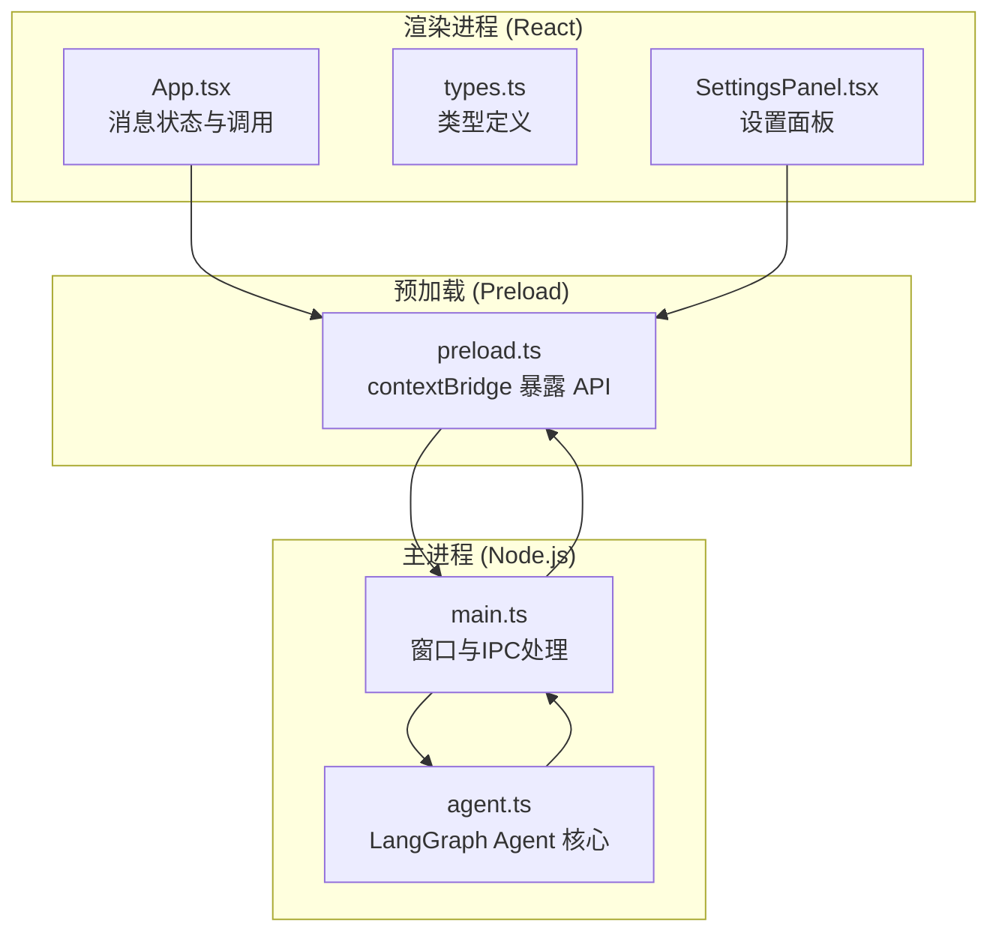
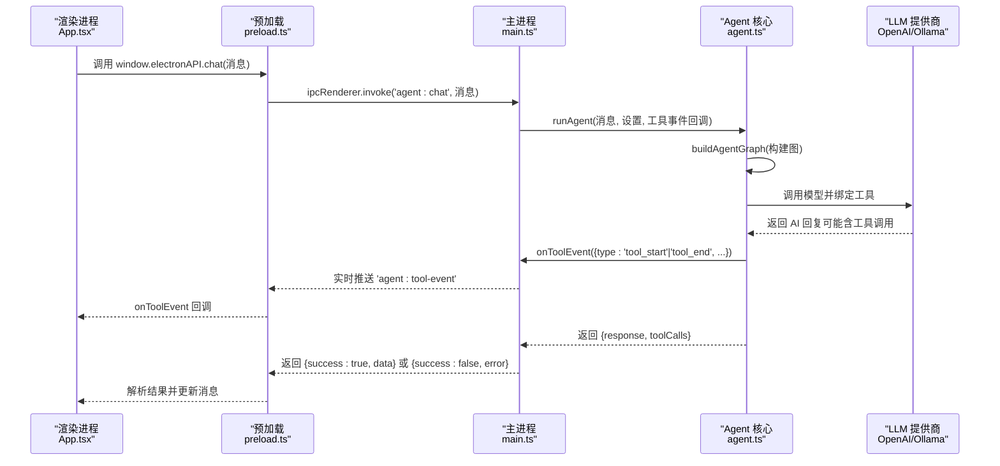
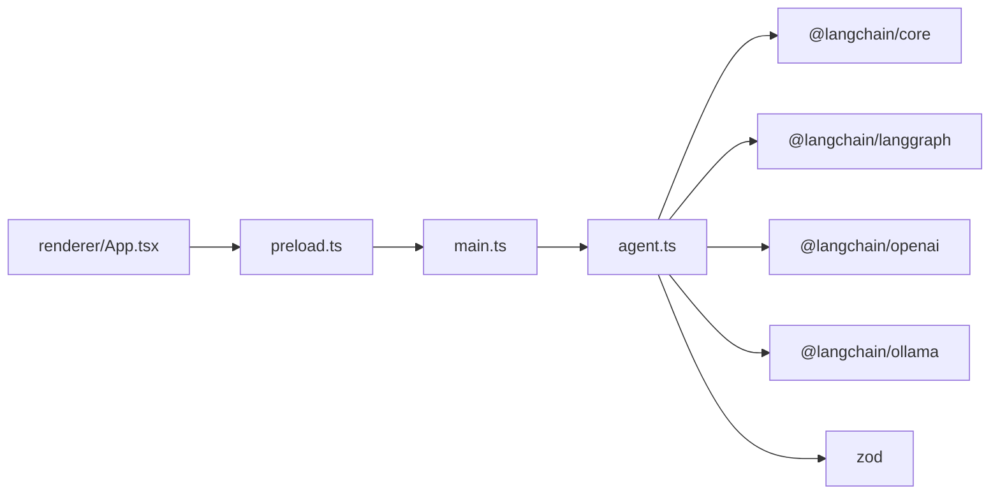

# AI 代理服务 API

<cite>
**本文引用的文件**
- [src/agent.ts](file://src/agent.ts)
- [src/main.ts](file://src/main.ts)
- [src/preload.ts](file://src/preload.ts)
- [src/renderer/App.tsx](file://src/renderer/App.tsx)
- [src/renderer/types.ts](file://src/renderer/types.ts)
- [src/renderer/components/SettingsPanel.tsx](file://src/renderer/components/SettingsPanel.tsx)
- [package.json](file://package.json)
- [开发文档.md](file://开发文档.md)
</cite>

## 目录
1. [简介](#简介)
2. [项目结构](#项目结构)
3. [核心组件](#核心组件)
4. [架构总览](#架构总览)
5. [详细组件分析](#详细组件分析)
6. [依赖关系分析](#依赖关系分析)
7. [性能考虑](#性能考虑)
8. [故障排查指南](#故障排查指南)
9. [结论](#结论)
10. [附录](#附录)

## 简介
本文件为 langGraph 的 AI 代理服务 API 文档，聚焦于 agent.ts 中定义的服务方法、配置项与调用接口，涵盖：
- 代理初始化参数与模型配置
- 工具调用 API 规范与事件触发机制
- 结果处理与前端集成
- OpenAI 与 Ollama 两种 AI 服务提供商的集成指南
- API 密钥管理、请求限流与错误重试策略建议
- 性能优化与监控指标建议

## 项目结构
该项目采用 Electron + React + Vite 架构，核心逻辑位于主进程的 agent.ts，通过 IPC 与渲染进程通信。主要文件职责如下：
- src/agent.ts：LangGraph Agent 核心逻辑、工具定义、模型创建与执行流程
- src/main.ts：Electron 主进程，负责窗口、IPC 处理与设置持久化
- src/preload.ts：Preload 脚本，通过 contextBridge 暴露受控 API
- src/renderer/App.tsx：React 根组件，负责消息状态、设置面板与调用 Agent
- src/renderer/types.ts：前端类型定义（AgentSettings、ToolEvent、Message、ElectronAPI）
- src/renderer/components/SettingsPanel.tsx：设置面板组件，支持 OpenAI/Ollama 切换与参数配置
- package.json：依赖与脚本
- 开发文档.md：项目整体技术文档与扩展指南

图表来源
- [src/renderer/App.tsx:1-140](file://src/renderer/App.tsx#L1-L140)
- [src/renderer/types.ts:1-49](file://src/renderer/types.ts#L1-L49)
- [src/renderer/components/SettingsPanel.tsx:1-139](file://src/renderer/components/SettingsPanel.tsx#L1-L139)
- [src/preload.ts:1-18](file://src/preload.ts#L1-L18)
- [src/main.ts:1-100](file://src/main.ts#L1-L100)
- [src/agent.ts:1-316](file://src/agent.ts#L1-L316)

章节来源
- [开发文档.md:152-190](file://开发文档.md#L152-L190)
- [package.json:1-36](file://package.json#L1-L36)

## 核心组件
本节梳理 agent.ts 中的关键类型与方法，以及与前端的对接方式。

- AgentSettings（代理设置）
  - 字段：provider、apiKey、model、baseUrl、temperature
  - 用途：控制 LLM 提供商、模型名称、基础 URL、温度系数
  - 默认值：provider='openai'、apiKey=''、model='gpt-4o-mini'、baseUrl=''、temperature=0.7
- ToolEvent（工具事件）
  - 字段：type、toolName、input、output
  - 用途：在工具调用开始/结束时由主进程推送到渲染进程
- AgentResult（代理结果）
  - 字段：response、toolCalls
  - 用途：封装最终回复与工具调用清单

- 工具定义（ALL_TOOLS）
  - calculator：数学表达式求值
  - get_datetime：获取当前时间（Asia/Shanghai）
  - text_analysis：文本统计分析
  - random_number：生成指定范围内的随机整数

- 关键方法
  - buildAgentGraph(settings, onToolEvent?)：构建 LangGraph 状态图
  - runAgent(message, settings, onToolEvent?)：执行一次对话，返回 AgentResult

章节来源
- [src/agent.ts:19-37](file://src/agent.ts#L19-L37)
- [src/agent.ts:43-137](file://src/agent.ts#L43-L137)
- [src/agent.ts:171-262](file://src/agent.ts#L171-L262)
- [src/agent.ts:279-315](file://src/agent.ts#L279-L315)

## 架构总览
下图展示了从渲染进程发起对话到主进程执行 Agent 并回传结果的端到端流程，包括工具事件的实时推送。

图表来源
- [src/renderer/App.tsx:43-84](file://src/renderer/App.tsx#L43-L84)
- [src/preload.ts:3-17](file://src/preload.ts#L3-L17)
- [src/main.ts:65-84](file://src/main.ts#L65-L84)
- [src/agent.ts:171-262](file://src/agent.ts#L171-L262)
- [src/agent.ts:279-315](file://src/agent.ts#L279-L315)

## 详细组件分析

### AgentSettings 与模型配置
- provider
  - 取值：'openai' | 'ollama'
  - 影响：决定使用 ChatOpenAI 还是 ChatOllama
- apiKey
  - 用途：OpenAI API 密钥；若为空则尝试读取环境变量 OPENAI_API_KEY
- model
  - 用途：模型名称；OpenAI 默认 'gpt-4o-mini'，Ollama 默认 'llama3.1'
- baseUrl
  - 用途：OpenAI 可自定义 API 基础地址；Ollama 默认 'http://localhost:11434'
- temperature
  - 用途：采样温度，数值越高越随机

章节来源
- [src/agent.ts:19-25](file://src/agent.ts#L19-L25)
- [src/agent.ts:151-169](file://src/agent.ts#L151-L169)
- [src/main.ts:14-31](file://src/main.ts#L14-L31)

### 工具调用 API 规范
- 工具注册
  - 通过 tool() 与 Zod Schema 定义工具，统一注入到模型 bindTools()
  - 工具清单：ALL_TOOLS
- 工具事件
  - 触发时机：工具开始执行与执行结束
  - 事件字段：type、toolName、input、output
  - 推送路径：主进程 onToolEvent -> ipcMain.handle('agent:tool-event') -> preload.on('agent:tool-event') -> window.electronAPI.onToolEvent
- 工具调用解析
  - runAgent 会从最终消息中提取所有 AIMessage 的 tool_calls，形成 toolCalls 列表

章节来源
- [src/agent.ts:43-137](file://src/agent.ts#L43-L137)
- [src/agent.ts:171-262](file://src/agent.ts#L171-L262)
- [src/agent.ts:197-237](file://src/agent.ts#L197-L237)
- [src/agent.ts:279-315](file://src/agent.ts#L279-L315)
- [src/main.ts:65-84](file://src/main.ts#L65-L84)
- [src/preload.ts:7-12](file://src/preload.ts#L7-L12)

### 事件触发机制与结果处理
- 事件流
  - 主进程在工具执行前后触发 onToolEvent，通过 ipcMain.handle('agent:tool-event') 推送给渲染进程
  - 渲染进程通过 window.electronAPI.onToolEvent 订阅并更新消息中的 toolEvents
- 结果处理
  - runAgent 返回 AgentResult：response（最终回复）、toolCalls（工具调用清单）
  - 渲染进程根据 success 字段更新消息状态（content、isLoading、isError、toolCalls）

章节来源
- [src/agent.ts:197-237](file://src/agent.ts#L197-L237)
- [src/main.ts:65-84](file://src/main.ts#L65-L84)
- [src/renderer/App.tsx:24-41](file://src/renderer/App.tsx#L24-L41)
- [src/renderer/App.tsx:64-84](file://src/renderer/App.tsx#L64-L84)

### OpenAI 集成指南
- 必要配置
  - provider: 'openai'
  - apiKey：填写有效的 OpenAI API Key
  - model：如 'gpt-4o-mini'、'gpt-4o'、'gpt-3.5-turbo'
  - baseUrl：可选，自定义兼容 OpenAI 的 API 地址；留空使用官方地址
- 密钥管理
  - 若未显式提供 apiKey，将尝试读取环境变量 OPENAI_API_KEY
- 错误处理
  - runAgent 包裹在 ipcMain.handle 中，异常会被捕获并返回 {success:false, error}

章节来源
- [src/agent.ts:151-169](file://src/agent.ts#L151-L169)
- [src/main.ts:65-84](file://src/main.ts#L65-L84)

### Ollama 集成指南
- 必要配置
  - provider: 'ollama'
  - model：如 'llama3.1'、'mistral'、'qwen2.5'
  - baseUrl：默认 'http://localhost:11434'，确保本地 Ollama 服务已启动
- 错误处理
  - runAgent 包裹在 ipcMain.handle 中，异常会被捕获并返回 {success:false, error}

章节来源
- [src/agent.ts:151-169](file://src/agent.ts#L151-L169)
- [src/main.ts:65-84](file://src/main.ts#L65-L84)

### 前端 API 对接
- ElectronAPI（window.electronAPI）
  - chat(message)：发起对话，返回 {success, data?, error?}
  - onToolEvent(callback)：订阅工具事件，返回取消订阅函数
  - getSettings()/saveSettings(settings)：设置的读取与保存
- 类型定义
  - AgentSettings、ToolEvent、Message、ElectronAPI

章节来源
- [src/preload.ts:3-17](file://src/preload.ts#L3-L17)
- [src/renderer/types.ts:33-48](file://src/renderer/types.ts#L33-L48)
- [src/renderer/App.tsx:43-84](file://src/renderer/App.tsx#L43-L84)

### 设置面板与参数校验
- 设置面板支持：
  - provider 切换（OpenAI/Ollama）
  - apiKey（OpenAI 时显示）
  - model 名称与提示
  - baseUrl（OpenAI 显示自定义地址，Ollama 显示默认地址）
  - temperature 滑块（0~2）
- 参数持久化
  - 主进程将设置写入 userData 目录下的 JSON 文件

章节来源
- [src/renderer/components/SettingsPanel.tsx:10-139](file://src/renderer/components/SettingsPanel.tsx#L10-L139)
- [src/main.ts:14-31](file://src/main.ts#L14-L31)

## 依赖关系分析
- 主要依赖
  - @langchain/core：消息、工具、Runnable 类型
  - @langchain/langgraph：状态图与节点编排
  - @langchain/openai：OpenAI 模型适配器
  - @langchain/ollama：Ollama 模型适配器
  - zod：工具参数 Schema 校验
- 模块耦合
  - agent.ts 与 main.ts 通过 IPC 强耦合（'agent:chat'、'agent:tool-event'）
  - preload.ts 仅作为桥接层，低耦合
  - renderer/App.tsx 通过 window.electronAPI 与主进程交互

图表来源
- [package.json:13-21](file://package.json#L13-L21)
- [src/agent.ts:1-15](file://src/agent.ts#L1-L15)
- [src/main.ts:4](file://src/main.ts#L4)
- [src/preload.ts:1](file://src/preload.ts#L1)
- [src/renderer/App.tsx:1-5](file://src/renderer/App.tsx#L1-L5)

章节来源
- [package.json:13-21](file://package.json#L13-L21)

## 性能考虑
- 模型选择与温度
  - 更高的 temperature 会增加生成不确定性，可能影响工具调用稳定性
  - 适当降低 temperature 可减少不必要的工具调用次数
- 工具调用批处理
  - 当多个工具被连续调用时，建议在前端合并工具事件，避免频繁重渲染
- 网络与本地模型
  - OpenAI API 延迟取决于网络与配额；Ollama 本地模型延迟取决于硬件与模型大小
- 内存与会话
  - 可通过 LangGraph 的 checkpointer 实现多轮对话记忆，但需权衡内存占用
- 流式输出（扩展建议）
  - 可在 agent.ts 中使用 streamEvents 实现逐字输出，提升交互体验

章节来源
- [开发文档.md:631-647](file://开发文档.md#L631-L647)

## 故障排查指南
- 无法连接 Ollama
  - 检查 baseUrl 是否正确，默认 'http://localhost:11434'
  - 确认本地 Ollama 服务已启动
- OpenAI API Key 无效
  - 确认 apiKey 已在设置中保存
  - 若未填写，确认环境变量 OPENAI_API_KEY 是否存在
- 工具事件未显示
  - 确认 onToolEvent 订阅是否成功
  - 检查主进程是否正确推送 'agent:tool-event'
- 请求超时或失败
  - 检查网络连通性与防火墙
  - 对于 OpenAI，检查配额与速率限制
- 无限循环风险
  - LangGraph 的条件路由会在无工具调用时结束，通常不会无限循环

章节来源
- [src/agent.ts:151-169](file://src/agent.ts#L151-L169)
- [src/main.ts:65-84](file://src/main.ts#L65-L84)
- [src/renderer/App.tsx:24-41](file://src/renderer/App.tsx#L24-L41)

## 结论
本项目通过 Electron + LangGraph 的组合，提供了可扩展、可配置的桌面端 AI 代理服务。agent.ts 定义了清晰的代理设置、工具与执行流程，结合主进程 IPC 与前端桥接，实现了稳定的对话与工具事件推送。OpenAI 与 Ollama 的双栈支持满足云端与本地部署需求。建议在生产环境中完善密钥管理、限流与重试策略，并根据业务场景启用流式输出与会话记忆。

## 附录

### API 定义与调用规范

- ElectronAPI（window.electronAPI）
  - chat(message: string) -> Promise<{success: boolean, data?: {response: string, toolCalls: ToolCallInfo[]}, error?: string}>
  - onToolEvent(callback: (event: ToolEvent) => void) -> () => void
  - getSettings() -> Promise<AgentSettings>
  - saveSettings(settings: AgentSettings) -> Promise<boolean>

- AgentSettings
  - provider: 'openai' | 'ollama'
  - apiKey: string
  - model: string
  - baseUrl: string
  - temperature: number

- ToolEvent
  - type: 'tool_start' | 'tool_end'
  - toolName: string
  - input?: string
  - output?: string

- ToolCallInfo
  - name: string
  - args: Record<string, any>

- Message
  - id: string
  - role: 'user' | 'assistant' | 'system'
  - content: string
  - toolCalls?: ToolCallInfo[]
  - toolEvents?: ToolEvent[]
  - timestamp: number
  - isLoading?: boolean
  - isError?: boolean

章节来源
- [src/renderer/types.ts:22-48](file://src/renderer/types.ts#L22-L48)
- [src/preload.ts:3-17](file://src/preload.ts#L3-L17)

### 工具清单与参数
- calculator
  - 参数：expression: string
  - 用途：执行数学表达式求值
- get_datetime
  - 参数：query: string（可选）
  - 用途：获取当前时间（Asia/Shanghai）
- text_analysis
  - 参数：text: string
  - 用途：统计分析文本字符、单词、行数等
- random_number
  - 参数：min: number, max: number
  - 用途：生成指定范围内的随机整数

章节来源
- [src/agent.ts:43-137](file://src/agent.ts#L43-L137)