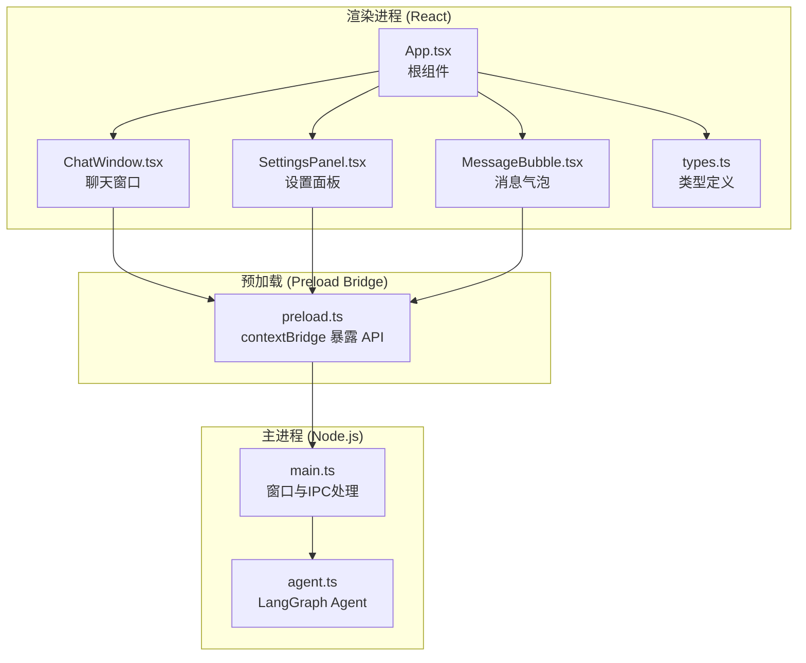
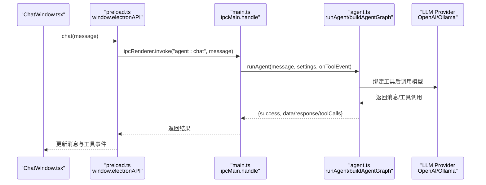
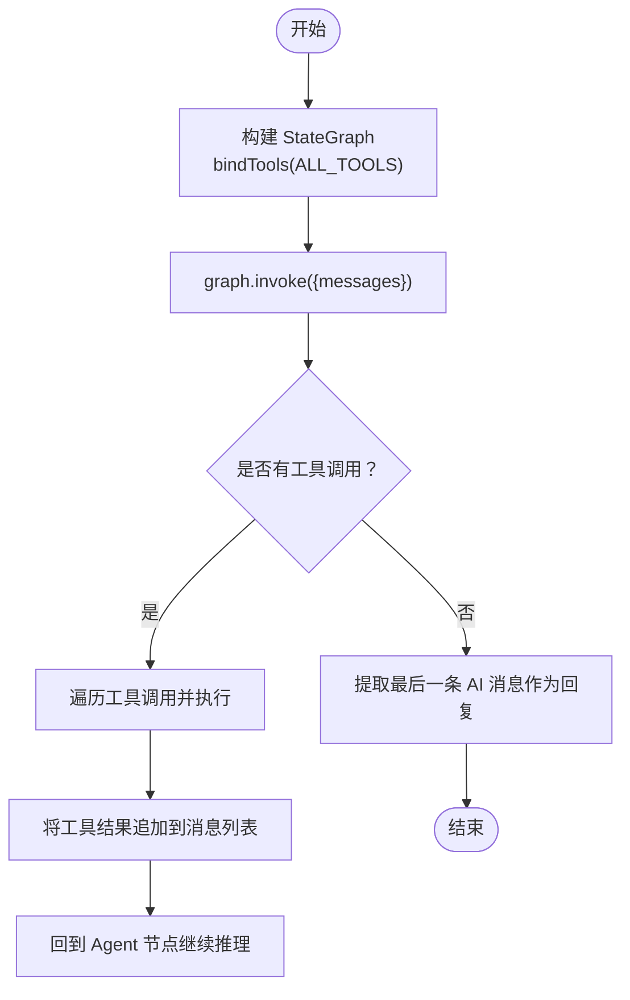
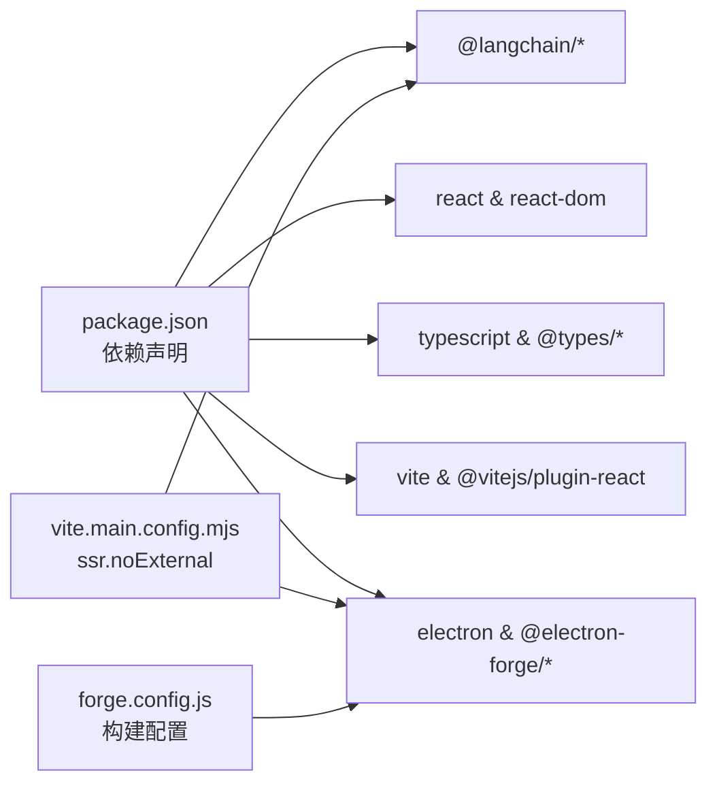

# API 参考

<cite>
**本文引用的文件**
- [package.json](file://package.json)
- [tsconfig.json](file://tsconfig.json)
- [index.html](file://index.html)
- [forge.config.js](file://forge.config.js)
- [vite.main.config.mjs](file://vite.main.config.mjs)
- [vite.preload.config.mjs](file://vite.preload.config.mjs)
- [vite.renderer.config.mjs](file://vite.renderer.config.mjs)
- [src/main.ts](file://src/main.ts)
- [src/preload.ts](file://src/preload.ts)
- [src/agent.ts](file://src/agent.ts)
- [src/renderer/main.tsx](file://src/renderer/main.tsx)
- [src/renderer/App.tsx](file://src/renderer/App.tsx)
- [src/renderer/types.ts](file://src/renderer/types.ts)
- [src/renderer/components/ChatWindow.tsx](file://src/renderer/components/ChatWindow.tsx)
- [src/renderer/components/SettingsPanel.tsx](file://src/renderer/components/SettingsPanel.tsx)
- [src/renderer/components/MessageBubble.tsx](file://src/renderer/components/MessageBubble.tsx)
- [src/renderer/index.css](file://src/renderer/index.css)
- [开发文档.md](file://开发文档.md)
</cite>

## 目录
1. [简介](#简介)
2. [项目结构](#项目结构)
3. [核心组件](#核心组件)
4. [架构总览](#架构总览)
5. [详细组件分析](#详细组件分析)
6. [依赖关系分析](#依赖关系分析)
7. [性能考量](#性能考量)
8. [故障排查指南](#故障排查指南)
9. [结论](#结论)
10. [附录](#附录)

## 简介
本文件为 langGraph 桌面端 AI Agent 应用的 API 参考文档，覆盖：
- Electron 主进程与渲染进程之间的 IPC 接口规范、消息格式与错误处理
- AI 代理服务（LangGraph Agent）的 API 方法、参数与返回值
- React 组件的 props 接口、事件回调与受控属性
- TypeScript 类型定义、接口规范与泛型使用
- 配置项参考、默认值与可选参数
- 使用示例、最佳实践与常见用法模式
- 版本管理、废弃警告与迁移建议

## 项目结构
该项目采用 Electron + Vite + React + TypeScript 的现代桌面应用架构，核心目录与职责如下：
- src/main.ts：Electron 主进程入口，负责窗口创建、IPC 处理与设置持久化
- src/preload.ts：Preload 脚本，通过 contextBridge 暴露安全的 window.electronAPI
- src/agent.ts：LangGraph Agent 核心逻辑，包含状态图、工具定义、LLM 绑定与执行流程
- src/renderer：React 前端应用
  - src/renderer/main.tsx：前端入口
  - src/renderer/App.tsx：根组件，负责全局状态与布局
  - src/renderer/types.ts：前端类型定义（AgentSettings、ToolEvent、Message、ElectronAPI）
  - src/renderer/components：UI 组件（ChatWindow、SettingsPanel、MessageBubble）
- 构建与打包：forge.config.js、vite.*.config.mjs、tsconfig.json、package.json

图表来源
- [src/renderer/App.tsx:1-140](file://src/renderer/App.tsx#L1-L140)
- [src/renderer/components/ChatWindow.tsx:1-114](file://src/renderer/components/ChatWindow.tsx#L1-L114)
- [src/renderer/components/SettingsPanel.tsx:1-139](file://src/renderer/components/SettingsPanel.tsx#L1-L139)
- [src/renderer/components/MessageBubble.tsx:1-104](file://src/renderer/components/MessageBubble.tsx#L1-L104)
- [src/renderer/types.ts:1-49](file://src/renderer/types.ts#L1-L49)
- [src/preload.ts:1-18](file://src/preload.ts#L1-L18)
- [src/main.ts:1-100](file://src/main.ts#L1-L100)
- [src/agent.ts:1-316](file://src/agent.ts#L1-L316)

章节来源
- [开发文档.md:152-190](file://开发文档.md#L152-L190)
- [开发文档.md:235-264](file://开发文档.md#L235-L264)

## 核心组件
本节梳理各模块的关键 API 与类型定义，便于快速查阅与集成。

- Electron 主进程 API（IPC 处理）
  - 通道：agent:chat
    - 参数：message: string
    - 返回：Promise<{ success: boolean; data?: { response: string; toolCalls: ToolCallInfo[] }; error?: string }>
  - 通道：settings:get
    - 参数：无
    - 返回：AgentSettings
  - 通道：settings:save
    - 参数：settings: AgentSettings
    - 返回：boolean

- 预加载桥接 API（window.electronAPI）
  - chat(message: string): Promise 返回 IPC 通道 agent:chat 的结果
  - onToolEvent(callback: (event: ToolEvent) => void): () => void 返回移除监听器的清理函数
  - getSettings(): Promise<AgentSettings>
  - saveSettings(settings: AgentSettings): Promise<boolean>

- LangGraph Agent API
  - buildAgentGraph(settings: AgentSettings, onToolEvent?: (event: ToolEvent) => void): StateGraph
  - runAgent(message: string, settings: AgentSettings, onToolEvent?: (event: ToolEvent) => void): Promise<{ response: string; toolCalls: ToolCallInfo[] }>
  - 内置工具：calculator、get_datetime、text_analysis、random_number
  - 状态图：AgentState(messages[])，节点 agent/tools，条件路由 shouldContinue

- React 组件 API
  - App.tsx
    - props: 无
    - 状态：messages(Message[]), showSettings(boolean), settings(AgentSettings)
    - 事件：handleSend(text: string), handleSaveSettings(newSettings: AgentSettings), handleClearChat()
  - ChatWindow.tsx
    - props: messages: Message[]; onSend: (text: string) => void
    - 状态：input(string), isSending(boolean)
    - 事件：handleSend(), handleKeyDown(e: KeyboardEvent)
  - SettingsPanel.tsx
    - props: settings: AgentSettings; onSave: (settings: AgentSettings) => void; onClose: () => void
    - 状态：form: AgentSettings
    - 事件：handleChange(field: keyof AgentSettings, value: string | number), handleSave()
  - MessageBubble.tsx
    - props: message: Message
    - 状态：showTools(boolean)
    - 事件：无

- TypeScript 类型定义
  - AgentSettings: provider, apiKey, model, baseUrl, temperature
  - ToolEvent: type('tool_start'|'tool_end'), toolName, input?, output?
  - ToolCallInfo: name, args: Record<string, any>
  - Message: id, role('user'|'assistant'|'system'), content, toolCalls?, toolEvents?, timestamp, isLoading?, isError?
  - ElectronAPI: chat, onToolEvent, getSettings, saveSettings

章节来源
- [src/main.ts:64-84](file://src/main.ts#L64-L84)
- [src/preload.ts:3-17](file://src/preload.ts#L3-L17)
- [src/agent.ts:17-37](file://src/agent.ts#L17-L37)
- [src/agent.ts:171-262](file://src/agent.ts#L171-L262)
- [src/agent.ts:279-315](file://src/agent.ts#L279-L315)
- [src/renderer/App.tsx:1-140](file://src/renderer/App.tsx#L1-L140)
- [src/renderer/components/ChatWindow.tsx:1-114](file://src/renderer/components/ChatWindow.tsx#L1-L114)
- [src/renderer/components/SettingsPanel.tsx:1-139](file://src/renderer/components/SettingsPanel.tsx#L1-L139)
- [src/renderer/components/MessageBubble.tsx:1-104](file://src/renderer/components/MessageBubble.tsx#L1-L104)
- [src/renderer/types.ts:1-49](file://src/renderer/types.ts#L1-L49)

## 架构总览
下图展示了 Electron 进程间通信与 Agent 执行的总体流程，以及前端组件与主进程的交互关系。

图表来源
- [src/renderer/components/ChatWindow.tsx:29-42](file://src/renderer/components/ChatWindow.tsx#L29-L42)
- [src/preload.ts:3-17](file://src/preload.ts#L3-L17)
- [src/main.ts:64-84](file://src/main.ts#L64-L84)
- [src/agent.ts:279-315](file://src/agent.ts#L279-L315)

## 详细组件分析

### Electron IPC 通信 API
- 通道 agent:chat
  - 触发时机：用户发送消息
  - 参数：message: string
  - 返回：Promise 对象，包含 success、data 或 error 字段
  - 错误处理：捕获异常并返回 { success: false, error: ... }
- 通道 settings:get
  - 触发时机：应用启动或打开设置面板
  - 返回：当前 AgentSettings
- 通道 settings:save
  - 触发时机：保存设置
  - 参数：settings: AgentSettings
  - 返回：boolean

- 预加载桥接 API
  - chat(message: string): Promise 返回 IPC 通道 agent:chat 的结果
  - onToolEvent(callback: (event: ToolEvent) => void): () => void 返回移除监听器的清理函数
  - getSettings(): Promise<AgentSettings>
  - saveSettings(settings: AgentSettings): Promise<boolean>

章节来源
- [src/main.ts:64-84](file://src/main.ts#L64-L84)
- [src/preload.ts:3-17](file://src/preload.ts#L3-L17)

### LangGraph Agent API
- 构建状态图
  - buildAgentGraph(settings: AgentSettings, onToolEvent?: (event: ToolEvent) => void): StateGraph
  - 作用：根据设置创建 LLM 并绑定工具，构建 StateGraph，返回可执行图
- 执行 Agent
  - runAgent(message: string, settings: AgentSettings, onToolEvent?: (event: ToolEvent) => void): Promise<{ response: string; toolCalls: ToolCallInfo[] }>
  - 作用：构造系统提示与用户消息，执行图并提取最后一条 AI 消息作为回复；收集所有工具调用信息
- 内置工具
  - calculator(expression: string)
  - get_datetime(query?: string)
  - text_analysis(text: string)
  - random_number(min: number, max: number)

图表来源
- [src/agent.ts:171-262](file://src/agent.ts#L171-L262)
- [src/agent.ts:279-315](file://src/agent.ts#L279-L315)

章节来源
- [src/agent.ts:17-37](file://src/agent.ts#L17-L37)
- [src/agent.ts:171-262](file://src/agent.ts#L171-L262)
- [src/agent.ts:279-315](file://src/agent.ts#L279-L315)

### React 组件 API

#### App.tsx
- 状态
  - messages: Message[]
  - showSettings: boolean
  - settings: AgentSettings
- 事件
  - handleSend(text: string): 发送消息、添加加载中助手消息、调用 window.electronAPI.chat 并更新消息
  - handleSaveSettings(newSettings: AgentSettings): 保存设置并关闭面板
  - handleClearChat(): 清空消息列表

章节来源
- [src/renderer/App.tsx:1-140](file://src/renderer/App.tsx#L1-L140)

#### ChatWindow.tsx
- Props
  - messages: Message[]
  - onSend: (text: string) => void
- 状态
  - input: string
  - isSending: boolean
- 事件
  - handleSend(): 校验输入、禁用发送、调用 onSend、恢复焦点
  - handleKeyDown(e: KeyboardEvent): Enter 发送，Shift+Enter 换行

章节来源
- [src/renderer/components/ChatWindow.tsx:1-114](file://src/renderer/components/ChatWindow.tsx#L1-L114)

#### SettingsPanel.tsx
- Props
  - settings: AgentSettings
  - onSave: (settings: AgentSettings) => void
  - onClose: () => void
- 状态
  - form: AgentSettings
- 事件
  - handleChange(field: keyof AgentSettings, value: string | number)
  - handleSave()

章节来源
- [src/renderer/components/SettingsPanel.tsx:1-139](file://src/renderer/components/SettingsPanel.tsx#L1-L139)

#### MessageBubble.tsx
- Props
  - message: Message
- 状态
  - showTools: boolean
- 功能
  - 将 toolEvents 配对为 start/end，展示工具调用输入/输出

章节来源
- [src/renderer/components/MessageBubble.tsx:1-104](file://src/renderer/components/MessageBubble.tsx#L1-L104)

### TypeScript 类型定义与接口规范
- AgentSettings
  - provider: 'openai' | 'ollama'
  - apiKey: string
  - model: string
  - baseUrl: string
  - temperature: number
- ToolEvent
  - type: 'tool_start' | 'tool_end'
  - toolName: string
  - input?: string
  - output?: string
- ToolCallInfo
  - name: string
  - args: Record<string, any>
- Message
  - id: string
  - role: 'user' | 'assistant' | 'system'
  - content: string
  - toolCalls?: ToolCallInfo[]
  - toolEvents?: ToolEvent[]
  - timestamp: number
  - isLoading?: boolean
  - isError?: boolean
- ElectronAPI
  - chat(message: string): Promise<{ success: boolean; data?: { response: string; toolCalls: ToolCallInfo[] }; error?: string }>
  - onToolEvent(callback: (event: ToolEvent) => void): () => void
  - getSettings(): Promise<AgentSettings>
  - saveSettings(settings: AgentSettings): Promise<boolean>

章节来源
- [src/renderer/types.ts:1-49](file://src/renderer/types.ts#L1-L49)

## 依赖关系分析
- 依赖版本与构建配置
  - Electron 33 + Electron Forge v7
  - Vite 6 + @vitejs/plugin-react
  - TypeScript 5
  - LangGraph.js + LangChain.js
  - React 18
- 关键依赖
  - @langchain/langgraph, @langchain/core, @langchain/openai, @langchain/ollama
  - react, react-dom, zod
- 构建配置要点
  - vite.main.config.mjs 中通过 ssr.noExternal 解决 ESM/CJS 兼容问题
  - forge.config.js 配置打包与 Vite 插件

图表来源
- [package.json:13-34](file://package.json#L13-L34)
- [vite.main.config.mjs:235-262](file://vite.main.config.mjs#L235-L262)
- [forge.config.js:197-228](file://forge.config.js#L197-L228)

章节来源
- [package.json:13-34](file://package.json#L13-L34)
- [开发文档.md:195-264](file://开发文档.md#L195-L264)

## 性能考量
- IPC 调用开销
  - 使用 invoke/handle 模式避免频繁同步调用，减少阻塞
  - 工具事件通过单向推送（send/on）降低 UI 重绘压力
- 渲染性能
  - ChatWindow 使用自动高度调整与平滑滚动，避免频繁 DOM 重排
  - MessageBubble 仅在有工具事件时展开详情，减少不必要的渲染
- Agent 执行
  - StateGraph 条件路由在无工具调用时直接结束，避免无限循环
  - 工具执行前进行输入校验，减少无效调用

[本节为通用指导，不直接分析具体文件]

## 故障排查指南
- IPC 通信失败
  - 确认 preload.ts 是否正确暴露 window.electronAPI
  - 检查主进程 ipcMain.handle 是否注册对应通道
- Agent 执行异常
  - 检查 settings.provider/model/apiKey/baseUrl/temperature 是否有效
  - 查看 onToolEvent 回调是否正确接收工具事件
- 工具调用错误
  - 检查工具 schema 与传参是否匹配
  - 查看工具执行日志与错误输出
- 设置持久化
  - 确认 userData 目录存在且可写
  - 检查 settings.json 格式是否正确

章节来源
- [src/preload.ts:3-17](file://src/preload.ts#L3-L17)
- [src/main.ts:14-31](file://src/main.ts#L14-L31)
- [src/agent.ts:197-234](file://src/agent.ts#L197-L234)

## 结论
本 API 参考文档系统梳理了 Electron IPC、LangGraph Agent、React 组件与 TypeScript 类型定义，提供了接口规范、参数说明、返回值格式与错误处理策略。结合内置工具与可扩展架构，开发者可快速集成新的工具、LLM 提供商与 UI 组件，构建功能完备的桌面端 AI Agent 应用。

[本节为总结性内容，不直接分析具体文件]

## 附录

### 配置选项参考
- AgentSettings
  - provider: 'openai' | 'ollama'
  - apiKey: string（OpenAI 时必填或从环境变量读取）
  - model: string（默认：OpenAI: gpt-4o-mini；Ollama: llama3.1）
  - baseUrl: string（OpenAI 可选自定义 API 地址；Ollama 默认 http://localhost:11434）
  - temperature: number（0~2，默认 0.7）

- 默认值与可选参数
  - settings.json 不存在时，使用上述默认值
  - baseUrl 留空时使用官方或本地默认地址

章节来源
- [src/main.ts:14-31](file://src/main.ts#L14-L31)
- [src/agent.ts:151-169](file://src/agent.ts#L151-L169)

### 使用示例与最佳实践
- 发送消息
  - 在 ChatWindow 中输入文本，按 Enter 发送
  - App.tsx 调用 window.electronAPI.chat 并更新消息状态
- 实时工具事件
  - App.tsx 通过 window.electronAPI.onToolEvent 监听工具事件，更新助手消息的 toolEvents
- 保存设置
  - SettingsPanel 修改表单后调用 window.electronAPI.saveSettings，主进程持久化到 userData 目录

章节来源
- [src/renderer/App.tsx:43-90](file://src/renderer/App.tsx#L43-L90)
- [src/renderer/components/ChatWindow.tsx:29-42](file://src/renderer/components/ChatWindow.tsx#L29-L42)
- [src/renderer/components/SettingsPanel.tsx:17-19](file://src/renderer/components/SettingsPanel.tsx#L17-L19)
- [src/main.ts:29-31](file://src/main.ts#L29-L31)

### 版本管理、废弃警告与迁移指南
- 版本
  - 项目版本：1.0.0
  - 依赖版本：Electron 33、LangGraph.js 0.2.*、LangChain.js 0.3.*、React 18、TypeScript 5
- 迁移建议
  - 若升级 LangGraph/LangChain，请关注 API 变更与工具绑定方式
  - 若升级 Electron/Vite，请同步更新 forge.config.js 与 vite.*.config.mjs
  - 若新增工具，遵循 tool() 与 Zod Schema 的定义规范

章节来源
- [package.json:2-34](file://package.json#L2-L34)
- [开发文档.md:195-228](file://开发文档.md#L195-L228)