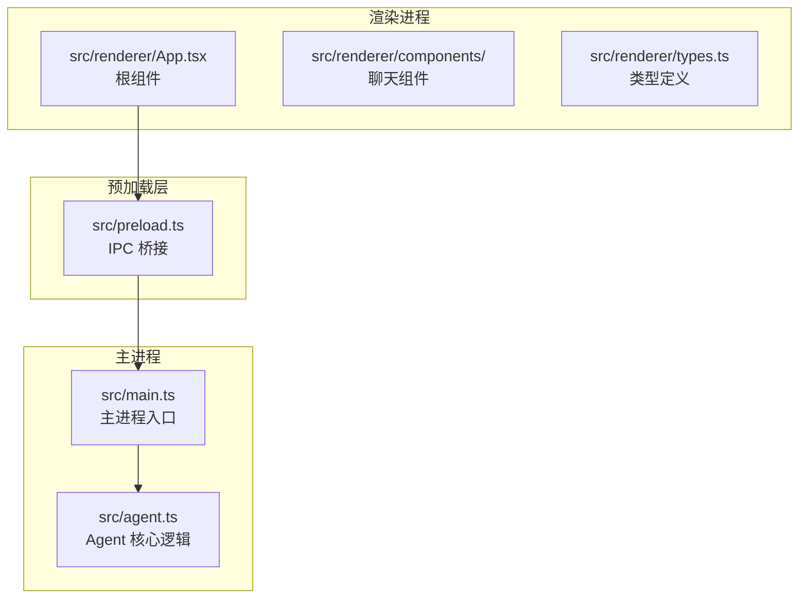
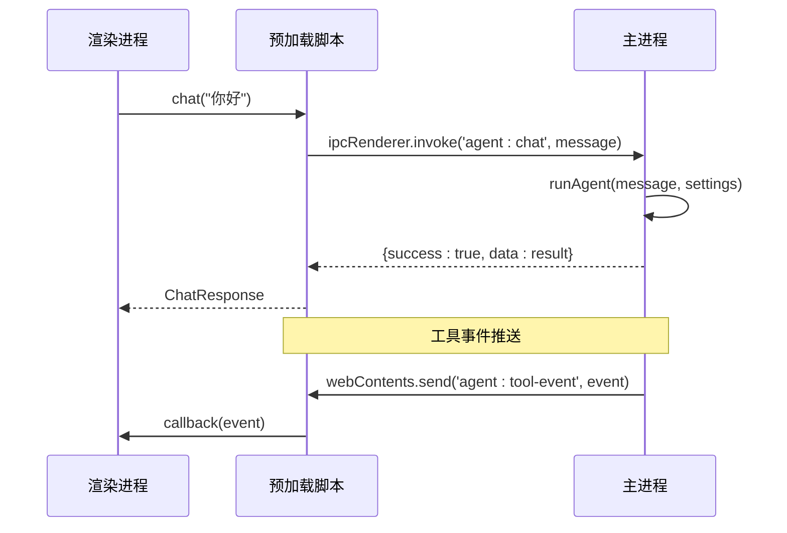
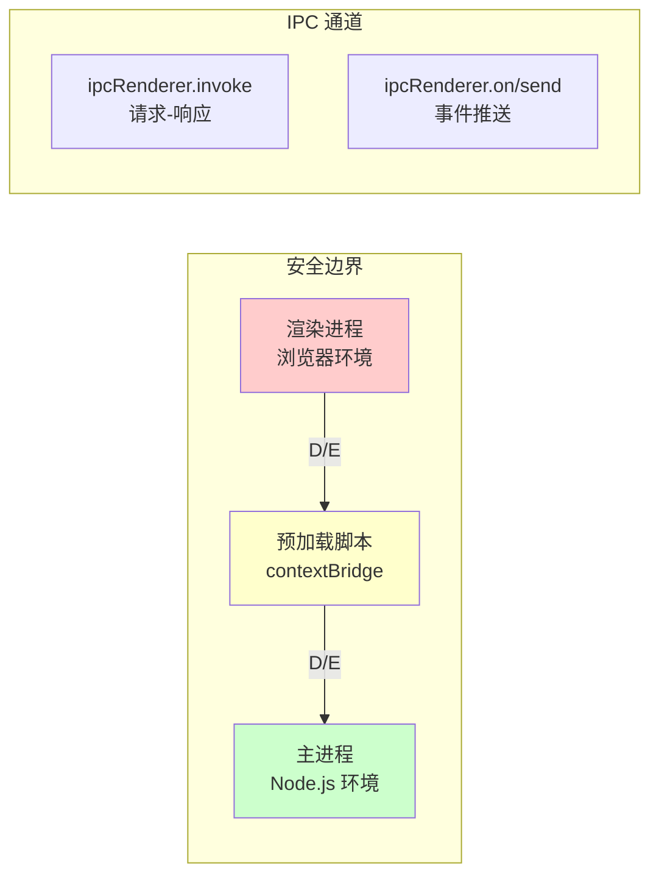
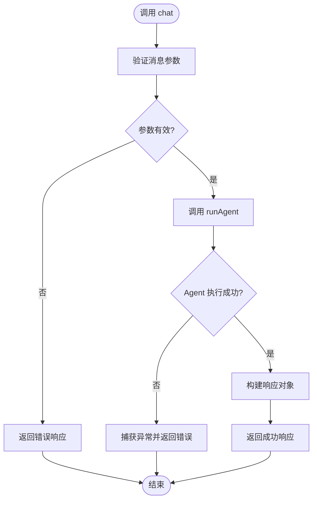
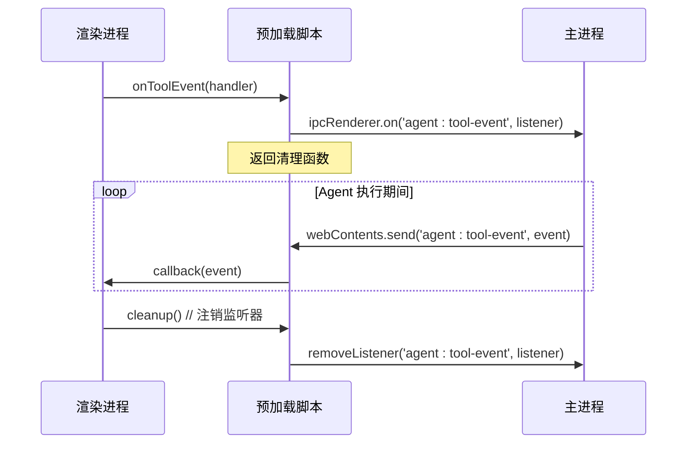
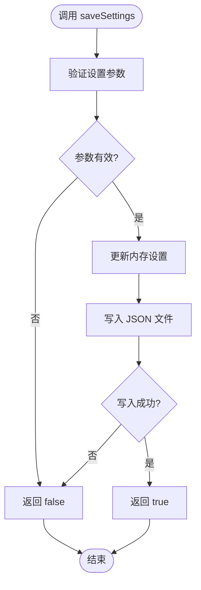
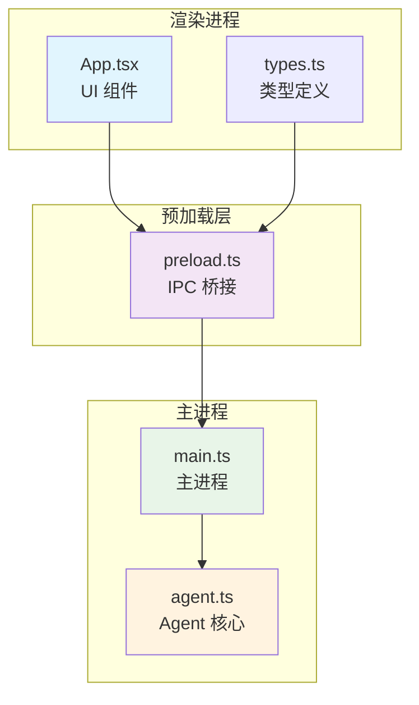

# Electron IPC API

<cite>
**本文档引用的文件**
- [src/preload.ts](file://src/preload.ts)
- [src/main.ts](file://src/main.ts)
- [src/agent.ts](file://src/agent.ts)
- [src/renderer/types.ts](file://src/renderer/types.ts)
- [src/renderer/App.tsx](file://src/renderer/App.tsx)
- [开发文档.md](file://开发文档.md)
- [package.json](file://package.json)
</cite>

## 目录
1. [简介](#简介)
2. [项目结构](#项目结构)
3. [核心组件](#核心组件)
4. [架构概览](#架构概览)
5. [详细组件分析](#详细组件分析)
6. [依赖关系分析](#依赖关系分析)
7. [性能考虑](#性能考虑)
8. [故障排除指南](#故障排除指南)
9. [结论](#结论)

## 简介

本文档详细记录了 langGraph 项目中 Electron IPC 通信的完整 API 规范。该项目是一个基于 LangGraph 的桌面端 AI Agent 应用，采用 Electron 框架构建，通过安全的 IPC 通道实现渲染进程与主进程之间的通信。

系统采用三层架构设计：
- **渲染进程 (React)**：负责用户界面交互和状态管理
- **预加载脚本 (Bridge)**：通过 contextBridge 安全暴露 API
- **主进程 (Node.js)**：处理 IPC 通信和业务逻辑

## 项目结构

项目采用模块化组织方式，关键文件分布如下：



**图表来源**
- [src/renderer/App.tsx:1-140](file://src/renderer/App.tsx#L1-L140)
- [src/preload.ts:1-18](file://src/preload.ts#L1-L18)
- [src/main.ts:1-100](file://src/main.ts#L1-L100)

**章节来源**
- [开发文档.md:152-176](file://开发文档.md#L152-L176)
- [package.json:1-36](file://package.json#L1-L36)

## 核心组件

### ElectronAPI 接口定义

渲染进程通过 `window.electronAPI` 对象访问所有 IPC 方法。接口定义如下：

| 方法名 | 参数类型 | 返回值类型 | 描述 |
|--------|----------|------------|------|
| `chat` | `(message: string)` | `Promise<ChatResponse>` | 发送消息给 Agent 进行对话 |
| `onToolEvent` | `(callback: (event: ToolEvent) => void)` | `() => void` | 注册工具事件监听器 |
| `getSettings` | `()` | `Promise<AgentSettings>` | 获取当前设置 |
| `saveSettings` | `(settings: AgentSettings)` | `Promise<boolean>` | 保存设置到本地 |

### 数据传输协议

系统采用标准化的消息传递协议，支持类型安全的数据交换：



**图表来源**
- [src/preload.ts:5](file://src/preload.ts#L5)
- [src/main.ts:65](file://src/main.ts#L65)

**章节来源**
- [src/renderer/types.ts:33-42](file://src/renderer/types.ts#L33-L42)
- [src/preload.ts:3-17](file://src/preload.ts#L3-L17)

## 架构概览

系统采用安全的 IPC 通信架构，确保渲染进程只能通过预加载脚本访问受限的 API：



**图表来源**
- [src/main.ts:43](file://src/main.ts#L43)
- [src/preload.ts:1](file://src/preload.ts#L1)

### 安全特性

系统实现了多重安全防护机制：

1. **上下文隔离** (`contextIsolation: true`)
2. **Node.js 集成禁用** (`nodeIntegration: false`)
3. **API 白名单** (仅暴露必要方法)
4. **类型安全** (TypeScript 接口约束)

**章节来源**
- [src/main.ts:43-47](file://src/main.ts#L43-L47)
- [开发文档.md:317-322](file://开发文档.md#L317-L322)

## 详细组件分析

### chat 方法

#### 方法签名
```typescript
chat(message: string): Promise<{
  success: boolean;
  data?: {
    response: string;
    toolCalls: Array<{ name: string; args: Record<string, any> }>;
  };
  error?: string;
}>
```

#### 参数规范
- **message** (`string`): 用户发送的原始消息文本
- **验证规则**: 必须为非空字符串，长度限制由前端组件控制

#### 返回值结构
系统返回统一的响应对象：

| 字段 | 类型 | 必填 | 描述 |
|------|------|------|------|
| `success` | `boolean` | ✓ | 操作是否成功 |
| `data.response` | `string` | ✓ | Agent 的最终回复 |
| `data.toolCalls` | `ToolCallInfo[]` | ✓ | 工具调用信息数组 |
| `error` | `string` | ✗ | 错误信息（失败时） |

#### 错误处理
- **网络异常**: 返回 `{ success: false, error: string }`
- **Agent 执行错误**: 捕获异常并返回详细错误信息
- **超时处理**: 由底层 Agent 超时机制处理



**图表来源**
- [src/main.ts:65](file://src/main.ts#L65)
- [src/agent.ts:279](file://src/agent.ts#L279)

**章节来源**
- [src/preload.ts:5](file://src/preload.ts#L5)
- [src/main.ts:65-74](file://src/main.ts#L65-L74)
- [src/agent.ts:279-315](file://src/agent.ts#L279-L315)

### onToolEvent 方法

#### 方法签名
```typescript
onToolEvent(callback: (event: ToolEvent) => void): () => void
```

#### 事件监听机制



**图表来源**
- [src/preload.ts:8](file://src/preload.ts#L8)
- [src/main.ts:68](file://src/main.ts#L68)

#### ToolEvent 结构
```typescript
interface ToolEvent {
  type: 'tool_start' | 'tool_end';
  toolName: string;
  input?: string;
  output?: string;
}
```

#### 监听器生命周期
- **注册**: 调用 `onToolEvent` 返回清理函数
- **激活**: Agent 执行期间持续接收事件
- **注销**: 调用返回的清理函数移除监听器

**章节来源**
- [src/preload.ts:8-12](file://src/preload.ts#L8-L12)
- [src/agent.ts:197](file://src/agent.ts#L197)
- [src/renderer/App.tsx:24-41](file://src/renderer/App.tsx#L24-L41)

### getSettings 方法

#### 方法签名
```typescript
getSettings(): Promise<AgentSettings>
```

#### AgentSettings 结构
```typescript
interface AgentSettings {
  provider: 'openai' | 'ollama';
  apiKey: string;
  model: string;
  baseUrl: string;
  temperature: number;
}
```

#### 数据持久化
设置数据存储在 Electron 的 `userData` 目录中，路径格式：
```
%APPDATA%/langgraph-agent/agent-settings.json
```

#### 默认值
如果设置文件不存在，系统提供以下默认配置：
- `provider`: 'openai'
- `apiKey`: '' (空字符串)
- `model`: 'gpt-4o-mini'
- `baseUrl`: '' (空字符串)
- `temperature`: 0.7

**章节来源**
- [src/main.ts:14-31](file://src/main.ts#L14-L31)
- [src/renderer/types.ts:2-8](file://src/renderer/types.ts#L2-L8)

### saveSettings 方法

#### 方法签名
```typescript
saveSettings(settings: AgentSettings): Promise<boolean>
```

#### 保存流程


**图表来源**
- [src/main.ts:76](file://src/main.ts#L76)
- [src/main.ts:80](file://src/main.ts#L80)

#### 序列化规范
- **JSON 序列化**: 使用 `JSON.stringify(settings, null, 2)`
- **编码格式**: UTF-8
- **缩进**: 2 个空格

**章节来源**
- [src/main.ts:29](file://src/main.ts#L29)
- [src/main.ts:80](file://src/main.ts#L80)

## 依赖关系分析

### 模块依赖图



**图表来源**
- [src/renderer/App.tsx:1](file://src/renderer/App.tsx#L1)
- [src/preload.ts:1](file://src/preload.ts#L1)
- [src/main.ts:1](file://src/main.ts#L1)
- [src/agent.ts:1](file://src/agent.ts#L1)

### 外部依赖

项目依赖的关键包：

| 依赖包 | 版本 | 用途 |
|--------|------|------|
| `@langchain/langgraph` | ^0.2.44 | LangGraph 核心引擎 |
| `@langchain/core` | ^0.3.30 | LangChain 核心类型 |
| `@langchain/openai` | ^0.3.17 | OpenAI 模型适配器 |
| `@langchain/ollama` | ^0.1.4 | Ollama 本地模型适配器 |
| `electron` | ^33.2.1 | 桌面应用框架 |
| `react` | ^18.3.1 | UI 组件库 |

**章节来源**
- [package.json:13-34](file://package.json#L13-L34)

## 性能考虑

### IPC 通信优化

1. **异步处理**: 所有 IPC 调用均为异步，避免阻塞 UI 线程
2. **事件去重**: 工具事件按时间顺序处理，避免重复渲染
3. **内存管理**: 监听器使用后及时清理，防止内存泄漏

### Agent 执行优化

1. **状态缓存**: Agent 图编译后复用，避免重复编译开销
2. **工具调用并发**: 工具执行采用串行模式，确保状态一致性
3. **消息聚合**: 多个工具事件合并处理，减少 UI 更新频率

## 故障排除指南

### 常见问题及解决方案

#### 1. IPC 调用失败

**症状**: `chat` 方法返回 `{ success: false, error: "..." }`

**可能原因**:
- Agent 执行过程中抛出异常
- LLM API 调用失败
- 网络连接问题

**解决方案**:
- 检查 LLM API 密钥和网络连接
- 查看主进程日志获取详细错误信息
- 验证 Agent 设置配置

#### 2. 工具事件未显示

**症状**: Agent 执行了工具调用但 UI 未更新

**可能原因**:
- 事件监听器未正确注册
- 监听器被意外注销
- 数据格式不匹配

**解决方案**:
- 确认 `onToolEvent` 返回的清理函数未被调用
- 检查事件回调函数的实现
- 验证 ToolEvent 数据结构

#### 3. 设置保存失败

**症状**: `saveSettings` 返回 `false`

**可能原因**:
- 文件写入权限不足
- 磁盘空间不足
- JSON 序列化失败

**解决方案**:
- 检查应用是否有文件写入权限
- 确认磁盘空间充足
- 验证设置对象的 JSON 可序列化性

### 调试技巧

#### 1. 启用开发者工具

```typescript
// 在开发环境中自动打开 DevTools
if (MAIN_WINDOW_VITE_DEV_SERVER_URL) {
  mainWindow.webContents.openDevTools();
}
```

#### 2. 日志记录

在主进程中添加详细的日志输出：
```typescript
console.log('Agent 执行开始:', message);
console.log('Agent 执行结果:', result);
```

#### 3. 类型检查

利用 TypeScript 的类型系统进行早期错误检测：
```typescript
// 确保传入的参数符合预期类型
const validatedSettings: AgentSettings = {
  provider: settings.provider,
  apiKey: settings.apiKey,
  model: settings.model,
  baseUrl: settings.baseUrl,
  temperature: settings.temperature,
};
```

**章节来源**
- [src/main.ts:52](file://src/main.ts#L52)
- [src/renderer/App.tsx:18](file://src/renderer/App.tsx#L18)

## 结论

langGraph 项目的 Electron IPC 通信实现展现了现代桌面应用的最佳实践。通过精心设计的三层架构和严格的类型安全机制，系统实现了：

1. **安全性**: 通过 contextBridge 和上下文隔离确保渲染进程无法直接访问 Node.js
2. **可靠性**: 统一的错误处理和数据验证机制
3. **可维护性**: 清晰的模块分离和标准化的 IPC 协议
4. **可扩展性**: 易于添加新功能和新工具的架构设计

该实现为其他 Electron 应用提供了优秀的参考模板，特别是在处理复杂业务逻辑和实时事件推送方面。