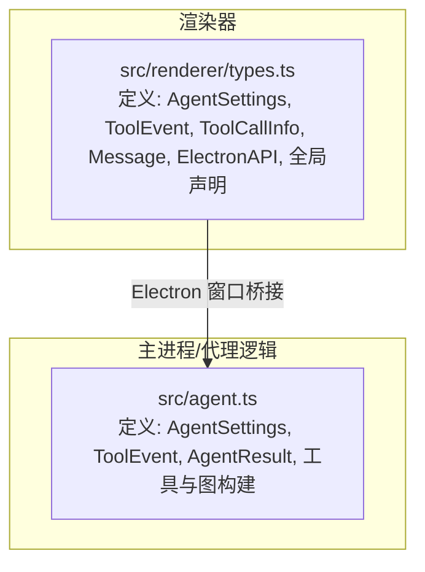
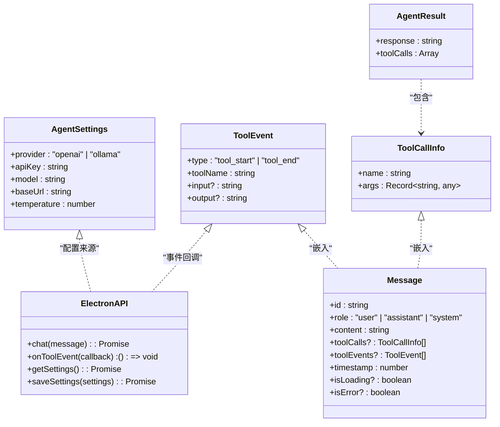
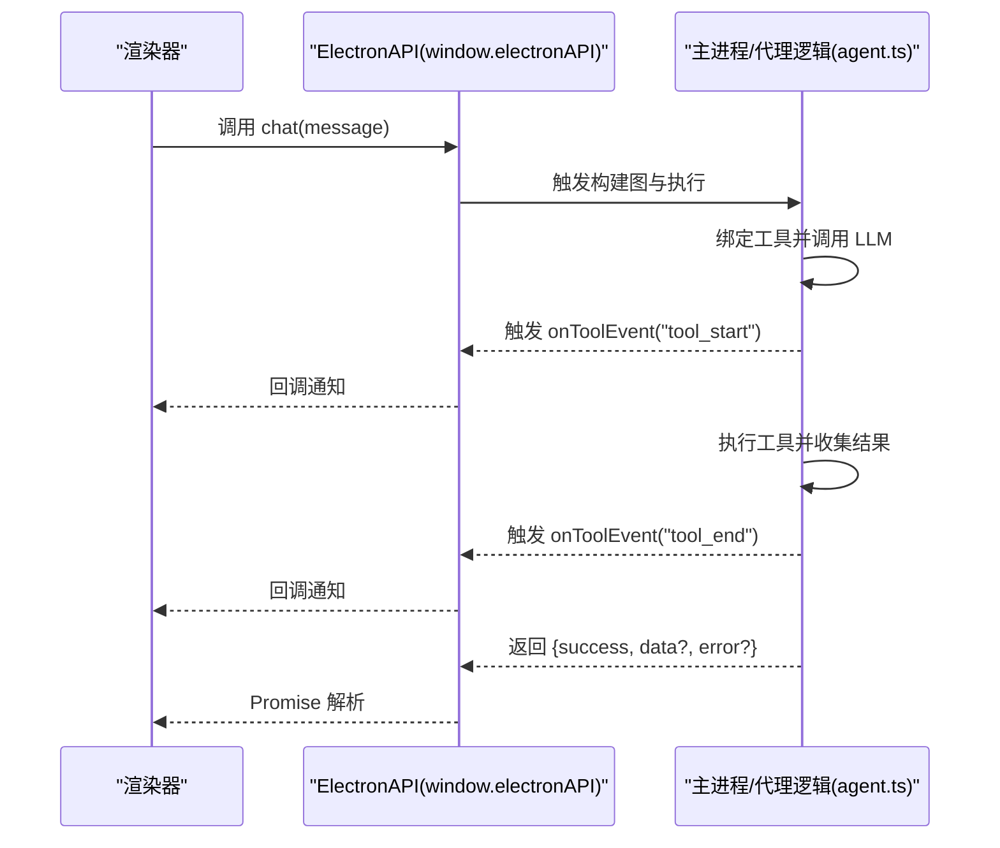

# 类型定义

<cite>
**本文引用的文件**
- [src/renderer/types.ts](file://src/renderer/types.ts)
- [src/agent.ts](file://src/agent.ts)
- [package.json](file://package.json)
- [tsconfig.json](file://tsconfig.json)
</cite>

## 目录
1. [简介](#简介)
2. [项目结构](#项目结构)
3. [核心类型总览](#核心类型总览)
4. [架构概览](#架构概览)
5. [详细类型分析](#详细类型分析)
6. [依赖与兼容性分析](#依赖与兼容性分析)
7. [性能与类型安全建议](#性能与类型安全建议)
8. [故障排查指南](#故障排查指南)
9. [结论](#结论)
10. [附录：类型推导示例与最佳实践](#附录类型推导示例与最佳实践)

## 简介
本文件系统化梳理 langGraph 项目的 TypeScript 类型定义，聚焦于核心接口与类型别名，覆盖 AgentSettings、ToolEvent、ToolCallInfo、Message 等关键类型，并说明其字段语义、数据类型、可选性与约束；同时给出类型继承关系、联合类型与可选属性的使用说明，以及类型推导示例与类型安全最佳实践。文档还包含全局类型声明与模块声明的使用方式、类型兼容性说明与版本变更影响提示。

## 项目结构
本项目采用前后端分离的 Electron 架构，TypeScript 类型主要分布在两个位置：
- 渲染进程类型：集中于渲染器的类型声明文件，负责窗口桥接 API 与消息模型。
- 主进程/代理逻辑类型：集中在代理构建与执行模块中，负责 Agent 设置、工具事件与消息状态。

图表来源
- [src/renderer/types.ts:1-49](file://src/renderer/types.ts#L1-L49)
- [src/agent.ts:1-316](file://src/agent.ts#L1-L316)

章节来源
- [src/renderer/types.ts:1-49](file://src/renderer/types.ts#L1-L49)
- [src/agent.ts:1-316](file://src/agent.ts#L1-L316)

## 核心类型总览
- AgentSettings：用于配置大模型提供商、密钥、模型名、基础地址与温度。
- ToolEvent：用于描述工具调用生命周期事件（开始/结束）及其输入输出。
- ToolCallInfo：描述一次工具调用的名称与参数。
- Message：对话消息体，支持工具调用与工具事件的嵌入，以及加载/错误标记。
- ElectronAPI：渲染器通过 window.electronAPI 与主进程通信的接口集合。

章节来源
- [src/renderer/types.ts:2-48](file://src/renderer/types.ts#L2-L48)
- [src/agent.ts:19-37](file://src/agent.ts#L19-L37)

## 架构概览
类型在系统中的角色与交互如下：

图表来源
- [src/renderer/types.ts:2-48](file://src/renderer/types.ts#L2-L48)
- [src/agent.ts:19-37](file://src/agent.ts#L19-L37)

## 详细类型分析

### AgentSettings
- 字段与类型
  - provider: 字符串字面量联合类型，限定为 "openai" 或 "ollama"
  - apiKey: 字符串
  - model: 字符串
  - baseUrl: 字符串
  - temperature: 数字
- 约束与默认
  - 该类型在主进程与渲染器均出现，用于统一配置来源与传递路径
  - 在主进程创建模型时，会根据 provider 决定使用 Ollama 或 OpenAI 的实现
- 可选性
  - 无强制可选字段；但在主进程创建模型时存在默认值回退逻辑

章节来源
- [src/renderer/types.ts:2-8](file://src/renderer/types.ts#L2-L8)
- [src/agent.ts:19-25](file://src/agent.ts#L19-L25)
- [src/agent.ts:151-169](file://src/agent.ts#L151-L169)

### ToolEvent
- 字段与类型
  - type: 字符串字面量联合类型，限定为 "tool_start" 或 "tool_end"
  - toolName: 字符串
  - input?: 字符串（可选）
  - output?: 字符串（可选）
- 语义与用途
  - 描述工具调用的生命周期事件，用于渲染层订阅与展示
  - 在主进程工具节点执行前后触发，携带序列化后的参数与结果
- 可选性
  - input 与 output 为可选，便于在不同阶段或异常情况下仅携带必要信息

章节来源
- [src/renderer/types.ts:10-15](file://src/renderer/types.ts#L10-L15)
- [src/agent.ts:27-32](file://src/agent.ts#L27-L32)
- [src/agent.ts:197-227](file://src/agent.ts#L197-L227)

### ToolCallInfo
- 字段与类型
  - name: 字符串
  - args: Record<string, any>（任意键值对）
- 语义与用途
  - 描述一次工具调用的名称与参数对象
  - 在 Message 中作为可选字段嵌入，用于记录与回放
- 可选性
  - 作为 Message 的可选字段，仅在存在工具调用时出现

章节来源
- [src/renderer/types.ts:17-20](file://src/renderer/types.ts#L17-L20)
- [src/agent.ts:34-37](file://src/agent.ts#L34-L37)
- [src/agent.ts:302-312](file://src/agent.ts#L302-L312)

### Message
- 字段与类型
  - id: 字符串
  - role: 字符串字面量联合类型，限定为 "user" | "assistant" | "system"
  - content: 字符串
  - toolCalls?: ToolCallInfo[]（可选）
  - toolEvents?: ToolEvent[]（可选）
  - timestamp: 数字
  - isLoading?: boolean（可选）
  - isError?: boolean（可选）
- 语义与用途
  - 对话消息载体，支持嵌入工具调用与工具事件
  - 可选标记用于 UI 展示加载态与错误态
- 可选性
  - 多个字段为可选，以适配不同阶段的消息状态

章节来源
- [src/renderer/types.ts:22-31](file://src/renderer/types.ts#L22-L31)
- [src/agent.ts:286-289](file://src/agent.ts#L286-L289)
- [src/agent.ts:293-299](file://src/agent.ts#L293-L299)

### ElectronAPI 与全局声明
- ElectronAPI
  - chat(message): Promise 返回包含 success、data（含 response 与 toolCalls）、error 的结构
  - onToolEvent(callback): 注册工具事件回调，并返回取消订阅函数
  - getSettings(): Promise<AgentSettings>
  - saveSettings(settings): Promise<boolean>
- 全局声明
  - 通过 declare global 声明 window.electronAPI，使渲染器可直接访问

章节来源
- [src/renderer/types.ts:33-48](file://src/renderer/types.ts#L33-L48)

## 架构概览
下面的时序图展示了从渲染器发起聊天到主进程工具执行与事件回调的整体流程，映射到实际类型定义：

图表来源
- [src/renderer/types.ts:33-42](file://src/renderer/types.ts#L33-L42)
- [src/agent.ts:171-262](file://src/agent.ts#L171-L262)
- [src/agent.ts:197-227](file://src/agent.ts#L197-L227)

## 详细类型分析

### 类型继承与组合关系
- 字面量联合类型
  - provider、role、type 等字段使用字面量联合类型，确保取值范围受控
- 可选属性
  - input/output、toolCalls/toolEvents、isLoading/isError 等均为可选，体现消息与事件的阶段性特征
- 复合类型
  - ToolCallInfo 的 args 使用 Record<string, any>，允许任意参数对象
  - Message 同时聚合 ToolCallInfo 与 ToolEvent，形成“消息内嵌工具调用与事件”的结构

章节来源
- [src/renderer/types.ts:2-31](file://src/renderer/types.ts#L2-L31)
- [src/agent.ts:19-37](file://src/agent.ts#L19-L37)

### 类型别名与泛型
- 本项目未显式定义类型别名或自定义泛型
- 使用了内置类型如 Record<string, any> 与数组类型
- 在主进程构建图时使用了 LangChain 的类型注解（如 typeof AgentState.State），但这些属于外部类型，不在此项目内定义

章节来源
- [src/agent.ts:144-149](file://src/agent.ts#L144-L149)
- [src/agent.ts:178-183](file://src/agent.ts#L178-L183)
- [src/agent.ts:185-238](file://src/agent.ts#L185-L238)

### 类型推导示例（基于源码路径）
- 从 AgentSettings 推导出模型创建参数
  - 参考路径：[src/agent.ts:151-169](file://src/agent.ts#L151-L169)
- 从 ToolEvent 推导事件回调签名
  - 参考路径：[src/agent.ts:173](file://src/agent.ts#L173)、[src/agent.ts:197-227](file://src/agent.ts#L197-L227)
- 从 Message 推导消息结构
  - 参考路径：[src/agent.ts:286-289](file://src/agent.ts#L286-L289)、[src/agent.ts:293-299](file://src/agent.ts#L293-L299)
- 从 ElectronAPI 推导渲染器调用约定
  - 参考路径：[src/renderer/types.ts:33-42](file://src/renderer/types.ts#L33-L42)

## 依赖与兼容性分析
- 语言与编译配置
  - 编译目标与模块解析：ESNext、bundler
  - JSX：react-jsx
  - 严格模式：开启
  - 路径映射：@/* -> src/*
- 外部依赖与类型
  - @langchain/core、@langchain/langgraph、@langchain/openai、@langchain/ollama 提供消息、运行时与工具类型
  - zod 用于工具参数 Schema 校验
- 版本变更影响
  - 当 LangChain 或 Zod 版本升级时，可能影响工具 Schema、消息类型与工具调用签名
  - Electron 与 React 类型版本升级需同步更新 @types 依赖，避免类型冲突

章节来源
- [tsconfig.json:1-22](file://tsconfig.json#L1-L22)
- [package.json:1-36](file://package.json#L1-L36)

## 性能与类型安全建议
- 使用字面量联合类型限制枚举值，减少分支判断开销与错误概率
- 对可选字段进行明确的判空处理，避免在渲染层直接访问未赋值字段
- 在工具参数校验上结合 Zod Schema，提前发现参数问题，降低运行时异常
- 对工具调用结果进行统一格式化（字符串或 JSON 字符串），保证 ToolEvent 的 output 一致性
- 在 ElectronAPI 的 Promise 结构中，区分 success/data/error，便于前端统一处理

## 故障排查指南
- 工具事件未触发
  - 检查 onToolEvent 回调是否正确注册与注销
  - 确认主进程工具节点是否按预期触发 tool_start/tool_end
  - 参考路径：[src/agent.ts:173](file://src/agent.ts#L173)、[src/agent.ts:197-227](file://src/agent.ts#L197-L227)
- 工具调用参数为空或异常
  - 检查 ToolCallInfo 的 args 是否被正确序列化为字符串
  - 参考路径：[src/agent.ts:197-201](file://src/agent.ts#L197-L201)
- 消息内容缺失
  - 检查 Message 的 content 与 toolCalls/toolEvents 是否按阶段填充
  - 参考路径：[src/agent.ts:293-299](file://src/agent.ts#L293-L299)、[src/agent.ts:302-312](file://src/agent.ts#L302-L312)
- 配置无效
  - 检查 AgentSettings 的 provider/model/baseUrl/temperature 是否符合预期
  - 参考路径：[src/agent.ts:151-169](file://src/agent.ts#L151-L169)

章节来源
- [src/agent.ts:173-227](file://src/agent.ts#L173-L227)
- [src/agent.ts:197-201](file://src/agent.ts#L197-L201)
- [src/agent.ts:293-312](file://src/agent.ts#L293-L312)
- [src/agent.ts:151-169](file://src/agent.ts#L151-L169)

## 结论
本项目的类型体系围绕 AgentSettings、ToolEvent、ToolCallInfo、Message 与 ElectronAPI 展开，通过字面量联合类型与可选属性实现了清晰的边界与灵活的扩展。配合 LangChain 与 Zod 的使用，既保证了运行时行为的可控性，也提升了开发体验与可维护性。建议在后续版本中持续关注外部依赖的类型变化，并在渲染层与主进程之间保持一致的类型契约。

## 附录：类型推导示例与最佳实践
- 类型推导示例（路径参考）
  - 从 AgentSettings 推导模型配置：[src/agent.ts:151-169](file://src/agent.ts#L151-L169)
  - 从 ToolEvent 推导事件回调签名：[src/agent.ts:173](file://src/agent.ts#L173)、[src/agent.ts:197-227](file://src/agent.ts#L197-L227)
  - 从 Message 推导消息结构：[src/agent.ts:286-289](file://src/agent.ts#L286-L289)、[src/agent.ts:293-299](file://src/agent.ts#L293-L299)
  - 从 ElectronAPI 推导渲染器调用约定：[src/renderer/types.ts:33-42](file://src/renderer/types.ts#L33-L42)
- 最佳实践
  - 明确区分必填与可选字段，避免在渲染层做过多的空值判断
  - 使用字面量联合类型约束枚举值，减少分支复杂度
  - 对工具参数与结果进行统一格式化，确保 ToolEvent 的 input/output 一致性
  - 在 ElectronAPI 的 Promise 结构中，优先使用 success/data/error 的三元结构，便于前端统一处理