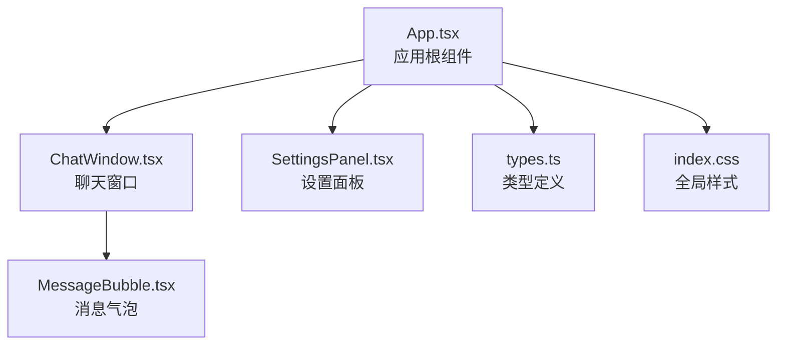
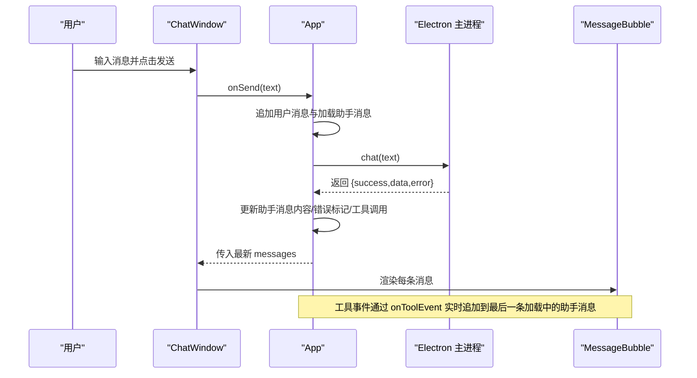
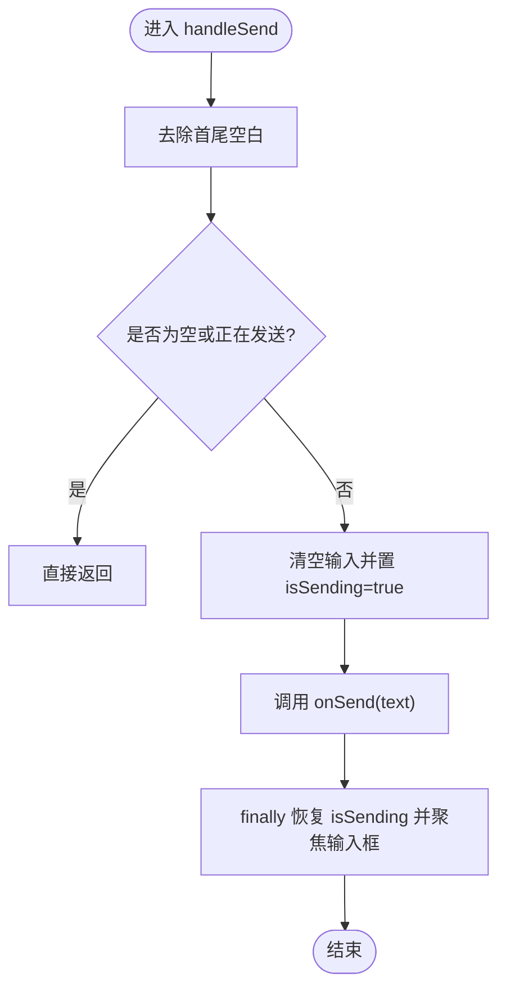
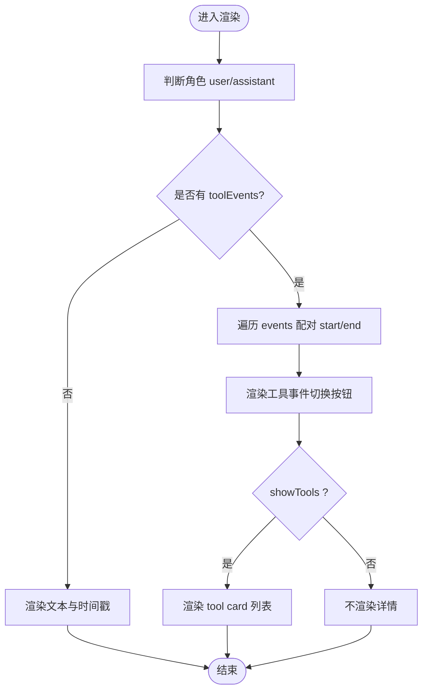
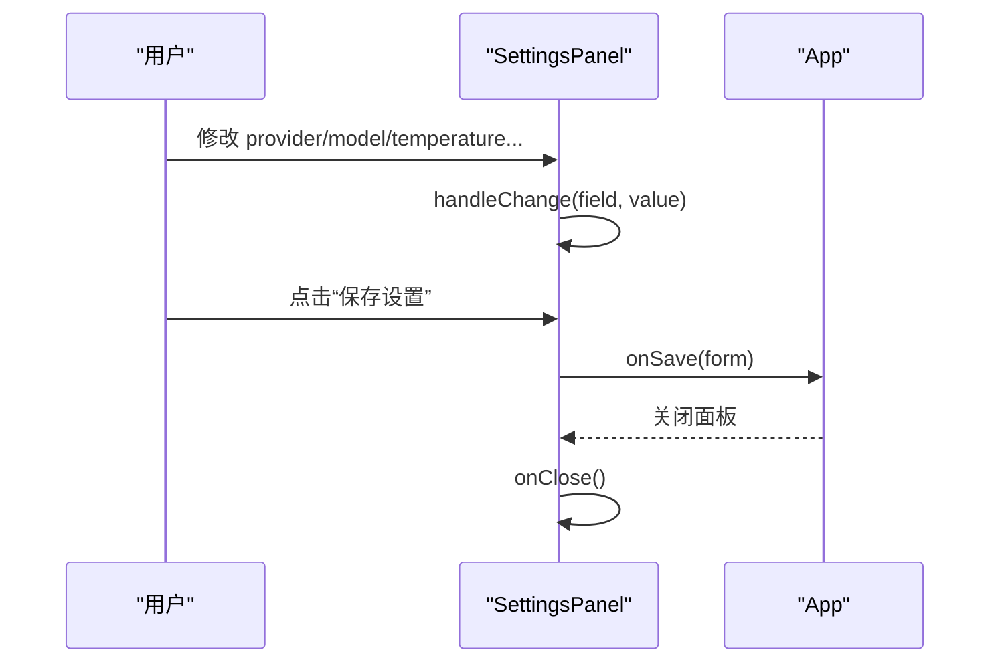
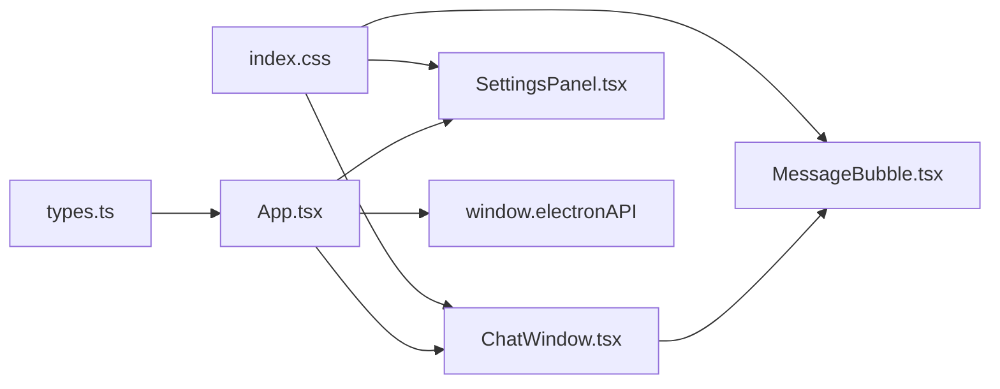

# 组件 API

<cite>
**本文引用的文件**
- [ChatWindow.tsx](file://src/renderer/components/ChatWindow.tsx)
- [MessageBubble.tsx](file://src/renderer/components/MessageBubble.tsx)
- [SettingsPanel.tsx](file://src/renderer/components/SettingsPanel.tsx)
- [App.tsx](file://src/renderer/App.tsx)
- [types.ts](file://src/renderer/types.ts)
- [index.css](file://src/renderer/index.css)
- [package.json](file://package.json)
- [index.html](file://index.html)
</cite>

## 目录
1. [简介](#简介)
2. [项目结构](#项目结构)
3. [核心组件](#核心组件)
4. [架构总览](#架构总览)
5. [组件详细分析](#组件详细分析)
6. [依赖关系分析](#依赖关系分析)
7. [性能与可扩展性](#性能与可扩展性)
8. [故障排查指南](#故障排查指南)
9. [结论](#结论)
10. [附录：样式与主题](#附录样式与主题)

## 简介
本文件为 langGraph 的 React 组件 API 文档，聚焦以下核心组件：
- ChatWindow：聊天窗口容器，负责消息列表渲染、输入区交互、自动滚动与高度自适应、发送流程与加载态控制。
- MessageBubble：单条消息气泡组件，支持用户/助手头像、消息文本、工具事件展示与折叠、时间戳显示。
- SettingsPanel：设置面板，支持 LLM 提供商切换（OpenAI/Ollama）、API Key、模型名、Base URL、Temperature 等配置项的编辑与保存。

文档涵盖各组件的 props 接口、事件回调、受控属性、状态管理、生命周期行为、错误处理、无障碍与响应式设计建议，以及组件组合的最佳实践与样式定制方案。

## 项目结构
- 渲染进程入口位于 src/renderer/main.tsx，应用根组件 App.tsx 负责状态管理与子组件编排。
- 核心组件位于 src/renderer/components 下，类型定义集中在 src/renderer/types.ts。
- 样式集中于 src/renderer/index.css，采用 CSS 变量实现主题化与暗色风格。

图表来源
- [App.tsx:1-140](file://src/renderer/App.tsx#L1-L140)
- [ChatWindow.tsx:1-114](file://src/renderer/components/ChatWindow.tsx#L1-L114)
- [MessageBubble.tsx:1-104](file://src/renderer/components/MessageBubble.tsx#L1-L104)
- [SettingsPanel.tsx:1-139](file://src/renderer/components/SettingsPanel.tsx#L1-L139)
- [types.ts:1-49](file://src/renderer/types.ts#L1-L49)
- [index.css:1-649](file://src/renderer/index.css#L1-L649)

章节来源
- [App.tsx:1-140](file://src/renderer/App.tsx#L1-L140)
- [package.json:1-36](file://package.json#L1-L36)
- [index.html:1-13](file://index.html#L1-L13)

## 核心组件
本节概述三个核心组件的职责与对外接口。

- ChatWindow
  - 负责消息列表渲染、输入区交互、自动滚动至底部、输入框高度自适应、发送按钮禁用逻辑、加载态指示。
  - 对外暴露受控属性 messages 与回调 onSend；内部维护输入值与发送中状态。
- MessageBubble
  - 渲染单条消息，区分用户/助手角色，支持加载态与错误态样式，展示工具事件配对卡片与展开/收起。
- SettingsPanel
  - 提供 Agent 设置表单，支持提供商切换、API Key、模型名、Base URL、Temperature 调整，并触发保存与关闭回调。

章节来源
- [ChatWindow.tsx:5-114](file://src/renderer/components/ChatWindow.tsx#L5-L114)
- [MessageBubble.tsx:4-104](file://src/renderer/components/MessageBubble.tsx#L4-L104)
- [SettingsPanel.tsx:4-139](file://src/renderer/components/SettingsPanel.tsx#L4-L139)

## 架构总览
应用通过 App.tsx 管理全局状态（消息列表、设置、设置面板开关），将状态与回调传递给子组件。Electron 主进程通过 window.electronAPI 提供聊天与工具事件监听能力，组件通过异步回调更新消息状态与工具事件。

图表来源
- [App.tsx:43-84](file://src/renderer/App.tsx#L43-L84)
- [types.ts:33-42](file://src/renderer/types.ts#L33-L42)
- [ChatWindow.tsx:29-42](file://src/renderer/components/ChatWindow.tsx#L29-L42)
- [MessageBubble.tsx:8-101](file://src/renderer/components/MessageBubble.tsx#L8-L101)

## 组件详细分析

### ChatWindow 组件 API
- 组件定位：聊天窗口容器，承载消息列表与输入区。
- 受控属性
  - messages: Message[] —— 必填，用于渲染消息列表。
  - onSend: (text: string) => void | Promise<void> —— 必填，发送回调，接收用户输入文本。
- 内部状态与行为
  - 输入值 input: string —— 受控输入，支持自动高度调整。
  - 发送中状态 isSending: boolean —— 控制发送按钮与输入框禁用。
  - 自动滚动：每次 messages 更新后滚动到底部。
  - 输入框高度自适应：根据内容高度限制在最小到最大之间。
  - 键盘快捷键：按 Enter 发送，Shift+Enter 换行。
- 事件与回调
  - handleSend：校验输入与发送中状态，调用 onSend 并在完成后恢复焦点。
  - handleKeyDown：拦截 Enter 键，阻止默认换行行为并触发发送。
- 错误处理
  - 禁止重复发送：当 isSending 或输入为空时直接返回。
  - 发送完成统一恢复 isSending 与焦点。
- 无障碍与可用性
  - 输入框与按钮具备禁用态视觉反馈。
  - 占位符提示 Enter 发送、Shift+Enter 换行。
- 性能与复杂度
  - 每次消息更新触发一次滚动，消息列表渲染为 O(n)。
  - 输入高度自适应为 O(1) 操作（DOM 计算）。
- 使用示例（路径）
  - 在 App 中作为受控组件使用：[App.tsx:133](file://src/renderer/App.tsx#L133)
  - ChatWindow 的发送流程与状态管理：[ChatWindow.tsx:29-42](file://src/renderer/components/ChatWindow.tsx#L29-L42)

图表来源
- [ChatWindow.tsx:29-42](file://src/renderer/components/ChatWindow.tsx#L29-L42)

章节来源
- [ChatWindow.tsx:5-114](file://src/renderer/components/ChatWindow.tsx#L5-L114)
- [App.tsx:43-84](file://src/renderer/App.tsx#L43-L84)

### MessageBubble 组件 API
- 组件定位：渲染单条消息气泡，支持用户/助手头像、消息文本、工具事件卡片与时间戳。
- 受控属性
  - message: Message —— 必填，包含消息内容、角色、时间戳、加载/错误标记、工具调用与工具事件等。
- 内部状态与行为
  - showTools: boolean —— 控制工具事件详情卡片的展开/收起。
  - 工具事件配对：遍历 toolEvents，将 type 为 tool_start 与最近未闭合的 tool_end 配对，形成 pairs。
  - 角色判定：根据 message.role 决定头像与气泡样式类名。
- 事件与回调
  - 工具事件卡片切换：点击“🔧 工具调用”按钮切换 showTools。
- 错误处理
  - 当 message.isError 为真时，文本区域应用 error 样式。
  - 当 message.isLoading 为真时，显示三点加载动画。
- 无障碍与可用性
  - 工具事件卡片使用按钮触发展开，便于键盘操作。
- 性能与复杂度
  - 工具事件配对为 O(n)，n 为 toolEvents 数量。
- 使用示例（路径）
  - 在 ChatWindow 中循环渲染：[ChatWindow.tsx:77-79](file://src/renderer/components/ChatWindow.tsx#L77-L79)
  - MessageBubble 的工具事件配对与渲染：[MessageBubble.tsx:13-28](file://src/renderer/components/MessageBubble.tsx#L13-L28)

图表来源
- [MessageBubble.tsx:8-101](file://src/renderer/components/MessageBubble.tsx#L8-L101)

章节来源
- [MessageBubble.tsx:4-104](file://src/renderer/components/MessageBubble.tsx#L4-L104)

### SettingsPanel 组件 API
- 组件定位：Agent 设置面板，支持提供商选择、API Key、模型名、Base URL、Temperature 等配置。
- 受控属性
  - settings: AgentSettings —— 必填，初始设置对象。
  - onSave: (settings: AgentSettings) => void | Promise<void> —— 必填，保存回调。
  - onClose: () => void —— 必填，关闭回调。
- 表单字段与行为
  - provider: 'openai' | 'ollama' —— 单选，影响后续字段可见性与占位符。
  - apiKey: string —— OpenAI 时显示密码输入框。
  - model: string —— 文本输入，不同提供商默认值不同。
  - baseUrl: string —— 自定义 API 地址或本地 Ollama 地址。
  - temperature: number —— 范围 0~2，步进 0.1。
- 事件与回调
  - handleChange(field, value)：受控更新表单副本。
  - handleSave()：调用 onSave(form) 后关闭面板。
  - 关闭按钮：调用 onClose()。
- 错误处理
  - 无显式校验逻辑，保存由 App 层负责持久化与刷新。
- 无障碍与可用性
  - 单选组使用 label 包裹，提升可点击区域与可读性。
  - 范围输入使用原生控件，具备键盘微调能力。
- 使用示例（路径）
  - App 中打开设置面板并传入回调：[App.tsx:124-130](file://src/renderer/App.tsx#L124-L130)
  - 保存设置与关闭面板：[App.tsx:86-90](file://src/renderer/App.tsx#L86-L90)

图表来源
- [SettingsPanel.tsx:10-139](file://src/renderer/components/SettingsPanel.tsx#L10-L139)
- [App.tsx:86-90](file://src/renderer/App.tsx#L86-L90)

章节来源
- [SettingsPanel.tsx:4-139](file://src/renderer/components/SettingsPanel.tsx#L4-L139)
- [App.tsx:86-90](file://src/renderer/App.tsx#L86-L90)

## 依赖关系分析
- 组件间依赖
  - App.tsx 同时依赖 ChatWindow 与 SettingsPanel，并向其传递状态与回调。
  - ChatWindow 依赖 MessageBubble 渲染消息列表。
  - 所有组件共享 types.ts 中的类型定义。
- 外部依赖
  - Electron 主进程通过 window.electronAPI 提供聊天与工具事件监听能力。
  - 样式依赖 CSS 变量与全局样式文件。

图表来源
- [types.ts:1-49](file://src/renderer/types.ts#L1-L49)
- [App.tsx:1-140](file://src/renderer/App.tsx#L1-L140)
- [ChatWindow.tsx:1-114](file://src/renderer/components/ChatWindow.tsx#L1-L114)
- [MessageBubble.tsx:1-104](file://src/renderer/components/MessageBubble.tsx#L1-L104)
- [SettingsPanel.tsx:1-139](file://src/renderer/components/SettingsPanel.tsx#L1-L139)
- [index.css:1-649](file://src/renderer/index.css#L1-L649)

章节来源
- [types.ts:1-49](file://src/renderer/types.ts#L1-L49)
- [App.tsx:1-140](file://src/renderer/App.tsx#L1-L140)

## 性能与可扩展性
- 渲染性能
  - ChatWindow 每次消息变更触发滚动，消息列表渲染为 O(n)；可通过虚拟列表优化长消息场景。
  - MessageBubble 工具事件配对为 O(n)，通常事件数量较少，开销可控。
- 状态管理
  - App 使用单一状态树管理 messages 与 settings，避免跨组件状态同步问题。
- 可扩展性
  - 新增消息类型（如 system）可在 MessageBubble 中扩展样式与行为。
  - SettingsPanel 可新增更多提供商与参数，通过 provider 字段动态渲染。

[本节为通用指导，无需特定文件引用]

## 故障排查指南
- 发送按钮不可用
  - 检查 isSending 状态是否被正确重置，确认 handleSend 的 finally 分支执行。
  - 参考路径：[ChatWindow.tsx:36-41](file://src/renderer/components/ChatWindow.tsx#L36-L41)
- 输入框高度异常
  - 确认自动高度逻辑在每次输入变化时执行，检查 textareaRef 是否正确赋值。
  - 参考路径：[ChatWindow.tsx:22-27](file://src/renderer/components/ChatWindow.tsx#L22-L27)
- 工具事件未显示
  - 确认 App 中 onToolEvent 回调已注册且事件顺序正确（先 tool_start，再 tool_end）。
  - 参考路径：[App.tsx:25-41](file://src/renderer/App.tsx#L25-L41)
- 设置保存后未生效
  - 确认 App.handleSaveSettings 已调用 window.electronAPI.saveSettings 并更新本地 settings。
  - 参考路径：[App.tsx:86-90](file://src/renderer/App.tsx#L86-L90)

章节来源
- [ChatWindow.tsx:22-41](file://src/renderer/components/ChatWindow.tsx#L22-L41)
- [App.tsx:25-41](file://src/renderer/App.tsx#L25-L41)
- [App.tsx:86-90](file://src/renderer/App.tsx#L86-L90)

## 结论
ChatWindow、MessageBubble、SettingsPanel 三者协同构建了完整的聊天界面与设置体系。通过清晰的受控属性与回调约定、完善的加载与错误态处理、以及基于 CSS 变量的主题系统，组件具备良好的可维护性与可扩展性。建议在生产环境中引入虚拟列表与更严格的表单校验，以进一步提升性能与用户体验。

[本节为总结性内容，无需特定文件引用]

## 附录：样式与主题
- 主题变量
  - 使用 CSS 变量统一管理背景、文本、强调色、边框、圆角与阴影等，便于主题切换。
  - 参考路径：[:root 定义:5-25](file://src/renderer/index.css#L5-L25)
- 组件样式类名
  - ChatWindow：chat-window、messages-container、empty-state、suggestions、input-area、input-wrapper、message-input、send-btn、spinner。
  - MessageBubble：message-row、user-row、assistant-row、message-bubble、user-bubble、assistant-bubble、avatar、bubble-content、message-text、tool-events、tool-toggle、tool-details、tool-card、tool-header、tool-code、message-time。
  - SettingsPanel：settings-panel、settings-header、settings-body、setting-group、setting-input、radio-group、radio-option、setting-range、range-labels、settings-footer、btn、btn-primary、btn-secondary。
- 响应式与无障碍
  - 使用 Flex 布局与合适的 gap，确保在不同屏幕尺寸下良好显示。
  - 提供禁用态与 hover 状态的视觉反馈，增强可访问性。
- 自定义建议
  - 通过覆盖 CSS 变量快速切换主题色系。
  - 为关键按钮与输入框添加 aria-* 属性以提升可访问性。

章节来源
- [index.css:1-649](file://src/renderer/index.css#L1-L649)