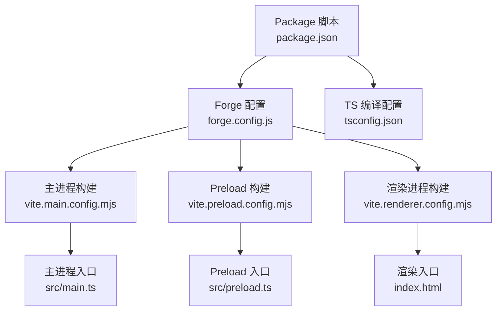
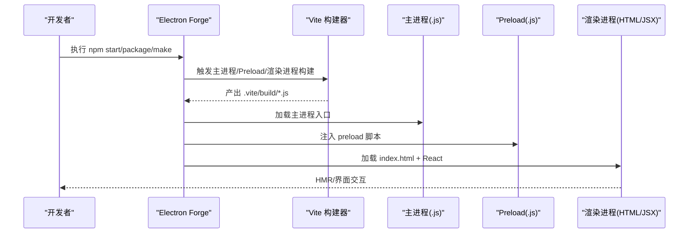
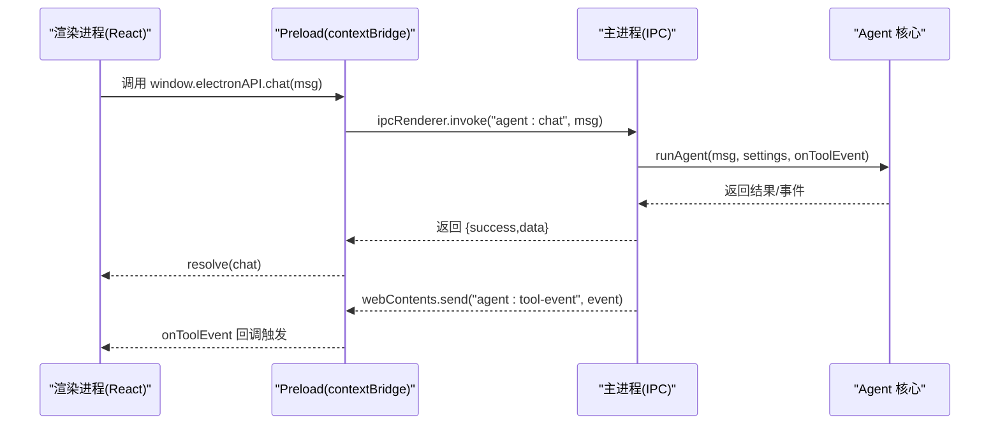
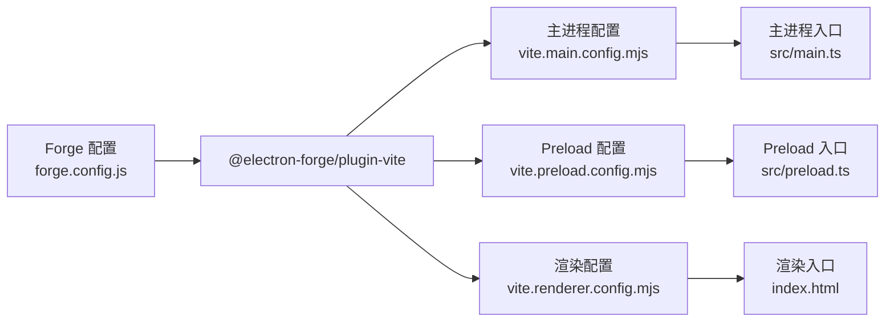

# Electron Forge 配置

<cite>
**本文引用的文件**
- [forge.config.js](file://forge.config.js)
- [package.json](file://package.json)
- [vite.main.config.mjs](file://vite.main.config.mjs)
- [vite.preload.config.mjs](file://vite.preload.config.mjs)
- [vite.renderer.config.mjs](file://vite.renderer.config.mjs)
- [src/main.ts](file://src/main.ts)
- [src/preload.ts](file://src/preload.ts)
- [index.html](file://index.html)
- [开发文档.md](file://开发文档.md)
- [tsconfig.json](file://tsconfig.json)
</cite>

## 目录
1. [简介](#简介)
2. [项目结构](#项目结构)
3. [核心组件](#核心组件)
4. [架构总览](#架构总览)
5. [详细组件分析](#详细组件分析)
6. [依赖关系分析](#依赖关系分析)
7. [性能考量](#性能考量)
8. [故障排查指南](#故障排查指南)
9. [结论](#结论)
10. [附录](#附录)

## 简介
本文件面向 langGraph 的 Electron Forge 打包配置，系统性解析 Forge 打包参数、构建流程与跨平台策略，覆盖 Windows、macOS、Linux 的 Maker 配置差异；同时说明应用图标、签名证书与安装包生成流程；对比开发与生产环境的构建差异（热重载、代码分割等）；给出发布流程、自动更新与版本管理建议；最后提供打包优化、体积控制与构建时间优化方法，并汇总常见问题与排障思路。

## 项目结构
该项目采用 Electron + Electron Forge + Vite 的现代化桌面应用工程化方案：
- Forge 配置集中于 forge.config.js，定义打包、Maker 与 Vite 插件。
- Vite 为三段式构建：主进程、preload、渲染进程分别配置。
- package.json 定义脚本与依赖，主入口指向 Vite 构建产物。
- src 目录包含主进程、preload、渲染进程入口与组件。
- index.html 作为渲染进程入口页面，配合 Vite React 插件。

图表来源
- [forge.config.js:1-42](file://forge.config.js#L1-L42)
- [vite.main.config.mjs:1-24](file://vite.main.config.mjs#L1-L24)
- [vite.preload.config.mjs:1-10](file://vite.preload.config.mjs#L1-L10)
- [vite.renderer.config.mjs:1-7](file://vite.renderer.config.mjs#L1-L7)
- [src/main.ts:1-100](file://src/main.ts#L1-L100)
- [src/preload.ts:1-18](file://src/preload.ts#L1-L18)
- [index.html:1-13](file://index.html#L1-L13)
- [package.json:1-36](file://package.json#L1-L36)
- [tsconfig.json:1-22](file://tsconfig.json#L1-L22)

章节来源
- [forge.config.js:1-42](file://forge.config.js#L1-L42)
- [package.json:1-36](file://package.json#L1-L36)
- [开发文档.md:152-176](file://开发文档.md#L152-L176)

## 核心组件
- Forge 打包配置（packagerConfig）
  - asar：启用 asar 归档以保护源码与资源。
- Maker 列表（makers）
  - Squirrel（Windows 安装程序）
  - Zip（Windows 压缩包）
- Vite 插件（plugins）
  - @electron-forge/plugin-vite：为主进程、preload、渲染进程分别指定入口与配置文件。
- Vite 主进程配置（vite.main.config.mjs）
  - electron 外部化，避免打包 Electron。
  - SSR noExternal 内联 LangChain/LangGraph 等纯 ESM 包，解决 CJS/ESM 兼容问题。
- Vite Preload 配置（vite.preload.config.mjs）
  - electron 外部化，避免打包 Electron。
- Vite 渲染进程配置（vite.renderer.config.mjs）
  - 引入 React 插件，支持 JSX。
- Package 脚本（package.json）
  - start/package/make/publish：对应开发、打包、制作安装包、发布。
- TS 编译配置（tsconfig.json）
  - ESNext 模块系统、Bundler 解析、严格模式、路径别名等。

章节来源
- [forge.config.js:3-41](file://forge.config.js#L3-L41)
- [vite.main.config.mjs:8-22](file://vite.main.config.mjs#L8-L22)
- [vite.preload.config.mjs:4-8](file://vite.preload.config.mjs#L4-L8)
- [vite.renderer.config.mjs:4-6](file://vite.renderer.config.mjs#L4-L6)
- [package.json:6-11](file://package.json#L6-L11)
- [tsconfig.json:2-17](file://tsconfig.json#L2-L17)

## 架构总览
Electron Forge + Vite 的构建架构如下：
- 开发阶段：Vite 渲染进程热更新，主进程/Preload 由 Forge/Vite 插件构建后交由 Electron 启动。
- 生产阶段：Forge 调用 Vite 三段式构建，再通过 Maker 生成安装包或压缩包。

图表来源
- [forge.config.js:19-39](file://forge.config.js#L19-L39)
- [vite.main.config.mjs:1-24](file://vite.main.config.mjs#L1-L24)
- [vite.preload.config.mjs:1-10](file://vite.preload.config.mjs#L1-L10)
- [vite.renderer.config.mjs:1-7](file://vite.renderer.config.mjs#L1-L7)
- [src/main.ts:36-62](file://src/main.ts#L36-L62)
- [src/preload.ts:1-18](file://src/preload.ts#L1-L18)
- [index.html:8-12](file://index.html#L8-L12)

## 详细组件分析

### Forge 打包配置（forge.config.js）
- packagerConfig.asar：开启 asar 归档，提高安全性与分发效率。
- makers：
  - @electron-forge/maker-squirrel：Windows 安装程序，配置应用名称。
  - @electron-forge/maker-zip：仅针对 win32 平台输出 ZIP 压缩包。
- plugins：
  - @electron-forge/plugin-vite：
    - build：主进程与 preload 的入口与配置映射。
    - renderer：渲染进程的开发服务器与构建配置。
- 说明：当前配置未包含 macOS 与 Linux 的 Maker，后续可按需扩展。

章节来源
- [forge.config.js:4-18](file://forge.config.js#L4-L18)
- [forge.config.js:19-39](file://forge.config.js#L19-L39)

### Vite 主进程配置（vite.main.config.mjs）
- electron 外部化：避免将 Electron 打包进主进程产物，减少体积与冲突。
- SSR noExternal：将 LangChain/LangGraph/zod 等纯 ESM 包内联，解决 CJS/ESM 兼容问题。
- 模块解析：conditions 与 mainFields 适配 Node 环境。

章节来源
- [vite.main.config.mjs:8-22](file://vite.main.config.mjs#L8-L22)

### Vite Preload 配置（vite.preload.config.mjs）
- electron 外部化：preload 也应保持外部化，避免打包 Electron。
- 适合在此处进行最小化构建，保证 preload 快速加载。

章节来源
- [vite.preload.config.mjs:4-8](file://vite.preload.config.mjs#L4-L8)

### Vite 渲染进程配置（vite.renderer.config.mjs）
- 引入 React 插件，支持 JSX 与 HMR。
- 与 index.html 的模块入口配合，形成完整的渲染进程开发/构建链路。

章节来源
- [vite.renderer.config.mjs:4-6](file://vite.renderer.config.mjs#L4-L6)
- [index.html:10](file://index.html#L10)

### 主进程与 Preload 的 IPC 设计
- 主进程负责窗口创建、IPC 处理、设置持久化与 Agent 调用。
- Preload 通过 contextBridge 暴露受控 API 至渲染进程，使用 invoke/handle 与 send/on 实现双向通信。

图表来源
- [src/main.ts:65-84](file://src/main.ts#L65-L84)
- [src/preload.ts:3-17](file://src/preload.ts#L3-L17)

章节来源
- [src/main.ts:36-62](file://src/main.ts#L36-L62)
- [src/main.ts:65-84](file://src/main.ts#L65-L84)
- [src/preload.ts:1-18](file://src/preload.ts#L1-L18)

### 跨平台构建策略
- 当前配置仅包含 Windows 的 Squirrel 与 Zip Maker。
- macOS/Linux 建议：
  - macOS：使用 @electron-forge/maker-dmg 或 @electron-forge/maker-zip。
  - Linux：使用 @electron-forge/maker-deb/@electron-forge/maker-rpm 或 @electron-forge/maker-zip。
- 平台过滤：可通过 makers[].platforms 控制仅在特定平台生成对应包。

章节来源
- [forge.config.js:7-18](file://forge.config.js#L7-L18)

### 应用图标、签名证书与安装包生成
- 应用图标与签名证书：
  - Forge 配置中未显式声明图标与签名参数，通常可在 packagerConfig 或 maker 配置中补充。
  - 建议在 packagerConfig 中设置 icon 字段；在 Windows 上可配置 publisherName、signingHashAlgorithms 等。
- 安装包生成：
  - Windows：Squirrel 生成 .exe 安装包；Zip 生成便携版压缩包。
  - macOS/Linux：按上述建议添加相应 Maker。

章节来源
- [forge.config.js:4-18](file://forge.config.js#L4-L18)

### 开发环境与生产环境构建差异
- 开发环境（npm start）：
  - 渲染进程走 Vite 开发服务器，支持 HMR。
  - 主进程/Preload 由 Forge/Vite 插件构建后交由 Electron 启动。
- 生产环境（npm run package/make）：
  - 三段式构建全部产出静态文件。
  - make 会调用各 Maker 生成安装包或压缩包。
- 代码分割策略：
  - 当前配置未显式配置 Rollup 代码分割；如需进一步拆分，可在 vite.*.config.mjs 的 rollupOptions.output 中定制。

章节来源
- [开发文档.md:509-541](file://开发文档.md#L509-L541)
- [package.json:6-11](file://package.json#L6-L11)

### 发布流程、自动更新与版本管理
- 发布流程：
  - 使用 npm run publish（需配置发布源与凭据）。
- 自动更新：
  - 当前配置未启用自动更新；可在主进程初始化时集成 autoUpdater 或使用 @electron/update-electron-app。
- 版本管理：
  - package.json 的 version 字段即应用版本；建议遵循语义化版本规范。

章节来源
- [package.json:2-4](file://package.json#L2-L4)
- [package.json:10](file://package.json#L10)

## 依赖关系分析
Forge 与 Vite 的依赖关系如下：
- Forge 通过 @electron-forge/plugin-vite 调用 Vite 三段式构建。
- 主进程构建依赖 vite.main.config.mjs；preload 依赖 vite.preload.config.mjs；渲染进程依赖 vite.renderer.config.mjs。
- 主进程入口与 preload 入口分别由 Forge 映射至 src/main.ts 与 src/preload.ts。

图表来源
- [forge.config.js:19-39](file://forge.config.js#L19-L39)
- [vite.main.config.mjs:1-24](file://vite.main.config.mjs#L1-L24)
- [vite.preload.config.mjs:1-10](file://vite.preload.config.mjs#L1-L10)
- [vite.renderer.config.mjs:1-7](file://vite.renderer.config.mjs#L1-L7)
- [src/main.ts:1-100](file://src/main.ts#L1-L100)
- [src/preload.ts:1-18](file://src/preload.ts#L1-L18)
- [index.html:1-13](file://index.html#L1-L13)

章节来源
- [forge.config.js:19-39](file://forge.config.js#L19-L39)

## 性能考量
- asar 启用：减少文件数量，提升加载性能与安全性。
- 外部化 Electron：避免重复打包，减小体积。
- 内联 ESM 包：通过 noExternal 解决 CJS/ESM 兼容，避免运行时动态解析带来的开销。
- 代码分割：可在 rollupOptions.output 中定制，按需拆分主进程/渲染进程模块。
- 构建缓存：Vite 默认缓存，合理利用可缩短二次构建时间。
- 并行构建：确保多核 CPU 下充分利用资源。

## 故障排查指南
- ESM/CJS 兼容错误
  - 现象：运行时报错提示模块未找到或 ESM 导出不可用。
  - 处理：确认 vite.main.config.mjs 的 ssr.noExternal 是否包含相关包。
- preload 无法加载
  - 现象：渲染进程无法访问 window.electronAPI。
  - 处理：确认主进程 BrowserWindow 的 preload 路径正确，且 preload 已成功构建。
- 开发模式 HMR 不生效
  - 现象：修改渲染进程代码后未热更新。
  - 处理：确认 vite.renderer.config.mjs 正确引入 React 插件，且 index.html 的入口脚本加载路径正确。
- Windows 安装包缺失
  - 现象：make 后未生成 .exe 或 ZIP。
  - 处理：确认 makers 配置与平台匹配；必要时为 Zip 指定 platforms: ['win32']。
- 版本号不更新
  - 现象：发布后版本未变化。
  - 处理：更新 package.json 的 version 字段并重新 make/publish。

章节来源
- [vite.main.config.mjs:24-261](file://vite.main.config.mjs#L24-L261)
- [src/main.ts:44](file://src/main.ts#L44)
- [index.html:10](file://index.html#L10)
- [forge.config.js:14-18](file://forge.config.js#L14-L18)
- [package.json:2-4](file://package.json#L2-L4)

## 结论
本项目以 Electron + Forge + Vite 构建，配置简洁高效，重点解决了主进程 ESM/CSM 兼容与跨平台打包的痛点。当前配置聚焦 Windows，建议后续补充 macOS/Linux 的 Maker 与签名配置；同时可考虑引入自动更新与更细粒度的代码分割策略，以进一步提升用户体验与维护效率。

## 附录
- 常用命令
  - 开发：npm start
  - 打包（不生成安装包）：npm run package
  - 制作安装包：npm run make
  - 发布：npm run publish
- 路径与入口
  - 主进程入口：src/main.ts
  - Preload 入口：src/preload.ts
  - 渲染入口：index.html + src/renderer/main.tsx
- TypeScript 路径别名
  - @/* -> src/*

章节来源
- [开发文档.md:651-659](file://开发文档.md#L651-L659)
- [开发文档.md:152-176](file://开发文档.md#L152-L176)
- [tsconfig.json:15-17](file://tsconfig.json#L15-L17)