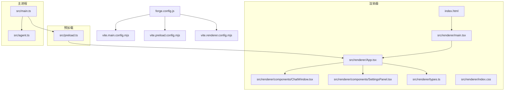
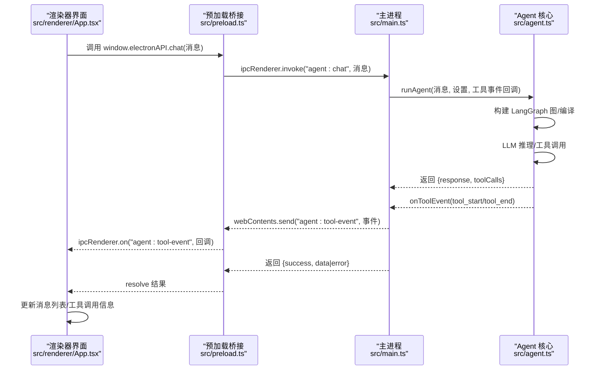
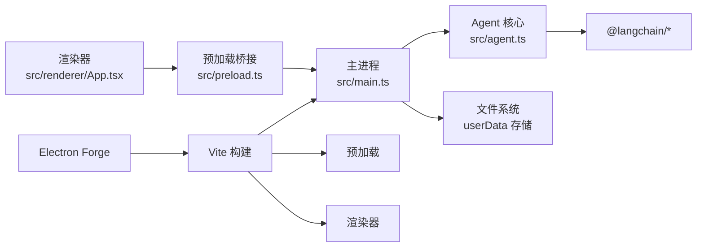
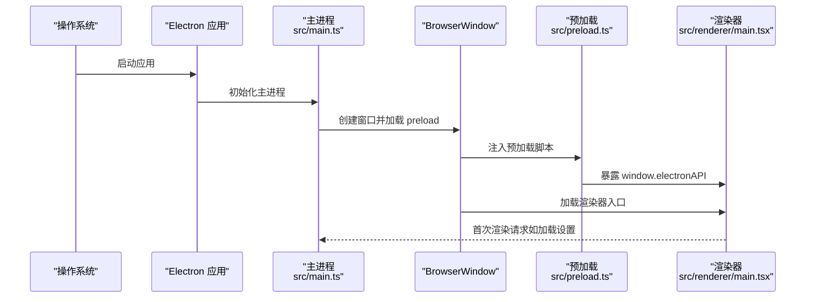
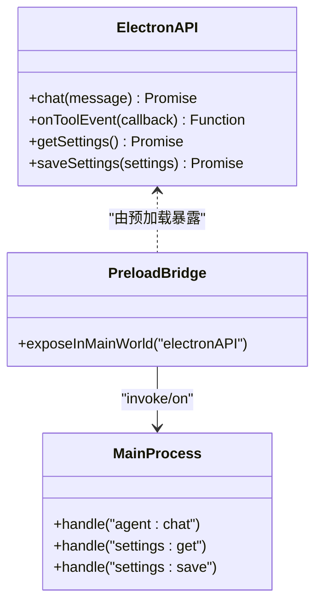

# Electron 集成

<cite>
**本文引用的文件**
- [package.json](file://package.json)
- [forge.config.js](file://forge.config.js)
- [src/main.ts](file://src/main.ts)
- [src/preload.ts](file://src/preload.ts)
- [src/agent.ts](file://src/agent.ts)
- [src/renderer/main.tsx](file://src/renderer/main.tsx)
- [index.html](file://index.html)
- [vite.main.config.mjs](file://vite.main.config.mjs)
- [vite.preload.config.mjs](file://vite.preload.config.mjs)
- [vite.renderer.config.mjs](file://vite.renderer.config.mjs)
- [src/renderer/App.tsx](file://src/renderer/App.tsx)
- [src/renderer/types.ts](file://src/renderer/types.ts)
- [src/renderer/components/ChatWindow.tsx](file://src/renderer/components/ChatWindow.tsx)
- [src/renderer/components/SettingsPanel.tsx](file://src/renderer/components/SettingsPanel.tsx)
- [src/renderer/index.css](file://src/renderer/index.css)
</cite>

## 目录
1. [简介](#简介)
2. [项目结构](#项目结构)
3. [核心组件](#核心组件)
4. [架构总览](#架构总览)
5. [详细组件分析](#详细组件分析)
6. [依赖关系分析](#依赖关系分析)
7. [性能考量](#性能考量)
8. [故障排查指南](#故障排查指南)
9. [结论](#结论)
10. [附录](#附录)

## 简介
本文件为 langGraph 的 Electron 集成提供完整技术文档，覆盖主进程配置、应用生命周期管理、窗口控制、预加载脚本安全机制、IPC 通信桥接与 API 暴露策略、Electron Forge 打包配置与跨平台分发、Node.js API 的安全暴露与渲染器限制、应用启动流程、菜单与系统托盘扩展建议、通知功能集成建议、安全最佳实践、性能优化与调试技巧，以及不同操作系统下的兼容性注意事项。

## 项目结构
该项目采用“主进程 + 渲染器（React）+ 预加载桥接”的标准 Electron 架构，结合 Vite 进行多入口构建，通过 Electron Forge 插件完成打包与分发。主要目录与职责如下：
- src/main.ts：主进程入口，负责窗口创建、生命周期管理、IPC 处理与持久化设置读写。
- src/preload.ts：预加载脚本，通过 contextBridge 暴露受限 API 至渲染器。
- src/agent.ts：AI Agent 核心逻辑，封装 LangGraph 图与工具，处理对话与工具调用事件。
- src/renderer/*：React 渲染器，包含应用入口、页面组件与样式。
- vite.*.config.mjs：Vite 构建配置，分别针对主进程、预加载与渲染器。
- forge.config.js：Electron Forge 打包配置，启用 ASAR、maker 与 Vite 插件。
- package.json：脚本与依赖声明，定义主入口与开发依赖。

图表来源
- [src/main.ts:1-100](file://src/main.ts#L1-L100)
- [src/preload.ts:1-18](file://src/preload.ts#L1-L18)
- [src/agent.ts:1-316](file://src/agent.ts#L1-L316)
- [src/renderer/main.tsx:1-8](file://src/renderer/main.tsx#L1-L8)
- [src/renderer/App.tsx:1-140](file://src/renderer/App.tsx#L1-L140)
- [src/renderer/components/ChatWindow.tsx:1-114](file://src/renderer/components/ChatWindow.tsx#L1-L114)
- [src/renderer/components/SettingsPanel.tsx:1-139](file://src/renderer/components/SettingsPanel.tsx#L1-L139)
- [src/renderer/types.ts:1-49](file://src/renderer/types.ts#L1-L49)
- [index.html:1-13](file://index.html#L1-L13)
- [vite.main.config.mjs:1-24](file://vite.main.config.mjs#L1-L24)
- [vite.preload.config.mjs:1-10](file://vite.preload.config.mjs#L1-L10)
- [vite.renderer.config.mjs:1-7](file://vite.renderer.config.mjs#L1-L7)
- [forge.config.js:1-42](file://forge.config.js#L1-L42)

章节来源
- [package.json:1-36](file://package.json#L1-L36)
- [forge.config.js:1-42](file://forge.config.js#L1-L42)
- [vite.main.config.mjs:1-24](file://vite.main.config.mjs#L1-L24)
- [vite.preload.config.mjs:1-10](file://vite.preload.config.mjs#L1-L10)
- [vite.renderer.config.mjs:1-7](file://vite.renderer.config.mjs#L1-L7)

## 核心组件
- 主进程（src/main.ts）
  - 窗口创建与生命周期：创建 BrowserWindow，设置 webPreferences（上下文隔离、禁用 Node 集成），开发模式下自动打开 DevTools。
  - IPC 处理：注册 ipcMain.handle，提供 agent:chat、settings:get、settings:save；监听工具事件并通过 webContents.send 推送至渲染器。
  - 设置持久化：使用 app.getPath('userData') 下的 JSON 文件存储 Agent 设置。
- 预加载脚本（src/preload.ts）
  - 通过 contextBridge.exposeInMainWorld 暴露受控 API：chat、onToolEvent、getSettings、saveSettings；使用 ipcRenderer.invoke 与主进程交互。
- 渲染器（src/renderer/App.tsx）
  - 管理消息列表、设置面板、工具事件展示；调用 window.electronAPI.chat 发起对话；订阅工具事件更新 UI。
- Agent 核心（src/agent.ts）
  - 定义 AgentSettings、ToolEvent、ToolCallInfo 等类型；实现 LangGraph 图与工具（计算器、时间、文本分析、随机数）；封装 runAgent 与 buildAgentGraph。
- 构建与打包（forge.config.js、vite.*.config.mjs）
  - Electron Forge 启用 @electron-forge/plugin-vite，分别构建 main、preload 与 renderer；packagerConfig 启用 asar；maker 包含 squirrel（Windows 安装包）与 zip（Win 平台压缩包）。

章节来源
- [src/main.ts:1-100](file://src/main.ts#L1-L100)
- [src/preload.ts:1-18](file://src/preload.ts#L1-L18)
- [src/renderer/App.tsx:1-140](file://src/renderer/App.tsx#L1-L140)
- [src/agent.ts:1-316](file://src/agent.ts#L1-L316)
- [forge.config.js:1-42](file://forge.config.js#L1-L42)
- [vite.main.config.mjs:1-24](file://vite.main.config.mjs#L1-L24)
- [vite.preload.config.mjs:1-10](file://vite.preload.config.mjs#L1-L10)
- [vite.renderer.config.mjs:1-7](file://vite.renderer.config.mjs#L1-L7)

## 架构总览
下图展示了从渲染器发起请求到主进程执行 Agent、再到工具事件回传的完整流程。

图表来源
- [src/renderer/App.tsx:43-84](file://src/renderer/App.tsx#L43-L84)
- [src/preload.ts:3-17](file://src/preload.ts#L3-L17)
- [src/main.ts:65-84](file://src/main.ts#L65-L84)
- [src/agent.ts:279-315](file://src/agent.ts#L279-L315)

## 详细组件分析

### 主进程（src/main.ts）
- 窗口创建与安全配置
  - webPreferences 启用 contextIsolation，禁用 nodeIntegration，确保渲染器无法直接访问 Node.js API。
  - 开发环境自动打开 DevTools，便于调试。
- IPC 注册
  - agent:chat：异步执行 runAgent，捕获异常并返回统一结构。
  - settings:get/save：读取/写入 userData 下的 JSON 设置文件。
- 生命周期
  - app.whenReady 创建窗口；window-all-closed 触发 app.quit；activate 保证 macOS 多实例行为正确。

章节来源
- [src/main.ts:36-62](file://src/main.ts#L36-L62)
- [src/main.ts:65-84](file://src/main.ts#L65-L84)
- [src/main.ts:87-99](file://src/main.ts#L87-L99)

### 预加载脚本（src/preload.ts）
- 通过 contextBridge.exposeInMainWorld 暴露有限 API：
  - chat：调用主进程处理聊天请求。
  - onToolEvent：订阅工具事件，返回解绑函数以避免内存泄漏。
  - getSettings/saveSettings：读取/保存设置。
- 设计原则
  - 仅暴露必要方法，避免直接暴露 ipcRenderer 或其他高危对象。
  - 使用 invoke 与主进程通信，确保参数与返回值可控。

章节来源
- [src/preload.ts:1-18](file://src/preload.ts#L1-L18)

### 渲染器（src/renderer/App.tsx）
- 状态管理
  - messages：维护用户与助手消息、加载状态与工具调用信息。
  - settings：Provider、API Key、模型、Base URL、Temperature。
- 事件与副作用
  - 首次渲染时加载设置；订阅工具事件并更新最后一条助手消息的 toolEvents。
  - 发送消息时添加用户消息与占位助手消息，调用 window.electronAPI.chat 获取结果后更新 UI。
- 设置面板
  - 支持切换 Provider（OpenAI/Ollama）、填写 API Key、模型名、Base URL、Temperature。

章节来源
- [src/renderer/App.tsx:6-22](file://src/renderer/App.tsx#L6-L22)
- [src/renderer/App.tsx:24-41](file://src/renderer/App.tsx#L24-L41)
- [src/renderer/App.tsx:43-84](file://src/renderer/App.tsx#L43-L84)
- [src/renderer/App.tsx:86-90](file://src/renderer/App.tsx#L86-L90)

### Agent 核心（src/agent.ts）
- 类型与事件
  - AgentSettings：提供者、API Key、模型、Base URL、Temperature。
  - ToolEvent：工具开始/结束事件，携带工具名与输入/输出。
  - ToolCallInfo：工具调用记录。
- 工具实现
  - 计算器：安全清洗表达式后使用 Function 构造器求值。
  - 时间：返回指定时区格式化时间。
  - 文本分析：统计字符、单词、中文字、行数、大小写与数字数量。
  - 随机数：生成指定范围整数。
- LangGraph 图
  - StateGraph 维护 messages；agent 节点推理；tools 节点执行工具并回传工具消息；条件路由在存在工具调用时循环至 tools。
- 执行流程
  - runAgent：构建图、注入系统提示与用户消息、执行图、提取最后 AI 回复与工具调用列表。

章节来源
- [src/agent.ts:19-37](file://src/agent.ts#L19-L37)
- [src/agent.ts:43-137](file://src/agent.ts#L43-L137)
- [src/agent.ts:171-262](file://src/agent.ts#L171-L262)
- [src/agent.ts:279-315](file://src/agent.ts#L279-L315)

### 构建与打包（forge.config.js、vite.*.config.mjs）
- Electron Forge
  - packagerConfig.asar=true：启用 ASAR 打包，提升安全性与加载性能。
  - makers：squirrel（Windows 安装包）、zip（Win 平台压缩包）。
  - plugins：VitePlugin，分别配置 main、preload、renderer 的入口与目标。
- Vite 配置
  - vite.main.config.mjs：external electron，SSR noExternal 包含 LangChain 与 zod。
  - vite.preload.config.mjs：external electron。
  - vite.renderer.config.mjs：集成 React 插件。

章节来源
- [forge.config.js:3-41](file://forge.config.js#L3-L41)
- [vite.main.config.mjs:1-24](file://vite.main.config.mjs#L1-L24)
- [vite.preload.config.mjs:1-10](file://vite.preload.config.mjs#L1-L10)
- [vite.renderer.config.mjs:1-7](file://vite.renderer.config.mjs#L1-L7)

### 渲染器入口与页面组件
- 入口与挂载
  - src/renderer/main.tsx：创建根节点并渲染 App。
  - index.html：提供 #root 容器与入口脚本。
- 页面组件
  - ChatWindow：消息列表、输入框、自动滚动与高度自适应、快捷键发送。
  - SettingsPanel：Provider 切换、API Key、模型、Base URL、Temperature 调节。
- 类型声明
  - src/renderer/types.ts：声明 ElectronAPI、AgentSettings、ToolEvent、ToolCallInfo、Message。

章节来源
- [src/renderer/main.tsx:1-8](file://src/renderer/main.tsx#L1-L8)
- [index.html:1-13](file://index.html#L1-L13)
- [src/renderer/components/ChatWindow.tsx:1-114](file://src/renderer/components/ChatWindow.tsx#L1-L114)
- [src/renderer/components/SettingsPanel.tsx:1-139](file://src/renderer/components/SettingsPanel.tsx#L1-L139)
- [src/renderer/types.ts:1-49](file://src/renderer/types.ts#L1-L49)

## 依赖关系分析
- 模块耦合
  - 渲染器仅通过 window.electronAPI 与预加载交互，预加载再与主进程通信，形成清晰的单向数据流。
  - 主进程持有 Agent 实例，但通过 IPC 抽象对外暴露能力，避免渲染器直接依赖 LangChain/LangGraph。
- 外部依赖
  - @langchain/core、@langchain/langgraph、@langchain/openai、@langchain/ollama、zod：用于构建 Agent 与工具。
  - electron、@electron-forge/*、vite、@vitejs/plugin-react：开发与打包工具链。

图表来源
- [src/renderer/App.tsx:1-140](file://src/renderer/App.tsx#L1-L140)
- [src/preload.ts:1-18](file://src/preload.ts#L1-L18)
- [src/main.ts:1-100](file://src/main.ts#L1-L100)
- [src/agent.ts:1-316](file://src/agent.ts#L1-L316)
- [forge.config.js:1-42](file://forge.config.js#L1-L42)

章节来源
- [package.json:13-34](file://package.json#L13-L34)
- [src/agent.ts:1-316](file://src/agent.ts#L1-L316)

## 性能考量
- 构建与打包
  - 启用 ASAR：提升加载速度并降低资源泄露风险。
  - Vite 多入口：按需构建，减少冗余代码。
- 渲染器性能
  - 使用 React 状态与不可变更新，避免不必要的重渲染。
  - ChatWindow 自动滚动与输入框高度自适应，减少 DOM 操作开销。
- 主进程与 Agent
  - LangGraph 图编译一次即可复用；工具调用串行执行，避免并发资源竞争。
  - 工具执行前进行表达式清洗与边界检查，降低异常开销与安全风险。

[本节为通用性能建议，不直接分析具体文件，故无章节来源]

## 故障排查指南
- 渲染器无法调用 window.electronAPI
  - 检查预加载是否正确暴露 API，且 BrowserWindow 的 webPreferences 是否开启 contextIsolation 且未启用 nodeIntegration。
  - 章节来源: [src/main.ts:43-47](file://src/main.ts#L43-L47), [src/preload.ts:1-18](file://src/preload.ts#L1-L18)
- IPC 调用无响应或报错
  - 在主进程确认 ipcMain.handle 是否注册；在预加载确认 ipcRenderer.invoke 调用路径；在渲染器确认 window.electronAPI 方法是否正确绑定。
  - 章节来源: [src/main.ts:65-84](file://src/main.ts#L65-L84), [src/preload.ts:3-17](file://src/preload.ts#L3-L17)
- 设置无法持久化
  - 检查 app.getPath('userData') 路径是否存在；确认 JSON 文件读写权限；注意异常捕获与默认值回退。
  - 章节来源: [src/main.ts:14-31](file://src/main.ts#L14-L31)
- 工具执行异常
  - 检查工具输入校验与表达式清洗逻辑；查看 Agent 的工具事件回调是否正确触发。
  - 章节来源: [src/agent.ts:43-65](file://src/agent.ts#L43-L65), [src/agent.ts:197-234](file://src/agent.ts#L197-L234)
- 打包后资源路径问题
  - 确认 Vite renderer 入口与 HTML 挂载路径一致；Electron Forge 的 renderer 配置与入口一致。
  - 章节来源: [index.html:10](file://index.html#L10), [forge.config.js:33-38](file://forge.config.js#L33-L38)

## 结论
该 Electron 集成以清晰的三层架构（主进程、预加载、渲染器）实现了安全可控的 IPC 通信与 AI Agent 能力暴露。通过 Vite 与 Electron Forge 的组合，项目具备良好的开发体验与跨平台打包能力。遵循上下文隔离、最小权限暴露与严格输入校验的原则，可在保证功能完整性的同时最大化安全性与可维护性。

[本节为总结性内容，不直接分析具体文件，故无章节来源]

## 附录

### 应用启动流程（时序图）

图表来源
- [src/main.ts:36-62](file://src/main.ts#L36-L62)
- [src/preload.ts:1-18](file://src/preload.ts#L1-L18)
- [src/renderer/main.tsx:1-8](file://src/renderer/main.tsx#L1-L8)

### IPC 通信类图（代码级）

图表来源
- [src/renderer/types.ts:33-42](file://src/renderer/types.ts#L33-L42)
- [src/preload.ts:3-17](file://src/preload.ts#L3-L17)
- [src/main.ts:65-84](file://src/main.ts#L65-L84)

### 打包与分发配置要点
- Electron Forge
  - asar 启用，提升安全性与性能。
  - maker：squirrel（Windows 安装包）、zip（Win 平台压缩包）。
  - Vite 插件：分别构建 main、preload、renderer。
- 依赖与脚本
  - 依赖包含 LangChain 生态与 zod；脚本定义 start/package/make/publish/lint。
- 章节来源: [forge.config.js:3-41](file://forge.config.js#L3-L41), [package.json:6-11](file://package.json#L6-L11), [package.json:13-34](file://package.json#L13-L34)

### 安全最佳实践
- 上下文隔离与禁用 Node 集成
  - 主进程 webPreferences 必须启用 contextIsolation 并禁用 nodeIntegration。
  - 章节来源: [src/main.ts:43-47](file://src/main.ts#L43-L47)
- 最小权限暴露
  - 预加载仅暴露必要 API；避免直接暴露 ipcRenderer 或全局对象。
  - 章节来源: [src/preload.ts:1-18](file://src/preload.ts#L1-L18)
- 输入验证与工具安全
  - 工具执行前进行表达式清洗与参数校验；捕获异常并返回结构化错误。
  - 章节来源: [src/agent.ts:43-65](file://src/agent.ts#L43-L65), [src/agent.ts:197-234](file://src/agent.ts#L197-L234)
- 设置持久化安全
  - 使用 app.getPath('userData') 存储敏感设置；异常时提供默认安全值。
  - 章节来源: [src/main.ts:14-31](file://src/main.ts#L14-L31)

### 调试技巧
- 开发模式
  - 主进程自动打开 DevTools，便于检查渲染器与主进程通信。
  - 章节来源: [src/main.ts:50-52](file://src/main.ts#L50-L52)
- 日志与事件
  - 在工具事件回调中记录工具开始/结束与输入输出，辅助定位问题。
  - 章节来源: [src/agent.ts:197-234](file://src/agent.ts#L197-L234), [src/renderer/App.tsx:24-41](file://src/renderer/App.tsx#L24-L41)

### 跨平台与兼容性
- Windows
  - 使用 squirrel maker 生成安装包；zip maker 提供便携压缩包。
  - 章节来源: [forge.config.js:7-18](file://forge.config.js#L7-L18)
- macOS/Linux
  - Electron Forge 默认支持 macOS/Linux；可根据需要扩展 maker（如 @electron-forge/maker-dmg、@electron-forge/maker-deb/rpm）。
  - 章节来源: [forge.config.js:19-40](file://forge.config.js#L19-L40)