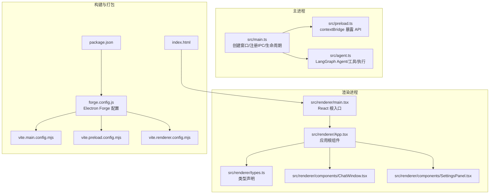
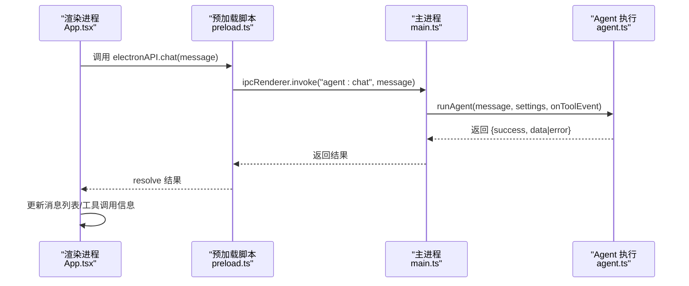
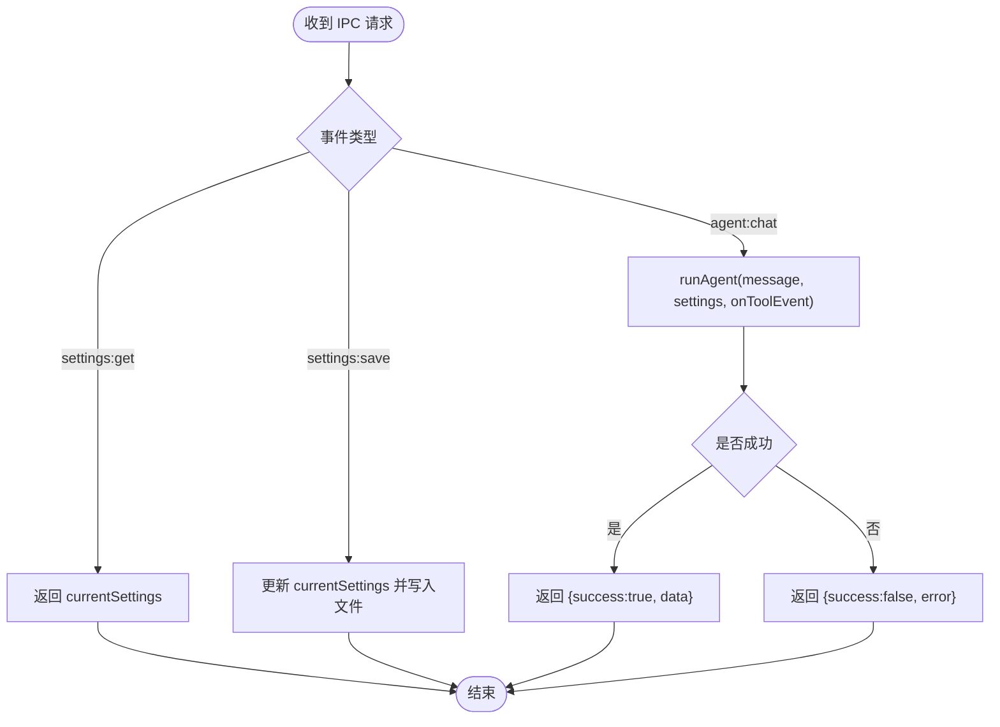
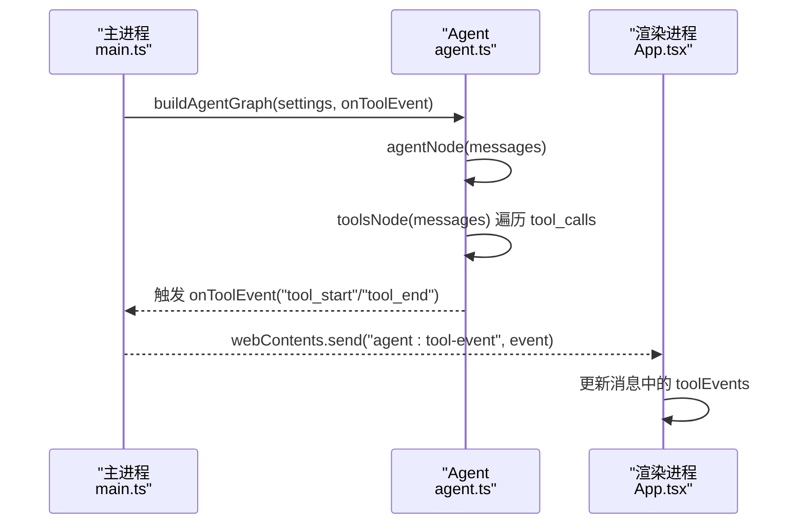
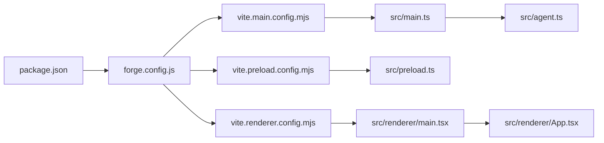

# 主进程配置

<cite>
**本文引用的文件**
- [src/main.ts](file://src/main.ts)
- [src/preload.ts](file://src/preload.ts)
- [src/agent.ts](file://src/agent.ts)
- [src/renderer/App.tsx](file://src/renderer/App.tsx)
- [src/renderer/main.tsx](file://src/renderer/main.tsx)
- [src/renderer/types.ts](file://src/renderer/types.ts)
- [src/renderer/components/ChatWindow.tsx](file://src/renderer/components/ChatWindow.tsx)
- [src/renderer/components/SettingsPanel.tsx](file://src/renderer/components/SettingsPanel.tsx)
- [package.json](file://package.json)
- [forge.config.js](file://forge.config.js)
- [vite.main.config.mjs](file://vite.main.config.mjs)
- [vite.preload.config.mjs](file://vite.preload.config.mjs)
- [vite.renderer.config.mjs](file://vite.renderer.config.mjs)
- [index.html](file://index.html)
</cite>

## 目录
1. [简介](#简介)
2. [项目结构](#项目结构)
3. [核心组件](#核心组件)
4. [架构总览](#架构总览)
5. [详细组件分析](#详细组件分析)
6. [依赖关系分析](#依赖关系分析)
7. [性能与内存优化](#性能与内存优化)
8. [故障排查指南](#故障排查指南)
9. [结论](#结论)
10. [附录：开发与生产配置模式](#附录开发与生产配置模式)

## 简介
本文件面向 Electron 桌面应用的主进程配置，系统性梳理 langGraph 的启动流程、应用生命周期管理、窗口控制、IPC 通信、设置持久化、错误处理以及跨平台兼容性。文档同时给出开发与生产两种构建模式的差异，并提供窗口管理最佳实践、内存优化与性能监控建议。

## 项目结构
该项目采用 Electron + Vite + React 的混合架构：
- 主进程入口位于 src/main.ts，负责创建 BrowserWindow、注册 IPC 处理器、应用生命周期管理与设置持久化。
- 预加载脚本 src/preload.ts 通过 contextBridge 暴露受控 API 至渲染进程。
- 渲染进程由 React 组件构成，入口为 src/renderer/main.tsx，应用根组件为 src/renderer/App.tsx。
- 代理（Agent）逻辑封装在 src/agent.ts，包含 LangGraph 图、工具集合与运行时执行。
- 构建与打包通过 @electron-forge/plugin-vite 配合 Vite 配置文件完成。

图表来源
- [src/main.ts:1-100](file://src/main.ts#L1-L100)
- [src/preload.ts:1-18](file://src/preload.ts#L1-L18)
- [src/agent.ts:1-316](file://src/agent.ts#L1-L316)
- [src/renderer/main.tsx:1-8](file://src/renderer/main.tsx#L1-L8)
- [src/renderer/App.tsx:1-140](file://src/renderer/App.tsx#L1-L140)
- [src/renderer/types.ts:1-49](file://src/renderer/types.ts#L1-L49)
- [src/renderer/components/ChatWindow.tsx:1-114](file://src/renderer/components/ChatWindow.tsx#L1-L114)
- [src/renderer/components/SettingsPanel.tsx:1-139](file://src/renderer/components/SettingsPanel.tsx#L1-L139)
- [forge.config.js:1-42](file://forge.config.js#L1-L42)
- [vite.main.config.mjs:1-24](file://vite.main.config.mjs#L1-L24)
- [vite.preload.config.mjs:1-10](file://vite.preload.config.mjs#L1-L10)
- [vite.renderer.config.mjs:1-7](file://vite.renderer.config.mjs#L1-L7)
- [package.json:1-36](file://package.json#L1-L36)
- [index.html:1-13](file://index.html#L1-L13)

章节来源
- [src/main.ts:1-100](file://src/main.ts#L1-L100)
- [forge.config.js:1-42](file://forge.config.js#L1-L42)
- [package.json:1-36](file://package.json#L1-L36)

## 核心组件
- 主进程窗口与生命周期
  - 创建 BrowserWindow 并设置尺寸、最小宽高、标题与 webPreferences（预加载路径、上下文隔离、禁用 Node 集成）。
  - 开发模式下加载 Vite DevServer；生产模式下加载打包后的渲染页面。
  - 注册窗口关闭回调以释放引用。
- IPC 通信
  - 主进程注册 handler：agent:chat、settings:get、settings:save。
  - 预加载脚本通过 contextBridge.exposeInMainWorld 暴露 electronAPI，渲染进程通过 ipcRenderer 调用。
- 设置持久化
  - 使用 app.getPath('userData') 下的 JSON 文件存储 AgentSettings。
  - 启动时读取，保存时写回。
- Agent 执行
  - 在主进程中调用 runAgent，将工具事件通过 IPC 回传给渲染进程。
- 渲染进程交互
  - App.tsx 负责消息流管理、监听工具事件、调用 electronAPI.chat/save/get。
  - ChatWindow.tsx 负责输入、自动滚动与高度自适应。
  - SettingsPanel.tsx 负责设置表单与保存。

章节来源
- [src/main.ts:35-84](file://src/main.ts#L35-L84)
- [src/preload.ts:1-18](file://src/preload.ts#L1-L18)
- [src/agent.ts:171-316](file://src/agent.ts#L171-L316)
- [src/renderer/App.tsx:1-140](file://src/renderer/App.tsx#L1-L140)
- [src/renderer/components/ChatWindow.tsx:1-114](file://src/renderer/components/ChatWindow.tsx#L1-L114)
- [src/renderer/components/SettingsPanel.tsx:1-139](file://src/renderer/components/SettingsPanel.tsx#L1-L139)

## 架构总览
主进程负责应用生命周期与窗口控制，渲染进程负责 UI 与用户交互，预加载脚本作为桥接层暴露受限 API，Agent 逻辑在主进程内执行并通过 IPC 事件驱动 UI 更新。

图表来源
- [src/renderer/App.tsx:43-84](file://src/renderer/App.tsx#L43-L84)
- [src/preload.ts:3-17](file://src/preload.ts#L3-L17)
- [src/main.ts:65-84](file://src/main.ts#L65-L84)
- [src/agent.ts:279-316](file://src/agent.ts#L279-L316)

## 详细组件分析

### 主进程：窗口创建与生命周期
- BrowserWindow 参数要点
  - 尺寸与最小尺寸：确保初始体验与最小可用尺寸。
  - 标题：便于任务栏识别。
  - webPreferences：
    - preload：指向预加载脚本。
    - contextIsolation：启用上下文隔离，提升安全性。
    - nodeIntegration：禁用 Node 集成，避免直接访问 Node API。
- 开发/生产模式切换
  - 开发：加载 Vite DevServer 地址并打开 DevTools。
  - 生产：加载打包后的渲染页面。
- 生命周期
  - whenReady：应用就绪后创建窗口。
  - window-all-closed：关闭最后一个窗口时退出应用。
  - activate：macOS 点击 Dock 图标时重建窗口。

章节来源
- [src/main.ts:35-62](file://src/main.ts#L35-L62)
- [src/main.ts:86-99](file://src/main.ts#L86-L99)

### 主进程：IPC 通信注册与处理
- 事件与处理器
  - agent:chat：接收消息，调用 runAgent，返回执行结果；工具事件通过 webContents.send 回传。
  - settings:get：返回当前内存中的设置对象。
  - settings:save：更新内存设置并写入持久化文件，返回布尔值。
- 错误处理
  - agent:chat 包裹 try/catch，统一返回 {success, data|error}，便于渲染进程判断。

图表来源
- [src/main.ts:65-84](file://src/main.ts#L65-L84)

章节来源
- [src/main.ts:65-84](file://src/main.ts#L65-L84)

### 预加载脚本：API 暴露与类型约束
- 通过 contextBridge.exposeInMainWorld 暴露 electronAPI，包含：
  - chat：调用 agent:chat 并等待结果。
  - onToolEvent：订阅 agent:tool-event 并返回解绑函数。
  - getSettings/saveSettings：分别调用 settings:get/settings:save。
- 类型声明：在全局 window 上声明 ElectronAPI 接口，保证 TS 类型安全。

章节来源
- [src/preload.ts:1-18](file://src/preload.ts#L1-L18)
- [src/renderer/types.ts:33-48](file://src/renderer/types.ts#L33-L48)

### 渲染进程：应用状态与 UI 控制
- App.tsx
  - 初始化消息数组、设置面板开关、默认设置。
  - 首次挂载时从主进程获取设置并更新本地状态。
  - 监听工具事件，动态更新最后一条助手消息的 toolEvents。
  - 发送消息时添加用户消息与“加载中”的助手消息，调用 electronAPI.chat 后更新助手消息。
  - 保存设置时调用 electronAPI.saveSettings 并关闭面板。
- ChatWindow.tsx
  - 自动滚动至底部，输入框高度随内容自适应。
  - Enter 发送、Shift+Enter 换行。
- SettingsPanel.tsx
  - 提供提供商选择、API Key、模型名、Base URL、Temperature 等设置项。
  - 保存时触发父组件回调。

章节来源
- [src/renderer/App.tsx:1-140](file://src/renderer/App.tsx#L1-L140)
- [src/renderer/components/ChatWindow.tsx:1-114](file://src/renderer/components/ChatWindow.tsx#L1-L114)
- [src/renderer/components/SettingsPanel.tsx:1-139](file://src/renderer/components/SettingsPanel.tsx#L1-L139)

### Agent 执行与工具事件
- 构建图
  - 使用 StateGraph 定义状态 messages，节点 agent 与 tools，条件边根据是否有 tool_calls 决定流转。
  - 绑定工具：计算器、时间、文本分析、随机数。
- 执行流程
  - runAgent 构建图并注入系统提示与用户消息，执行图得到最终 AI 回复。
  - 收集所有 tool_calls 作为返回数据的一部分。
  - 工具调用前后通过 onToolEvent 回调触发工具开始/结束事件。
- 安全与容错
  - 计算器对表达式做字符过滤，异常捕获并返回错误信息。
  - 工具执行异常时同样记录错误到工具事件。

图表来源
- [src/agent.ts:171-262](file://src/agent.ts#L171-L262)
- [src/agent.ts:279-316](file://src/agent.ts#L279-L316)
- [src/main.ts:67-69](file://src/main.ts#L67-L69)
- [src/renderer/App.tsx:24-41](file://src/renderer/App.tsx#L24-L41)

章节来源
- [src/agent.ts:171-316](file://src/agent.ts#L171-L316)
- [src/main.ts:65-84](file://src/main.ts#L65-L84)
- [src/renderer/App.tsx:24-84](file://src/renderer/App.tsx#L24-L84)

## 依赖关系分析
- 构建与打包
  - @electron-forge/plugin-vite 配置了 main、preload、renderer 三套入口与目标。
  - main 配置外部 electron，SSR 不对外部化导致 LangGraph 等库被正确打包。
  - renderer 使用 React 插件。
- 运行时依赖
  - @langchain/* 用于 LLM 与 LangGraph。
  - React/ReactDOM 用于 UI。
  - electron 与 @electron-forge/* 用于打包与运行。

图表来源
- [package.json:1-36](file://package.json#L1-L36)
- [forge.config.js:19-40](file://forge.config.js#L19-L40)
- [vite.main.config.mjs:1-24](file://vite.main.config.mjs#L1-L24)
- [vite.preload.config.mjs:1-10](file://vite.preload.config.mjs#L1-L10)
- [vite.renderer.config.mjs:1-7](file://vite.renderer.config.mjs#L1-L7)
- [src/main.ts:1-100](file://src/main.ts#L1-L100)
- [src/preload.ts:1-18](file://src/preload.ts#L1-L18)
- [src/renderer/main.tsx:1-8](file://src/renderer/main.tsx#L1-L8)
- [src/agent.ts:1-316](file://src/agent.ts#L1-L316)
- [src/renderer/App.tsx:1-140](file://src/renderer/App.tsx#L1-L140)

章节来源
- [package.json:1-36](file://package.json#L1-L36)
- [forge.config.js:1-42](file://forge.config.js#L1-L42)
- [vite.main.config.mjs:1-24](file://vite.main.config.mjs#L1-L24)
- [vite.preload.config.mjs:1-10](file://vite.preload.config.mjs#L1-L10)
- [vite.renderer.config.mjs:1-7](file://vite.renderer.config.mjs#L1-L7)

## 性能与内存优化
- 窗口与渲染
  - 合理设置最小宽高，避免频繁重排。
  - 输入框高度自适应仅在必要时更新，减少 DOM 抖动。
- IPC 与事件
  - 工具事件按需更新最后一条助手消息，避免全量重渲染。
  - onToolEvent 返回解绑函数，确保组件卸载时移除监听，防止内存泄漏。
- 主进程执行
  - runAgent 在主进程执行，避免渲染进程阻塞。
  - 工具执行异常时记录错误，避免崩溃传播。
- 构建优化
  - asar 打包提升加载速度与安全性。
  - SSR noExternal 配置确保 LangGraph 等库被正确打包。

章节来源
- [src/renderer/components/ChatWindow.tsx:21-27](file://src/renderer/components/ChatWindow.tsx#L21-L27)
- [src/renderer/App.tsx:24-41](file://src/renderer/App.tsx#L24-L41)
- [src/preload.ts:8-12](file://src/preload.ts#L8-L12)
- [forge.config.js:4-6](file://forge.config.js#L4-L6)
- [vite.main.config.mjs:13-22](file://vite.main.config.mjs#L13-L22)

## 故障排查指南
- 无法加载渲染页面
  - 开发模式：确认 Vite DevServer 地址已正确注入且端口可用。
  - 生产模式：检查打包产物路径与 index.html 引用。
- IPC 调用失败
  - 确认预加载脚本已正确暴露 electronAPI。
  - 检查主进程是否注册对应 handler。
- 设置未生效
  - 确认 settings:save 返回值与文件写入成功。
  - 检查 userData 目录权限。
- 工具事件不显示
  - 确认主进程通过 webContents.send 发送 agent:tool-event。
  - 确认渲染进程 onToolEvent 订阅成功且未提前解绑。
- macOS 窗口重建
  - 确认 activate 事件触发后重新创建窗口。

章节来源
- [src/main.ts:50-57](file://src/main.ts#L50-L57)
- [src/preload.ts:3-17](file://src/preload.ts#L3-L17)
- [src/main.ts:80-84](file://src/main.ts#L80-L84)
- [src/renderer/App.tsx:24-41](file://src/renderer/App.tsx#L24-L41)
- [src/main.ts:95-99](file://src/main.ts#L95-L99)

## 结论
该主进程配置围绕 Electron 的安全模型与 Vite 构建体系，实现了稳定的窗口生命周期管理、可控的 IPC 通信、可靠的设置持久化与清晰的 Agent 执行链路。通过合理的事件驱动与最小化渲染阻塞，兼顾了用户体验与性能表现。建议在生产环境中持续关注 asar 打包与 SSR 配置，确保第三方库的正确加载与安全隔离。

## 附录：开发与生产配置模式
- 开发模式
  - 主进程加载 Vite DevServer 地址并开启 DevTools，便于调试。
  - 预加载与渲染进程均走 Vite HMR。
- 生产模式
  - 主进程加载打包后的渲染页面，关闭 DevTools。
  - forge.config.js 启用 asar 打包，提高加载速度与安全性。
- 关键差异
  - 环境变量 MAIN_WINDOW_VITE_DEV_SERVER_URL 与 MAIN_WINDOW_VITE_NAME 由 @electron-forge/plugin-vite 注入，主进程据此选择加载源。
  - vite.main.config.mjs 的 SSR noExternal 显式允许 LangGraph 系列库参与打包，避免运行时缺失。

章节来源
- [src/main.ts:6-7](file://src/main.ts#L6-L7)
- [src/main.ts:50-57](file://src/main.ts#L50-L57)
- [forge.config.js:4-6](file://forge.config.js#L4-L6)
- [vite.main.config.mjs:13-22](file://vite.main.config.mjs#L13-L22)