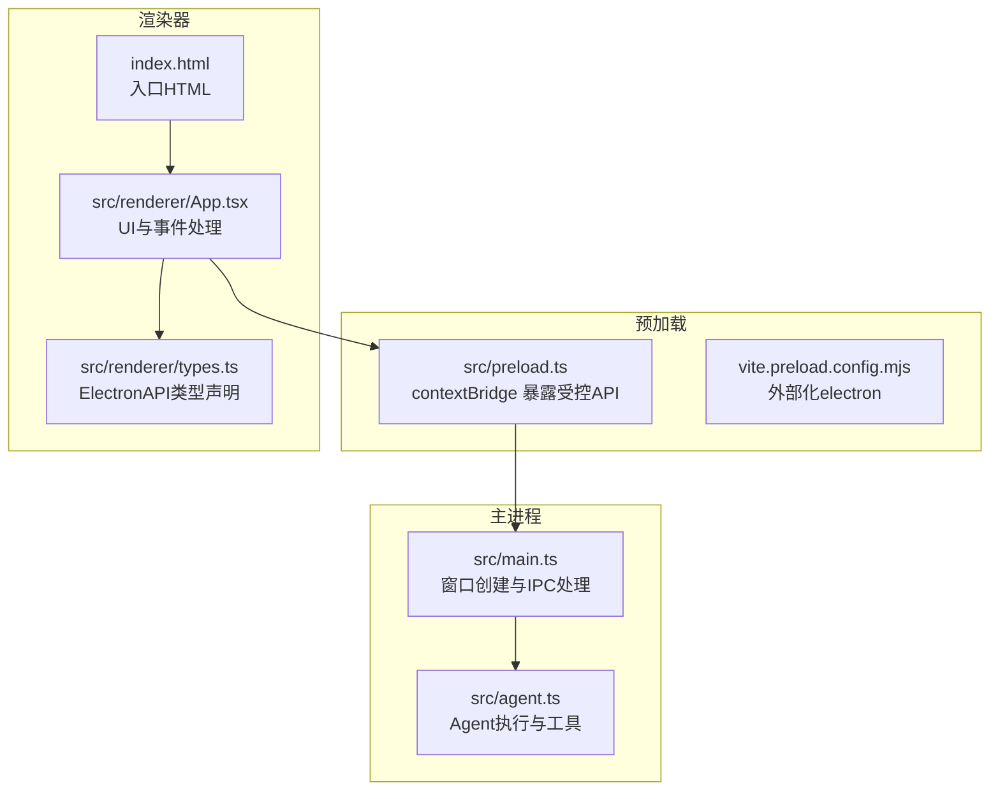
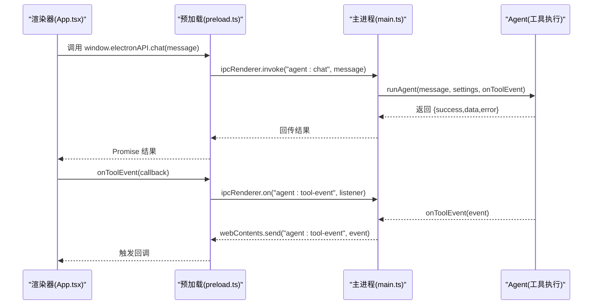
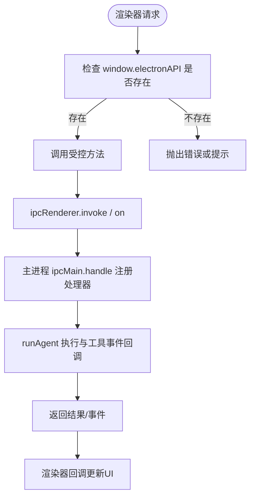
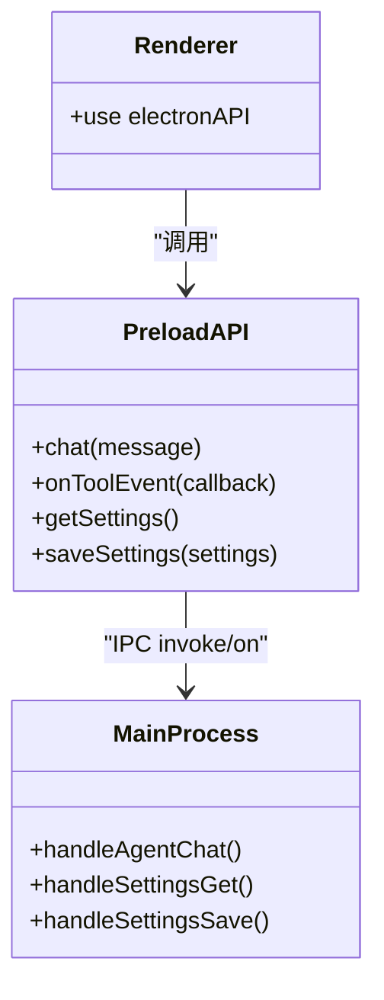
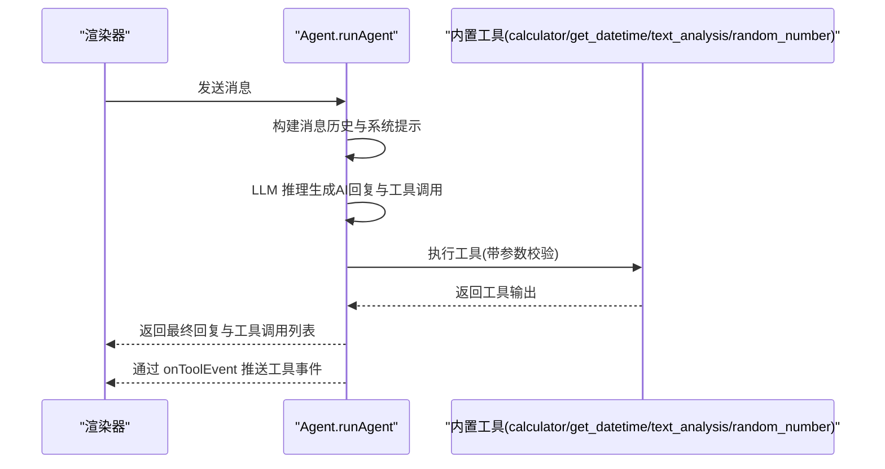
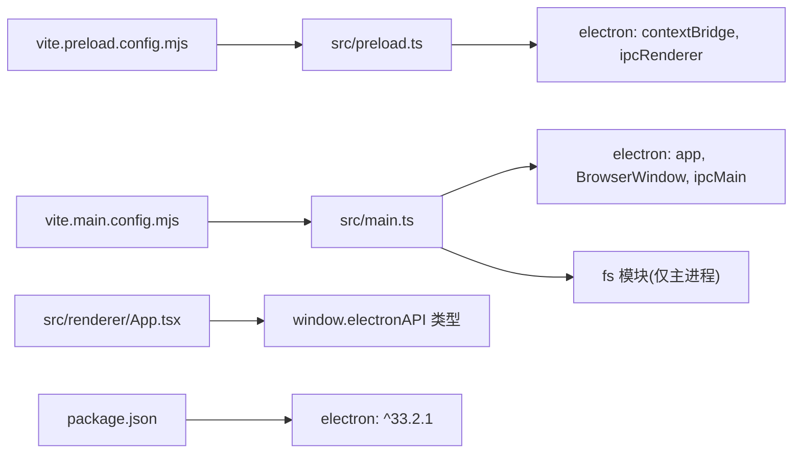

# 预加载脚本

<cite>
**本文引用的文件**
- [src/preload.ts](file://src/preload.ts)
- [src/main.ts](file://src/main.ts)
- [src/agent.ts](file://src/agent.ts)
- [src/renderer/App.tsx](file://src/renderer/App.tsx)
- [src/renderer/types.ts](file://src/renderer/types.ts)
- [index.html](file://index.html)
- [forge.config.js](file://forge.config.js)
- [package.json](file://package.json)
- [vite.preload.config.mjs](file://vite.preload.config.mjs)
- [vite.main.config.mjs](file://vite.main.config.mjs)
</cite>

## 目录
1. [简介](#简介)
2. [项目结构](#项目结构)
3. [核心组件](#核心组件)
4. [架构总览](#架构总览)
5. [详细组件分析](#详细组件分析)
6. [依赖关系分析](#依赖关系分析)
7. [性能考量](#性能考量)
8. [故障排查指南](#故障排查指南)
9. [结论](#结论)
10. [附录](#附录)

## 简介
本文件围绕 Electron 应用中的“预加载脚本”展开，系统性阐述其在 langGraph 桌面应用中的安全机制与隔离策略，重点覆盖：
- contextIsolation 的实现与安全边界
- 安全的 IPC 通信桥接方式（仅暴露受控 API）
- 预加载脚本的执行时机、作用域与生命周期
- 如何通过预加载脚本实现安全的 API 暴露，避免直接的 Node.js 访问
- 安全最佳实践、漏洞防护与权限控制策略
- 调试方法与常见安全问题的解决方案
- 不同 Electron 版本的安全配置差异与升级注意事项

## 项目结构
该应用采用标准的 Electron + Vite 架构，预加载脚本位于 src/preload.ts，并通过 Forge 插件由 Vite 进行构建。主进程负责窗口创建与 IPC 注册，渲染器通过 window.electronAPI 与主进程交互。

图表来源
- [src/main.ts:36-62](file://src/main.ts#L36-L62)
- [src/preload.ts:1-18](file://src/preload.ts#L1-L18)
- [src/renderer/App.tsx:1-140](file://src/renderer/App.tsx#L1-L140)
- [src/renderer/types.ts:33-48](file://src/renderer/types.ts#L33-L48)
- [index.html:10](file://index.html#L10)
- [vite.preload.config.mjs:1-10](file://vite.preload.config.mjs#L1-L10)

章节来源
- [src/main.ts:36-62](file://src/main.ts#L36-L62)
- [src/preload.ts:1-18](file://src/preload.ts#L1-L18)
- [src/renderer/App.tsx:1-140](file://src/renderer/App.tsx#L1-L140)
- [src/renderer/types.ts:33-48](file://src/renderer/types.ts#L33-L48)
- [index.html:10](file://index.html#L10)
- [vite.preload.config.mjs:1-10](file://vite.preload.config.mjs#L1-L10)

## 核心组件
- 预加载脚本：通过 contextBridge.exposeInMainWorld 在渲染器中暴露受控 API，仅导出有限的 IPC 方法，不直接暴露 Node.js 能力。
- 主进程：启用 contextIsolation，禁用 nodeIntegration，注册 ipcMain.handle 并通过 ipcRenderer.invoke/ipcRenderer.on 与渲染器通信。
- 渲染器：通过 window.electronAPI 调用受控方法，监听工具事件，管理聊天状态与设置。
- 构建配置：Vite 预加载构建外部化 electron，确保预加载模块不打包 Node 内置模块；主进程构建针对 SSR 与外部化需求进行配置。

章节来源
- [src/preload.ts:3-17](file://src/preload.ts#L3-L17)
- [src/main.ts:43-47](file://src/main.ts#L43-L47)
- [src/renderer/App.tsx:18-41](file://src/renderer/App.tsx#L18-L41)
- [vite.preload.config.mjs:4-8](file://vite.preload.config.mjs#L4-L8)
- [vite.main.config.mjs:3-23](file://vite.main.config.mjs#L3-L23)

## 架构总览
下图展示从渲染器到主进程的受控 IPC 流程，以及预加载脚本在其中的桥接作用。

图表来源
- [src/renderer/App.tsx:65](file://src/renderer/App.tsx#L65)
- [src/preload.ts:5](file://src/preload.ts#L5)
- [src/main.ts:65-74](file://src/main.ts#L65-L74)
- [src/agent.ts:279-315](file://src/agent.ts#L279-L315)

## 详细组件分析

### 预加载脚本与 contextIsolation
- 预加载脚本通过 contextBridge.exposeInMainWorld 将受控 API 暴露给渲染器，确保渲染器无法访问 Node.js 全局对象或 require。
- 主进程在创建 BrowserWindow 时明确启用 contextIsolation，并禁用 nodeIntegration，形成强隔离边界。
- 预加载脚本仅导出有限方法：chat、onToolEvent、getSettings、saveSettings，均通过 ipcRenderer.invoke/on 实现与主进程通信。

图表来源
- [src/preload.ts:3-17](file://src/preload.ts#L3-L17)
- [src/main.ts:43-47](file://src/main.ts#L43-L47)
- [src/renderer/App.tsx:18-41](file://src/renderer/App.tsx#L18-L41)

章节来源
- [src/preload.ts:1-18](file://src/preload.ts#L1-L18)
- [src/main.ts:43-47](file://src/main.ts#L43-L47)
- [src/renderer/App.tsx:18-41](file://src/renderer/App.tsx#L18-L41)

### 安全的 IPC 桥接设计
- 受控 API 仅暴露必要方法，参数与返回值均经过类型约束，避免直接传递复杂对象导致上下文污染。
- onToolEvent 返回清理函数，用于移除监听器，防止内存泄漏与意外事件传播。
- 主进程通过 ipcMain.handle 统一处理请求，避免在渲染器中直接操作文件系统或网络资源。

图表来源
- [src/preload.ts:3-17](file://src/preload.ts#L3-L17)
- [src/main.ts:65-84](file://src/main.ts#L65-L84)
- [src/renderer/App.tsx:18-41](file://src/renderer/App.tsx#L18-L41)

章节来源
- [src/preload.ts:3-17](file://src/preload.ts#L3-L17)
- [src/main.ts:65-84](file://src/main.ts#L65-L84)
- [src/renderer/App.tsx:18-41](file://src/renderer/App.tsx#L18-L41)

### 预加载脚本的执行时机、作用域与生命周期
- 执行时机：在 BrowserWindow 创建时，通过 webPreferences.preload 指定预加载脚本路径，预加载脚本在页面加载前注入。
- 作用域：预加载脚本运行在隔离上下文中，拥有有限的 API，但可访问 ipcRenderer 与 contextBridge。
- 生命周期：随 BrowserWindow 存续，窗口关闭后销毁；预加载脚本不会被重新注入到新页面。

章节来源
- [src/main.ts:43-47](file://src/main.ts#L43-L47)
- [src/main.ts:59-62](file://src/main.ts#L59-L62)

### 安全的 API 暴露与权限控制
- 仅暴露必要方法，避免直接暴露 Node.js 模块与全局对象。
- 使用 ipcRenderer.invoke/on 明确请求/响应边界，避免在渲染器中直接执行敏感操作。
- 设置持久化逻辑在主进程内完成，渲染器仅通过 IPC 读写设置，降低风险面。

章节来源
- [src/preload.ts:3-17](file://src/preload.ts#L3-L17)
- [src/main.ts:14-31](file://src/main.ts#L14-L31)
- [src/main.ts:76-84](file://src/main.ts#L76-L84)

### Agent 工具与事件流
- Agent 执行流程：接收用户消息，构建系统提示与消息历史，调用模型推理，根据工具调用执行相应工具，回传结果与事件。
- 工具事件：通过 onToolEvent 回调向渲染器推送工具开始/结束事件，渲染器据此更新 UI。

图表来源
- [src/agent.ts:171-262](file://src/agent.ts#L171-L262)
- [src/agent.ts:279-315](file://src/agent.ts#L279-L315)

章节来源
- [src/agent.ts:43-137](file://src/agent.ts#L43-L137)
- [src/agent.ts:171-262](file://src/agent.ts#L171-L262)
- [src/agent.ts:279-315](file://src/agent.ts#L279-L315)

### 渲染器与类型声明
- 渲染器通过 window.electronAPI 调用受控方法，类型声明在 src/renderer/types.ts 中集中定义，确保开发期类型安全。
- 渲染器在挂载时加载设置，监听工具事件，发送消息时添加加载态与错误态，保证用户体验与数据一致性。

章节来源
- [src/renderer/App.tsx:18-41](file://src/renderer/App.tsx#L18-L41)
- [src/renderer/types.ts:33-48](file://src/renderer/types.ts#L33-L48)

## 依赖关系分析
- 预加载构建：外部化 electron，避免将 Node 内置模块打包进预加载包。
- 主进程构建：针对 SSR 与外部化依赖进行配置，确保 LangChain 等库在主进程可用。
- 应用依赖：electron 版本为 ^33.2.1，Forge 插件配合 Vite 构建主进程与预加载脚本。

图表来源
- [src/preload.ts:1](file://src/preload.ts#L1)
- [src/main.ts:1-4](file://src/main.ts#L1-L4)
- [vite.preload.config.mjs:6](file://vite.preload.config.mjs#L6)
- [vite.main.config.mjs:10-22](file://vite.main.config.mjs#L10-L22)
- [package.json:31](file://package.json#L31)

章节来源
- [vite.preload.config.mjs:4-8](file://vite.preload.config.mjs#L4-L8)
- [vite.main.config.mjs:3-23](file://vite.main.config.mjs#L3-L23)
- [package.json:31](file://package.json#L31)

## 性能考量
- 预加载脚本应保持轻量，避免在预加载中执行重逻辑，减少对渲染器启动的影响。
- IPC 调用应尽量批量化或去抖动，避免频繁触发工具事件导致 UI 抖动。
- Agent 工具执行应在主进程内进行，避免在渲染器中引入重型计算。

## 故障排查指南
- 预加载脚本未生效
  - 检查 BrowserWindow 的 webPreferences.preload 路径是否正确指向构建产物。
  - 确认 contextIsolation 已启用且 nodeIntegration 已禁用。
  - 参考：[src/main.ts:43-47](file://src/main.ts#L43-L47)
- 渲染器无法访问 window.electronAPI
  - 确认预加载脚本已成功注入，且 exposeInMainWorld 的键名一致。
  - 检查预加载构建是否外部化 electron。
  - 参考：[src/preload.ts:3-17](file://src/preload.ts#L3-L17)，[vite.preload.config.mjs:6](file://vite.preload.config.mjs#L6)
- IPC 调用无响应
  - 确认主进程已注册对应的 ipcMain.handle。
  - 检查渲染器调用的方法名与参数是否匹配。
  - 参考：[src/main.ts:65-84](file://src/main.ts#L65-L84)
- 工具事件未显示
  - 确认 onToolEvent 的回调已注册并返回清理函数。
  - 检查主进程是否通过 webContents.send 正确推送事件。
  - 参考：[src/renderer/App.tsx:24-41](file://src/renderer/App.tsx#L24-L41)，[src/main.ts:67-69](file://src/main.ts#L67-L69)
- 设置保存失败
  - 检查主进程文件读写权限与路径。
  - 参考：[src/main.ts:14-31](file://src/main.ts#L14-L31)，[src/main.ts:76-84](file://src/main.ts#L76-L84)

章节来源
- [src/main.ts:43-47](file://src/main.ts#L43-L47)
- [src/preload.ts:3-17](file://src/preload.ts#L3-L17)
- [vite.preload.config.mjs:6](file://vite.preload.config.mjs#L6)
- [src/main.ts:65-84](file://src/main.ts#L65-L84)
- [src/renderer/App.tsx:24-41](file://src/renderer/App.tsx#L24-L41)
- [src/main.ts:14-31](file://src/main.ts#L14-L31)

## 结论
本项目通过严格的 contextIsolation、受控的 IPC 桥接与最小权限暴露，有效降低了渲染器侧的安全风险。预加载脚本仅暴露必要的 API，主进程统一处理敏感操作与状态持久化，结合类型声明与构建配置，形成了清晰、可维护且安全的架构。

## 附录

### 安全最佳实践
- 仅暴露必要 API，避免直接暴露 Node.js 能力。
- 使用 ipcRenderer.invoke/on 明确请求/响应边界，避免在渲染器中直接执行敏感操作。
- 对 IPC 参数进行严格校验与序列化，避免原型链污染与任意对象注入。
- 为 IPC 事件提供清理函数，防止内存泄漏与事件累积。
- 在主进程内集中处理文件系统、网络与外部服务调用。

### 不同 Electron 版本的安全配置差异与升级注意事项
- Electron 29+ 引入了更严格的默认安全策略，建议升级时检查 contextIsolation 默认行为与 CSP 配置。
- Electron 33+ 建议启用额外的安全选项（如 sandbox、disableRemoteModule），并在升级前进行全面测试。
- 升级时需验证 Forge 插件与 Vite 配置的兼容性，确保预加载与主进程构建正常。

章节来源
- [package.json:31](file://package.json#L31)
- [forge.config.js:1-42](file://forge.config.js#L1-L42)