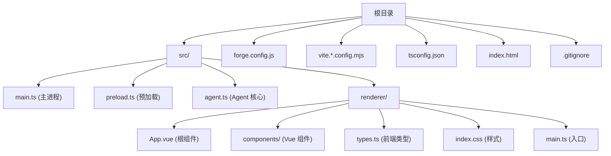
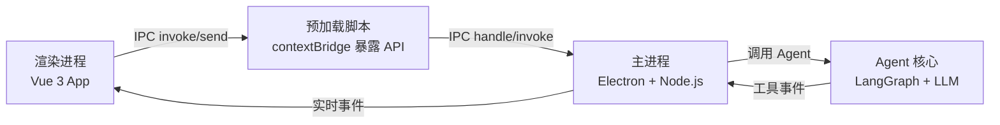
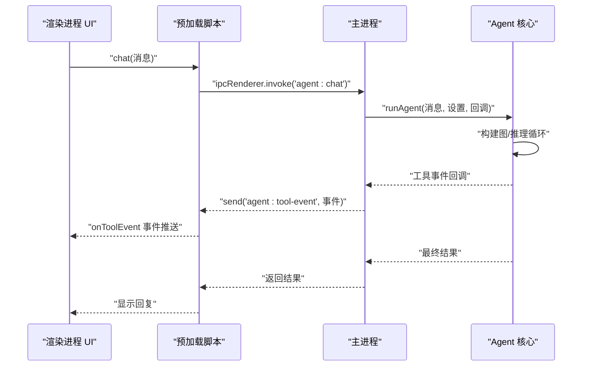
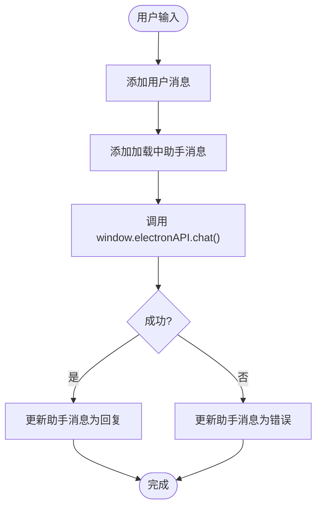
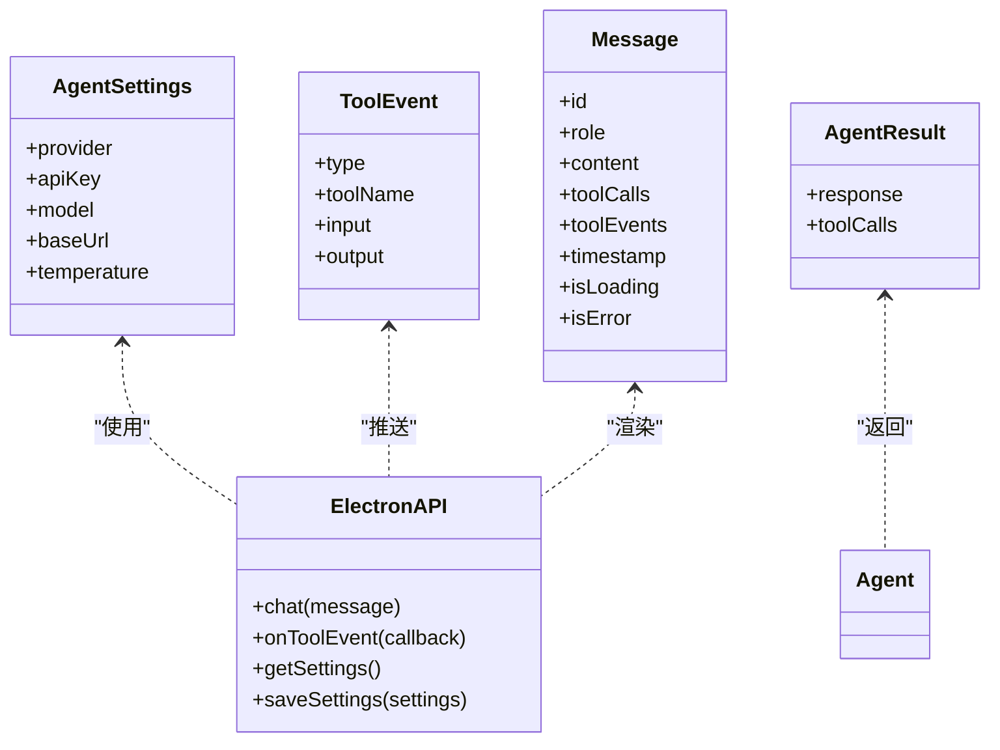
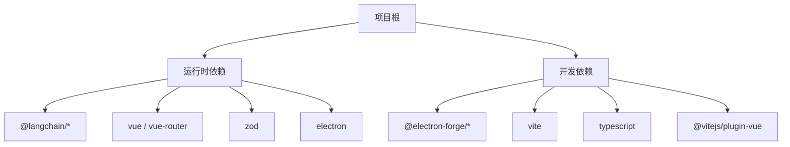

# 开发环境设置

<cite>
**本文档引用的文件**
- [package.json](file://package.json)
- [tsconfig.json](file://tsconfig.json)
- [forge.config.js](file://forge.config.js)
- [vite.main.config.mjs](file://vite.main.config.mjs)
- [vite.preload.config.mjs](file://vite.preload.config.mjs)
- [vite.renderer.config.mjs](file://vite.renderer.config.mjs)
- [开发文档.md](file://开发文档.md)
- [src/main.ts](file://src/main.ts)
- [src/preload.ts](file://src/preload.ts)
- [src/agent.ts](file://src/agent.ts)
- [src/renderer/App.vue](file://src/renderer/App.vue)
- [src/renderer/components/ChatWindow.vue](file://src/renderer/components/ChatWindow.vue)
- [src/renderer/components/MessageBubble.vue](file://src/renderer/components/MessageBubble.vue)
- [src/renderer/components/SettingsPanel.vue](file://src/renderer/components/SettingsPanel.vue)
- [src/renderer/types.ts](file://src/renderer/types.ts)
- [index.html](file://index.html)
- [.gitignore](file://.gitignore)
</cite>

## 更新摘要
**所做更改**
- 更新了技术栈：从 React 迁移到 Vue 3
- 更新了组件结构：从 React 组件迁移到 Vue 单文件组件
- 更新了开发工具配置：调整 Vite 和 Electron Forge 配置以支持 Vue
- 更新了开发命令和工作流程：反映新的 Vue 开发生态
- 更新了调试和热重载配置：适配 Vue 开发体验

## 目录
1. [简介](#简介)
2. [项目结构](#项目结构)
3. [核心组件](#核心组件)
4. [架构总览](#架构总览)
5. [详细组件分析](#详细组件分析)
6. [依赖分析](#依赖分析)
7. [性能考虑](#性能考虑)
8. [故障排除指南](#故障排除指南)
9. [结论](#结论)
10. [附录](#附录)

## 简介
本指南面向新加入团队的开发者，提供 langGraph 项目的完整开发环境搭建与日常开发操作手册。项目采用 Electron + Vite + Vue + TypeScript 技术栈，结合 LangGraph.js 实现桌面端 AI Agent 的智能体推理与工具调用。文档覆盖环境要求、依赖安装、开发工具与 IDE 配置、开发服务器启动与热重载、调试设置、Git 工作流与分支策略、代码规范（TypeScript、ESLint、Prettier）、常用开发命令与任务，以及常见问题排查与性能优化建议。

**更新** 项目已从 React 开发工作流程迁移到 Vue 3 开发工作流程，采用单文件组件（SFC）架构。

## 项目结构
项目采用"按职责分层 + 按功能模块划分"的组织方式：
- 根目录包含构建与配置文件（Electron Forge、Vite、TypeScript、入口 HTML）
- src 目录下分为主进程、预加载脚本、渲染进程与 Agent 核心逻辑
- 渲染进程采用 Vue 3 + TypeScript，组件化组织 UI，使用单文件组件格式
- .gitignore 忽略 node_modules、Vite 构建缓存、打包产物与日志

**图表来源**
- [forge.config.js:1-42](file://forge.config.js#L1-L42)
- [vite.main.config.mjs:1-24](file://vite.main.config.mjs#L1-L24)
- [vite.preload.config.mjs:1-10](file://vite.preload.config.mjs#L1-L10)
- [vite.renderer.config.mjs:1-7](file://vite.renderer.config.mjs#L1-L7)
- [index.html:1-13](file://index.html#L1-L13)
- [src/main.ts:1-100](file://src/main.ts#L1-L100)
- [src/preload.ts:1-18](file://src/preload.ts#L1-L18)
- [src/agent.ts:1-316](file://src/agent.ts#L1-L316)
- [src/renderer/App.vue:1-140](file://src/renderer/App.vue#L1-L140)
- [src/renderer/components/ChatWindow.vue:1-114](file://src/renderer/components/ChatWindow.vue#L1-L114)
- [src/renderer/types.ts:1-49](file://src/renderer/types.ts#L1-L49)

**章节来源**
- [开发文档.md:152-190](file://开发文档.md#L152-L190)
- [开发文档.md:1-672](file://开发文档.md#L1-L672)

## 核心组件
- Electron 主进程：负责窗口创建、IPC 通信、设置持久化与调用 Agent
- 预加载脚本：通过 contextBridge 暴露受控 API 至渲染进程
- 渲染进程（Vue 3）：负责 UI、状态管理、事件监听与用户交互，采用 Composition API
- Agent 核心（LangGraph）：定义状态图、工具、LLM 接入与推理循环
- 构建配置：Electron Forge + Vite，分别针对主进程、预加载与渲染进程进行独立构建与热重载

**章节来源**
- [src/main.ts:1-100](file://src/main.ts#L1-L100)
- [src/preload.ts:1-18](file://src/preload.ts#L1-L18)
- [src/renderer/App.vue:1-140](file://src/renderer/App.vue#L1-L140)
- [src/agent.ts:1-316](file://src/agent.ts#L1-L316)
- [forge.config.js:1-42](file://forge.config.js#L1-L42)
- [vite.main.config.mjs:1-24](file://vite.main.config.mjs#L1-L24)
- [vite.preload.config.mjs:1-10](file://vite.preload.config.mjs#L1-L10)
- [vite.renderer.config.mjs:1-7](file://vite.renderer.config.mjs#L1-L7)

## 架构总览
系统由三层组成：渲染进程（Vue 3）、预加载脚本（安全桥接）、主进程（Node.js）。渲染进程通过 window.electronAPI 与主进程通信；主进程通过 IPC 与 Agent 交互，将工具事件实时推送给渲染进程。

**图表来源**
- [src/renderer/App.vue:1-140](file://src/renderer/App.vue#L1-L140)
- [src/preload.ts:1-18](file://src/preload.ts#L1-L18)
- [src/main.ts:1-100](file://src/main.ts#L1-L100)
- [src/agent.ts:1-316](file://src/agent.ts#L1-L316)

## 详细组件分析

### 环境要求与系统兼容性
- 操作系统：Windows 10/11（官方仅支持 Windows 平台）
- Node.js：>= 18（推荐 v20+）
- npm：>= 9
- Python：>= 3.10（Electron Forge 构建原生依赖需要）

**章节来源**
- [开发文档.md:61-74](file://开发文档.md#L61-L74)

### 依赖安装与开发工具配置
- 安装依赖：使用 npm install 安装所有依赖
- 开发工具建议：VS Code + ESLint + Prettier 插件 + Vue Language Features 插件
- Git：版本控制工具

**章节来源**
- [开发文档.md:144-148](file://开发文档.md#L144-L148)
- [开发文档.md:76-80](file://开发文档.md#L76-L80)

### TypeScript 配置
- 目标与模块：ESNext
- 模块解析：bundler
- JSX：react-jsx
- 严格模式：开启
- 路径映射：@/* -> src/*
- 输出目录：./dist
- 排除：node_modules

**章节来源**
- [tsconfig.json:1-22](file://tsconfig.json#L1-L22)

### Vite 与 Electron Forge 构建配置
- 主进程配置：设置条件解析、外部化 electron、SSR 内联 LangChain 包以解决 ESM/CJS 兼容
- 预加载配置：外部化 electron
- 渲染进程配置：启用 Vue 插件而非 React 插件
- Forge 插件：VitePlugin，分别构建 main、preload 与渲染进程

**章节来源**
- [vite.main.config.mjs:1-24](file://vite.main.config.mjs#L1-L24)
- [vite.preload.config.mjs:1-10](file://vite.preload.config.mjs#L1-L10)
- [vite.renderer.config.mjs:1-7](file://vite.renderer.config.mjs#L1-L7)
- [forge.config.js:1-42](file://forge.config.js#L1-L42)

### 开发服务器启动与热重载
- 启动命令：npm start
- 行为：启动 Vite 开发服务器（渲染进程）、构建主进程与预加载、启动 Electron、自动打开 DevTools（开发模式）

**章节来源**
- [开发文档.md:511-522](file://开发文档.md#L511-L522)
- [package.json:6-12](file://package.json#L6-L12)

### 调试环境设置
- 主进程调试：Electron DevTools 自动打开
- 渲染进程调试：Vue DevTools 可配合 VS Code 扩展使用
- IPC 调试：通过 DevTools 查看主进程日志与事件推送

**章节来源**
- [src/main.ts:50-57](file://src/main.ts#L50-L57)
- [开发文档.md:511-522](file://开发文档.md#L511-L522)

### Git 工作流程、分支策略与代码审查
- 分支策略：采用功能分支 + 主干合并，主分支保护
- 提交规范：遵循约定式提交
- 代码审查：Pull Request + Review + CI 校验
- 仓库忽略：node_modules、.vite、out、dist、日志、系统文件

**章节来源**
- [.gitignore:1-7](file://.gitignore#L1-L7)
- [开发文档.md:1-672](file://开发文档.md#L1-L672)

### TypeScript、ESLint 与 Prettier 配置建议
- TypeScript：使用项目现有 tsconfig.json
- ESLint：建议使用 @typescript-eslint + eslint-plugin-vue
- Prettier：统一代码风格，与 VS Code 保存时格式化集成
- 本仓库未配置 ESLint/Prettier，建议新增 .eslintrc.cjs/.prettierrc 并纳入 CI 校验

**章节来源**
- [tsconfig.json:1-22](file://tsconfig.json#L1-L22)
- [开发文档.md:1-672](file://开发文档.md#L1-L672)

### 开发命令与常用任务
- 启动开发：npm start
- 打包应用：npm run package
- 构建安装包：npm run make（生成 Squirrel 安装程序与 ZIP）
- 发布：npm run publish（需配置发布源）

**章节来源**
- [package.json:6-12](file://package.json#L6-L12)
- [开发文档.md:651-660](file://开发文档.md#L651-L660)

### Agent 与 IPC 通信序列

**图表来源**
- [src/renderer/App.vue:43-84](file://src/renderer/App.vue#L43-L84)
- [src/preload.ts:1-18](file://src/preload.ts#L1-L18)
- [src/main.ts:65-84](file://src/main.ts#L65-L84)
- [src/agent.ts:279-315](file://src/agent.ts#L279-L315)

### 数据流与状态管理
- 渲染进程状态：消息列表、设置、加载状态
- 工具事件：通过 IPC 事件实时更新 UI
- 设置持久化：Electron userData 目录下的 JSON 文件

**图表来源**
- [src/renderer/App.vue:43-84](file://src/renderer/App.vue#L43-L84)

**章节来源**
- [src/renderer/App.vue:1-140](file://src/renderer/App.vue#L1-L140)
- [src/renderer/components/ChatWindow.vue:1-114](file://src/renderer/components/ChatWindow.vue#L1-L114)
- [src/renderer/types.ts:1-49](file://src/renderer/types.ts#L1-L49)
- [src/main.ts:11-31](file://src/main.ts#L11-L31)

### 主进程与 Agent 的数据模型

**图表来源**
- [src/renderer/types.ts:1-49](file://src/renderer/types.ts#L1-L49)
- [src/agent.ts:19-37](file://src/agent.ts#L19-L37)
- [src/main.ts:11-31](file://src/main.ts#L11-L31)

## 依赖分析
- 运行时依赖：LangChain/LangGraph、Vue 3、Zod、Electron
- 开发依赖：Electron Forge CLI、Vite、Vue 插件、TypeScript
- 构建与打包：Electron Forge + Vite Plugin，分别构建主进程、预加载与渲染进程

**图表来源**
- [package.json:13-34](file://package.json#L13-L34)

**章节来源**
- [package.json:1-36](file://package.json#L1-L36)
- [forge.config.js:1-42](file://forge.config.js#L1-L42)

## 性能考虑
- Vite 构建与 HMR：渲染进程热更新体验优异，主进程与预加载独立构建减少冷启动时间
- ESM/CJS 兼容：通过 SSR noExternal 内联 LangChain 包，避免运行时模块解析开销
- UI 优化：Vue 3 Composition API 提供更好的响应式性能，避免不必要的重渲染
- 打包优化：Electron Forge ASAR 打包，减小分发体积

**章节来源**
- [开发文档.md:545-574](file://开发文档.md#L545-L574)
- [vite.main.config.mjs:24-26](file://vite.main.config.mjs#L24-L26)

## 故障排除指南
- Node 版本过低：升级至 v20+，确保 npm >= 9
- Python 缺失：安装 Python 3.10+（用于 node-gyp）
- 模块兼容问题：确认已正确配置 vite.main.config.mjs 的 ssr.noExternal
- 端口占用：Vite 默认端口 5173，必要时修改或释放端口
- DevTools 未打开：确认开发模式下主进程加载 URL 并打开 DevTools
- 设置读取失败：检查 userData 目录写入权限与 JSON 格式
- Vue 组件热重载问题：检查 Vite Vue 插件配置和组件文件扩展名

**章节来源**
- [开发文档.md:59-74](file://开发文档.md#L59-L74)
- [src/main.ts:50-57](file://src/main.ts#L50-L57)
- [src/main.ts:11-31](file://src/main.ts#L11-L31)

## 结论
本项目以 Electron + Vite + Vue + LangGraph 为核心，提供了从开发到打包的一体化工作流。通过明确的环境要求、完善的构建配置与安全的 IPC 设计，开发者可以快速搭建稳定高效的开发环境，并在此基础上扩展工具与 Agent 能力。

## 附录

### 快速上手清单
- 安装 Node.js v20+、npm >= 9、Python 3.10+
- 克隆仓库后执行 npm install
- 运行 npm start 启动开发服务器
- 配置 VS Code ESLint/Prettier 插件 + Vue Language Features 插件
- 遵循约定式提交与分支策略
- 使用 npm run make 构建安装包

**章节来源**
- [开发文档.md:59-80](file://开发文档.md#L59-L80)
- [开发文档.md:511-542](file://开发文档.md#L511-L542)
- [开发文档.md:651-660](file://开发文档.md#L651-L660)