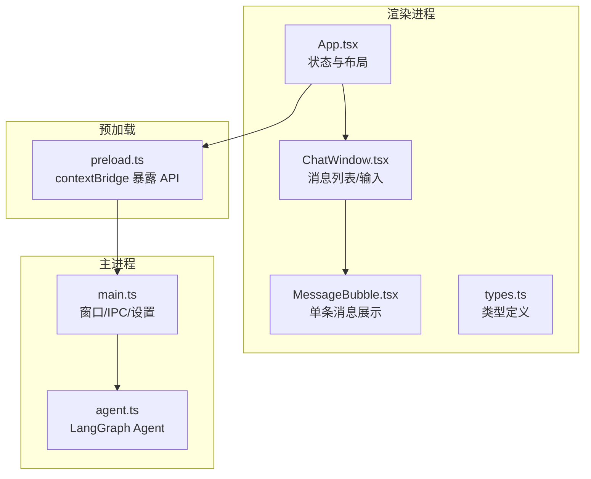
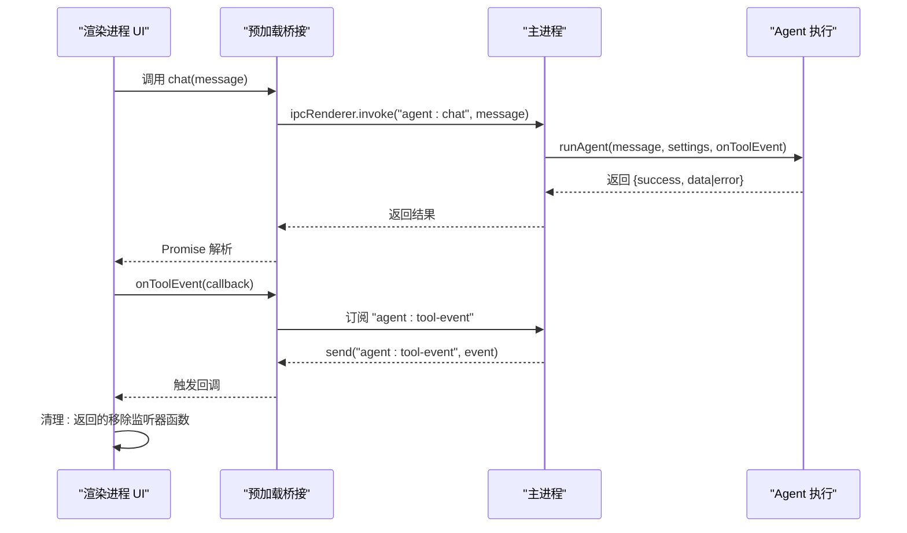
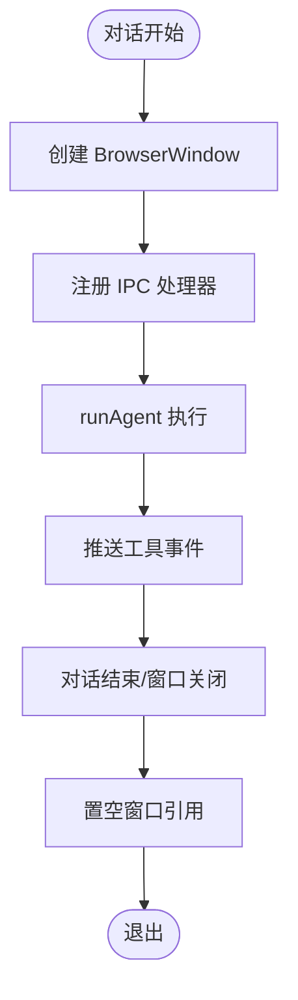
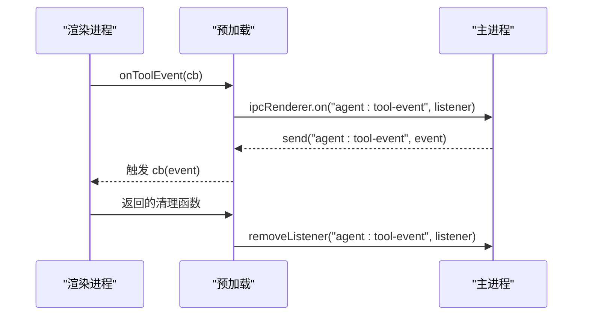
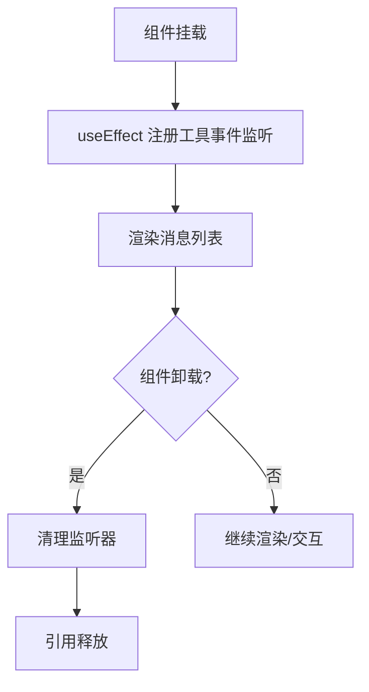
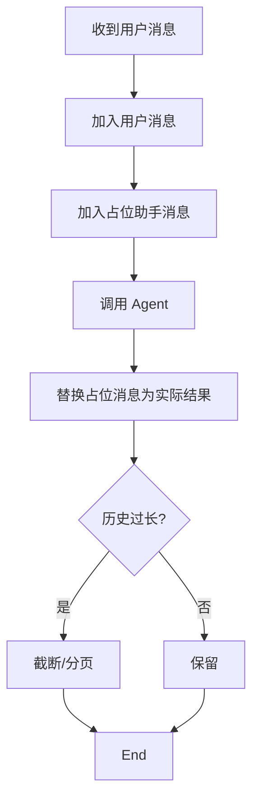
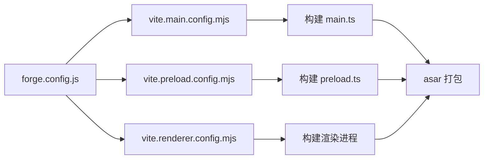

# 内存管理

<cite>
**本文引用的文件**
- [src/main.ts](file://src/main.ts)
- [src/preload.ts](file://src/preload.ts)
- [src/agent.ts](file://src/agent.ts)
- [src/renderer/App.tsx](file://src/renderer/App.tsx)
- [src/renderer/components/ChatWindow.tsx](file://src/renderer/components/ChatWindow.tsx)
- [src/renderer/components/MessageBubble.tsx](file://src/renderer/components/MessageBubble.tsx)
- [src/renderer/types.ts](file://src/renderer/types.ts)
- [package.json](file://package.json)
- [forge.config.js](file://forge.config.js)
- [开发文档.md](file://开发文档.md)
</cite>

## 目录
1. [引言](#引言)
2. [项目结构](#项目结构)
3. [核心组件](#核心组件)
4. [架构总览](#架构总览)
5. [详细组件分析](#详细组件分析)
6. [依赖关系分析](#依赖关系分析)
7. [性能考量](#性能考量)
8. [故障排查指南](#故障排查指南)
9. [结论](#结论)
10. [附录](#附录)

## 引言
本指南面向系统架构师与高级开发者，聚焦 langGraph 项目的内存管理优化，覆盖 Electron 主进程与渲染器进程的内存使用控制、React 组件的内存优化（组件卸载、事件监听器清理、引用管理）、消息历史的内存控制与缓存策略、Node.js API 的内存安全使用与异步优化、以及内存泄漏检测、分析与性能监控方法。同时给出垃圾回收优化、对象池模式、内存碎片整理策略，以及大型应用的内存分片、延迟加载与按需资源管理建议。

## 项目结构
langGraph 采用 Electron + React + LangGraph 的三层架构：
- 主进程（Node.js）：窗口管理、IPC 处理、Agent 执行、设置持久化
- 预加载脚本（Preload）：安全桥接，暴露受限 API
- 渲染进程（React）：UI 组件、状态管理、事件监听与清理

图表来源
- [src/renderer/App.tsx:1-140](file://src/renderer/App.tsx#L1-L140)
- [src/renderer/components/ChatWindow.tsx:1-114](file://src/renderer/components/ChatWindow.tsx#L1-L114)
- [src/renderer/components/MessageBubble.tsx:1-104](file://src/renderer/components/MessageBubble.tsx#L1-L104)
- [src/renderer/types.ts:1-49](file://src/renderer/types.ts#L1-L49)
- [src/preload.ts:1-18](file://src/preload.ts#L1-L18)
- [src/main.ts:1-100](file://src/main.ts#L1-L100)
- [src/agent.ts:1-316](file://src/agent.ts#L1-L316)

章节来源
- [开发文档.md:152-190](file://开发文档.md#L152-L190)

## 核心组件
- 主进程窗口与生命周期：创建窗口、关闭清理、应用生命周期事件
- IPC 通道：代理对话、工具事件推送、设置读写
- 预加载桥接：暴露受限 API，返回移除监听器的清理函数
- React 根组件：消息历史状态、设置状态、工具事件监听与清理
- ChatWindow：输入框高度自适应、发送状态、滚动行为
- MessageBubble：工具事件配对展示、时间戳显示
- Agent：LangGraph 状态图、工具节点、LLM 绑定与调用

章节来源
- [src/main.ts:36-100](file://src/main.ts#L36-L100)
- [src/preload.ts:3-17](file://src/preload.ts#L3-L17)
- [src/renderer/App.tsx:6-94](file://src/renderer/App.tsx#L6-L94)
- [src/renderer/components/ChatWindow.tsx:10-50](file://src/renderer/components/ChatWindow.tsx#L10-L50)
- [src/renderer/components/MessageBubble.tsx:8-28](file://src/renderer/components/MessageBubble.tsx#L8-L28)
- [src/agent.ts:171-262](file://src/agent.ts#L171-L262)

## 架构总览
Electron 安全架构：渲染进程通过 contextBridge 暴露的 API 与主进程通信；主进程负责执行长耗时的 Agent 逻辑并推送工具事件；渲染进程仅维护 UI 状态与事件监听清理。

图表来源
- [src/preload.ts:3-17](file://src/preload.ts#L3-L17)
- [src/main.ts:65-84](file://src/main.ts#L65-L84)
- [src/agent.ts:279-315](file://src/agent.ts#L279-L315)

## 详细组件分析

### 主进程内存管理策略
- 窗口生命周期：窗口关闭时置空引用，避免残留引用导致 GC 不回收
- IPC 处理：使用 handle/handle 模式，避免长期持有回调；工具事件通过单向 send 推送，减少双向引用
- 设置持久化：JSON 文件写入，避免大对象常驻内存；读取失败回退默认值，降低异常路径内存占用
- Agent 执行：每次对话新建图实例，避免跨请求状态污染；工具事件回调在主进程内部触发，避免跨进程对象泄漏

图表来源
- [src/main.ts:36-62](file://src/main.ts#L36-L62)
- [src/main.ts:65-84](file://src/main.ts#L65-L84)
- [src/agent.ts:279-315](file://src/agent.ts#L279-L315)

章节来源
- [src/main.ts:36-100](file://src/main.ts#L36-L100)

### 预加载桥接的内存安全
- 仅暴露必要 API，避免渲染进程直接访问 Node.js
- onToolEvent 返回移除监听器的清理函数，确保组件卸载后无残留监听
- invoke/handle 模式避免闭包持有主进程对象

图表来源
- [src/preload.ts:8-12](file://src/preload.ts#L8-L12)

章节来源
- [src/preload.ts:1-18](file://src/preload.ts#L1-L18)

### React 组件内存优化
- App 状态：消息数组、设置状态、工具事件监听；监听在 useEffect 中建立并在返回的清理函数中移除
- ChatWindow：输入框高度自适应与滚动行为；发送状态防抖；输入框与滚动锚点引用复用
- MessageBubble：工具事件配对展示，避免重复计算；时间戳格式化在渲染时进行

图表来源
- [src/renderer/App.tsx:24-41](file://src/renderer/App.tsx#L24-L41)
- [src/renderer/components/ChatWindow.tsx:17-27](file://src/renderer/components/ChatWindow.tsx#L17-L27)
- [src/renderer/components/MessageBubble.tsx:14-28](file://src/renderer/components/MessageBubble.tsx#L14-L28)

章节来源
- [src/renderer/App.tsx:6-94](file://src/renderer/App.tsx#L6-L94)
- [src/renderer/components/ChatWindow.tsx:10-50](file://src/renderer/components/ChatWindow.tsx#L10-L50)
- [src/renderer/components/MessageBubble.tsx:8-28](file://src/renderer/components/MessageBubble.tsx#L8-L28)

### 消息历史与缓存策略
- 消息数组：每次新增用户消息与助手消息占位符，完成后替换占位符内容
- 工具事件：按消息聚合，避免重复渲染；配对 start/end 事件，减少冗余状态
- 清空对话：重置消息数组，释放旧引用
- 建议：对超长历史进行截断（保留最近 N 条），或采用分页/懒加载策略

图表来源
- [src/renderer/App.tsx:43-84](file://src/renderer/App.tsx#L43-L84)
- [src/renderer/App.tsx:92-94](file://src/renderer/App.tsx#L92-L94)

章节来源
- [src/renderer/App.tsx:43-94](file://src/renderer/App.tsx#L43-L94)

### Node.js API 的内存安全与异步优化
- IPC invoke/handle：避免回调长期持有对象；事件推送使用单向 send
- Agent 执行：每次对话构建新图实例，避免状态累积；工具事件回调在主进程内触发
- LLM 绑定工具：bindTools 注入工具定义，避免重复构造；工具执行结果序列化为字符串，减少对象复杂度

```mermaid
sequenceDiagram
participant Main as "主进程"
participant Graph as "LangGraph 图"
participant Tools as "工具集合"
Main->>Graph : buildAgentGraph(settings, onToolEvent)
Graph->>Tools : bindTools(ALL_TOOLS)
Graph->>Graph : invoke({messages})
Graph-->>Main : {response, toolCalls}
Main-->>Main : 事件回调触发
```

图表来源
- [src/agent.ts:171-262](file://src/agent.ts#L171-L262)
- [src/agent.ts:279-315](file://src/agent.ts#L279-L315)

章节来源
- [src/agent.ts:1-316](file://src/agent.ts#L1-L316)

## 依赖关系分析
- Electron Forge + Vite：主进程与 preload 通过 Vite 构建，渲染进程独立开发服务器
- asar 打包：生产环境将源码归档，减少文件系统开销
- LangChain/LangGraph：ESM/CJS 兼容通过 Vite SSR noExternal 内联打包

图表来源
- [forge.config.js:1-42](file://forge.config.js#L1-L42)
- [package.json:1-36](file://package.json#L1-L36)

章节来源
- [forge.config.js:1-42](file://forge.config.js#L1-L42)
- [package.json:1-36](file://package.json#L1-L36)

## 性能考量
- 垃圾回收优化
  - 避免闭包捕获大对象；及时清理事件监听器与定时器
  - 减少不必要的深拷贝，优先使用不可变更新策略
- 对象池模式
  - 对频繁创建的小对象（如消息项、工具事件）考虑复用，但需谨慎避免共享状态
- 内存碎片整理
  - 长时间运行后可触发显式 GC（Node.js v20+ 支持）或重启主进程
- 大型应用的内存分片与延迟加载
  - 将工具与 LLM 适配器按需加载；对话历史分页与懒加载
  - 渲染进程组件按需渲染，避免一次性渲染大量消息
- 异步与并发
  - 控制并发 Agent 调用数量；使用队列串行化长耗时任务
- 监控与分析
  - 使用 Electron DevTools 的 Memory 面板与 Node Profiler
  - 在 CI 中加入内存峰值与泄漏检测脚本

[本节为通用指导，不直接分析具体文件]

## 故障排查指南
- 常见内存泄漏症状
  - 页面卡顿、CPU 占用升高、内存持续增长
- 快速定位
  - 渲染进程：打开 DevTools -> Memory 面板，截图堆快照对比
  - 主进程：使用 Node.js profiler，关注 IPC 回调与工具事件堆积
- 常见原因与修复
  - 未清理的事件监听器：确保 useEffect 返回的清理函数被调用
  - 未释放的窗口引用：窗口 closed 时置空引用
  - 未截断的消息历史：实现历史上限与分页
  - 未移除的 IPC 监听：预加载 onToolEvent 返回的清理函数必须调用
- 工具与方法
  - Electron DevTools Memory 面板
  - Node --inspect 与 Chrome DevTools Profiler
  - heapdump + clinic/flame 分析
  - 日志记录内存使用趋势

章节来源
- [src/renderer/App.tsx:24-41](file://src/renderer/App.tsx#L24-L41)
- [src/preload.ts:8-12](file://src/preload.ts#L8-L12)
- [src/main.ts:59-61](file://src/main.ts#L59-L61)

## 结论
langGraph 的内存管理基础良好：严格的进程隔离、受控的 IPC 通信、合理的状态更新与清理机制。为进一步提升稳定性与性能，建议在消息历史上实施截断与分页、完善事件监听器的生命周期管理、在主进程侧增加显式的 GC 触发与内存监控，并在 CI 中引入自动化内存泄漏检测。

[本节为总结，不直接分析具体文件]

## 附录
- 相关实现参考路径
  - 主进程窗口与 IPC：[src/main.ts:36-100](file://src/main.ts#L36-L100)
  - 预加载桥接与清理：[src/preload.ts:3-17](file://src/preload.ts#L3-L17)
  - React 状态与监听清理：[src/renderer/App.tsx:18-41](file://src/renderer/App.tsx#L18-L41)
  - 消息与工具事件展示：[src/renderer/components/MessageBubble.tsx:14-28](file://src/renderer/components/MessageBubble.tsx#L14-L28)
  - Agent 执行与工具绑定：[src/agent.ts:171-262](file://src/agent.ts#L171-L262)

[本节为补充说明，不直接分析具体文件]