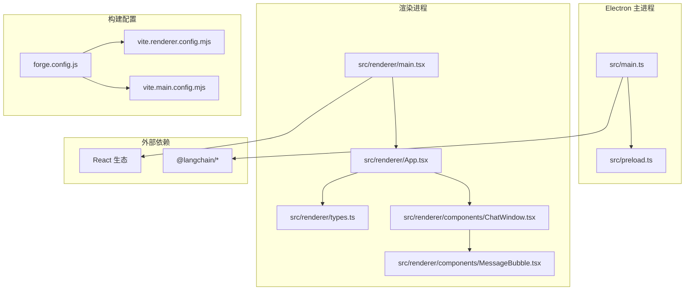
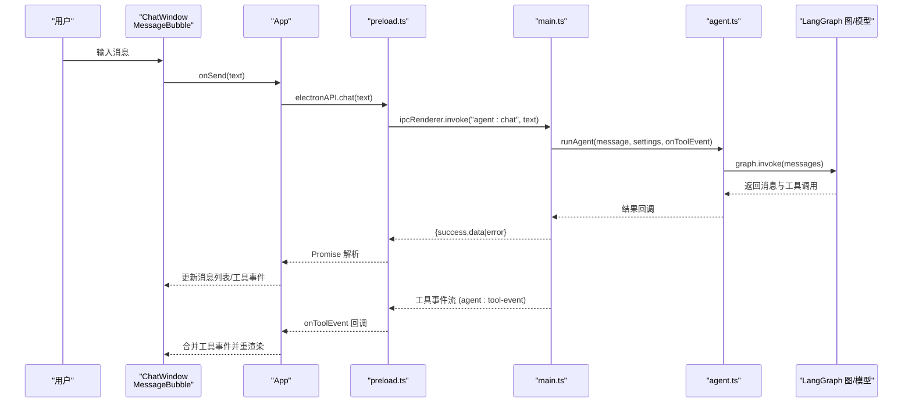
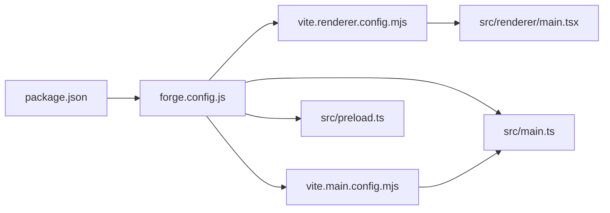

# 性能优化

<cite>
**本文引用的文件**
- [package.json](file://package.json)
- [vite.renderer.config.mjs](file://vite.renderer.config.mjs)
- [vite.main.config.mjs](file://vite.main.config.mjs)
- [forge.config.js](file://forge.config.js)
- [src/main.ts](file://src/main.ts)
- [src/preload.ts](file://src/preload.ts)
- [src/agent.ts](file://src/agent.ts)
- [src/renderer/App.tsx](file://src/renderer/App.tsx)
- [src/renderer/components/ChatWindow.tsx](file://src/renderer/components/ChatWindow.tsx)
- [src/renderer/components/MessageBubble.tsx](file://src/renderer/components/MessageBubble.tsx)
- [src/renderer/types.ts](file://src/renderer/types.ts)
- [src/renderer/main.tsx](file://src/renderer/main.tsx)
- [index.html](file://index.html)
</cite>

## 目录
1. [简介](#简介)
2. [项目结构](#项目结构)
3. [核心组件](#核心组件)
4. [架构总览](#架构总览)
5. [详细组件分析](#详细组件分析)
6. [依赖关系分析](#依赖关系分析)
7. [性能考量与优化策略](#性能考量与优化策略)
8. [故障排查指南](#故障排查指南)
9. [结论](#结论)
10. [附录](#附录)

## 简介
本指南面向性能工程师与高级开发者，围绕 langGraph 的 Electron + React + Vite 技术栈，系统性梳理构建期优化、运行时性能与内存管理策略，并结合现有代码实现给出可落地的优化建议。重点覆盖：
- Vite 构建配置中的性能优化选项、代码分割与懒加载
- React 组件的渲染优化、状态提升与事件处理
- Electron 进程间通信（IPC）优化与资源使用控制
- 性能监控、指标分析与瓶颈定位
- 用户体验优化：启动速度、响应时间与交互流畅度
- 缓存策略、数据预加载与异步处理优化

## 项目结构
该项目采用 Electron + React + Vite 的双包（main/preload/renderer）分层架构，通过 @electron-forge/plugin-vite 插件集成多入口构建。前端应用通过 preload 暴露受控 API 至渲染进程，主进程负责窗口创建、IPC 服务与持久化设置。

图表来源
- [src/main.ts:1-100](file://src/main.ts#L1-L100)
- [src/preload.ts:1-18](file://src/preload.ts#L1-L18)
- [src/renderer/main.tsx:1-8](file://src/renderer/main.tsx#L1-L8)
- [src/renderer/App.tsx:1-140](file://src/renderer/App.tsx#L1-L140)
- [src/renderer/components/ChatWindow.tsx:1-114](file://src/renderer/components/ChatWindow.tsx#L1-L114)
- [src/renderer/components/MessageBubble.tsx:1-104](file://src/renderer/components/MessageBubble.tsx#L1-L104)
- [src/renderer/types.ts:1-49](file://src/renderer/types.ts#L1-L49)
- [vite.renderer.config.mjs:1-7](file://vite.renderer.config.mjs#L1-L7)
- [vite.main.config.mjs:1-24](file://vite.main.config.mjs#L1-L24)
- [forge.config.js:1-42](file://forge.config.js#L1-L42)

章节来源
- [package.json:1-36](file://package.json#L1-L36)
- [forge.config.js:1-42](file://forge.config.js#L1-L42)
- [vite.renderer.config.mjs:1-7](file://vite.renderer.config.mjs#L1-L7)
- [vite.main.config.mjs:1-24](file://vite.main.config.mjs#L1-L24)

## 核心组件
- 主进程与窗口管理：负责窗口创建、生命周期、IPC 注册与设置持久化。
- 预加载脚本：通过 contextBridge 暴露受控 API，限制渲染进程访问 Node.js 能力。
- Agent 逻辑：基于 LangGraph 的状态机图，封装 OpenAI/Ollama 模型与工具调用，支持工具事件流式上报。
- 渲染层：React 应用，包含聊天窗口、消息气泡、设置面板与类型声明；通过 window.electronAPI 与主进程通信。

章节来源
- [src/main.ts:1-100](file://src/main.ts#L1-L100)
- [src/preload.ts:1-18](file://src/preload.ts#L1-L18)
- [src/agent.ts:1-316](file://src/agent.ts#L1-L316)
- [src/renderer/App.tsx:1-140](file://src/renderer/App.tsx#L1-L140)
- [src/renderer/components/ChatWindow.tsx:1-114](file://src/renderer/components/ChatWindow.tsx#L1-L114)
- [src/renderer/components/MessageBubble.tsx:1-104](file://src/renderer/components/MessageBubble.tsx#L1-L104)
- [src/renderer/types.ts:1-49](file://src/renderer/types.ts#L1-L49)

## 架构总览
下图展示了从用户输入到模型推理再到工具执行与 UI 更新的完整链路，以及 IPC 事件流。

图表来源
- [src/renderer/components/ChatWindow.tsx:29-42](file://src/renderer/components/ChatWindow.tsx#L29-L42)
- [src/renderer/App.tsx:43-84](file://src/renderer/App.tsx#L43-L84)
- [src/preload.ts:3-17](file://src/preload.ts#L3-L17)
- [src/main.ts:65-84](file://src/main.ts#L65-L84)
- [src/agent.ts:279-315](file://src/agent.ts#L279-L315)

## 详细组件分析

### 主进程与窗口管理（src/main.ts）
- 窗口创建与安全配置：启用 contextIsolation、禁用 nodeIntegration，确保隔离环境。
- IPC 服务：注册 agent:chat、settings:get/save，处理异常并返回统一结构。
- 设置持久化：使用 app.getPath('userData') 存储 JSON 文件，避免跨平台路径差异。
- 生命周期：窗口关闭后置空引用，应用退出策略。

优化要点
- 异常兜底：IPC 处理中捕获错误并返回字符串化错误，避免崩溃传播。
- 内存释放：窗口关闭时置空引用，防止残留引用导致 GC 不回收。
- 可扩展性：新增 IPC 接口时保持一致的返回结构，便于前端统一处理。

章节来源
- [src/main.ts:36-62](file://src/main.ts#L36-L62)
- [src/main.ts:65-84](file://src/main.ts#L65-L84)
- [src/main.ts:14-31](file://src/main.ts#L14-L31)

### 预加载脚本（src/preload.ts）
- 通过 contextBridge.exposeInMainWorld 暴露受控 API，仅暴露必要方法。
- onToolEvent 订阅/退订机制：返回清理函数，避免重复监听与内存泄漏。
- 与主进程约定的 IPC 名称与参数结构，保证前后端契约稳定。

优化要点
- 事件解绑：每次订阅返回移除监听函数，确保组件卸载时清理。
- 参数校验：在调用前对参数进行基本校验，减少无效 IPC 调用。

章节来源
- [src/preload.ts:3-17](file://src/preload.ts#L3-L17)

### Agent 逻辑（src/agent.ts）
- LangGraph 图构建：定义状态、节点与条件边，编译后复用。
- 工具集合：计算器、时间、文本分析、随机数工具，具备输入校验与错误处理。
- 工具事件流：逐个工具执行并上报 tool_start/tool_end，支持前端可视化。
- 模型适配：OpenAI/Ollama 两种 Provider，支持自定义 baseURL 与温度。

优化要点
- 并行工具执行：当前串行执行，可考虑并发或批处理以缩短总耗时。
- 工具缓存：对无状态工具可引入缓存，降低重复计算成本。
- 流式输出：若模型支持流式，可在 UI 层逐步渲染，改善感知延迟。

章节来源
- [src/agent.ts:171-262](file://src/agent.ts#L171-L262)
- [src/agent.ts:185-238](file://src/agent.ts#L185-L238)
- [src/agent.ts:43-137](file://src/agent.ts#L43-L137)

### 渲染层（src/renderer/App.tsx）
- 全局状态：消息列表、设置、是否显示设置面板。
- 事件监听：useEffect 订阅工具事件，合并到最新助手消息。
- 发送流程：添加用户消息 -> 添加加载中助手消息 -> IPC 调用 -> 更新 UI。
- 设置保存：调用 IPC 保存并更新本地状态。

优化要点
- 状态提升：将消息与工具事件提升至 App 层，减少子组件重渲染。
- 错误状态：在消息中标记 isError，便于 UI 区分成功/失败。
- 清空会话：一键清空消息列表，避免长对话累积导致渲染压力。

章节来源
- [src/renderer/App.tsx:6-22](file://src/renderer/App.tsx#L6-L22)
- [src/renderer/App.tsx:24-41](file://src/renderer/App.tsx#L24-L41)
- [src/renderer/App.tsx:43-84](file://src/renderer/App.tsx#L43-L84)
- [src/renderer/App.tsx:86-94](file://src/renderer/App.tsx#L86-L94)

### 聊天窗口（src/renderer/components/ChatWindow.tsx）
- 自动滚动：消息变化时平滑滚动到底部。
- 自适应输入框：根据内容高度自动调整，限制最大高度。
- 发送防抖：isSending 状态避免重复提交。
- 快捷键：Enter 发送，Shift+Enter 换行。

优化要点
- 虚拟化：消息量大时引入虚拟列表，降低 DOM 节点数量。
- 防抖发送：对高频输入进行防抖，减少 IPC 调用次数。
- 输入优化：使用受控组件与最小化状态更新，避免不必要的重渲染。

章节来源
- [src/renderer/components/ChatWindow.tsx:16-27](file://src/renderer/components/ChatWindow.tsx#L16-L27)
- [src/renderer/components/ChatWindow.tsx:29-42](file://src/renderer/components/ChatWindow.tsx#L29-L42)
- [src/renderer/components/ChatWindow.tsx:44-49](file://src/renderer/components/ChatWindow.tsx#L44-L49)

### 消息气泡（src/renderer/components/MessageBubble.tsx）
- 工具事件配对：将 tool_start 与 tool_end 配对展示，支持展开/收起。
- 加载与错误状态：根据 isLoading/isError 渲染不同样式。
- 时间戳格式化：本地化时间显示。

优化要点
- 懒渲染：工具详情按需展开，避免一次性渲染大量节点。
- 状态缓存：对已配对的工具事件进行缓存，减少计算开销。
- 字符串渲染：对输入/输出使用 pre/code 包裹，避免复杂 HTML 渲染。

章节来源
- [src/renderer/components/MessageBubble.tsx:13-28](file://src/renderer/components/MessageBubble.tsx#L13-L28)
- [src/renderer/components/MessageBubble.tsx:30-100](file://src/renderer/components/MessageBubble.tsx#L30-L100)

### 类型与入口（src/renderer/types.ts, src/renderer/main.tsx, index.html）
- 类型声明：统一 ElectronAPI、AgentSettings、Message、ToolEvent 等接口。
- 入口挂载：main.tsx 通过 createRoot 渲染 App。
- HTML 结构：index.html 提供根容器与模块入口脚本。

优化要点
- 类型约束：严格类型有助于 TS 编译期优化与 IDE 提示。
- 入口最小化：入口文件尽量轻量，避免阻塞首屏渲染。

章节来源
- [src/renderer/types.ts:1-49](file://src/renderer/types.ts#L1-L49)
- [src/renderer/main.tsx:1-8](file://src/renderer/main.tsx#L1-L8)
- [index.html:1-13](file://index.html#L1-L13)

## 依赖关系分析
- 构建插件：@electron-forge/plugin-vite 将 vite.main.config.mjs 与 vite.preload.config.mjs 作为主进程与预加载入口，vite.renderer.config.mjs 作为渲染入口。
- 依赖生态：React 18、LangChain 生态（core/langgraph/openai/ollama）、Zod 类型校验。
- SSR/打包：主进程配置中对 @langchain/* 与 zod 声明 noExternal，避免 SSR 失败。

图表来源
- [package.json:13-34](file://package.json#L13-L34)
- [forge.config.js:19-40](file://forge.config.js#L19-L40)
- [vite.renderer.config.mjs:1-7](file://vite.renderer.config.mjs#L1-L7)
- [vite.main.config.mjs:13-23](file://vite.main.config.mjs#L13-L23)

章节来源
- [package.json:1-36](file://package.json#L1-L36)
- [forge.config.js:1-42](file://forge.config.js#L1-L42)
- [vite.main.config.mjs:1-24](file://vite.main.config.mjs#L1-L24)

## 性能考量与优化策略

### 构建期优化（Vite + Forge）
- 代码分割与懒加载
  - 当前渲染入口为单页应用，建议对重型组件或路由进行动态导入，减少首屏体积。
  - 对第三方库（如 LangChain）按需引入，避免整包打包。
- 构建产物优化
  - 启用压缩与最小化（terser/esbuild），合理配置 rollupOptions.external 以减小主进程包体。
  - 在生产模式下开启 sourcemap，便于问题定位但注意体积与安全性权衡。
- SSR 与 noExternal
  - 主进程 SSR 配置中对 @langchain/* 与 zod 声明 noExternal，确保运行时可用；如需进一步优化，可拆分依赖或使用别名映射。

章节来源
- [vite.renderer.config.mjs:1-7](file://vite.renderer.config.mjs#L1-L7)
- [vite.main.config.mjs:13-23](file://vite.main.config.mjs#L13-L23)
- [forge.config.js:19-40](file://forge.config.js#L19-L40)

### 运行时性能（React 组件）
- 渲染优化
  - 使用 React.memo 或 useMemo/useCallback 缓存昂贵计算与子组件，减少重渲染。
  - 将高频更新的状态局部化，避免全局状态波动引发大面积重渲染。
- 事件与状态提升
  - 已在 App 层集中管理消息与工具事件，建议进一步拆分状态域（如消息域、设置域）以降低耦合。
- 交互体验
  - 输入框自适应高度与发送防抖已实现，可增加“输入提示”与“占位建议”，减少用户思考成本。
  - 对长消息进行折叠/展开，避免 UI 压力。

章节来源
- [src/renderer/App.tsx:6-22](file://src/renderer/App.tsx#L6-L22)
- [src/renderer/components/ChatWindow.tsx:16-27](file://src/renderer/components/ChatWindow.tsx#L16-L27)
- [src/renderer/components/ChatWindow.tsx:29-42](file://src/renderer/components/ChatWindow.tsx#L29-L42)

### IPC 与进程通信优化（Electron）
- 事件流式上报
  - 已通过 onToolEvent 实现工具事件的增量更新，建议在主进程侧批量合并事件，减少 IPC 次数。
- 请求去重与节流
  - 在渲染层对高频 IPC 请求进行去重与节流，避免重复触发 Agent 执行。
- 错误与超时
  - 为 IPC 调用增加超时与重试策略，提升稳定性与可观测性。

章节来源
- [src/preload.ts:3-17](file://src/preload.ts#L3-L17)
- [src/main.ts:65-84](file://src/main.ts#L65-L84)

### 内存管理与资源控制（Electron + React）
- 主进程
  - 窗口关闭时置空引用，避免循环引用；定期检查未清理的定时器与监听器。
  - 设置持久化使用同步写入，建议改为异步写入并在应用退出时合并写入，减少阻塞。
- 渲染进程
  - 对长列表使用虚拟化或分页加载；对图片/富文本内容进行懒加载。
  - 及时清理事件监听与定时器，避免内存泄漏。

章节来源
- [src/main.ts:59-62](file://src/main.ts#L59-L62)
- [src/main.ts:29-31](file://src/main.ts#L29-L31)
- [src/renderer/components/MessageBubble.tsx:30-100](file://src/renderer/components/MessageBubble.tsx#L30-L100)

### 性能监控与指标分析
- 指标采集
  - 关键指标：首屏渲染时间、IPC 调用耗时、工具执行耗时、消息渲染耗时、内存占用峰值。
- 工具建议
  - 使用浏览器性能面板（Performance/Network/Timeline）定位卡顿与网络瓶颈。
  - 在主进程记录 IPC 调用开始/结束时间，形成调用链日志。
- 瓶颈识别
  - LangGraph 图执行与工具调用是主要耗时点，优先优化工具执行与模型调用路径。

章节来源
- [src/agent.ts:279-315](file://src/agent.ts#L279-L315)
- [src/main.ts:65-84](file://src/main.ts#L65-L84)

### 用户体验优化
- 启动速度
  - 减少首屏 JS 体积，启用懒加载与代码分割；预热常用模块。
- 响应时间
  - 对用户输入进行防抖与去重；对长消息进行分片渲染；对工具事件采用增量展示。
- 交互流畅度
  - 使用骨架屏与占位符；对动画与滚动使用硬件加速属性。

章节来源
- [src/renderer/components/ChatWindow.tsx:16-27](file://src/renderer/components/ChatWindow.tsx#L16-L27)
- [src/renderer/components/MessageBubble.tsx:30-100](file://src/renderer/components/MessageBubble.tsx#L30-L100)

### 缓存策略、预加载与异步处理
- 缓存策略
  - 工具结果缓存：对无副作用且输入确定的工具结果进行缓存，命中则直接返回。
  - 模型会话缓存：对相同上下文的消息历史进行短期缓存，减少重复推理。
- 数据预加载
  - 应用启动时预加载常用设置与模型元数据；对工具描述与示例进行预加载。
- 异步处理
  - 将工具执行与模型调用放入微任务队列，避免阻塞 UI；对长任务进行分片处理。

章节来源
- [src/agent.ts:43-137](file://src/agent.ts#L43-L137)
- [src/renderer/App.tsx:18-22](file://src/renderer/App.tsx#L18-L22)

## 故障排查指南
- IPC 调用失败
  - 检查 preload 是否正确暴露 API，确认 IPC 名称与参数结构一致。
  - 在主进程捕获异常并返回错误信息，前端据此显示错误状态。
- 工具事件不显示
  - 确认 onToolEvent 订阅与退订逻辑正确，避免重复监听。
  - 检查工具事件配对逻辑，确保 tool_start 与 tool_end 成对出现。
- 渲染卡顿
  - 使用 React DevTools Profiler 分析组件重渲染热点；对长列表进行虚拟化。
  - 检查是否存在频繁的 setState 导致的连锁更新。

章节来源
- [src/preload.ts:3-17](file://src/preload.ts#L3-L17)
- [src/renderer/App.tsx:24-41](file://src/renderer/App.tsx#L24-L41)
- [src/renderer/components/MessageBubble.tsx:13-28](file://src/renderer/components/MessageBubble.tsx#L13-L28)

## 结论
本项目在 Electron + React + Vite 的技术栈上，已具备良好的基础：隔离的 IPC 设计、LangGraph 的状态机抽象与工具事件流式上报。后续优化应聚焦于：
- 构建期：代码分割、按需引入与产物压缩
- 运行时：组件渲染优化、状态域拆分与事件去重
- IPC：事件批量合并与请求节流
- 内存：及时清理与异步写入
- 监控：端到端指标采集与瓶颈定位

通过以上系统性优化，可显著提升启动速度、响应时间与整体用户体验。

## 附录
- 构建配置参考
  - 渲染入口：vite.renderer.config.mjs
  - 主进程入口：vite.main.config.mjs
  - Forge 插件：forge.config.js
- 关键文件清单
  - 主进程：src/main.ts
  - 预加载：src/preload.ts
  - Agent：src/agent.ts
  - 渲染入口：src/renderer/main.tsx
  - 应用：src/renderer/App.tsx
  - 组件：ChatWindow.tsx、MessageBubble.tsx
  - 类型：src/renderer/types.ts
  - HTML：index.html