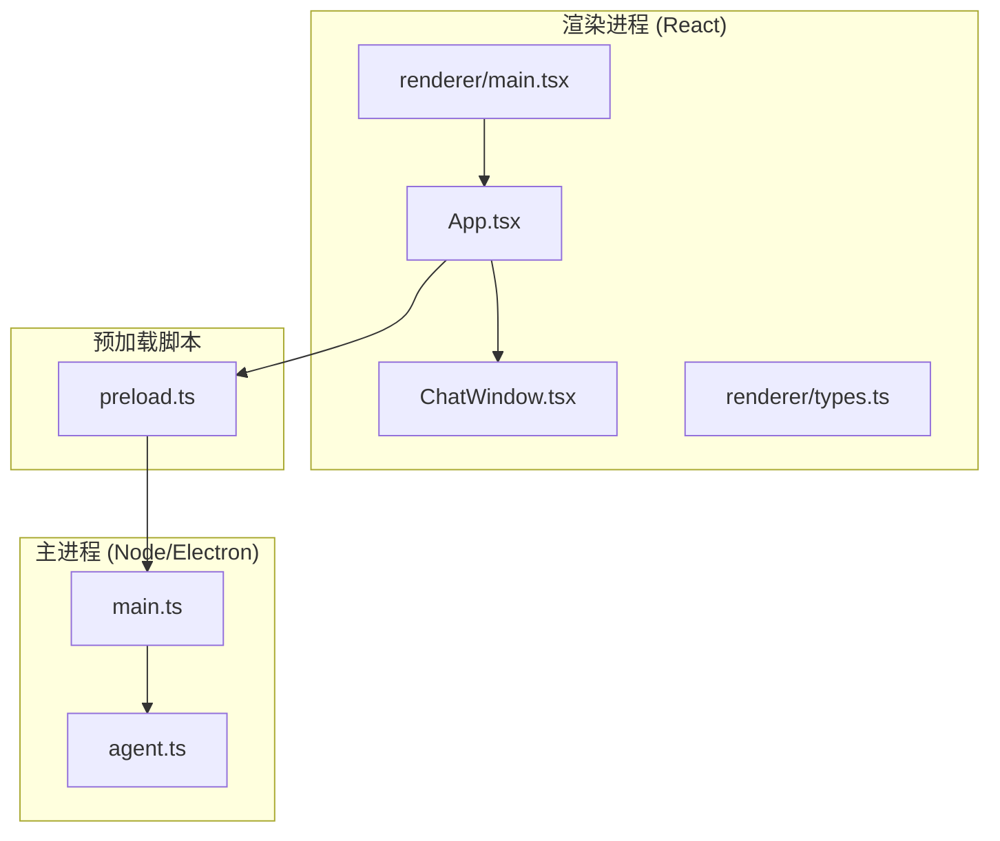
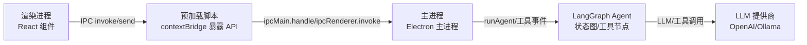
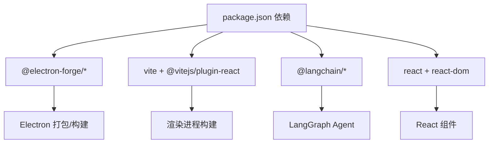

# 性能监控

<cite>
**本文引用的文件**
- [package.json](file://package.json)
- [forge.config.js](file://forge.config.js)
- [vite.renderer.config.mjs](file://vite.renderer.config.mjs)
- [vite.main.config.mjs](file://vite.main.config.mjs)
- [vite.preload.config.mjs](file://vite.preload.config.mjs)
- [src/main.ts](file://src/main.ts)
- [src/preload.ts](file://src/preload.ts)
- [src/agent.ts](file://src/agent.ts)
- [src/renderer/App.tsx](file://src/renderer/App.tsx)
- [src/renderer/main.tsx](file://src/renderer/main.tsx)
- [src/renderer/components/ChatWindow.tsx](file://src/renderer/components/ChatWindow.tsx)
- [src/renderer/types.ts](file://src/renderer/types.ts)
- [index.html](file://index.html)
- [开发文档.md](file://开发文档.md)
</cite>

## 目录
1. [简介](#简介)
2. [项目结构](#项目结构)
3. [核心组件](#核心组件)
4. [架构总览](#架构总览)
5. [详细组件分析](#详细组件分析)
6. [依赖分析](#依赖分析)
7. [性能考量](#性能考量)
8. [故障排查指南](#故障排查指南)
9. [结论](#结论)
10. [附录](#附录)

## 简介
本指南面向运维工程师与性能分析师，围绕 langGraph 项目的 Electron + React + LangGraph 技术栈，系统性梳理性能监控与分析方法。内容覆盖：
- Electron 应用性能监控与分析（内置性能分析器、第三方工具）
- React 应用性能监控（组件渲染时间、重渲染分析、瓶颈识别）
- 构建工具性能分析（Vite、Electron Forge）、Bundle 体积与依赖关系
- 用户行为监控、用户体验指标采集与性能告警
- 性能基准测试、A/B 测试与回归测试
- 实时性能监控、日志分析与错误追踪
- 性能数据可视化、报告生成与趋势分析

## 项目结构
langGraph 采用 Electron + Vite + React + LangGraph 的现代桌面应用架构。渲染进程由 React 驱动，主进程承载 LangGraph Agent 与 IPC；预加载脚本提供安全的 API 桥接。

图表来源
- [src/renderer/main.tsx:1-8](file://src/renderer/main.tsx#L1-L8)
- [src/renderer/App.tsx:1-140](file://src/renderer/App.tsx#L1-L140)
- [src/renderer/components/ChatWindow.tsx:1-114](file://src/renderer/components/ChatWindow.tsx#L1-L114)
- [src/renderer/types.ts:1-49](file://src/renderer/types.ts#L1-L49)
- [src/preload.ts:1-18](file://src/preload.ts#L1-L18)
- [src/main.ts:1-100](file://src/main.ts#L1-L100)
- [src/agent.ts:1-316](file://src/agent.ts#L1-L316)

章节来源
- [开发文档.md:152-190](file://开发文档.md#L152-L190)
- [package.json:1-36](file://package.json#L1-L36)
- [forge.config.js:1-42](file://forge.config.js#L1-L42)

## 核心组件
- Electron 主进程：窗口管理、IPC 处理、设置持久化、调用 Agent。
- 预加载脚本：通过 contextBridge 暴露受控 API，监听工具事件。
- React 渲染进程：应用布局、聊天窗口、设置面板、事件监听与状态管理。
- LangGraph Agent：状态图、工具节点、条件路由、LLM 绑定与执行。

章节来源
- [src/main.ts:1-100](file://src/main.ts#L1-L100)
- [src/preload.ts:1-18](file://src/preload.ts#L1-L18)
- [src/renderer/App.tsx:1-140](file://src/renderer/App.tsx#L1-L140)
- [src/renderer/components/ChatWindow.tsx:1-114](file://src/renderer/components/ChatWindow.tsx#L1-L114)
- [src/agent.ts:1-316](file://src/agent.ts#L1-L316)

## 架构总览
Electron 应用的三层架构（渲染进程、预加载脚本、主进程）在性能监控中分别承担不同职责：
- 渲染进程：UI 渲染、事件处理、用户交互、工具事件展示。
- 预加载脚本：安全桥接、IPC 事件订阅、回调清理。
- 主进程：Agent 执行、IPC 响应、设置读写、窗口生命周期。

图表来源
- [src/renderer/App.tsx:1-140](file://src/renderer/App.tsx#L1-L140)
- [src/preload.ts:1-18](file://src/preload.ts#L1-L18)
- [src/main.ts:1-100](file://src/main.ts#L1-L100)
- [src/agent.ts:1-316](file://src/agent.ts#L1-L316)

## 详细组件分析

### Electron 主进程性能监控
- 窗口生命周期与资源释放：窗口关闭时置空引用，避免内存泄漏。
- IPC 处理：异步处理用户消息，异常捕获并返回错误信息，避免阻塞主线程。
- 设置持久化：使用文件系统写入，注意磁盘 IO 与并发写入风险。

建议监控点
- 主线程阻塞检测：使用 Node.js profiler（见“性能考量”）。
- IPC 响应延迟：记录 ipcMain.handle 的耗时。
- 窗口创建/销毁次数与内存峰值。

章节来源
- [src/main.ts:36-62](file://src/main.ts#L36-L62)
- [src/main.ts:65-84](file://src/main.ts#L65-L84)
- [src/main.ts:87-99](file://src/main.ts#L87-L99)

### 预加载脚本与 IPC 性能
- 安全桥接：仅暴露必要 API，降低攻击面。
- 事件订阅：onToolEvent 返回移除监听函数，防止重复订阅导致内存泄漏。
- invoke/handle 模式：请求-响应通信，避免长轮询带来的 CPU 占用。

建议监控点
- 事件监听数量：确保每次订阅都有对应清理。
- IPC 调用频率与延迟：统计高频调用的累积开销。

章节来源
- [src/preload.ts:1-18](file://src/preload.ts#L1-L18)

### React 渲染进程性能监控
- 组件渲染时间：使用 React Profiler 或自定义高阶计时器。
- 重渲染分析：定位不必要的 setState 与 props 变更。
- 工具事件展示：聊天窗口根据消息列表渲染消息气泡，注意大数据量下的虚拟化。

建议监控点
- 组件挂载/卸载耗时。
- 消息列表渲染耗时与重渲染次数。
- 输入框自动高度调整与滚动行为对帧率的影响。

章节来源
- [src/renderer/App.tsx:1-140](file://src/renderer/App.tsx#L1-L140)
- [src/renderer/components/ChatWindow.tsx:1-114](file://src/renderer/components/ChatWindow.tsx#L1-L114)

### LangGraph Agent 性能监控
- 状态图执行：Agent 节点与 Tools 节点的调用链路，工具执行耗时。
- LLM 调用：OpenAI/Ollama 的网络延迟与响应时间。
- 条件路由：工具调用判断与循环终止逻辑的正确性与效率。

建议监控点
- Agent.invoke 总耗时与各阶段拆分（LLM、工具执行、状态合并）。
- 工具执行成功率与失败原因分类。
- LLM 调用次数与平均响应时间。

章节来源
- [src/agent.ts:171-262](file://src/agent.ts#L171-L262)
- [src/agent.ts:279-315](file://src/agent.ts#L279-L315)

## 依赖分析
- Electron Forge + Vite：构建与打包工具链，支持开发热更新与生产打包。
- LangChain/LangGraph：AI 推理与工具系统，涉及网络调用与计算密集型操作。
- React + TypeScript：前端 UI 与类型安全，影响渲染性能与开发效率。

图表来源
- [package.json:13-34](file://package.json#L13-L34)
- [forge.config.js:1-42](file://forge.config.js#L1-L42)
- [vite.renderer.config.mjs:1-7](file://vite.renderer.config.mjs#L1-L7)

章节来源
- [package.json:1-36](file://package.json#L1-L36)
- [forge.config.js:1-42](file://forge.config.js#L1-L42)

## 性能考量
本节提供通用性能指导，结合项目实际可落地的监控与优化策略。

- Electron 应用性能分析
  - 使用 Electron DevTools 的 Performance 面板进行录制与分析，关注主线程阻塞、GC 峰值、IPC 调用热点。
  - Node.js 内置 profiler：在 CI 或生产环境采集 CPU/Heap 快照，定位长尾与内存泄漏。
  - 第三方工具：使用 lighthouse-electron 或自研探针采集页面首屏、交互延迟等指标。

- React 应用性能
  - React Profiler：测量组件渲染耗时与重渲染次数，识别热点组件。
  - React DevTools Profiling：导出分析数据，结合火焰图定位瓶颈。
  - 重渲染优化：memo、useMemo、useCallback、减少深层对象变更。

- 构建工具性能
  - Vite：利用 HMR 与并行打包，关注依赖预构建缓存命中率。
  - Electron Forge：开启 asar 与产物压缩，减少安装包体积。
  - Bundle 体积分析：使用 webpack-bundle-analyzer 或 vite-bundle-analyzer，识别大体积依赖与重复模块。

- 用户行为与体验指标
  - 关键指标：FCP、LCP、FID、CLS、TTI、崩溃率、工具调用成功率。
  - 采集方式：在渲染进程埋点，通过预加载脚本 IPC 上报至主进程，再持久化或上报到监控系统。

- 性能告警
  - 设定阈值：如 IPC 响应超时、渲染帧率低于阈值、工具执行失败率上升。
  - 告警渠道：邮件、IM、Webhook，结合自动化降级策略。

- 基准测试与回归
  - 基准：固定输入与环境，测量 Agent 总耗时、渲染耗时、IPC 延迟。
  - A/B：对比不同 LLM 配置、工具数量、UI 优化的效果。
  - 回归：CI 中加入性能回归检测，超过阈值则阻断发布。

- 实时监控与日志
  - 实时：仪表盘展示关键指标，支持按用户、会话维度聚合。
  - 日志：结构化日志，区分级别与上下文，便于检索与分析。
  - 错误追踪：结合 Sentry 或自建错误上报，关联用户行为与系统状态。

- 数据可视化与报告
  - 可视化：折线图、柱状图、热力图、漏斗图。
  - 报告：每日/每周/每月性能报告，趋势分析与根因定位。

## 故障排查指南
- 渲染进程卡顿
  - 检查是否存在大量同步 setState 或深层不可变更新。
  - 观察聊天消息列表是否过大，考虑虚拟化或分页。
  - 关注输入框自动高度调整与滚动触发频率。

- IPC 延迟高
  - 检查主进程是否在执行长时间任务（如文件写入、网络请求）。
  - 确认预加载脚本未重复订阅事件，避免事件风暴。

- Agent 执行慢
  - 分析 LLM 调用耗时与工具执行耗时，优先优化慢工具。
  - 检查条件路由是否正确终止，避免无效循环。

- 打包体积大
  - 使用体积分析工具定位大依赖，评估是否可替换或拆分。
  - 确认 asar 与压缩已启用，剔除开发依赖。

章节来源
- [src/renderer/components/ChatWindow.tsx:17-27](file://src/renderer/components/ChatWindow.tsx#L17-L27)
- [src/preload.ts:8-12](file://src/preload.ts#L8-L12)
- [src/main.ts:65-84](file://src/main.ts#L65-L84)
- [src/agent.ts:171-262](file://src/agent.ts#L171-L262)

## 结论
langGraph 的性能监控体系应贯穿渲染进程、预加载脚本与主进程三个层面，结合构建工具与第三方监控手段，形成从指标采集、实时告警到趋势分析的闭环。通过基准测试与 A/B 测试持续优化用户体验，借助可视化与报告沉淀经验，逐步完善运维与性能分析能力。

## 附录

### 构建与打包配置要点
- Electron Forge 插件：使用 @electron-forge/plugin-vite，分别构建 main、preload、renderer。
- Vite 配置：renderer 使用 React 插件；main 配置 SSR noExternal 解决 ESM/CJS 兼容；preload 保持外部 Electron。
- 打包策略：asar 启用，产物压缩，便于分发与安装。

章节来源
- [forge.config.js:1-42](file://forge.config.js#L1-L42)
- [vite.renderer.config.mjs:1-7](file://vite.renderer.config.mjs#L1-L7)
- [vite.main.config.mjs:1-24](file://vite.main.config.mjs#L1-L24)
- [vite.preload.config.mjs:1-10](file://vite.preload.config.mjs#L1-L10)

### 运行与调试
- 开发模式：Vite 开发服务器 + Electron，自动打开 DevTools。
- 首次使用：设置提供商与模型，保存后即可对话。
- 打包分发：make 生成安装包与 ZIP 包。

章节来源
- [开发文档.md:509-542](file://开发文档.md#L509-L542)