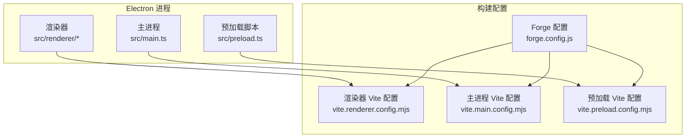
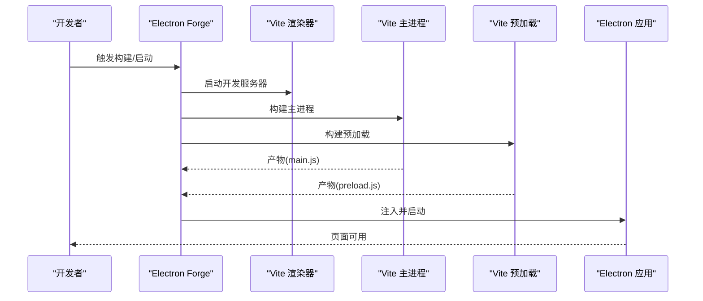
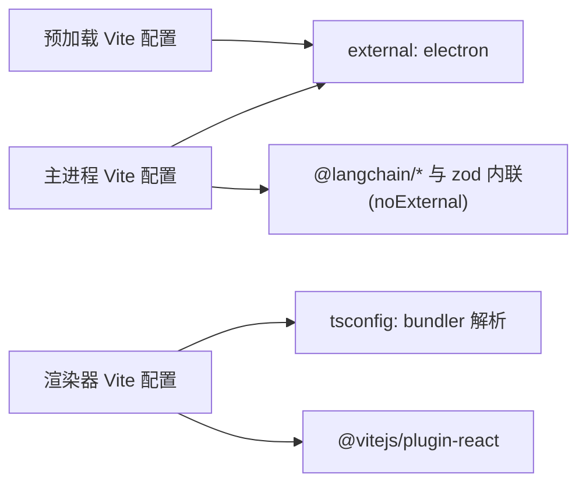

# 构建优化

<cite>
**本文引用的文件**
- [package.json](file://package.json)
- [forge.config.js](file://forge.config.js)
- [vite.renderer.config.mjs](file://vite.renderer.config.mjs)
- [vite.main.config.mjs](file://vite.main.config.mjs)
- [vite.preload.config.mjs](file://vite.preload.config.mjs)
- [tsconfig.json](file://tsconfig.json)
- [src/main.ts](file://src/main.ts)
- [src/preload.ts](file://src/preload.ts)
- [src/renderer/main.tsx](file://src/renderer/main.tsx)
- [src/renderer/App.tsx](file://src/renderer/App.tsx)
- [src/renderer/components/ChatWindow.tsx](file://src/renderer/components/ChatWindow.tsx)
- [src/renderer/types.ts](file://src/renderer/types.ts)
- [开发文档.md](file://开发文档.md)
</cite>

## 目录
1. [简介](#简介)
2. [项目结构](#项目结构)
3. [核心组件](#核心组件)
4. [架构总览](#架构总览)
5. [详细组件分析](#详细组件分析)
6. [依赖分析](#依赖分析)
7. [性能考量](#性能考量)
8. [故障排查指南](#故障排查指南)
9. [结论](#结论)
10. [附录](#附录)

## 简介
本指南面向前端与构建工程师，围绕 langGraph 项目的 Electron + Vite + Forge 架构，系统梳理构建优化策略，覆盖代码分割、懒加载、模块预优化、TypeScript 编译优化、Tree Shaking、Dead Code Elimination、生产构建优化、Bundle 分析与体积控制、构建缓存与并行、增量编译、Electron Forge 打包优化与分发性能提升等主题。文中所有建议均结合仓库现有配置与代码结构进行落地说明。

## 项目结构
项目采用“主进程 + 预加载脚本 + 渲染器”三层 Electron 架构，配合 Vite 多入口构建与 Electron Forge 打包：
- 主进程：负责窗口创建、IPC、持久化与调用 LangGraph Agent
- 预加载脚本：通过 contextBridge 暴露受控 API 至渲染进程
- 渲染器：React 应用，负责 UI 与交互

图表来源
- [forge.config.js:1-42](file://forge.config.js#L1-L42)
- [vite.renderer.config.mjs:1-7](file://vite.renderer.config.mjs#L1-L7)
- [vite.main.config.mjs:1-24](file://vite.main.config.mjs#L1-L24)
- [vite.preload.config.mjs:1-10](file://vite.preload.config.mjs#L1-L10)
- [src/main.ts:1-100](file://src/main.ts#L1-L100)
- [src/preload.ts:1-18](file://src/preload.ts#L1-L18)

章节来源
- [开发文档.md:152-190](file://开发文档.md#L152-L190)
- [forge.config.js:1-42](file://forge.config.js#L1-L42)

## 核心组件
- Electron Forge 插件：通过 @electron-forge/plugin-vite 集成 Vite，分别构建主进程、预加载与渲染器。
- Vite 渲染器配置：启用 React 插件，满足开发与生产构建需求。
- Vite 主进程配置：针对 Electron 主进程的模块解析、外部化与 SSR 内联策略，解决 LangChain ESM/CJS 兼容问题。
- Vite 预加载配置：仅做基础构建，外部化 Electron。
- TypeScript 配置：ESNext 目标、bundler 解析、路径别名等，保证类型与模块解析一致性。

章节来源
- [package.json:1-36](file://package.json#L1-L36)
- [vite.renderer.config.mjs:1-7](file://vite.renderer.config.mjs#L1-L7)
- [vite.main.config.mjs:1-24](file://vite.main.config.mjs#L1-L24)
- [vite.preload.config.mjs:1-10](file://vite.preload.config.mjs#L1-L10)
- [tsconfig.json:1-22](file://tsconfig.json#L1-L22)

## 架构总览
Electron Forge + Vite 的构建链路如下：
- 开发模式：渲染器由 Vite Dev Server 提供 HMR；主进程与预加载由 Forge 插件构建后注入 Electron。
- 生产模式：渲染器与主进程/预加载分别产出产物，Forge 打包为 asar 并生成安装包。

图表来源
- [forge.config.js:19-40](file://forge.config.js#L19-L40)
- [vite.renderer.config.mjs:1-7](file://vite.renderer.config.mjs#L1-L7)
- [vite.main.config.mjs:1-24](file://vite.main.config.mjs#L1-L24)
- [vite.preload.config.mjs:1-10](file://vite.preload.config.mjs#L1-L10)

## 详细组件分析

### 渲染器构建优化（vite.renderer.config.mjs）
- 当前配置：启用 React 插件，未显式配置 Rollup 输出、代码分割与压缩策略。
- 建议优化方向：
  - 明确 Rollup 输出与最小化策略，确保生产构建开启 Tree Shaking 与压缩。
  - 配置动态导入与路由级懒加载，减少首屏体积。
  - 使用 Vite 插件按需启用资源内联/外链策略，平衡请求数与体积。
  - 针对 React 18 的并发特性，评估 Suspense 与边界懒加载对用户体验的影响。

章节来源
- [vite.renderer.config.mjs:1-7](file://vite.renderer.config.mjs#L1-L7)
- [src/renderer/App.tsx:1-140](file://src/renderer/App.tsx#L1-L140)
- [src/renderer/components/ChatWindow.tsx:1-114](file://src/renderer/components/ChatWindow.tsx#L1-L114)

### 主进程构建优化（vite.main.config.mjs）
- 关键点：resolve.conditions 与 mainFields 配置，rollupOptions.external 外部化 Electron，ssr.noExternal 内联 LangChain 生态包，解决 ESM/CJS 兼容。
- 建议优化方向：
  - 在生产构建中启用最小化与 Tree Shaking，避免冗余代码进入主进程包。
  - 将第三方依赖拆分为独立 chunk，便于缓存与增量更新。
  - 对 LangChain 相关包使用明确的 external/noExternal 策略，避免重复打包。
  - 针对主进程的模块解析与打包，结合 tsconfig 的 moduleResolution=bundler，确保类型与运行时一致。

章节来源
- [vite.main.config.mjs:1-24](file://vite.main.config.mjs#L1-L24)
- [开发文档.md:545-557](file://开发文档.md#L545-L557)

### 预加载脚本构建优化（vite.preload.config.mjs）
- 当前配置：仅外部化 Electron，未配置最小化与输出策略。
- 建议优化方向：
  - 在生产构建中启用最小化，减少 preload 体积。
  - 保持 API 暴露面最小化，避免将过多逻辑放入 preload。
  - 若 preload 逻辑复杂，考虑拆分为更小的模块并通过动态导入按需加载。

章节来源
- [vite.preload.config.mjs:1-10](file://vite.preload.config.mjs#L1-L10)
- [src/preload.ts:1-18](file://src/preload.ts#L1-L18)

### TypeScript 编译优化（tsconfig.json）
- 关键点：target/module 为 ESNext，moduleResolution 为 bundler，jsx 为 react-jsx，路径别名 @/* 指向 src。
- 建议优化方向：
  - 保持 ESNext 与 bundler 解析，确保与 Vite/Forge 的打包行为一致。
  - 配合 Vite 的最小化与 Tree Shaking，确保 unused 导出被移除。
  - 使用 isolatedModules 与 skipLibCheck，提升构建稳定性与速度。

章节来源
- [tsconfig.json:1-22](file://tsconfig.json#L1-L22)

### Electron Forge 打包与分发优化（forge.config.js）
- 关键点：asar=true，maker 使用 Squirrel 与 Zip，插件配置主进程与预加载构建入口及渲染器配置。
- 建议优化方向：
  - asar 打包提升安全性，但需注意某些路径解析与资源加载策略。
  - 针对不同平台与分发渠道（如 Store/企业分发）调整 maker 配置。
  - 在 Forge 层面启用构建缓存与增量构建，减少重复打包时间。

章节来源
- [forge.config.js:1-42](file://forge.config.js#L1-L42)
- [package.json:1-36](file://package.json#L1-L36)

### 代码分割与懒加载实践
- 渲染器侧：建议将大型组件或重型依赖通过动态导入实现按需加载；结合路由级懒加载，降低首屏 JS 体积。
- 主进程侧：将非核心逻辑拆分为独立模块，按需 require/import，避免一次性加载全部依赖。
- 预加载侧：保持轻量化，避免引入重型依赖。

章节来源
- [src/renderer/App.tsx:1-140](file://src/renderer/App.tsx#L1-L140)
- [src/renderer/components/ChatWindow.tsx:1-114](file://src/renderer/components/ChatWindow.tsx#L1-L114)

### 模块预优化与依赖治理
- 通过 Vite 的 external/noExternal 策略，确保 Electron 与 LangChain 生态的正确打包。
- 在 tsconfig 中统一模块解析策略，避免运行时与构建时差异导致的打包问题。
- 对重型依赖（如 LangChain、React 生态）采用按需引入与 Tree Shaking，减少冗余。

章节来源
- [vite.main.config.mjs:1-24](file://vite.main.config.mjs#L1-L24)
- [tsconfig.json:1-22](file://tsconfig.json#L1-L22)

### 生产构建优化与 Bundle 分析
- 建议在生产构建中启用：
  - 最小化与 Tree Shaking（Rollup 插件链）
  - 代码分割与命名策略（chunk 名称与大小阈值）
  - 资源内联/外链策略（图片、字体、CSS）
- 使用构建分析工具（如 Vite 插件）输出 bundle 报告，识别大体积依赖与重复模块。

章节来源
- [开发文档.md:532-542](file://开发文档.md#L532-L542)

### 构建缓存、并行与增量编译
- 构建缓存：利用 Vite/Forge 的缓存机制，避免重复编译；在 CI 中缓存 node_modules 与 .vite/build。
- 并行构建：在多核环境下并行执行主进程、预加载与渲染器构建任务。
- 增量编译：在开发模式下启用 HMR 与增量编译，缩短热更新时间。

章节来源
- [开发文档.md:509-522](file://开发文档.md#L509-L522)

## 依赖分析
- Electron 主进程与预加载对 Electron 的依赖应保持 external，避免重复打包。
- 渲染器对 React 生态与 UI 组件的依赖应通过 Tree Shaking 移除未使用代码。
- LangChain 生态包因发布为 ESM，需通过 noExternal 内联，确保 CJS/ESM 兼容。

图表来源
- [vite.main.config.mjs:1-24](file://vite.main.config.mjs#L1-L24)
- [vite.preload.config.mjs:1-10](file://vite.preload.config.mjs#L1-L10)
- [vite.renderer.config.mjs:1-7](file://vite.renderer.config.mjs#L1-L7)
- [tsconfig.json:1-22](file://tsconfig.json#L1-L22)

章节来源
- [vite.main.config.mjs:1-24](file://vite.main.config.mjs#L1-L24)
- [vite.preload.config.mjs:1-10](file://vite.preload.config.mjs#L1-L10)
- [vite.renderer.config.mjs:1-7](file://vite.renderer.config.mjs#L1-L7)
- [tsconfig.json:1-22](file://tsconfig.json#L1-L22)

## 性能考量
- 体积控制：通过 Tree Shaking、代码分割、按需加载与资源内联策略，降低首屏体积。
- 启动性能：预加载与主进程体积越小，应用启动越快；避免在 preload 中执行重逻辑。
- 运行时性能：LangChain 与 LLM 调用应在主进程异步执行，避免阻塞渲染线程。
- 打包性能：合理配置 asar、maker 与 Forge 缓存，缩短打包时间。

章节来源
- [开发文档.md:532-542](file://开发文档.md#L532-L542)
- [src/main.ts:1-100](file://src/main.ts#L1-L100)
- [src/preload.ts:1-18](file://src/preload.ts#L1-L18)

## 故障排查指南
- 模块兼容问题（ESM/CJS）：确认主进程配置中 LangChain 生态包已在 noExternal 列表，避免打包失败。
- IPC 通信异常：检查 preload 暴露 API 与渲染器调用是否一致，确保 contextIsolation 与 invoke/handle 使用正确。
- 打包体积过大：使用构建分析报告定位大体积依赖，结合按需加载与 Tree Shaking 优化。
- 开发/生产差异：确保 tsconfig 的 moduleResolution 与 Vite 行为一致，避免类型与运行时不匹配。

章节来源
- [开发文档.md:545-557](file://开发文档.md#L545-L557)
- [src/renderer/types.ts:1-49](file://src/renderer/types.ts#L1-L49)
- [src/preload.ts:1-18](file://src/preload.ts#L1-L18)

## 结论
本指南基于 langGraph 项目现有配置，提出了面向 Electron + Vite + Forge 的系统性构建优化方案。通过明确的代码分割与懒加载策略、严格的 Tree Shaking 与 DCE、合理的生产构建与打包配置，以及构建缓存与并行优化，可在保证开发体验的同时显著提升应用体积与启动性能。建议在后续迭代中逐步引入构建分析与自动化优化流程，持续监控与改进构建表现。

## 附录
- 命令速查：start/package/make/publish，对应开发、打包与分发流程。
- 项目命令参考见开发文档相应章节。

章节来源
- [开发文档.md:651-660](file://开发文档.md#L651-L660)