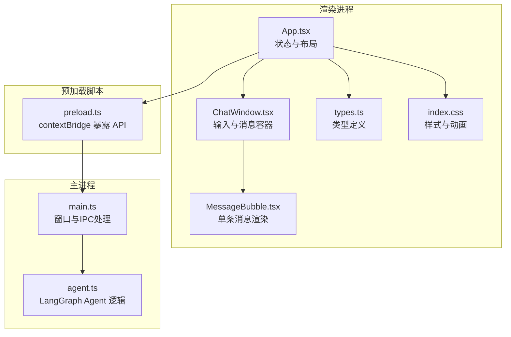
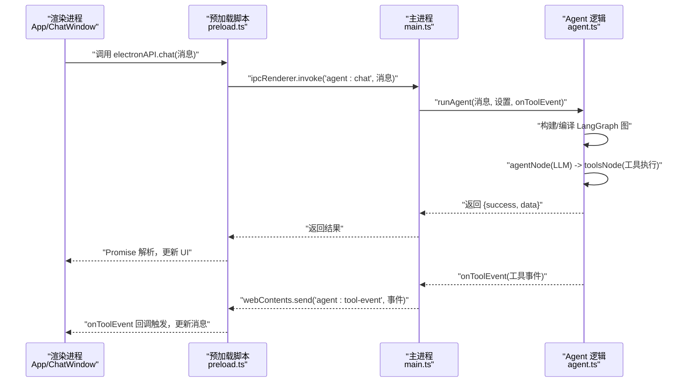
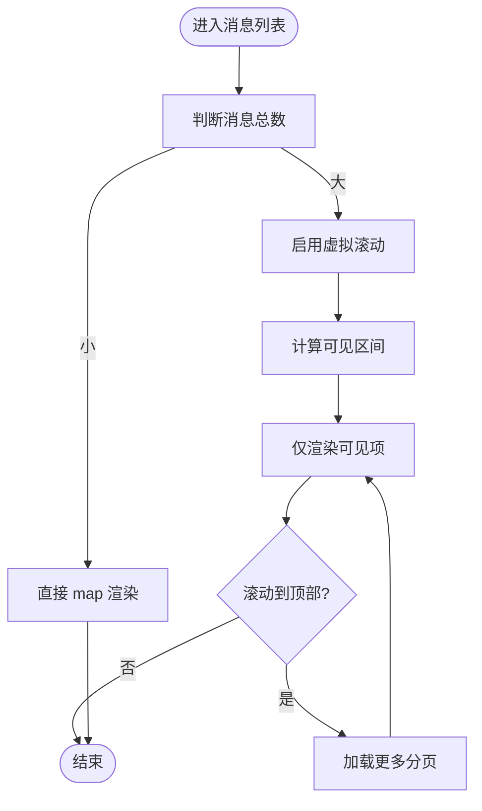
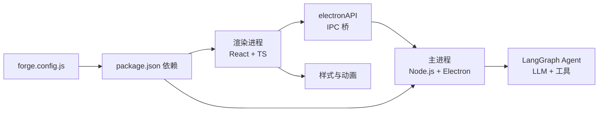

# 运行时性能

<cite>
**本文引用的文件**
- [src/renderer/App.tsx](file://src/renderer/App.tsx)
- [src/renderer/components/ChatWindow.tsx](file://src/renderer/components/ChatWindow.tsx)
- [src/renderer/components/MessageBubble.tsx](file://src/renderer/components/MessageBubble.tsx)
- [src/renderer/types.ts](file://src/renderer/types.ts)
- [src/renderer/index.css](file://src/renderer/index.css)
- [src/agent.ts](file://src/agent.ts)
- [src/main.ts](file://src/main.ts)
- [src/preload.ts](file://src/preload.ts)
- [package.json](file://package.json)
- [forge.config.js](file://forge.config.js)
- [开发文档.md](file://开发文档.md)
</cite>

## 目录
1. [简介](#简介)
2. [项目结构](#项目结构)
3. [核心组件](#核心组件)
4. [架构总览](#架构总览)
5. [详细组件分析](#详细组件分析)
6. [依赖关系分析](#依赖关系分析)
7. [性能考量](#性能考量)
8. [故障排查指南](#故障排查指南)
9. [结论](#结论)
10. [附录](#附录)

## 简介
本指南聚焦 langGraph 在 Electron 渲染进程中的运行时性能优化，覆盖 React 组件渲染优化、状态提升与虚拟滚动、消息列表高性能渲染与无限/分页加载、AI 代理服务异步处理与并发控制、IPC 事件推送与缓存、前端交互响应优化、网络请求合并与重试、以及 Electron 渲染器进程的 GPU/硬件加速配置、内存泄漏检测与资源释放策略。目标是为前端开发者与性能工程师提供可落地的优化方案。

## 项目结构
项目采用 Electron + Vite + React + LangGraph 架构，核心文件分布如下：
- 渲染进程（React）：App.tsx、ChatWindow.tsx、MessageBubble.tsx、types.ts、index.css
- 主进程（Node.js）：main.ts、agent.ts
- 预加载脚本（IPC 桥）：preload.ts
- 构建与打包：forge.config.js、vite.*.config.mjs、package.json
- 开发文档：开发文档.md

图表来源
- [src/renderer/App.tsx:1-140](file://src/renderer/App.tsx#L1-L140)
- [src/renderer/components/ChatWindow.tsx:1-114](file://src/renderer/components/ChatWindow.tsx#L1-L114)
- [src/renderer/components/MessageBubble.tsx:1-104](file://src/renderer/components/MessageBubble.tsx#L1-L104)
- [src/renderer/types.ts:1-49](file://src/renderer/types.ts#L1-L49)
- [src/renderer/index.css:1-649](file://src/renderer/index.css#L1-L649)
- [src/preload.ts:1-18](file://src/preload.ts#L1-L18)
- [src/main.ts:1-100](file://src/main.ts#L1-L100)
- [src/agent.ts:1-316](file://src/agent.ts#L1-L316)

章节来源
- [开发文档.md:152-190](file://开发文档.md#L152-L190)

## 核心组件
- App.tsx：集中管理消息列表、设置面板、工具事件监听与发送消息的主流程；负责触发主进程 Agent 执行并更新 UI。
- ChatWindow.tsx：输入区、自动滚动、高度自适应、发送状态与按键处理；负责将用户输入传递给 App.tsx。
- MessageBubble.tsx：单条消息渲染，含加载指示、错误态、工具事件配对展示与展开收起。
- agent.ts：LangGraph Agent 状态图、工具定义、LLM 模型接入、工具调用事件推送。
- main.ts：窗口创建、IPC 处理（聊天与设置）、设置持久化。
- preload.ts：通过 contextBridge 暴露安全 API，封装 IPC 调用与事件监听。
- types.ts：ElectronAPI、AgentSettings、ToolEvent、Message 等类型定义。

章节来源
- [src/renderer/App.tsx:1-140](file://src/renderer/App.tsx#L1-L140)
- [src/renderer/components/ChatWindow.tsx:1-114](file://src/renderer/components/ChatWindow.tsx#L1-L114)
- [src/renderer/components/MessageBubble.tsx:1-104](file://src/renderer/components/MessageBubble.tsx#L1-L104)
- [src/agent.ts:1-316](file://src/agent.ts#L1-L316)
- [src/main.ts:1-100](file://src/main.ts#L1-L100)
- [src/preload.ts:1-18](file://src/preload.ts#L1-L18)
- [src/renderer/types.ts:1-49](file://src/renderer/types.ts#L1-L49)

## 架构总览
渲染进程通过 preload.ts 暴露的 electronAPI 与主进程通信，主进程调用 agent.ts 中的 LangGraph Agent 执行推理与工具调用，期间通过 IPC 实时推送工具事件，渲染进程据此更新消息 UI。

图表来源
- [src/renderer/App.tsx:43-84](file://src/renderer/App.tsx#L43-L84)
- [src/preload.ts:3-17](file://src/preload.ts#L3-L17)
- [src/main.ts:65-84](file://src/main.ts#L65-L84)
- [src/agent.ts:279-315](file://src/agent.ts#L279-L315)

## 详细组件分析

### React 组件渲染优化
- 状态提升与局部更新
  - App.tsx 维护全局 messages，ChatWindow.tsx 仅负责输入与发送状态，避免重复渲染。
  - MessageBubble.tsx 仅消费 message 数据，不持有复杂状态，利于 React 重用。
- 渲染路径
  - ChatWindow.tsx 的消息列表通过 map 渲染，key 使用 message.id，保证稳定标识。
  - MessageBubble.tsx 内部状态仅用于“展开/收起工具详情”，不影响消息主体渲染。
- 自动滚动与输入自适应
  - ChatWindow.tsx 在消息变化后平滑滚动至底部，避免频繁强制布局。
  - 输入框高度自适应通过手动设置 style，减少回流开销。

章节来源
- [src/renderer/App.tsx:6-14](file://src/renderer/App.tsx#L6-L14)
- [src/renderer/components/ChatWindow.tsx:10-49](file://src/renderer/components/ChatWindow.tsx#L10-L49)
- [src/renderer/components/MessageBubble.tsx:8-11](file://src/renderer/components/MessageBubble.tsx#L8-L11)

### 消息列表高性能渲染、无限/分页加载
- 当前实现
  - ChatWindow.tsx 直接 map 渲染全部消息，适合中小规模对话。
  - 滚动容器使用 smooth behavior，视觉体验良好。
- 推荐优化
  - 虚拟滚动：使用固定高度容器与可见窗口索引，仅渲染可视区域元素，显著降低 DOM 节点数量与重排成本。
  - 无限滚动：在滚动到顶部时按需加载更早的消息片段，结合分页接口或游标。
  - 分页加载：按页拉取历史消息，避免一次性渲染超大数组。
  - 优先级渲染：最近消息优先渲染，远期消息延迟渲染。

图表来源
- [src/renderer/components/ChatWindow.tsx:77-81](file://src/renderer/components/ChatWindow.tsx#L77-L81)

章节来源
- [src/renderer/components/ChatWindow.tsx:16-27](file://src/renderer/components/ChatWindow.tsx#L16-L27)
- [src/renderer/index.css:126-131](file://src/renderer/index.css#L126-L131)

### AI 代理服务异步处理、请求缓存与并发控制
- 异步处理
  - App.tsx 的 handleSend 为异步流程：添加用户消息、添加加载中助手消息、调用主进程 Agent、更新助手消息。
  - 主进程 main.ts 通过 ipcMain.handle('agent:chat') 调用 runAgent，并将工具事件实时推送到渲染进程。
- 并发控制
  - 当前未显式限制并发请求，建议在 App.tsx 层面增加“发送中”状态与防重复提交，避免同一时刻多次触发 runAgent。
  - 可引入队列或信号量，确保一次仅有一个对话回合在处理。
- 请求缓存
  - 对于相同输入或相似输入，可在 App.tsx 层引入轻量缓存（如 Map<输入指纹, 结果>），命中则直接复用。
  - 注意缓存键应包含模型参数（provider/model/temperature），否则会产生不一致结果。
- 工具事件缓存
  - MessageBubble.tsx 已将 tool events 配对展示，渲染时避免重复计算，提高可读性与性能。

章节来源
- [src/renderer/App.tsx:43-84](file://src/renderer/App.tsx#L43-L84)
- [src/main.ts:65-84](file://src/main.ts#L65-L84)
- [src/agent.ts:197-238](file://src/agent.ts#L197-L238)

### Electron 渲染器进程性能监控、GPU 加速与硬件加速
- GPU 加速
  - 在 BrowserWindow 选项中开启硬件加速与 GPU 硬件加速，有助于提升 Canvas/WebGL/合成层性能。
  - 建议在开发与生产配置中统一启用相应标志位，确保一致性。
- 性能监控
  - 使用 Chrome DevTools Performance 面板录制渲染与主线程耗时。
  - 使用 Memory 面板观察堆内存增长趋势，定位潜在泄漏。
  - 使用 Network 面板观测 IPC 与网络请求频率与耗时。
- 样式与动画
  - index.css 中大量使用 CSS 动画与变换，建议避免在长列表中触发布局抖动，优先使用 transform/opacity。

章节来源
- [src/main.ts:36-48](file://src/main.ts#L36-L48)
- [src/renderer/index.css:204-308](file://src/renderer/index.css#L204-L308)

### 内存泄漏检测、垃圾回收优化与资源释放
- 泄漏风险点
  - ChatWindow.tsx 中 onToolEvent 的事件监听在组件卸载时应清理，避免闭包持有旧消息导致 GC 无法回收。
  - App.tsx 中工具事件监听应在卸载时移除，避免持续更新消息数组。
- 资源释放
  - 预加载脚本中 onToolEvent 返回的清理函数应由 ChatWindow.tsx 或 App.tsx 在卸载时调用。
  - 大对象（如超长消息数组）应及时切片或释放引用，避免长时间驻留堆内存。
- 垃圾回收优化
  - 减少不必要的闭包与对象创建，避免在渲染路径中产生临时对象。
  - 使用 React.memo 或 useMemo/useCallback 优化子组件重渲染。

章节来源
- [src/renderer/App.tsx:24-41](file://src/renderer/App.tsx#L24-L41)
- [src/preload.ts:8-12](file://src/preload.ts#L8-L12)

### 用户交互响应优化、防抖节流与事件处理优化
- 防抖节流
  - 输入框高频输入可通过节流控制发送频率，避免频繁触发 IPC。
  - 滚动事件建议使用节流，减少滚动时的重排与重绘压力。
- 事件处理
  - ChatWindow.tsx 的 handleKeyDown 仅在 Enter（非 Shift）时发送，避免误触发。
  - 发送按钮禁用状态与 loading 动画提示，改善用户感知。
- 键盘与焦点
  - 输入框高度自适应与失焦恢复焦点，提升输入连续性。

章节来源
- [src/renderer/components/ChatWindow.tsx:44-49](file://src/renderer/components/ChatWindow.tsx#L44-L49)
- [src/renderer/components/ChatWindow.tsx:21-27](file://src/renderer/components/ChatWindow.tsx#L21-L27)

### 网络请求优化、API 调用合并与重试机制
- IPC 作为“API”
  - electronAPI.chat 与 onToolEvent 为渲染进程与主进程之间的“API”，建议：
    - 合并短时间内的工具事件推送，减少 UI 更新次数。
    - 对于工具事件，采用批量更新策略，避免逐条 setState 导致的多次重渲染。
- 重试机制
  - 当 runAgent 抛错时，主进程返回 {success:false, error}，渲染进程可根据策略进行有限重试或提示用户。
  - 对于网络类错误，可引入指数退避与最大重试次数，避免雪崩效应。

章节来源
- [src/main.ts:65-84](file://src/main.ts#L65-L84)
- [src/renderer/App.tsx:65-84](file://src/renderer/App.tsx#L65-L84)

## 依赖关系分析
- 渲染进程依赖
  - React 18、@langchain/core、@langchain/langgraph、@langchain/openai、@langchain/ollama、zod
- 主进程依赖
  - Electron、LangChain/LangGraph、工具执行
- 构建与打包
  - Electron Forge + Vite，主进程使用 SSR.noExternal 解决 ESM/CJS 兼容

图表来源
- [package.json:13-34](file://package.json#L13-L34)
- [forge.config.js:1-42](file://forge.config.js#L1-L42)

章节来源
- [package.json:1-36](file://package.json#L1-L36)
- [forge.config.js:1-42](file://forge.config.js#L1-L42)

## 性能考量
- 渲染性能
  - 控制消息列表节点数量，优先采用虚拟滚动；减少每帧重排与重绘。
  - 使用 CSS 动画替代 JS 动画，利用 GPU 合成层。
- 主线程负载
  - 将长耗时任务（如工具执行）尽量放在主进程，渲染进程只做 UI 更新。
  - 合理拆分工具事件推送，避免 UI 线程阻塞。
- 内存占用
  - 限制消息数组长度，定期截断历史；及时清理事件监听与定时器。
- 网络与 IPC
  - 合并工具事件推送，减少 IPC 次数；对失败场景加入重试与降级策略。

## 故障排查指南
- 工具事件未显示
  - 检查 onToolEvent 是否正确注册与注销；确认主进程是否通过 webContents.send 推送事件。
- 发送按钮不可用或卡住
  - 检查 isSending 状态是否正确切换；确保 finally 分支恢复状态与焦点。
- 消息列表不滚动
  - 检查 messagesEndRef 是否正确挂载；确认 scrollIntoView 的行为与容器 overflow。
- 设置保存无效
  - 检查 settings:get/save 的 IPC 处理与文件写入路径；确认 userData 目录存在与权限。

章节来源
- [src/renderer/App.tsx:24-41](file://src/renderer/App.tsx#L24-L41)
- [src/renderer/components/ChatWindow.tsx:16-49](file://src/renderer/components/ChatWindow.tsx#L16-L49)
- [src/main.ts:76-84](file://src/main.ts#L76-L84)

## 结论
通过在渲染进程采用虚拟滚动与事件批处理、在主进程进行并发控制与缓存、在 IPC 层合并推送与重试、在 Electron 中启用 GPU 加速与 DevTools 监控，可显著提升 langGraph 的运行时性能与用户体验。建议在现有架构基础上逐步引入上述优化策略，并结合实际数据进行 A/B 对比与回归测试。

## 附录
- 快速检查清单
  - 是否启用虚拟滚动与可见区间渲染
  - 是否对工具事件进行批量更新
  - 是否限制并发请求与引入缓存
  - 是否清理事件监听与定时器
  - 是否启用 GPU 加速与 DevTools 性能分析
  - 是否对网络/IPC 失败进行重试与降级