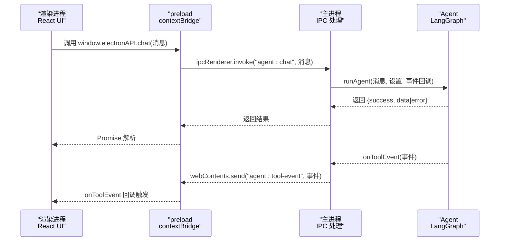
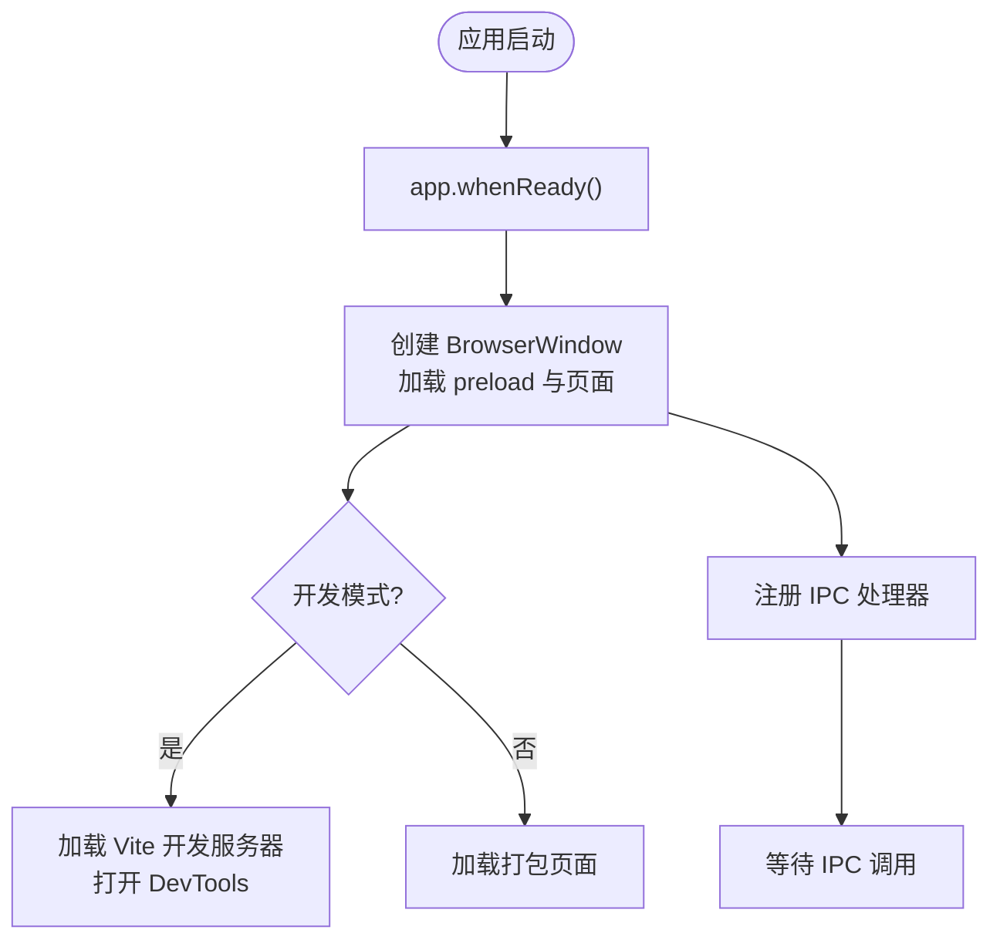
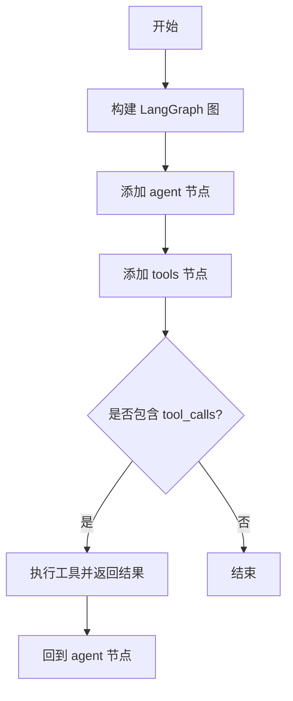
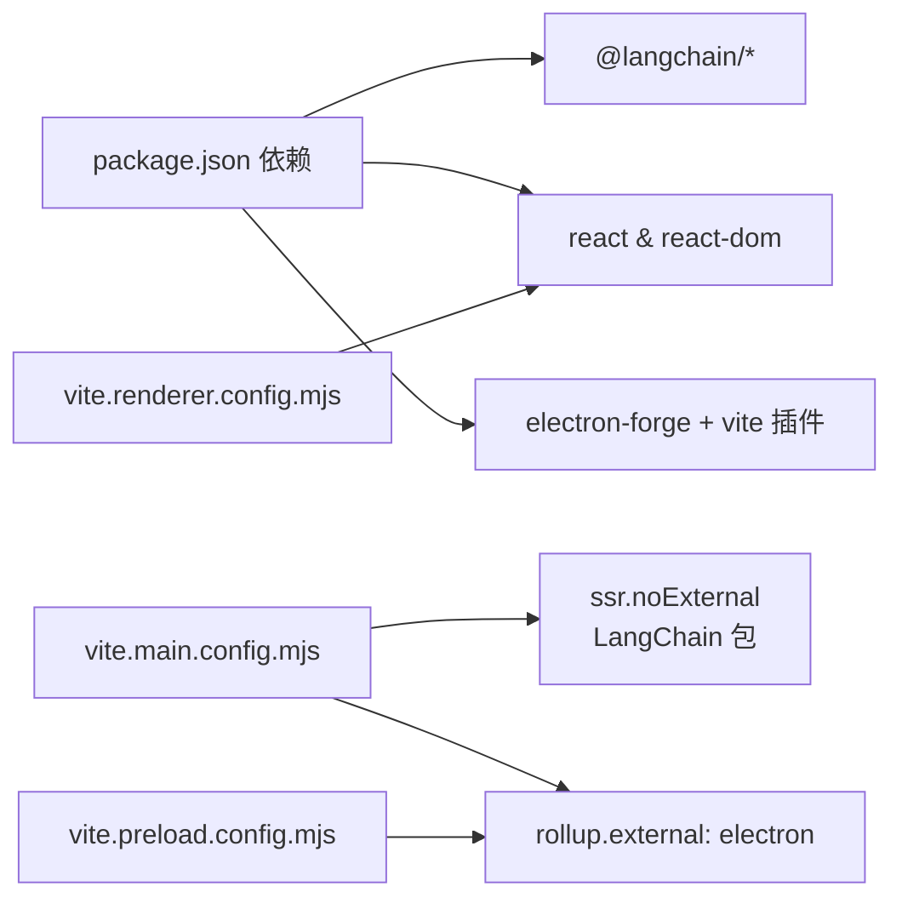

# 故障排除指南

<cite>
**本文引用的文件**
- [package.json](file://package.json)
- [forge.config.js](file://forge.config.js)
- [vite.main.config.mjs](file://vite.main.config.mjs)
- [vite.preload.config.mjs](file://vite.preload.config.mjs)
- [vite.renderer.config.mjs](file://vite.renderer.config.mjs)
- [tsconfig.json](file://tsconfig.json)
- [index.html](file://index.html)
- [src/main.ts](file://src/main.ts)
- [src/preload.ts](file://src/preload.ts)
- [src/agent.ts](file://src/agent.ts)
- [src/renderer/App.tsx](file://src/renderer/App.tsx)
- [src/renderer/components/ChatWindow.tsx](file://src/renderer/components/ChatWindow.tsx)
- [src/renderer/types.ts](file://src/renderer/types.ts)
- [src/renderer/main.tsx](file://src/renderer/main.tsx)
- [开发文档.md](file://开发文档.md)
</cite>

## 目录
1. [简介](#简介)
2. [项目结构](#项目结构)
3. [核心组件](#核心组件)
4. [架构总览](#架构总览)
5. [详细组件分析](#详细组件分析)
6. [依赖关系分析](#依赖关系分析)
7. [性能考虑](#性能考虑)
8. [故障排除指南](#故障排除指南)
9. [结论](#结论)
10. [附录](#附录)

## 简介
本指南面向技术支持团队与开发者，聚焦 langGraph 项目的常见问题与解决方案，覆盖 Electron 应用启动失败、IPC 通信错误、渲染器进程崩溃、开发环境问题、构建与打包失败、跨平台兼容性、权限与安全策略冲突、性能问题（内存泄漏与资源占用）、用户反馈分类与应急响应流程。文档结合实际源码与配置文件，提供可操作的诊断步骤与修复建议。

## 项目结构
项目采用 Electron + Vite + React + LangGraph 的桌面应用架构，主要由以下部分组成：
- 主进程：负责窗口创建、IPC 处理、设置持久化与 Agent 调用
- Preload：通过 contextBridge 暴露受控 API 至渲染进程
- 渲染进程：React 应用，负责 UI 与用户交互
- 构建配置：Vite 配置分别针对主进程、preload 与渲染进程；Electron Forge 负责打包与分发

```mermaid
graph TB
subgraph "渲染进程"
R_App["App.tsx<br/>React 根组件"]
R_Chat["ChatWindow.tsx<br/>聊天窗口"]
R_Types["types.ts<br/>类型定义"]
R_Index["index.html<br/>HTML 入口"]
end
subgraph "预加载"
P_Bridge["preload.ts<br/>contextBridge 暴露 API"]
end
subgraph "主进程"
M_Main["main.ts<br/>窗口与IPC"]
M_Agent["agent.ts<br/>LangGraph Agent"]
end
subgraph "构建配置"
V_Main["vite.main.config.mjs"]
V_Preload["vite.preload.config.mjs"]
V_Renderer["vite.renderer.config.mjs"]
F_Config["forge.config.js"]
TS_Config["tsconfig.json"]
end
R_App --> P_Bridge
R_Chat --> P_Bridge
P_Bridge <- --> M_Main
M_Main --> M_Agent
V_Main --> M_Main
V_Preload --> P_Bridge
V_Renderer --> R_App
F_Config --> M_Main
TS_Config --> R_App
```

**图表来源**
- [src/renderer/App.tsx](file://src/renderer/App.tsx)
- [src/renderer/components/ChatWindow.tsx](file://src/renderer/components/ChatWindow.tsx)
- [src/renderer/types.ts](file://src/renderer/types.ts)
- [index.html](file://index.html)
- [src/preload.ts](file://src/preload.ts)
- [src/main.ts](file://src/main.ts)
- [src/agent.ts](file://src/agent.ts)
- [vite.main.config.mjs](file://vite.main.config.mjs)
- [vite.preload.config.mjs](file://vite.preload.config.mjs)
- [vite.renderer.config.mjs](file://vite.renderer.config.mjs)
- [forge.config.js](file://forge.config.js)
- [tsconfig.json](file://tsconfig.json)

**章节来源**
- [开发文档.md](file://开发文档.md)
- [package.json](file://package.json)
- [forge.config.js](file://forge.config.js)
- [vite.main.config.mjs](file://vite.main.config.mjs)
- [vite.preload.config.mjs](file://vite.preload.config.mjs)
- [vite.renderer.config.mjs](file://vite.renderer.config.mjs)
- [tsconfig.json](file://tsconfig.json)
- [index.html](file://index.html)

## 核心组件
- 主进程窗口与 IPC
  - 创建 BrowserWindow，启用 contextIsolation 并加载 preload
  - 注册 IPC 处理器：代理对话、获取/保存设置
  - 将工具事件通过 send 推送至渲染进程
- Preload 桥接
  - 通过 contextBridge.exposeInMainWorld 暴露受控 API：chat、onToolEvent、getSettings、saveSettings
- Agent 逻辑
  - 基于 LangGraph 的状态图，支持 OpenAI/Ollama，内置工具集合
  - 通过 bindTools 将工具注入模型，实现 ReAct 推理循环
- 渲染进程
  - React 应用，监听工具事件，展示消息与工具调用过程
  - 通过 window.electronAPI 调用主进程能力

**章节来源**
- [src/main.ts](file://src/main.ts)
- [src/preload.ts](file://src/preload.ts)
- [src/agent.ts](file://src/agent.ts)
- [src/renderer/App.tsx](file://src/renderer/App.tsx)
- [src/renderer/types.ts](file://src/renderer/types.ts)

## 架构总览
Electron 应用采用“渲染进程（React）—preload（桥接）—主进程（Node.js）”三层架构，IPC 采用 invoke/handle 与 send/on 模式，确保安全性与实时性。



**图表来源**
- [src/renderer/App.tsx](file://src/renderer/App.tsx)
- [src/preload.ts](file://src/preload.ts)
- [src/main.ts](file://src/main.ts)
- [src/agent.ts](file://src/agent.ts)

## 详细组件分析

### 主进程（src/main.ts）
- 窗口创建与加载
  - 使用 webPreferences 启用 contextIsolation，禁用 nodeIntegration
  - 开发模式下加载 Vite 开发服务器并打开 DevTools
  - 生产模式下加载打包后的 index.html
- IPC 处理
  - agent:chat：调用 runAgent，捕获异常并返回结构化错误
  - settings:get/save：读写用户设置文件（userData 目录）
- 生命周期
  - app.whenReady 创建窗口
  - window-all-closed 触发 app.quit
  - activate 重建窗口



**图表来源**
- [src/main.ts](file://src/main.ts)

**章节来源**
- [src/main.ts](file://src/main.ts)

### Preload（src/preload.ts）
- 暴露 API
  - chat：调用 ipcRenderer.invoke('agent:chat')
  - onToolEvent：订阅 'agent:tool-event' 事件，返回取消订阅函数
  - getSettings/saveSettings：调用对应 IPC 处理器
- 安全性
  - 仅暴露必要 API，通过 contextBridge 暴露至 window.electronAPI

**章节来源**
- [src/preload.ts](file://src/preload.ts)
- [src/renderer/types.ts](file://src/renderer/types.ts)

### Agent（src/agent.ts）
- 状态图与节点
  - agentNode：调用 LLM 生成回复
  - toolsNode：遍历 tool_calls，执行工具并回传结果
  - 条件路由：根据是否有 tool_calls 决定下一步
- 工具系统
  - calculator、get_datetime、text_analysis、random_number
  - 通过 bindTools 注入模型，实现 ReAct 循环
- 错误处理
  - 工具执行异常时记录错误并继续流程



**图表来源**
- [src/agent.ts](file://src/agent.ts)

**章节来源**
- [src/agent.ts](file://src/agent.ts)

### 渲染进程（src/renderer/App.tsx 与 ChatWindow.tsx）
- 状态管理
  - messages：对话历史，包含工具调用与加载状态
  - settings：LLM 提供商、模型、API Key、Base URL、Temperature
- 事件监听
  - onToolEvent：实时更新最后一条加载中的助手消息的 toolEvents
- 发送消息
  - 调用 window.electronAPI.chat，更新助手消息内容与工具调用信息

**章节来源**
- [src/renderer/App.tsx](file://src/renderer/App.tsx)
- [src/renderer/components/ChatWindow.tsx](file://src/renderer/components/ChatWindow.tsx)
- [src/renderer/types.ts](file://src/renderer/types.ts)

## 依赖关系分析
- 构建与打包
  - Electron Forge + Vite 插件，分别构建 main、preload、renderer
  - 主进程对 Electron 保持外部化，LangChain/LangGraph 等包通过 noExternal 内联
- 运行时依赖
  - @langchain/langgraph、@langchain/core、@langchain/openai、@langchain/ollama、zod
  - React、ReactDOM、TypeScript



**图表来源**
- [package.json](file://package.json)
- [vite.main.config.mjs](file://vite.main.config.mjs)
- [vite.preload.config.mjs](file://vite.preload.config.mjs)
- [vite.renderer.config.mjs](file://vite.renderer.config.mjs)

**章节来源**
- [package.json](file://package.json)
- [vite.main.config.mjs](file://vite.main.config.mjs)
- [vite.preload.config.mjs](file://vite.preload.config.mjs)
- [vite.renderer.config.mjs](file://vite.renderer.config.mjs)

## 性能考虑
- 模块兼容与构建
  - 使用 ssr.noExternal 将 ESM-only 的 LangChain 包内联，避免 CJS/ESM 兼容问题
  - 主进程 external electron，减少打包体积
- IPC 与事件
  - 使用 invoke/handle 进行请求-响应，降低阻塞风险
  - 工具事件通过 send/on 推送，避免频繁轮询
- UI 与内存
  - React 状态管理合理拆分，避免不必要的重渲染
  - 工具事件累积在消息对象中，注意清理与上限控制

**章节来源**
- [vite.main.config.mjs](file://vite.main.config.mjs)
- [src/main.ts](file://src/main.ts)
- [src/preload.ts](file://src/preload.ts)
- [src/renderer/App.tsx](file://src/renderer/App.tsx)

## 故障排除指南

### 一、应用启动失败
- 症状
  - npm start 后窗口未显示或立即退出
- 诊断步骤
  - 检查主进程窗口创建与加载路径
    - 开发模式：确认 MAIN_WINDOW_VITE_DEV_SERVER_URL 是否正确
    - 生产模式：确认 index.html 与打包产物路径
  - 查看 DevTools 是否自动打开（开发模式）
  - 检查 app.whenReady 与 createWindow 是否执行
- 常见原因
  - Vite 开发服务器未启动或端口被占用
  - preload 路径错误或 contextIsolation 导致脚本加载失败
  - index.html 引入的入口脚本路径不正确
- 修复建议
  - 确认 index.html 中的 script 路径与实际构建产物一致
  - 检查 vite.renderer.config.mjs 与 vite.main.config.mjs 的入口配置
  - 在主进程开启 DevTools 便于定位问题

**章节来源**
- [src/main.ts](file://src/main.ts)
- [index.html](file://index.html)
- [vite.renderer.config.mjs](file://vite.renderer.config.mjs)
- [vite.main.config.mjs](file://vite.main.config.mjs)

### 二、IPC 通信错误
- 症状
  - 渲染进程调用 window.electronAPI.chat 无响应或报错
  - 工具事件未在 UI 中显示
- 诊断步骤
  - 确认 preload 是否成功暴露 electronAPI
  - 检查 ipcRenderer.invoke 与 ipcMain.handle 的通道名是否一致
  - 在主进程监听 'agent:tool-event' 并通过 webContents.send 推送
- 常见原因
  - 通道名拼写不一致
  - preload 未正确加载或 contextBridge 未生效
  - 事件监听未正确移除导致重复订阅
- 修复建议
  - 对照 preload.ts 与 main.ts 的 IPC 名称
  - 确保在渲染进程卸载时返回的取消函数被调用
  - 在主进程增加错误捕获并返回结构化错误对象

**章节来源**
- [src/preload.ts](file://src/preload.ts)
- [src/main.ts](file://src/main.ts)
- [src/renderer/App.tsx](file://src/renderer/App.tsx)

### 三、渲染器进程崩溃
- 症状
  - 页面白屏、JS 报错、工具事件不更新
- 诊断步骤
  - 打开 DevTools 查看 Console 与 Network
  - 检查 React 组件渲染与状态更新逻辑
  - 确认 onToolEvent 的回调是否正确触发
- 常见原因
  - 未正确处理异步调用状态（isLoading/isError）
  - 事件回调未在组件卸载时清理
  - 消息对象引用不当导致渲染异常
- 修复建议
  - 在 useEffect 返回中调用取消订阅
  - 合理设置消息对象的不可变更新
  - 对工具事件进行边界检查与长度限制

**章节来源**
- [src/renderer/App.tsx](file://src/renderer/App.tsx)
- [src/renderer/components/ChatWindow.tsx](file://src/renderer/components/ChatWindow.tsx)
- [src/preload.ts](file://src/preload.ts)

### 四、开发环境问题
- 症状
  - npm start 失败、HMR 不生效、TypeScript 类型报错
- 诊断步骤
  - 检查 Node.js 与 npm 版本是否满足要求
  - 确认 Vite 插件与配置文件存在且正确
  - 检查 tsconfig.json 的编译选项与路径映射
- 常见原因
  - 依赖未安装或版本不匹配
  - TypeScript 路径别名未生效
  - Vite 插件未正确注册
- 修复建议
  - 重新安装依赖并确保版本兼容
  - 确认 @vitejs/plugin-react 已启用
  - 检查 baseUrl 与 paths 配置

**章节来源**
- [开发文档.md](file://开发文档.md)
- [package.json](file://package.json)
- [tsconfig.json](file://tsconfig.json)
- [vite.renderer.config.mjs](file://vite.renderer.config.mjs)

### 五、构建与打包失败
- 症状
  - npm run make 失败、输出目录为空、安装包无法运行
- 诊断步骤
  - 检查 forge.config.js 的 makers 与 plugins 配置
  - 确认 vite.main.config.mjs 的 ssr.noExternal 是否包含 LangChain 包
  - 验证 asar 打包与 preload 路径
- 常见原因
  - ESM/CJS 模块兼容问题未解决
  - maker 配置缺失或平台不匹配
  - preload 未正确构建或路径错误
- 修复建议
  - 确保 noExternal 包含 @langchain/* 与 zod
  - 检查 makers 中的平台与名称配置
  - 清理缓存后重新构建

**章节来源**
- [forge.config.js](file://forge.config.js)
- [vite.main.config.mjs](file://vite.main.config.mjs)
- [package.json](file://package.json)

### 六、跨平台兼容性问题
- 症状
  - Windows 正常，其他平台行为异常
- 诊断步骤
  - 检查 makers 中 platforms 配置
  - 确认路径分隔符与大小写敏感性
- 修复建议
  - 使用相对路径与跨平台兼容的路径处理
  - 在非 Windows 平台测试并补充相应 maker

**章节来源**
- [forge.config.js](file://forge.config.js)

### 七、权限与安全策略冲突
- 症状
  - preload 无法暴露 API、contextIsolation 下脚本加载失败
- 诊断步骤
  - 确认 webPreferences 中 contextIsolation=true、nodeIntegration=false
  - 检查 preload 是否在窗口加载前执行
- 修复建议
  - 保持 contextIsolation 与 nodeIntegration 的安全配置
  - 通过 contextBridge 暴露受控 API

**章节来源**
- [src/main.ts](file://src/main.ts)
- [src/preload.ts](file://src/preload.ts)

### 八、性能问题、内存泄漏与资源占用过高
- 症状
  - CPU/内存持续升高、UI 卡顿
- 诊断步骤
  - 使用 DevTools 的 Performance 与 Memory 面板
  - 检查工具事件累积与消息列表增长
  - 监控 IPC 调用频率与 Agent 执行耗时
- 修复建议
  - 控制消息与事件数量上限，定期清理旧数据
  - 优化工具执行逻辑，避免阻塞主线程
  - 合理使用并发与节流策略

**章节来源**
- [src/renderer/App.tsx](file://src/renderer/App.tsx)
- [src/agent.ts](file://src/agent.ts)

### 九、用户反馈问题分类与应急响应
- 问题分类
  - 启动类：应用无法启动、黑屏、崩溃
  - 通信类：IPC 失败、工具事件丢失
  - 功能类：设置无效、模型调用失败
  - 性能类：卡顿、内存泄漏、CPU 占用高
- 应急响应流程
  - 快速复现并记录日志
  - 临时降级：关闭工具或切换模型
  - 热修复：修复 IPC 名称或 preload 路径
  - 发布补丁：重新打包并通知用户升级

**章节来源**
- [src/main.ts](file://src/main.ts)
- [src/preload.ts](file://src/preload.ts)
- [src/agent.ts](file://src/agent.ts)

## 结论
本指南基于实际源码与配置，提供了从启动、IPC、渲染、构建到性能与应急响应的全流程故障排除方法。建议在开发与运维过程中结合日志与 DevTools，按类别逐步定位问题，并优先保证安全与稳定性。

## 附录
- 常用命令
  - npm start：开发模式
  - npm run package：打包（不生成安装程序）
  - npm run make：生成安装包（Squirrel + ZIP）
  - npm run publish：发布（需配置）

**章节来源**
- [开发文档.md](file://开发文档.md)
- [package.json](file://package.json)