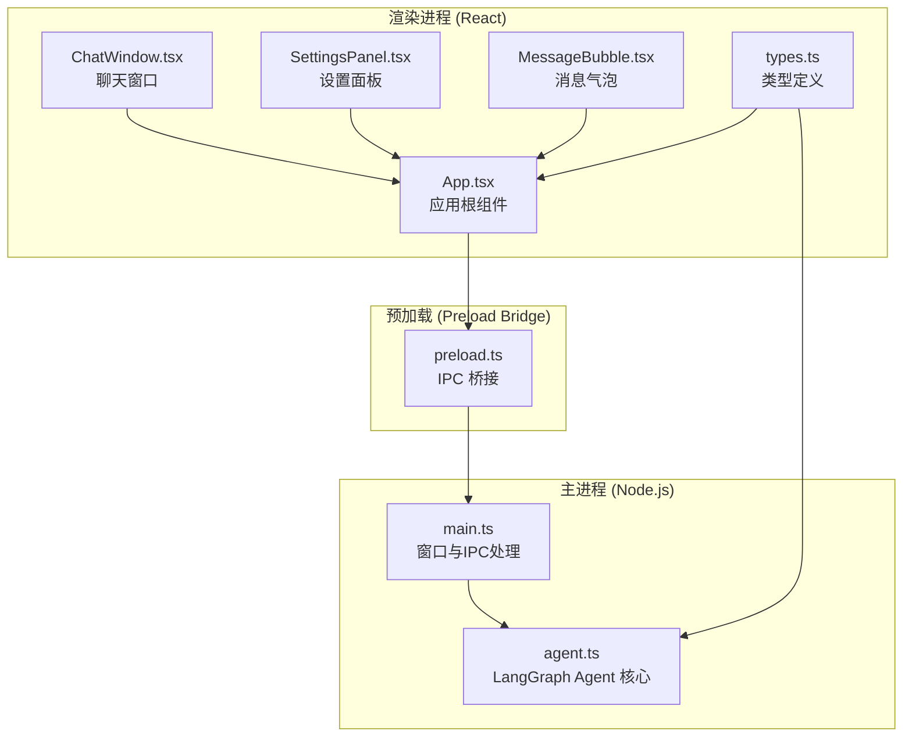
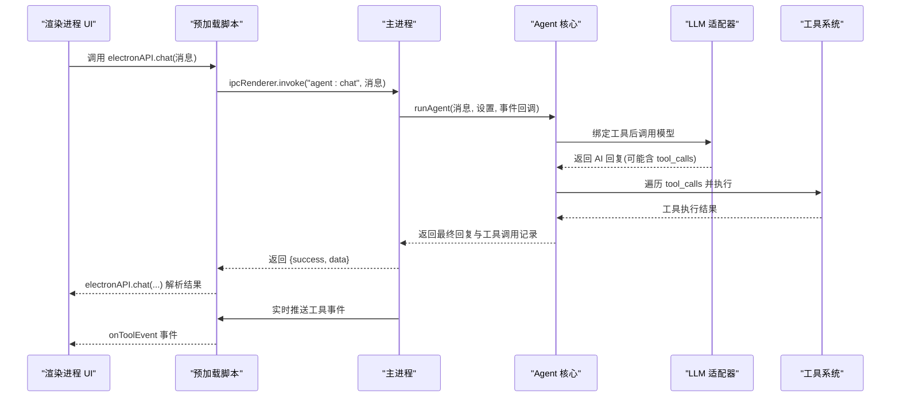
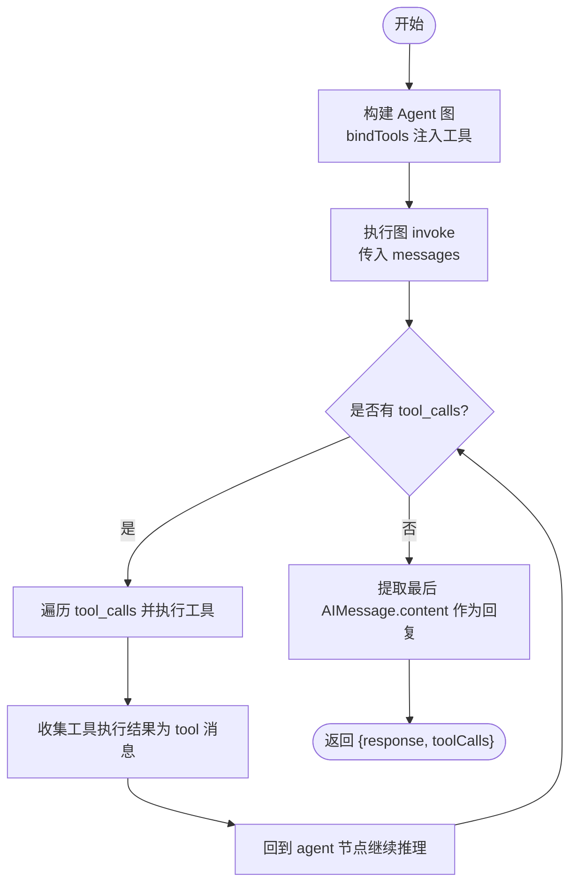
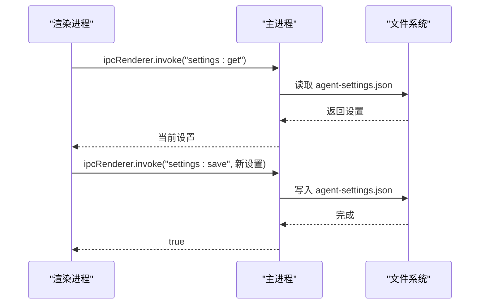
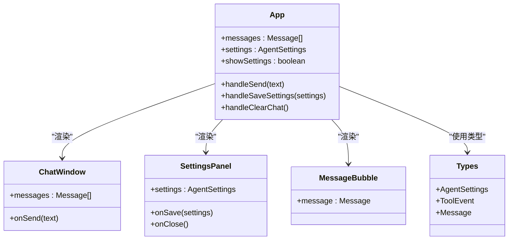
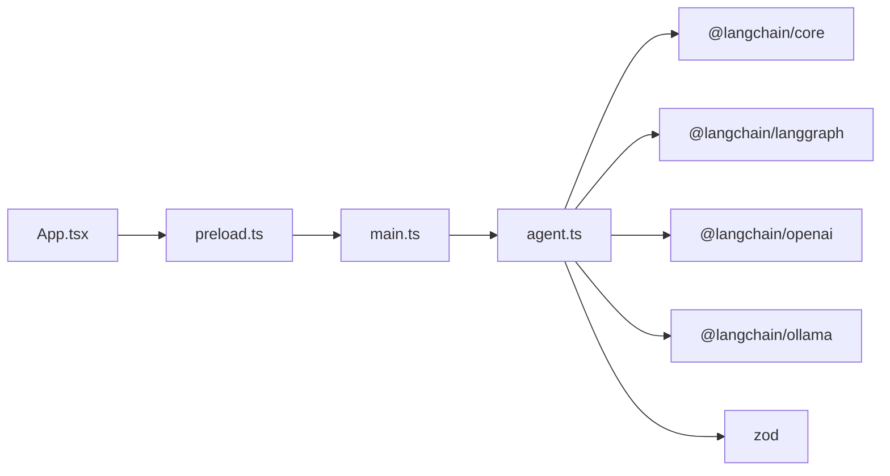

# AI 代理服务集成

<cite>
**本文引用的文件**
- [agent.ts](file://src/agent.ts)
- [main.ts](file://src/main.ts)
- [preload.ts](file://src/preload.ts)
- [App.tsx](file://src/renderer/App.tsx)
- [ChatWindow.tsx](file://src/renderer/components/ChatWindow.tsx)
- [SettingsPanel.tsx](file://src/renderer/components/SettingsPanel.tsx)
- [MessageBubble.tsx](file://src/renderer/components/MessageBubble.tsx)
- [types.ts](file://src/renderer/types.ts)
- [package.json](file://package.json)
- [开发文档.md](file://开发文档.md)
</cite>

## 目录
1. [简介](#简介)
2. [项目结构](#项目结构)
3. [核心组件](#核心组件)
4. [架构总览](#架构总览)
5. [详细组件分析](#详细组件分析)
6. [依赖关系分析](#依赖关系分析)
7. [性能考量](#性能考量)
8. [故障排查指南](#故障排查指南)
9. [结论](#结论)
10. [附录](#附录)

## 简介
本项目是一个基于 Electron + LangGraph 的桌面端 AI Agent 应用，支持通过 OpenAI 或本地 Ollama 驱动智能体，具备工具调用能力与实时工具事件展示。本文档围绕 agent.ts 模块展开，系统阐述其架构设计、AI 服务提供商集成（OpenAI、Ollama）、外部 API 调用机制、工具调用流程、消息处理管道、响应解析逻辑、配置项（温度、模型、基础 URL）的作用、错误处理策略、工具事件监听与实时通信实现，并提供扩展新 AI 服务提供商的指南与最佳实践。

## 项目结构
项目采用 Electron + Vite + React + TypeScript 的现代桌面应用架构：
- 主进程负责窗口管理、IPC 通信与持久化设置
- 预加载脚本通过 contextBridge 暴露受控 API
- 渲染进程负责 UI 与用户交互，调用预加载暴露的方法
- Agent 核心在主进程中运行，使用 LangGraph 构建状态图，结合 LangChain 的 LLM 适配器与工具系统

图表来源
- [main.ts:1-100](file://src/main.ts#L1-L100)
- [agent.ts:1-316](file://src/agent.ts#L1-L316)
- [preload.ts:1-18](file://src/preload.ts#L1-L18)
- [App.tsx:1-140](file://src/renderer/App.tsx#L1-L140)
- [ChatWindow.tsx:1-114](file://src/renderer/components/ChatWindow.tsx#L1-L114)
- [SettingsPanel.tsx:1-139](file://src/renderer/components/SettingsPanel.tsx#L1-L139)
- [MessageBubble.tsx:1-104](file://src/renderer/components/MessageBubble.tsx#L1-L104)
- [types.ts:1-49](file://src/renderer/types.ts#L1-L49)

章节来源
- [开发文档.md:152-190](file://开发文档.md#L152-L190)
- [package.json:1-36](file://package.json#L1-L36)

## 核心组件
- Agent 设置与类型
  - AgentSettings：包含 provider、apiKey、model、baseUrl、temperature
  - ToolEvent：工具调用事件（开始/结束）
  - Message/ToolCallInfo：前端消息与工具调用信息类型
- 工具系统
  - 内置工具：计算器、获取日期时间、文本分析、随机数
  - 工具参数使用 Zod Schema 校验
- LangGraph Agent 图
  - 状态：messages（BaseMessage[]）
  - 节点：agent（LLM）、tools（工具执行）
  - 条件路由：根据 LLM 是否返回 tool_calls 决定继续工具执行或结束
- LLM 模型接入
  - OpenAI：ChatOpenAI，支持自定义 baseURL
  - Ollama：ChatOllama，支持本地模型与自定义 baseUrl
  - 统一通过 bindTools 注入工具集合

章节来源
- [agent.ts:19-37](file://src/agent.ts#L19-L37)
- [agent.ts:43-137](file://src/agent.ts#L43-L137)
- [agent.ts:144-169](file://src/agent.ts#L144-L169)
- [agent.ts:171-262](file://src/agent.ts#L171-L262)
- [types.ts:2-49](file://src/renderer/types.ts#L2-L49)

## 架构总览
整体架构遵循 Electron 安全隔离原则：渲染进程仅通过预加载脚本暴露的 API 与主进程通信；主进程承载 Agent 逻辑与 LLM 调用；IPC 实时推送工具事件，前端即时展示。

图表来源
- [main.ts:65-84](file://src/main.ts#L65-L84)
- [agent.ts:279-315](file://src/agent.ts#L279-L315)
- [preload.ts:5-17](file://src/preload.ts#L5-L17)

## 详细组件分析

### Agent 核心模块（agent.ts）
- 类型与常量
  - AgentSettings：provider、apiKey、model、baseUrl、temperature
  - ToolEvent：type、toolName、input、output
  - AgentResult：response、toolCalls
- 工具定义
  - calculator：安全表达式校验与求值
  - get_datetime：获取 Asia/Shanghai 时区时间
  - text_analysis：统计字符、单词、行数、大小写、数字等
  - random_number：生成指定范围随机整数
  - 使用 Zod Schema 校验参数
- LangGraph Agent 图
  - 状态：messages（BaseMessage[]，reducer 追加）
  - 节点：
    - agentNode：调用 LLM，返回 AIMessage
    - toolsNode：遍历 AIMessage.tool_calls，执行对应工具，构造 tool 消息
  - 条件路由：若存在 tool_calls，则跳转 tools；否则结束
  - 编译为可执行图
- LLM 模型接入
  - OpenAI：ChatOpenAI，支持 apiKey 与自定义 baseURL
  - Ollama：ChatOllama，默认模型与 baseUrl
  - 统一通过 bindTools 注入工具集合
- 执行流程
  - runAgent：构建图、注入系统提示与用户消息、执行图、提取最后 AIMessage 的 content 作为回复，收集所有 tool_calls
  - 工具事件回调：在工具开始与结束时触发，传递给主进程并通过 IPC 推送到渲染进程

图表来源
- [agent.ts:171-262](file://src/agent.ts#L171-L262)
- [agent.ts:279-315](file://src/agent.ts#L279-L315)

章节来源
- [agent.ts:19-37](file://src/agent.ts#L19-L37)
- [agent.ts:43-137](file://src/agent.ts#L43-L137)
- [agent.ts:144-169](file://src/agent.ts#L144-L169)
- [agent.ts:171-262](file://src/agent.ts#L171-L262)
- [agent.ts:279-315](file://src/agent.ts#L279-L315)

### 主进程（main.ts）
- 设置持久化
  - 使用 Electron userData 目录存储 agent-settings.json
  - 默认设置：provider=openai、model=gpt-4o-mini、temperature=0.7
- IPC 处理
  - agent:chat：调用 runAgent，将工具事件通过 webContents.send 推送至渲染进程
  - settings:get/settings:save：读取/保存设置
- 生命周期
  - app.whenReady 创建窗口
  - window-all-closed 退出应用

图表来源
- [main.ts:14-31](file://src/main.ts#L14-L31)
- [main.ts:76-84](file://src/main.ts#L76-L84)

章节来源
- [main.ts:14-31](file://src/main.ts#L14-L31)
- [main.ts:65-84](file://src/main.ts#L65-L84)
- [main.ts:87-99](file://src/main.ts#L87-L99)

### 预加载脚本（preload.ts）
- 暴露 electronAPI：
  - chat：调用主进程 agent:chat
  - onToolEvent：订阅 agent:tool-event 事件，返回移除监听函数
  - getSettings/saveSettings：设置读取/保存
- 安全设计：contextBridge + contextIsolation，仅暴露必要 API

章节来源
- [preload.ts:1-18](file://src/preload.ts#L1-L18)

### 渲染进程（App.tsx、ChatWindow.tsx、SettingsPanel.tsx、MessageBubble.tsx）
- App.tsx
  - 管理 messages、settings、showSettings
  - 监听工具事件：将事件追加到正在加载的助手消息
  - 发送消息：添加用户消息与“正在思考”助手消息，调用 electronAPI.chat，更新助手消息内容与工具调用信息
  - 保存设置：调用 electronAPI.saveSettings
- ChatWindow.tsx
  - 输入框自动高度、回车发送、禁用发送期间的输入
  - 提供示例消息按钮
- SettingsPanel.tsx
  - 提供 provider、apiKey、model、baseUrl、temperature 的设置界面
  - 保存设置并关闭面板
- MessageBubble.tsx
  - 展示消息文本与时间戳
  - 将工具事件按 (tool_start, tool_end) 配对展示，支持展开/折叠

图表来源
- [App.tsx:1-140](file://src/renderer/App.tsx#L1-L140)
- [ChatWindow.tsx:1-114](file://src/renderer/components/ChatWindow.tsx#L1-L114)
- [SettingsPanel.tsx:1-139](file://src/renderer/components/SettingsPanel.tsx#L1-L139)
- [MessageBubble.tsx:1-104](file://src/renderer/components/MessageBubble.tsx#L1-L104)
- [types.ts:2-49](file://src/renderer/types.ts#L2-L49)

章节来源
- [App.tsx:17-94](file://src/renderer/App.tsx#L17-L94)
- [ChatWindow.tsx:29-49](file://src/renderer/components/ChatWindow.tsx#L29-L49)
- [SettingsPanel.tsx:10-139](file://src/renderer/components/SettingsPanel.tsx#L10-L139)
- [MessageBubble.tsx:13-28](file://src/renderer/components/MessageBubble.tsx#L13-L28)

## 依赖关系分析
- 依赖关系
  - main.ts 依赖 agent.ts 的 runAgent 与工具事件回调
  - preload.ts 依赖 main.ts 暴露的 IPC 处理
  - App.tsx 依赖 preload.ts 暴露的 electronAPI
  - agent.ts 依赖 @langchain/langgraph、@langchain/core、@langchain/openai、@langchain/ollama、zod
- 外部依赖
  - package.json 中声明 LangChain/LangGraph、React、Electron 等依赖

图表来源
- [main.ts:4](file://src/main.ts#L4)
- [agent.ts:1-15](file://src/agent.ts#L1-L15)
- [package.json:13-34](file://package.json#L13-L34)

章节来源
- [package.json:13-34](file://package.json#L13-L34)

## 性能考量
- 模型选择与温度
  - temperature 控制生成多样性；较低温度更稳定，较高温度更具创造性
  - 不同提供商默认模型不同，应根据场景选择合适模型
- 基础 URL 配置
  - OpenAI：可配置自定义 API 地址（兼容第三方服务）
  - Ollama：可配置本地服务地址
- 工具调用开销
  - 工具执行在主进程中同步进行，建议避免耗时过长的工具
- IPC 实时推送
  - 工具事件通过单向推送，前端即时展示，减少等待感

[本节为通用指导，不直接分析具体文件]

## 故障排查指南
- 无法连接 OpenAI
  - 检查 apiKey 是否正确，baseUrl 是否指向有效地址
  - 若使用自定义地址，确认网络可达与鉴权方式
- Ollama 未启动
  - 确认本地 Ollama 服务已启动，baseUrl 指向 http://localhost:11434
- 工具执行异常
  - 查看工具事件中的错误输出，定位具体工具与参数
  - 检查工具参数 Schema 是否匹配
- 设置未生效
  - 确认 settings:save 已成功写入 userData 目录
  - 重启应用后生效
- IPC 事件未到达
  - 确认 onToolEvent 订阅与移除监听逻辑正确
  - 检查主进程是否通过 webContents.send 推送事件

章节来源
- [main.ts:65-84](file://src/main.ts#L65-L84)
- [agent.ts:197-234](file://src/agent.ts#L197-L234)
- [App.tsx:24-41](file://src/renderer/App.tsx#L24-L41)

## 结论
本项目通过 Electron + LangGraph 的组合，实现了桌面端 AI Agent 的完整闭环：安全的进程隔离、声明式的 Agent 状态图、灵活的 LLM 提供商接入、完善的工具系统与实时事件展示。开发者可在此基础上快速扩展新工具、集成更多 LLM 提供商，并根据业务需求定制 Agent 的推理与记忆策略。

[本节为总结性内容，不直接分析具体文件]

## 附录

### API 调用示例（路径指引）
- 发送消息并获取结果
  - 渲染进程调用：[App.tsx:65](file://src/renderer/App.tsx#L65)
  - 预加载封装：[preload.ts:5](file://src/preload.ts#L5)
  - 主进程处理：[main.ts:65-74](file://src/main.ts#L65-L74)
  - Agent 执行：[agent.ts:279-315](file://src/agent.ts#L279-L315)
- 实时工具事件
  - 主进程推送：[main.ts:67-69](file://src/main.ts#L67-L69)
  - 预加载接收：[preload.ts:8-12](file://src/preload.ts#L8-L12)
  - 渲染进程订阅：[App.tsx:26-41](file://src/renderer/App.tsx#L26-L41)

### 错误处理策略
- 工具执行错误捕获
  - toolsNode 中对每个 tool_calls 的执行进行 try/catch，失败时仍构造 tool 消息并携带错误信息
- Agent 执行异常
  - 主进程 ipcMain.handle 捕获 runAgent 异常，返回 {success: false, error}
- 参数校验
  - 工具参数使用 Zod Schema 校验，避免无效输入导致执行失败

章节来源
- [agent.ts:197-234](file://src/agent.ts#L197-L234)
- [main.ts:71-73](file://src/main.ts#L71-L73)
- [agent.ts:58-64](file://src/agent.ts#L58-L64)

### 工具事件监听机制与实时通信
- 事件结构
  - ToolEvent：type（tool_start/tool_end）、toolName、input、output
- 事件流向
  - Agent 执行工具前后触发事件回调
  - 主进程通过 webContents.send 推送事件
  - 预加载脚本通过 ipcRenderer.on 接收
  - 渲染进程将事件追加到当前加载中的助手消息
- 事件配对
  - MessageBubble 将 (tool_start, tool_end) 按工具名配对展示

章节来源
- [agent.ts:197-234](file://src/agent.ts#L197-L234)
- [main.ts:67-69](file://src/main.ts#L67-L69)
- [preload.ts:8-12](file://src/preload.ts#L8-L12)
- [MessageBubble.tsx:13-28](file://src/renderer/components/MessageBubble.tsx#L13-L28)

### 扩展新 AI 服务提供商指南
- 步骤
  - 安装对应 LangChain 适配器（如 @langchain/anthropic、@langchain/google-genai 等）
  - 在 agent.ts 的 createModel 中新增分支，返回新的 ChatXxx 实例
  - 在 SettingsPanel.tsx 中增加 provider 选项与 UI
  - 在 App.tsx 的默认设置中补充默认值
- 最佳实践
  - 保持 provider 字段枚举与 UI 一致
  - 为新提供商提供合理的默认 model 与 baseUrl
  - 为新提供商提供必要的配置项（如 API Key）
  - 为新提供商编写测试用例与文档

章节来源
- [agent.ts:151-169](file://src/agent.ts#L151-L169)
- [SettingsPanel.tsx:30-54](file://src/renderer/components/SettingsPanel.tsx#L30-L54)
- [App.tsx:9-15](file://src/renderer/App.tsx#L9-L15)
- [开发文档.md:621-629](file://开发文档.md#L621-L629)