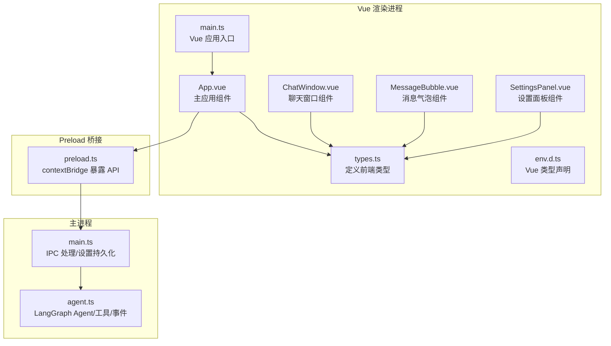
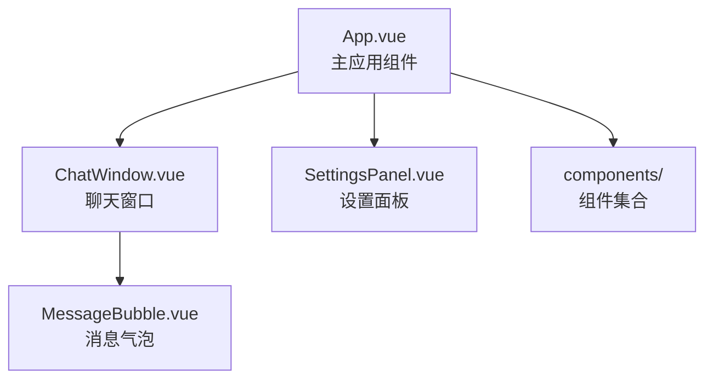
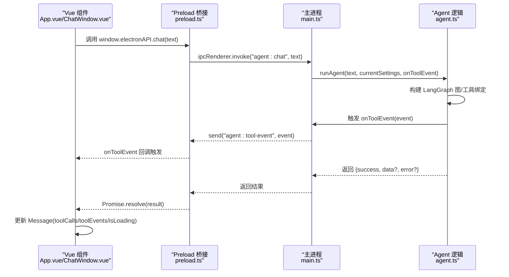
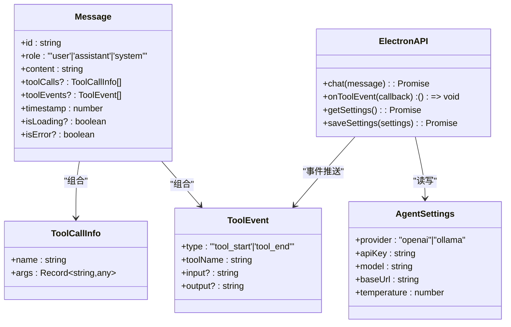
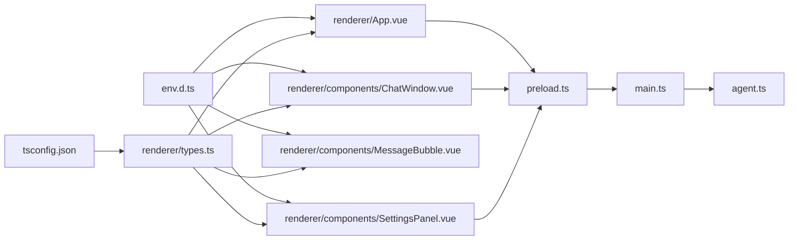

# TypeScript 类型系统

<cite>
**本文引用的文件**
- [tsconfig.json](file://tsconfig.json)
- [src/renderer/env.d.ts](file://src/renderer/env.d.ts)
- [src/renderer/types.ts](file://src/renderer/types.ts)
- [src/renderer/main.ts](file://src/renderer/main.ts)
- [src/renderer/App.vue](file://src/renderer/App.vue)
- [src/renderer/components/ChatWindow.vue](file://src/renderer/components/ChatWindow.vue)
- [src/renderer/components/MessageBubble.vue](file://src/renderer/components/MessageBubble.vue)
- [src/renderer/components/SettingsPanel.vue](file://src/renderer/components/SettingsPanel.vue)
- [src/agent.ts](file://src/agent.ts)
- [src/preload.ts](file://src/preload.ts)
- [src/main.ts](file://src/main.ts)
- [开发文档.md](file://开发文档.md)
- [package.json](file://package.json)
</cite>

## 更新摘要
**所做更改**
- 更新项目架构以反映从 React 到 Vue 的迁移
- 新增 Vue 单文件组件的类型系统文档
- 更新 TypeScript 配置以支持 Vue 组件开发
- 新增 env.d.ts 类型定义文件的详细说明
- 更新组件间通信和类型传递的最佳实践

## 目录
1. [简介](#简介)
2. [项目结构](#项目结构)
3. [核心类型定义](#核心类型定义)
4. [Vue 组件架构](#vue-组件架构)
5. [类型系统集成](#类型系统集成)
6. [架构总览](#架构总览)
7. [详细组件分析](#详细组件分析)
8. [依赖关系分析](#依赖关系分析)
9. [性能考量](#性能考量)
10. [故障排查指南](#故障排查指南)
11. [结论](#结论)
12. [附录](#附录)

## 简介
本文件系统化梳理 langGraph 项目的 TypeScript 类型体系，重点覆盖 Vue 单文件组件的类型声明与 Electron API 的安全封装。项目已完成从 React 到 Vue 的架构迁移，类型系统主要分布在：

- Vue 组件类型定义：src/renderer/types.ts
- Vue 应用入口：src/renderer/main.ts
- Vue 单文件组件：src/renderer/App.vue、src/renderer/components/*.vue
- TypeScript 配置：tsconfig.json、src/renderer/env.d.ts
- 主进程与 Agent 逻辑：src/agent.ts、src/main.ts
- Preload 桥接：src/preload.ts
- 开发文档与依赖：开发文档.md、package.json

我们将解释各类型的字段语义、数据类型约束、业务规则、继承与组合关系，并给出 Vue 组件开发的最佳实践、常见错误与使用示例路径。

## 项目结构
langGraph 采用 Electron + Vue + Vite 的前后端分离架构，类型系统主要分布在：

**图表来源**
- [src/renderer/main.ts:1-6](file://src/renderer/main.ts#L1-L6)
- [src/renderer/App.vue:1-131](file://src/renderer/App.vue#L1-L131)
- [src/renderer/components/ChatWindow.vue:1-128](file://src/renderer/components/ChatWindow.vue#L1-L128)
- [src/renderer/components/MessageBubble.vue:1-104](file://src/renderer/components/MessageBubble.vue#L1-L104)
- [src/renderer/components/SettingsPanel.vue:1-143](file://src/renderer/components/SettingsPanel.vue#L1-L143)
- [src/renderer/types.ts:1-51](file://src/renderer/types.ts#L1-L51)
- [src/renderer/env.d.ts:1-8](file://src/renderer/env.d.ts#L1-L8)
- [src/preload.ts:1-18](file://src/preload.ts#L1-L18)
- [src/main.ts:1-100](file://src/main.ts#L1-L100)
- [src/agent.ts:1-316](file://src/agent.ts#L1-L316)

**章节来源**
- [开发文档.md:152-190](file://开发文档.md#L152-L190)

## 核心类型定义
本节对核心类型进行逐项解析，包括字段含义、约束与业务规则。

### AgentSettings 类型
- 字段与约束
  - provider: 'openai' | 'ollama'
  - apiKey: string
  - model: string
  - baseUrl: string
  - temperature: number
- 业务规则
  - 当 provider 为 'ollama' 时，baseUrl 必须指向本地 Ollama 服务地址；temperature 控制采样多样性。
  - 当 provider 为 'openai' 时，apiKey 通常来自用户设置或环境变量；baseUrl 可选覆盖默认基础地址。
- 使用场景
  - 作为构建 LLM 模型的输入参数，贯穿主进程 IPC 处理与渲染进程设置面板。

### ToolEvent 类型
- 字段与约束
  - type: 'tool_start' | 'tool_end'
  - toolName: string
  - input?: string
  - output?: string
- 业务规则
  - 事件必须成对出现：先 tool_start，后 tool_end；input 与 output 为可选字符串，建议序列化为 JSON 字符串以便展示。
  - 主进程在工具执行前后触发事件，通过 IPC 推送给渲染进程。
- 使用场景
  - 渲染进程监听事件并更新 Message 的 toolEvents 属性，实现工具调用过程可视化。

### ToolCallInfo 类型
- 字段与约束
  - name: string
  - args: Record<string, any>
- 业务规则
  - args 为任意键值对，建议通过 Zod Schema 在 Agent 侧进行校验；args 由 LLM 工具调用生成。
- 使用场景
  - 作为 Message 的 toolCalls 字段元素，记录一次或多工具调用及其参数。

### Message 类型
- 字段与约束
  - id: string（唯一标识）
  - role: 'user' | 'assistant' | 'system'
  - content: string
  - toolCalls?: ToolCallInfo[]
  - toolEvents?: ToolEvent[]
  - timestamp: number
  - isLoading?: boolean（辅助 UI 状态）
  - isError?: boolean（辅助 UI 状态）
- 业务规则
  - role 为 'assistant' 且 isLoading 为真时，表示该消息正在等待 Agent 返回；isLoading 与 isError 仅用于 UI 状态标记。
  - toolCalls 与 toolEvents 分别记录工具调用的"意图"和"过程"，二者可独立存在。
- 使用场景
  - Vue 组件的消息列表数据结构，承载对话历史与工具调用可视化。

### ElectronAPI 接口
- 方法与返回
  - chat(message: string): Promise<{ success: boolean; data?: { response: string; toolCalls: ToolCallInfo[] }; error?: string }>
  - onToolEvent(callback: (event: ToolEvent) => void): () => void（返回移除监听器的函数）
  - getSettings(): Promise<AgentSettings>
  - saveSettings(settings: AgentSettings): Promise<boolean>
- 安全封装机制
  - 通过 preload.ts 使用 contextBridge.exposeInMainWorld 将 API 暴露到 window.electronAPI，避免渲染进程直接访问 Node.js。
  - IPC 采用 ipcRenderer.invoke/handle 的请求-响应模式，事件采用 ipcRenderer.on/send 的单向推送模式。
- 使用场景
  - Vue 组件通过 window.electronAPI 调用主进程能力，实现聊天、设置读写与工具事件监听。

**章节来源**
- [src/renderer/types.ts:1-51](file://src/renderer/types.ts#L1-L51)
- [src/agent.ts:19-37](file://src/agent.ts#L19-L37)
- [src/main.ts:65-84](file://src/main.ts#L65-L84)
- [src/preload.ts:3-17](file://src/preload.ts#L3-L17)

## Vue 组件架构
langGraph 的 Vue 组件采用单文件组件（SFC）格式，通过 Composition API 实现类型安全的组件开发。

### 组件层次结构

**图表来源**
- [src/renderer/App.vue:1-131](file://src/renderer/App.vue#L1-L131)
- [src/renderer/components/ChatWindow.vue:1-128](file://src/renderer/components/ChatWindow.vue#L1-L128)
- [src/renderer/components/MessageBubble.vue:1-104](file://src/renderer/components/MessageBubble.vue#L1-L104)
- [src/renderer/components/SettingsPanel.vue:1-143](file://src/renderer/components/SettingsPanel.vue#L1-L143)

### Vue 组件类型系统特点
- **Composition API**: 所有组件使用 `<script setup lang="ts">` 语法，提供更好的类型推断
- **Props 类型**: 使用 `defineProps<T>()` 函数定义组件属性类型
- **Emits 类型**: 使用 `defineEmits<T>()` 函数定义组件事件类型
- **响应式状态**: 使用 `ref<T>()` 和 `reactive<T>()` 管理组件状态
- **生命周期**: 使用 `onMounted`、`onUnmounted` 等生命周期钩子

**章节来源**
- [src/renderer/App.vue:1-131](file://src/renderer/App.vue#L1-L131)
- [src/renderer/components/ChatWindow.vue:1-128](file://src/renderer/components/ChatWindow.vue#L1-L128)
- [src/renderer/components/MessageBubble.vue:1-104](file://src/renderer/components/MessageBubble.vue#L1-L104)
- [src/renderer/components/SettingsPanel.vue:1-143](file://src/renderer/components/SettingsPanel.vue#L1-L143)

## 类型系统集成
Vue 组件与 TypeScript 类型系统的集成通过以下机制实现：

### TypeScript 配置更新
- **模块解析**: 使用 `moduleResolution: "bundler"` 支持 Vite 的模块解析
- **路径映射**: 通过 `baseUrl` 和 `paths` 配置 `@/*` 路径别名
- **Vue 支持**: 包含 `src/**/*.vue` 文件以支持 Vue 单文件组件类型检查
- **严格模式**: 启用 `strict` 模式确保类型安全

### Vue 类型声明
- **Vite 类型**: 通过 `/// <reference types="vite/client" />` 声明 Vite 环境类型
- **Vue 组件类型**: 使用 `DefineComponent` 类型定义 `.vue` 文件的默认导出
- **模块声明**: 通过 `declare module '*.vue'` 让 TypeScript 能识别 Vue 组件文件

### 组件间类型传递
- **Props 传递**: 父组件通过 props 将类型化的数据传递给子组件
- **事件发射**: 子组件通过 emits 定义事件类型，确保事件数据的类型安全
- **状态共享**: 通过响应式引用在组件间共享类型化的状态

**章节来源**
- [tsconfig.json:1-22](file://tsconfig.json#L1-L22)
- [src/renderer/env.d.ts:1-8](file://src/renderer/env.d.ts#L1-L8)
- [src/renderer/App.vue:1-131](file://src/renderer/App.vue#L1-L131)
- [src/renderer/components/ChatWindow.vue:1-128](file://src/renderer/components/ChatWindow.vue#L1-L128)

## 架构总览
Electron 进程间通信与 Vue 组件类型安全的总体流程如下：

**图表来源**
- [src/renderer/App.vue:41-77](file://src/renderer/App.vue#L41-L77)
- [src/preload.ts:5-16](file://src/preload.ts#L5-L16)
- [src/main.ts:65-84](file://src/main.ts#L65-L84)
- [src/agent.ts:171-262](file://src/agent.ts#L171-L262)

## 详细组件分析

### 类型关系与组合模式
- **组合关系**
  - Message 组合 ToolCallInfo 与 ToolEvent，分别记录"意图"和"过程"。
  - ElectronAPI 封装了与主进程交互的所有方法，Vue 组件通过它访问 Agent 与设置。
- **继承关系**
  - 本项目未使用 TypeScript 类继承，而是通过接口组合实现类型复用与扩展。
- **数据一致性**
  - ToolEvent 的 type 必须为 'tool_start' 或 'tool_end'，且应成对出现；Vue 组件通过查找最近的 isLoading assistant 消息来追加 toolEvents，保证展示顺序与一致性。

**图表来源**
- [src/renderer/types.ts:2-42](file://src/renderer/types.ts#L2-L42)

**章节来源**
- [src/renderer/types.ts:1-51](file://src/renderer/types.ts#L1-L51)

### Vue 组件类型安全实践
- **Props 类型定义**: 使用 `defineProps<T>()` 确保组件接收的数据类型正确
- **Emits 类型定义**: 使用 `defineEmits<T>()` 确保组件发出的事件数据类型正确
- **响应式状态管理**: 使用 `ref<T>()` 和 `reactive<T>()` 管理具有明确类型的组件状态
- **生命周期钩子**: 使用正确的生命周期钩子类型，如 `onMounted`、`onUnmounted`
- **事件处理**: 在事件处理器中使用类型化的参数，如 `(event: ToolEvent) => void`

### 全局类型声明与 Electron API 安全封装
- **全局声明**
  - 在 src/renderer/types.ts 中通过 declare global 为 window.electronAPI 声明类型，确保 Vue 组件访问时具备类型推断。
- **安全封装**
  - preload.ts 使用 contextBridge.exposeInMainWorld 暴露受控 API，仅暴露必要方法，避免渲染进程直接访问 Node.js。
  - IPC 采用 invoke/handle 与 on/send 的模式，既保证类型安全，又满足实时事件推送需求。
- **Vue 集成**
  - Vue 组件通过 `window.electronAPI` 访问 Electron API，类型系统确保调用的类型安全。

**章节来源**
- [src/renderer/types.ts:44-51](file://src/renderer/types.ts#L44-L51)
- [src/preload.ts:1-18](file://src/preload.ts#L1-L18)
- [package.json:22-34](file://package.json#L22-L34)

### 使用示例与最佳实践
- **Vue 组件中使用 Message**
  - 在 App.vue 中使用 `ref<Message[]>` 管理消息列表状态
  - 通过 props 将消息传递给 MessageBubble 组件
  - 示例路径参考：[src/renderer/App.vue:7-77](file://src/renderer/App.vue#L7-L77)、[src/renderer/components/MessageBubble.vue:5-7](file://src/renderer/components/MessageBubble.vue#L5-L7)
- **Vue 组件中使用 ToolEvent**
  - 在 App.vue 的 onMounted 生命周期中注册 onToolEvent 监听
  - 使用响应式引用管理清理函数
  - 示例路径参考：[src/renderer/App.vue:20-39](file://src/renderer/App.vue#L20-L39)
- **Vue 组件中使用 ToolCallInfo**
  - 从 chat 返回结果提取 toolCalls 并赋值到对应 Message 的 toolCalls 字段
  - 示例路径参考：[src/renderer/App.vue:67-75](file://src/renderer/App.vue#L67-L75)
- **Vue 组件中使用 ElectronAPI**
  - 通过 `window.electronAPI.chat` 发起请求
  - 通过 `onToolEvent` 订阅工具事件
  - 通过 `getSettings`/`saveSettings` 管理设置
  - 示例路径参考：[src/renderer/App.vue:21-22](file://src/renderer/App.vue#L21-L22)、[src/renderer/App.vue:62](file://src/renderer/App.vue#L62)

**章节来源**
- [src/renderer/App.vue:1-131](file://src/renderer/App.vue#L1-L131)

### 错误处理与边界条件
- **AgentSettings**
  - provider 与 baseUrl 的组合：当 provider 为 'ollama' 时，baseUrl 必须有效；否则 LLM 初始化失败。
  - temperature 为浮点数，建议在合理区间内（如 0~1），过高可能导致输出不稳定。
- **ToolEvent**
  - 成对出现：若缺少 tool_end，UI 可能持续显示"加载中"。建议在主进程异常分支也触发 tool_end，确保事件闭合。
  - input/output 建议序列化为 JSON 字符串，便于 UI 展示与调试。
- **Message**
  - isLoading 与 isError 仅用于 UI 状态，不应影响消息内容的持久化；实际持久化应以 content、toolCalls、toolEvents 为准。
- **ElectronAPI**
  - onToolEvent 返回的清理函数应在组件卸载时调用，避免内存泄漏。
  - chat 返回的 error 字段应被 UI 显示为错误提示，同时将 isError 标记为 true。
- **Vue 组件**
  - Props 类型不匹配会导致编译错误，应确保父组件传递的数据符合子组件的类型定义。
  - Emits 类型不匹配会阻止事件正确触发，应确保事件数据符合定义的类型。

**章节来源**
- [src/agent.ts:197-234](file://src/agent.ts#L197-L234)
- [src/main.ts:67-73](file://src/main.ts#L67-L73)
- [src/renderer/App.vue:20-39](file://src/renderer/App.vue#L20-L39)

## 依赖关系分析
- **类型依赖**
  - Vue 组件类型定义集中于 src/renderer/types.ts，被所有 Vue 组件引用。
  - TypeScript 配置文件 tsconfig.json 支持 Vue 单文件组件的类型检查。
  - env.d.ts 为 Vue 组件提供必要的类型声明。
- **IPC 依赖**
  - preload.ts 仅暴露 ElectronAPI，屏蔽底层 ipcRenderer 的细节。
  - main.ts 通过 ipcMain.handle 注册处理器，调用 agent.ts 的 runAgent 并转发工具事件。
- **第三方依赖**
  - @langchain/langgraph、@langchain/core、@langchain/openai、@langchain/ollama、zod 等为 Agent 与工具定义提供类型与运行时支持。
  - Vue 3.4+ 提供 Composition API 和更好的 TypeScript 支持。

**图表来源**
- [tsconfig.json:1-22](file://tsconfig.json#L1-L22)
- [src/renderer/env.d.ts:1-8](file://src/renderer/env.d.ts#L1-L8)
- [src/renderer/types.ts:1-51](file://src/renderer/types.ts#L1-L51)
- [src/renderer/App.vue:1-131](file://src/renderer/App.vue#L1-L131)
- [src/renderer/components/ChatWindow.vue:1-128](file://src/renderer/components/ChatWindow.vue#L1-L128)
- [src/renderer/components/MessageBubble.vue:1-104](file://src/renderer/components/MessageBubble.vue#L1-L104)
- [src/renderer/components/SettingsPanel.vue:1-143](file://src/renderer/components/SettingsPanel.vue#L1-L143)
- [src/preload.ts:1-18](file://src/preload.ts#L1-L18)
- [src/main.ts:1-100](file://src/main.ts#L1-L100)
- [src/agent.ts:1-316](file://src/agent.ts#L1-L316)

**章节来源**
- [package.json:13-34](file://package.json#L13-L34)

## 性能考量
- **类型安全带来的收益**
  - 通过明确的接口约束，减少运行时错误，降低调试成本。
  - Vue 的 Composition API 提供更好的 Tree-shaking 支持。
- **IPC 与事件推送**
  - onToolEvent 采用单向推送，避免频繁轮询；chat 采用请求-响应，适合一次性交互。
- **UI 渲染优化**
  - Vue 的响应式系统比 React 更细粒度的状态更新，减少不必要的重渲染。
  - Message 的 isLoading/isError 仅用于 UI 状态，不会参与复杂计算。
  - toolEvents/toolCalls 的增量更新可减少不必要的重渲染。
- **构建优化**
  - Vite 提供更快的开发服务器启动和热重载。
  - TypeScript 编译器选项优化了构建性能。

## 故障排查指南
- **Vue 组件无法访问 window.electronAPI**
  - 检查 preload.ts 是否成功通过 contextBridge.exposeInMainWorld 暴露 API。
  - 确认主进程 BrowserWindow 的 webPreferences 中启用了 contextIsolation。
  - 验证 env.d.ts 是否正确声明了 Vue 组件类型。
- **工具事件未显示**
  - 确认主进程在工具执行前后均触发 onToolEvent，并通过 IPC 推送。
  - 确认 Vue 组件在 onMounted 中正确注册 onToolEvent 并在 onUnmounted 时返回清理函数。
- **设置保存无效**
  - 确认 main.ts 的 settings:get/settings:save 处理器正常工作，并持久化到 userData 目录。
- **LLM 初始化失败**
  - 检查 AgentSettings 的 provider 与 baseUrl 组合是否正确；OpenAI 需要有效的 apiKey 或环境变量。
- **Vue 组件类型错误**
  - 检查 tsconfig.json 配置是否正确包含 Vue 文件。
  - 确认 env.d.ts 是否正确定义了 Vue 组件类型。
  - 验证组件 props 和 emits 的类型定义是否与父组件传递的数据匹配。

**章节来源**
- [src/preload.ts:3-17](file://src/preload.ts#L3-L17)
- [src/main.ts:14-31](file://src/main.ts#L14-L31)
- [src/agent.ts:151-169](file://src/agent.ts#L151-L169)
- [tsconfig.json:19](file://tsconfig.json#L19)
- [src/renderer/env.d.ts:3-7](file://src/renderer/env.d.ts#L3-L7)

## 结论
langGraph 的 TypeScript 类型系统已成功从 React 迁移到 Vue，通过"Vue 单文件组件 + TypeScript 类型定义 + Electron 安全桥接 + 主进程 IPC 处理"的方式，实现了更加现代化、类型安全且高效的开发体验。新的架构利用 Vue 3.4+ 的 Composition API 和更好的 TypeScript 支持，结合 Vite 的快速开发体验，为开发者提供了清晰、可维护且安全的类型契约。

通过明确的字段约束、事件成对规则与 UI 状态标记，开发者可以在 Electron + LangGraph 的复杂场景中快速定位问题、扩展功能并保持良好的用户体验。建议在新增 Vue 组件或修改 IPC 时，同步更新类型定义与主进程处理逻辑，确保类型一致性与安全性。

## 附录
- **相关实现路径**
  - TypeScript 配置：[tsconfig.json:1-22](file://tsconfig.json#L1-L22)
  - Vue 类型声明：[src/renderer/env.d.ts:1-8](file://src/renderer/env.d.ts#L1-L8)
  - 前端类型定义：[src/renderer/types.ts:1-51](file://src/renderer/types.ts#L1-L51)
  - Vue 应用入口：[src/renderer/main.ts:1-6](file://src/renderer/main.ts#L1-L6)
  - Vue 组件实现：[src/renderer/App.vue:1-131](file://src/renderer/App.vue#L1-L131)、[src/renderer/components/ChatWindow.vue:1-128](file://src/renderer/components/ChatWindow.vue#L1-L128)、[src/renderer/components/MessageBubble.vue:1-104](file://src/renderer/components/MessageBubble.vue#L1-L104)、[src/renderer/components/SettingsPanel.vue:1-143](file://src/renderer/components/SettingsPanel.vue#L1-L143)
  - Preload 桥接：[src/preload.ts:1-18](file://src/preload.ts#L1-L18)
  - 主进程 IPC 与设置持久化：[src/main.ts:1-100](file://src/main.ts#L1-L100)
  - Agent 与工具定义：[src/agent.ts:1-316](file://src/agent.ts#L1-L316)
  - 开发文档与技术选型：[开发文档.md:1-672](file://开发文档.md#L1-L672)
  - 依赖与版本：[package.json:1-36](file://package.json#L1-L36)