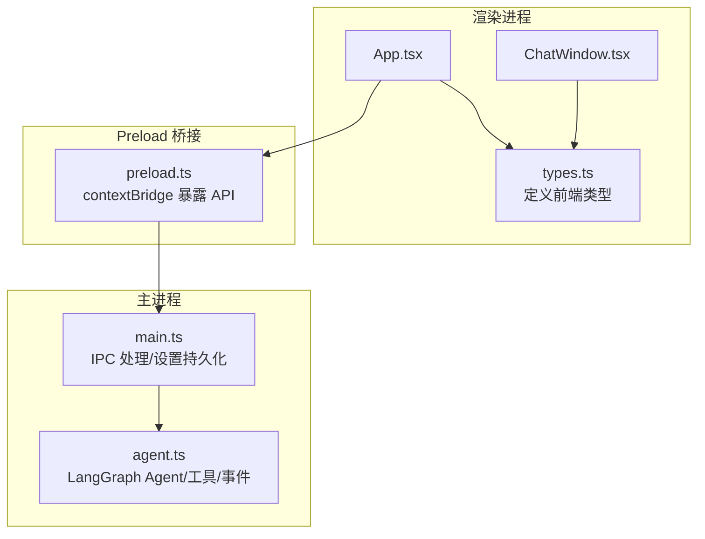
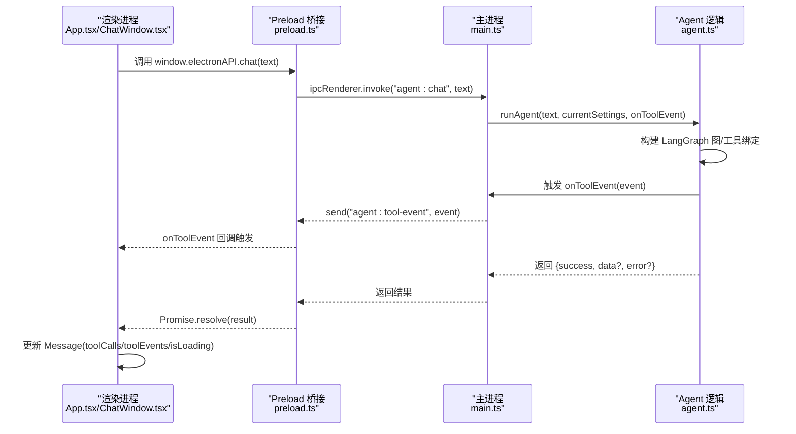
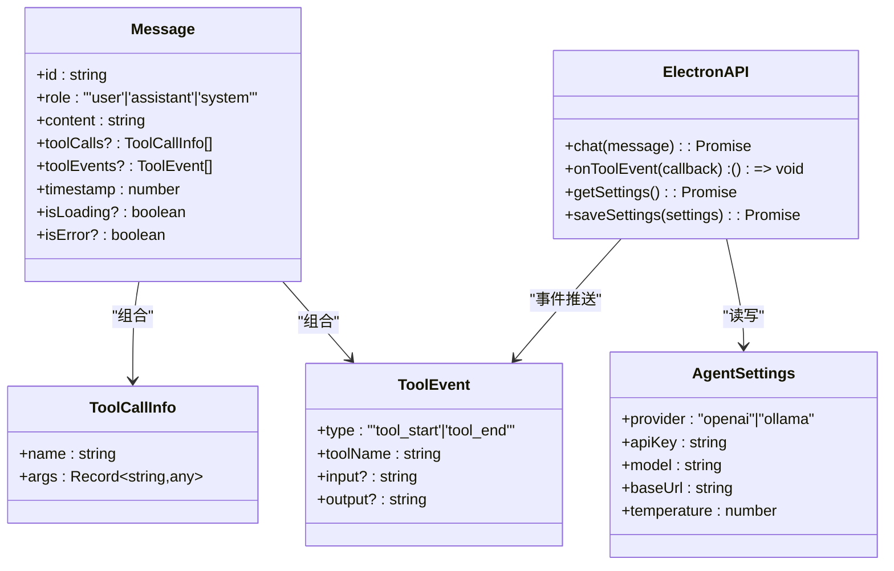
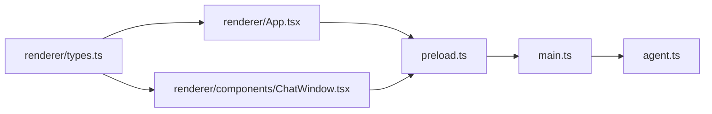

# TypeScript 类型系统

<cite>
**本文引用的文件**
- [src/renderer/types.ts](file://src/renderer/types.ts)
- [src/agent.ts](file://src/agent.ts)
- [src/preload.ts](file://src/preload.ts)
- [src/main.ts](file://src/main.ts)
- [src/renderer/App.tsx](file://src/renderer/App.tsx)
- [src/renderer/components/ChatWindow.tsx](file://src/renderer/components/ChatWindow.tsx)
- [开发文档.md](file://开发文档.md)
- [package.json](file://package.json)
</cite>

## 目录
1. [简介](#简介)
2. [项目结构](#项目结构)
3. [核心类型定义](#核心类型定义)
4. [架构总览](#架构总览)
5. [详细组件分析](#详细组件分析)
6. [依赖关系分析](#依赖关系分析)
7. [性能考量](#性能考量)
8. [故障排查指南](#故障排查指南)
9. [结论](#结论)
10. [附录](#附录)

## 简介
本文件系统化梳理 langGraph 项目的 TypeScript 类型体系，重点覆盖前端类型声明与 Electron API 的安全封装。文档围绕以下核心类型展开：
- AgentSettings：智能体配置
- ToolEvent：工具调用事件
- ToolCallInfo：工具调用信息
- Message：消息模型
- ElectronAPI：渲染进程与主进程之间的安全 API

我们将解释各类型的字段语义、数据类型约束、业务规则、继承与组合关系，并给出最佳实践、常见错误与使用示例路径，帮助开发者在 Electron + LangGraph 场景下高效、安全地使用类型系统。

## 项目结构
langGraph 采用 Electron + React + Vite 的前后端分离架构，类型系统主要分布在：
- 前端类型定义：src/renderer/types.ts
- 主进程与 Agent 逻辑：src/agent.ts、src/main.ts
- Preload 桥接：src/preload.ts
- 前端组件使用：src/renderer/App.tsx、src/renderer/components/ChatWindow.tsx
- 开发文档与依赖：开发文档.md、package.json

图表来源
- [src/renderer/App.tsx:1-140](file://src/renderer/App.tsx#L1-L140)
- [src/renderer/components/ChatWindow.tsx:1-114](file://src/renderer/components/ChatWindow.tsx#L1-L114)
- [src/renderer/types.ts:1-49](file://src/renderer/types.ts#L1-L49)
- [src/preload.ts:1-18](file://src/preload.ts#L1-L18)
- [src/main.ts:1-100](file://src/main.ts#L1-L100)
- [src/agent.ts:1-316](file://src/agent.ts#L1-L316)

章节来源
- [开发文档.md:152-190](file://开发文档.md#L152-L190)

## 核心类型定义
本节对核心类型进行逐项解析，包括字段含义、约束与业务规则。

- AgentSettings
  - 字段与约束
    - provider: 'openai' | 'ollama'
    - apiKey: string
    - model: string
    - baseUrl: string
    - temperature: number
  - 业务规则
    - 当 provider 为 'ollama' 时，baseUrl 必须指向本地 Ollama 服务地址；temperature 控制采样多样性。
    - 当 provider 为 'openai' 时，apiKey 通常来自用户设置或环境变量；baseUrl 可选覆盖默认基础地址。
  - 使用场景
    - 作为构建 LLM 模型的输入参数，贯穿主进程 IPC 处理与渲染进程设置面板。

- ToolEvent
  - 字段与约束
    - type: 'tool_start' | 'tool_end'
    - toolName: string
    - input?: string
    - output?: string
  - 业务规则
    - 事件必须成对出现：先 tool_start，后 tool_end；input 与 output 为可选字符串，建议序列化为 JSON 字符串以便展示。
    - 主进程在工具执行前后触发事件，通过 IPC 推送给渲染进程。
  - 使用场景
    - 渲染进程监听事件并更新 Message 的 toolEvents 属性，实现工具调用过程可视化。

- ToolCallInfo
  - 字段与约束
    - name: string
    - args: Record<string, any>
  - 业务规则
    - args 为任意键值对，建议通过 Zod Schema 在 Agent 侧进行校验；args 由 LLM 工具调用生成。
  - 使用场景
    - 作为 Message 的 toolCalls 字段元素，记录一次或多工具调用及其参数。

- Message
  - 字段与约束
    - id: string（唯一标识）
    - role: 'user' | 'assistant' | 'system'
    - content: string
    - toolCalls?: ToolCallInfo[]
    - toolEvents?: ToolEvent[]
    - timestamp: number
    - isLoading?: boolean（辅助 UI 状态）
    - isError?: boolean（辅助 UI 状态）
  - 业务规则
    - role 为 'assistant' 且 isLoading 为真时，表示该消息正在等待 Agent 返回；isLoading 与 isError 仅用于 UI 状态标记。
    - toolCalls 与 toolEvents 分别记录工具调用的“意图”和“过程”，二者可独立存在。
  - 使用场景
    - 渲染进程的消息列表数据结构，承载对话历史与工具调用可视化。

- ElectronAPI
  - 方法与返回
    - chat(message: string): Promise<{ success: boolean; data?: { response: string; toolCalls: ToolCallInfo[] }; error?: string }>
    - onToolEvent(callback: (event: ToolEvent) => void): () => void（返回移除监听器的函数）
    - getSettings(): Promise<AgentSettings>
    - saveSettings(settings: AgentSettings): Promise<boolean>
  - 安全封装机制
    - 通过 preload.ts 使用 contextBridge.exposeInMainWorld 将 API 暴露到 window.electronAPI，避免渲染进程直接访问 Node.js。
    - IPC 采用 ipcRenderer.invoke/handle 的请求-响应模式，事件采用 ipcRenderer.on/send 的单向推送模式。
  - 使用场景
    - 渲染进程通过 window.electronAPI 调用主进程能力，实现聊天、设置读写与工具事件监听。

章节来源
- [src/renderer/types.ts:1-49](file://src/renderer/types.ts#L1-L49)
- [src/agent.ts:19-37](file://src/agent.ts#L19-L37)
- [src/main.ts:65-84](file://src/main.ts#L65-L84)
- [src/preload.ts:3-17](file://src/preload.ts#L3-L17)

## 架构总览
Electron 进程间通信与类型安全的总体流程如下：

图表来源
- [src/renderer/App.tsx:43-84](file://src/renderer/App.tsx#L43-L84)
- [src/preload.ts:5-16](file://src/preload.ts#L5-L16)
- [src/main.ts:65-84](file://src/main.ts#L65-L84)
- [src/agent.ts:171-262](file://src/agent.ts#L171-L262)

## 详细组件分析

### 类型关系与组合模式
- 组合关系
  - Message 组合 ToolCallInfo 与 ToolEvent，分别记录“意图”和“过程”。
  - ElectronAPI 封装了与主进程交互的所有方法，渲染进程通过它访问 Agent 与设置。
- 继承关系
  - 本项目未使用 TypeScript 类继承，而是通过接口组合实现类型复用与扩展。
- 数据一致性
  - ToolEvent 的 type 必须为 'tool_start' 或 'tool_end'，且应成对出现；UI 通过查找最近的 isLoading assistant 消息来追加 toolEvents，保证展示顺序与一致性。

图表来源
- [src/renderer/types.ts:2-42](file://src/renderer/types.ts#L2-L42)
- [src/renderer/App.tsx:6-15](file://src/renderer/App.tsx#L6-L15)

章节来源
- [src/renderer/types.ts:1-49](file://src/renderer/types.ts#L1-L49)

### 全局类型声明与 Electron API 安全封装
- 全局声明
  - 在 src/renderer/types.ts 中通过 declare global 为 window.electronAPI 声明类型，确保渲染进程访问时具备类型推断。
- 安全封装
  - preload.ts 使用 contextBridge.exposeInMainWorld 暴露受控 API，仅暴露必要方法，避免渲染进程直接访问 Node.js。
  - IPC 采用 invoke/handle 与 on/send 的模式，既保证类型安全，又满足实时事件推送需求。
- 依赖与版本
  - 项目依赖 @types/node、@types/react、@types/react-dom，确保 TS 在渲染进程与主进程均有良好类型支持。

章节来源
- [src/renderer/types.ts:44-48](file://src/renderer/types.ts#L44-L48)
- [src/preload.ts:1-18](file://src/preload.ts#L1-L18)
- [package.json:22-34](file://package.json#L22-L34)

### 使用示例与最佳实践
- 正确使用 Message
  - 添加用户消息与加载中的助手消息，随后根据 chat 返回结果更新 assistant 消息的 content、toolCalls、isLoading 与 isError。
  - 示例路径参考：[src/renderer/App.tsx:43-84](file://src/renderer/App.tsx#L43-L84)
- 正确使用 ToolEvent
  - 在渲染进程 useEffect 中注册 onToolEvent 监听，找到最近的 isLoading assistant 消息并追加 toolEvents。
  - 示例路径参考：[src/renderer/App.tsx:24-41](file://src/renderer/App.tsx#L24-L41)
- 正确使用 ToolCallInfo
  - 从 chat 返回结果提取 toolCalls 并赋值到对应 Message 的 toolCalls 字段。
  - 示例路径参考：[src/renderer/App.tsx:67-83](file://src/renderer/App.tsx#L67-L83)
- 正确使用 ElectronAPI
  - 通过 window.electronAPI.chat 发起请求，通过 onToolEvent 订阅工具事件，通过 getSettings/saveSettings 管理设置。
  - 示例路径参考：[src/renderer/App.tsx:17-22](file://src/renderer/App.tsx#L17-L22)、[src/renderer/App.tsx:65](file://src/renderer/App.tsx#L65)

章节来源
- [src/renderer/App.tsx:17-84](file://src/renderer/App.tsx#L17-L84)

### 错误处理与边界条件
- AgentSettings
  - provider 与 baseUrl 的组合：当 provider 为 'ollama' 时，baseUrl 必须有效；否则 LLM 初始化失败。
  - temperature 为浮点数，建议在合理区间内（如 0~1），过高可能导致输出不稳定。
- ToolEvent
  - 成对出现：若缺少 tool_end，UI 可能持续显示“加载中”。建议在主进程异常分支也触发 tool_end，确保事件闭合。
  - input/output 建议序列化为 JSON 字符串，便于 UI 展示与调试。
- Message
  - isLoading 与 isError 仅用于 UI 状态，不应影响消息内容的持久化；实际持久化应以 content、toolCalls、toolEvents 为准。
- ElectronAPI
  - onToolEvent 返回的清理函数应在组件卸载时调用，避免内存泄漏。
  - chat 返回的 error 字段应被 UI 显示为错误提示，同时将 isError 标记为 true。

章节来源
- [src/agent.ts:197-234](file://src/agent.ts#L197-L234)
- [src/main.ts:67-73](file://src/main.ts#L67-L73)
- [src/renderer/App.tsx:24-41](file://src/renderer/App.tsx#L24-L41)

## 依赖关系分析
- 类型依赖
  - 渲染进程类型定义集中于 src/renderer/types.ts，被 App.tsx 与 ChatWindow.tsx 引用。
  - 主进程与 Agent 逻辑在 src/agent.ts 中定义了与前端类型一致的接口（如 ToolEvent、AgentSettings），并通过 IPC 传递。
- IPC 依赖
  - preload.ts 仅暴露 ElectronAPI，屏蔽底层 ipcRenderer 的细节。
  - main.ts 通过 ipcMain.handle 注册处理器，调用 agent.ts 的 runAgent 并转发工具事件。
- 第三方依赖
  - @langchain/langgraph、@langchain/core、@langchain/openai、@langchain/ollama、zod 等为 Agent 与工具定义提供类型与运行时支持。

图表来源
- [src/renderer/types.ts:1-49](file://src/renderer/types.ts#L1-L49)
- [src/renderer/App.tsx:1-140](file://src/renderer/App.tsx#L1-L140)
- [src/renderer/components/ChatWindow.tsx:1-114](file://src/renderer/components/ChatWindow.tsx#L1-L114)
- [src/preload.ts:1-18](file://src/preload.ts#L1-L18)
- [src/main.ts:1-100](file://src/main.ts#L1-L100)
- [src/agent.ts:1-316](file://src/agent.ts#L1-L316)

章节来源
- [package.json:13-34](file://package.json#L13-L34)

## 性能考量
- 类型安全带来的收益
  - 通过明确的接口约束，减少运行时错误，降低调试成本。
- IPC 与事件推送
  - onToolEvent 采用单向推送，避免频繁轮询；chat 采用请求-响应，适合一次性交互。
- UI 渲染
  - Message 的 isLoading/isError 仅用于 UI 状态，不会参与复杂计算；toolEvents/toolCalls 的增量更新可减少不必要的重渲染。

## 故障排查指南
- 渲染进程无法访问 window.electronAPI
  - 检查 preload.ts 是否成功通过 contextBridge.exposeInMainWorld 暴露 API。
  - 确认主进程 BrowserWindow 的 webPreferences 中启用了 contextIsolation。
- 工具事件未显示
  - 确认主进程在工具执行前后均触发 onToolEvent，并通过 IPC 推送。
  - 确认渲染进程 useEffect 中正确注册 onToolEvent 并在卸载时返回清理函数。
- 设置保存无效
  - 确认 main.ts 的 settings:get/settings:save 处理器正常工作，并持久化到 userData 目录。
- LLM 初始化失败
  - 检查 AgentSettings 的 provider 与 baseUrl 组合是否正确；OpenAI 需要有效的 apiKey 或环境变量。

章节来源
- [src/preload.ts:3-17](file://src/preload.ts#L3-L17)
- [src/main.ts:14-31](file://src/main.ts#L14-L31)
- [src/agent.ts:151-169](file://src/agent.ts#L151-L169)

## 结论
langGraph 的 TypeScript 类型系统以“前端类型定义 + Electron 安全桥接 + 主进程 IPC 处理”的方式，实现了清晰、可维护且安全的类型契约。通过明确的字段约束、事件成对规则与 UI 状态标记，开发者可以在 Electron + LangGraph 的复杂场景中快速定位问题、扩展功能并保持良好的用户体验。建议在新增类型或修改 IPC 时，同步更新前端类型定义与主进程处理逻辑，确保类型一致性与安全性。

## 附录
- 相关实现路径
  - 前端类型定义：[src/renderer/types.ts:1-49](file://src/renderer/types.ts#L1-L49)
  - 渲染进程使用示例：[src/renderer/App.tsx:1-140](file://src/renderer/App.tsx#L1-L140)、[src/renderer/components/ChatWindow.tsx:1-114](file://src/renderer/components/ChatWindow.tsx#L1-L114)
  - Preload 桥接：[src/preload.ts:1-18](file://src/preload.ts#L1-L18)
  - 主进程 IPC 与设置持久化：[src/main.ts:1-100](file://src/main.ts#L1-L100)
  - Agent 与工具定义：[src/agent.ts:1-316](file://src/agent.ts#L1-L316)
  - 开发文档与技术选型：[开发文档.md:1-672](file://开发文档.md#L1-L672)
  - 依赖与版本：[package.json:1-36](file://package.json#L1-L36)