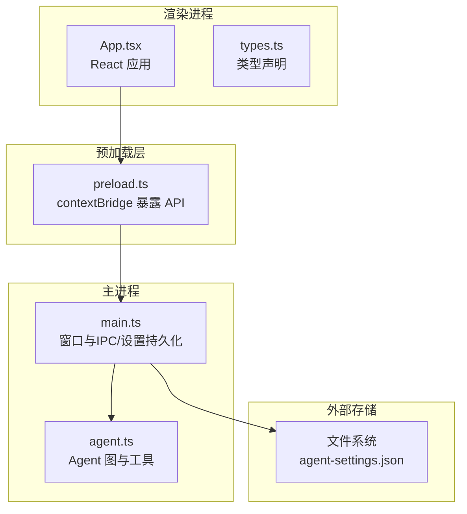
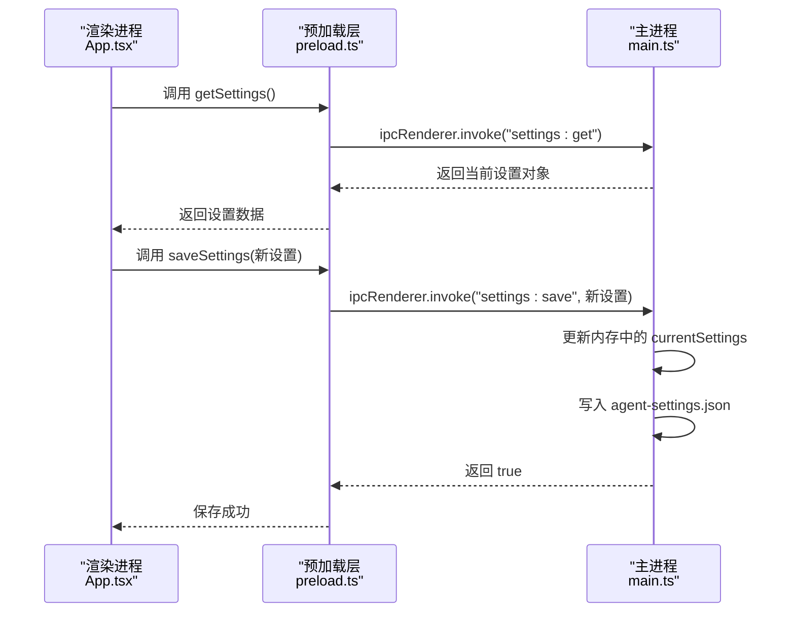
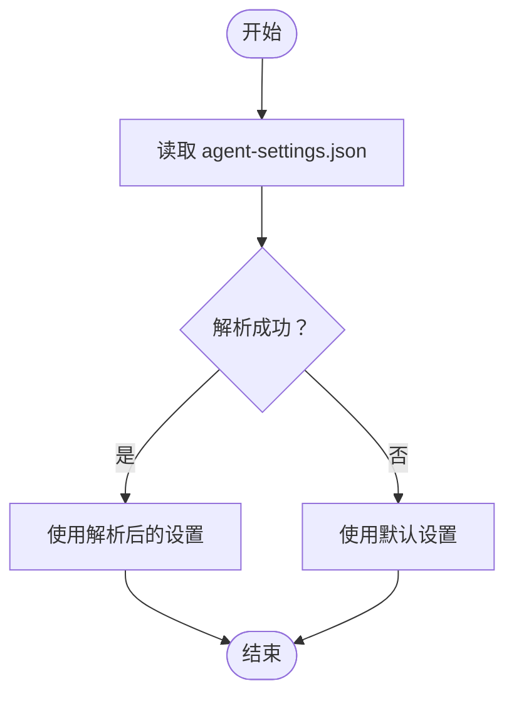
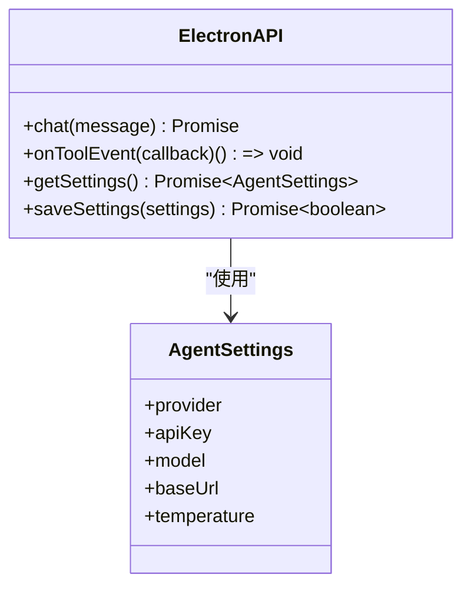
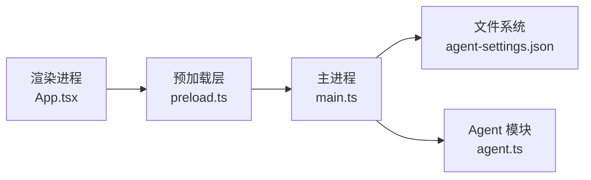

# 数据持久化与缓存

<cite>
**本文档引用的文件**
- [src/main.ts](file://src/main.ts)
- [src/preload.ts](file://src/preload.ts)
- [src/renderer/App.tsx](file://src/renderer/App.tsx)
- [src/renderer/types.ts](file://src/renderer/types.ts)
- [src/agent.ts](file://src/agent.ts)
- [package.json](file://package.json)
- [开发文档.md](file://开发文档.md)
</cite>

## 目录
1. [简介](#简介)
2. [项目结构](#项目结构)
3. [核心组件](#核心组件)
4. [架构总览](#架构总览)
5. [详细组件分析](#详细组件分析)
6. [依赖关系分析](#依赖关系分析)
7. [性能考虑](#性能考虑)
8. [故障排除指南](#故障排除指南)
9. [结论](#结论)
10. [附录](#附录)

## 简介
本文件聚焦于本项目的“数据持久化与缓存”机制，涵盖以下主题：
- 消息历史的本地存储策略
- 设置配置的持久化方案
- 缓存失效机制
- Electron API 中设置的获取与保存方法实现
- 数据序列化与反序列化过程
- 数据迁移策略与版本兼容性处理
- 缓存性能优化、内存管理与存储空间控制
- 数据备份与恢复实现指南
- 离线模式下的数据同步与冲突解决机制

## 项目结构
本项目采用 Electron + React 技术栈，前端通过预加载脚本暴露安全的 IPC 接口给渲染进程，后端主进程负责窗口管理、IPC 处理与设置持久化。

图表来源
- [src/renderer/App.tsx:1-140](file://src/renderer/App.tsx#L1-L140)
- [src/preload.ts:1-18](file://src/preload.ts#L1-L18)
- [src/main.ts:1-100](file://src/main.ts#L1-L100)
- [src/agent.ts:1-316](file://src/agent.ts#L1-L316)

章节来源
- [src/main.ts:1-100](file://src/main.ts#L1-L100)
- [src/preload.ts:1-18](file://src/preload.ts#L1-L18)
- [src/renderer/App.tsx:1-140](file://src/renderer/App.tsx#L1-L140)
- [src/renderer/types.ts:1-49](file://src/renderer/types.ts#L1-L49)
- [src/agent.ts:1-316](file://src/agent.ts#L1-L316)

## 核心组件
- 设置持久化与读取：主进程负责将设置写入 Electron userData 目录下的 JSON 文件，并提供 IPC 接口供渲染进程读取与保存。
- Electron API：通过预加载脚本暴露安全的 IPC 方法，包括聊天、工具事件监听以及设置的获取与保存。
- 消息历史：当前实现未对消息历史进行持久化；消息状态仅存在于渲染进程内存中。
- 缓存与失效：当前未实现显式的缓存与失效逻辑；工具事件实时推送，无本地缓存。

章节来源
- [src/main.ts:11-31](file://src/main.ts#L11-L31)
- [src/main.ts:76-84](file://src/main.ts#L76-L84)
- [src/preload.ts:3-17](file://src/preload.ts#L3-L17)
- [src/renderer/App.tsx:17-22](file://src/renderer/App.tsx#L17-L22)
- [src/renderer/App.tsx:86-90](file://src/renderer/App.tsx#L86-L90)

## 架构总览
下图展示了从渲染进程发起设置操作到主进程持久化的完整流程。

图表来源
- [src/renderer/App.tsx:17-22](file://src/renderer/App.tsx#L17-L22)
- [src/renderer/App.tsx:86-90](file://src/renderer/App.tsx#L86-L90)
- [src/preload.ts:14-16](file://src/preload.ts#L14-L16)
- [src/main.ts:76-84](file://src/main.ts#L76-L84)

## 详细组件分析

### 设置持久化与序列化/反序列化
- 存储位置：Electron 应用的 userData 目录，文件名为 agent-settings.json。
- 序列化：保存时使用 JSON.stringify 将设置对象写入文件。
- 反序列化：读取时使用 JSON.parse 将文件内容解析为设置对象。
- 默认值：若读取失败（如文件不存在），返回内置默认设置对象。
- 并发与一致性：当前实现为单实例写入，未见并发写入场景；建议后续增加锁或事务以避免竞态。

图表来源
- [src/main.ts:14-27](file://src/main.ts#L14-L27)

章节来源
- [src/main.ts:11-31](file://src/main.ts#L11-L31)
- [src/main.ts:14-27](file://src/main.ts#L14-L27)

### Electron API：设置获取与保存
- 预加载层暴露方法：
  - getSettings：通过 IPC 向主进程请求当前设置。
  - saveSettings：向主进程提交新设置并触发持久化。
- 主进程处理：
  - settings:get：返回内存中的 currentSettings。
  - settings:save：更新内存设置并写入文件。
- 类型约束：渲染进程与预加载层共享类型定义，确保参数与返回值一致。

图表来源
- [src/renderer/types.ts:33-42](file://src/renderer/types.ts#L33-L42)
- [src/renderer/types.ts:2-8](file://src/renderer/types.ts#L2-L8)
- [src/preload.ts:3-17](file://src/preload.ts#L3-L17)

章节来源
- [src/preload.ts:3-17](file://src/preload.ts#L3-L17)
- [src/renderer/types.ts:1-49](file://src/renderer/types.ts#L1-L49)
- [src/main.ts:76-84](file://src/main.ts#L76-L84)

### 消息历史的本地存储策略
- 当前实现：消息历史仅保存在渲染进程内存中，未进行任何本地持久化。
- 影响：关闭应用后消息历史丢失；无法实现跨会话的数据复用。
- 建议方案：
  - 选择性持久化：仅持久化最近 N 条消息或按会话分组持久化。
  - 结构化存储：使用 JSON 文件或轻量数据库（如 SQLite）保存消息列表。
  - 压缩与清理：定期清理过期会话，限制单个会话的消息数量。

章节来源
- [src/renderer/App.tsx:6-16](file://src/renderer/App.tsx#L6-L16)
- [src/renderer/App.tsx:43-84](file://src/renderer/App.tsx#L43-L84)

### 缓存失效机制
- 当前状态：未实现显式缓存与失效逻辑。
- 工具事件：通过 IPC 实时推送，不涉及本地缓存。
- 建议机制：
  - LRU 缓存：对频繁访问的模型响应或工具结果进行缓存。
  - 版本化键：为缓存项附加版本号，升级时自动失效旧缓存。
  - 时间戳失效：为缓存项添加 TTL，到期后自动删除。

章节来源
- [src/main.ts:65-74](file://src/main.ts#L65-L74)
- [src/agent.ts:171-262](file://src/agent.ts#L171-L262)

### 数据迁移策略与版本兼容性
- 当前状态：设置文件为简单 JSON，未包含版本字段。
- 迁移建议：
  - 在设置对象中加入 version 字段，初始为 1。
  - 升级时检测版本，执行必要的字段重命名、类型转换或默认值填充。
  - 提供回滚策略：保留旧版本备份文件，失败时快速恢复。

章节来源
- [src/main.ts:14-27](file://src/main.ts#L14-L27)
- [src/main.ts:29-31](file://src/main.ts#L29-L31)

### 缓存性能优化、内存管理与存储空间控制
- 性能优化：
  - 减少序列化开销：批量写入而非逐次写入。
  - 异步写入：使用异步文件写入避免阻塞主线程。
- 内存管理：
  - 控制消息数组长度，及时清理过期消息。
  - 使用不可变更新策略，避免不必要的深拷贝。
- 存储空间控制：
  - 限制单个会话的消息数量与总大小。
  - 定期压缩或归档历史数据。

章节来源
- [src/renderer/App.tsx:6-16](file://src/renderer/App.tsx#L6-L16)
- [src/renderer/App.tsx:43-84](file://src/renderer/App.tsx#L43-L84)

### 数据备份与恢复实现指南
- 备份：
  - 导出设置：读取 agent-settings.json 并保存为用户可选路径。
  - 导出消息：将内存中的消息历史导出为 JSON 文件。
- 恢复：
  - 导入设置：将备份文件写入 agent-settings.json。
  - 导入消息：将备份消息合并到当前会话或新建会话。
- 注意事项：
  - 校验备份文件完整性与版本。
  - 恢复前先确认当前数据是否需要保留或合并。

章节来源
- [src/main.ts:11-31](file://src/main.ts#L11-L31)
- [src/renderer/App.tsx:86-90](file://src/renderer/App.tsx#L86-L90)

### 离线模式下的数据同步与冲突解决机制
- 当前状态：未实现离线模式与云端同步。
- 建议机制：
  - 离线优先：本地生成临时标识符，离线时正常工作。
  - 同步队列：网络恢复后按顺序上传本地变更。
  - 冲突解决：
    - 时间戳优先：较新的记录覆盖旧记录。
    - 合并策略：对可合并字段进行合并（如消息列表）。
    - 用户确认：对不可自动合并的冲突提示用户选择。

章节来源
- [src/renderer/App.tsx:43-84](file://src/renderer/App.tsx#L43-L84)
- [src/agent.ts:279-315](file://src/agent.ts#L279-L315)

## 依赖关系分析
- 渲染进程依赖预加载层提供的安全 IPC 接口。
- 预加载层依赖主进程提供的 IPC 处理函数。
- 主进程依赖文件系统进行设置持久化。
- 主进程依赖 Agent 模块执行对话与工具调用。

图表来源
- [src/renderer/App.tsx:1-140](file://src/renderer/App.tsx#L1-L140)
- [src/preload.ts:1-18](file://src/preload.ts#L1-L18)
- [src/main.ts:1-100](file://src/main.ts#L1-L100)
- [src/agent.ts:1-316](file://src/agent.ts#L1-L316)

章节来源
- [src/renderer/App.tsx:1-140](file://src/renderer/App.tsx#L1-L140)
- [src/preload.ts:1-18](file://src/preload.ts#L1-L18)
- [src/main.ts:1-100](file://src/main.ts#L1-L100)
- [src/agent.ts:1-316](file://src/agent.ts#L1-L316)

## 性能考虑
- 文件 I/O：设置读写为小文件，性能影响有限；建议异步写入与防抖合并写入。
- 内存占用：消息数组随会话增长，应设定上限并定期清理。
- 序列化成本：JSON 解析与字符串化为常数时间，但频繁调用仍需注意节流。
- 网络与工具调用：工具执行可能产生 IO 或网络请求，应在 UI 层显示加载状态。

## 故障排除指南
- 设置读取失败：
  - 检查 agent-settings.json 是否存在且可读。
  - 若文件损坏，将回退到默认设置。
- 设置保存失败：
  - 检查目标目录权限与磁盘空间。
  - 确认主进程未被异常中断。
- 工具事件未显示：
  - 确认 IPC 订阅是否正确建立与释放。
  - 检查主进程是否正确推送事件。

章节来源
- [src/main.ts:14-27](file://src/main.ts#L14-L27)
- [src/main.ts:76-84](file://src/main.ts#L76-L84)
- [src/renderer/App.tsx:24-41](file://src/renderer/App.tsx#L24-L41)

## 结论
本项目已实现基础的设置持久化与安全的 IPC 接口，但尚未覆盖消息历史持久化、缓存与失效、数据迁移与版本兼容、离线同步与冲突解决等高级能力。建议在保持现有设计不变的前提下，逐步引入上述机制，以提升用户体验与系统可靠性。

## 附录
- Electron 应用入口与依赖：
  - 应用入口由 package.json 中的 main 指定。
  - 依赖包括 LangChain/LangGraph、React 生态与 Electron。

章节来源
- [package.json:1-36](file://package.json#L1-L36)
- [开发文档.md:264-296](file://开发文档.md#L264-L296)