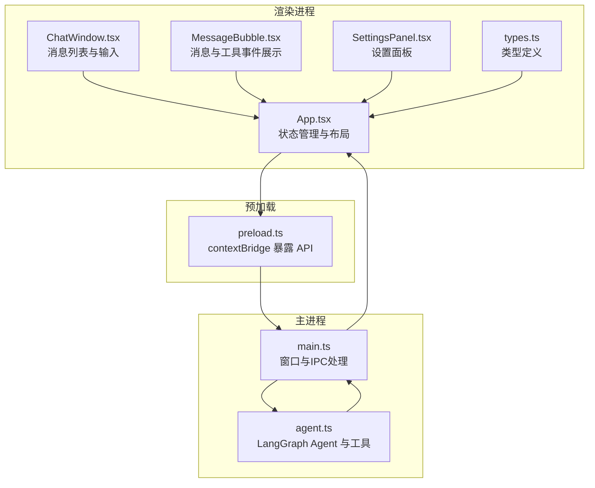
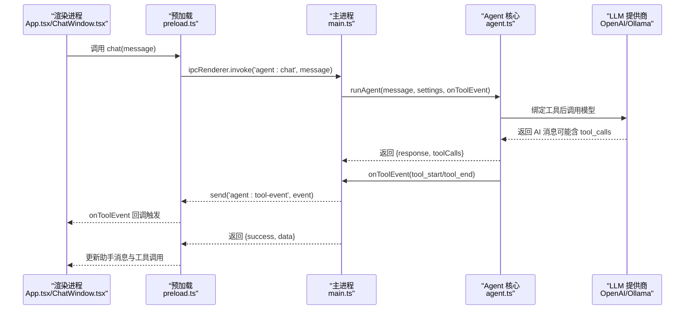
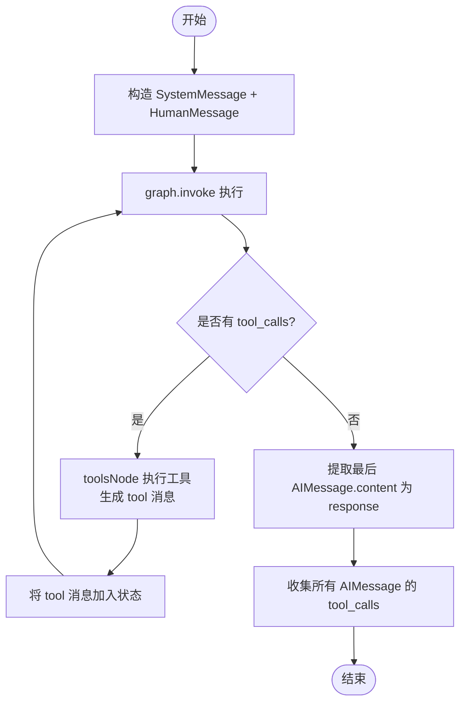
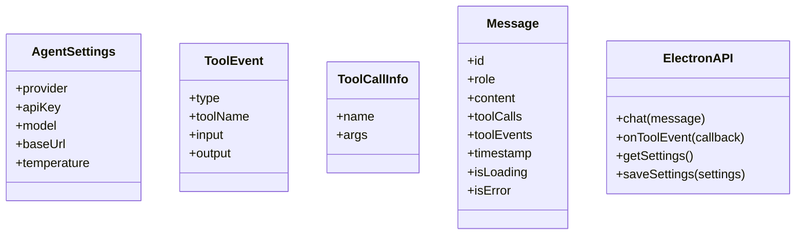
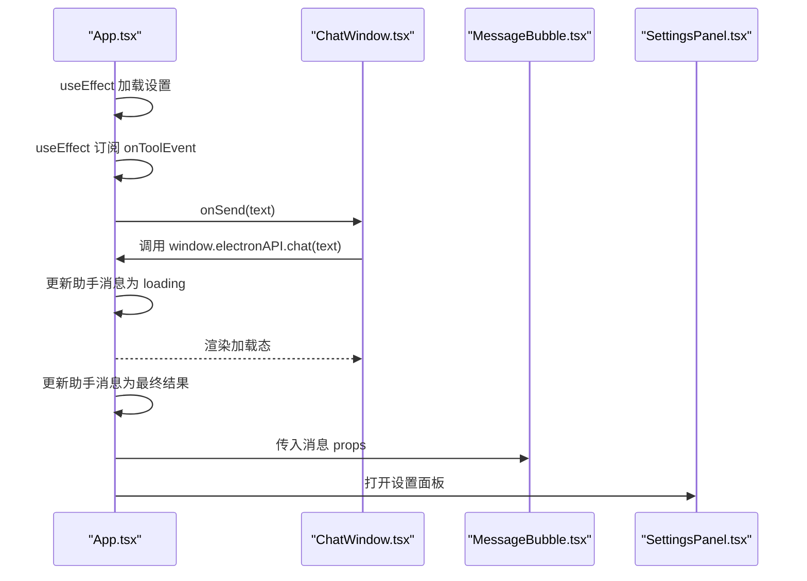
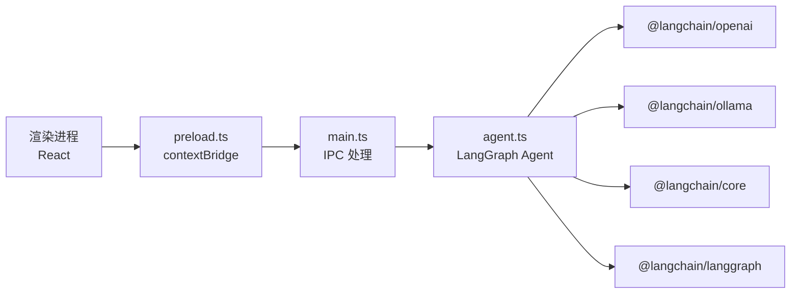

# 数据流与状态管理

<cite>
**本文引用的文件**
- [src/main.ts](file://src/main.ts)
- [src/agent.ts](file://src/agent.ts)
- [src/preload.ts](file://src/preload.ts)
- [src/renderer/App.tsx](file://src/renderer/App.tsx)
- [src/renderer/types.ts](file://src/renderer/types.ts)
- [src/renderer/components/ChatWindow.tsx](file://src/renderer/components/ChatWindow.tsx)
- [src/renderer/components/MessageBubble.tsx](file://src/renderer/components/MessageBubble.tsx)
- [src/renderer/components/SettingsPanel.tsx](file://src/renderer/components/SettingsPanel.tsx)
- [package.json](file://package.json)
- [开发文档.md](file://开发文档.md)
</cite>

## 目录
1. [简介](#简介)
2. [项目结构](#项目结构)
3. [核心组件](#核心组件)
4. [架构总览](#架构总览)
5. [详细组件分析](#详细组件分析)
6. [依赖关系分析](#依赖关系分析)
7. [性能考量](#性能考量)
8. [故障排查指南](#故障排查指南)
9. [结论](#结论)
10. [附录](#附录)

## 简介
本文件围绕 langGraph 的数据流与状态管理系统，系统性阐述应用的状态管理模式、数据流架构与消息处理流程；文档化 TypeScript 类型定义、数据模型与接口规范；深入说明 AI 代理服务的实现原理、外部 API 集成与响应处理机制；解释状态更新机制、组件间数据传递与实时通信实现；并给出数据持久化策略、缓存管理与性能优化建议。同时提供具体的数据流示例与状态转换图，覆盖错误处理、数据验证与业务规则实现，并为开发者提供扩展数据流与状态管理的最佳实践。

## 项目结构
项目采用 Electron + React + Vite 的桌面应用架构，核心分为：
- 主进程（Node.js）：负责窗口管理、IPC 处理、Agent 执行与设置持久化
- 预加载脚本（Preload）：通过 contextBridge 暴露受控 API 至渲染进程
- 渲染进程（React）：负责 UI 展示、用户交互、消息状态管理与工具事件展示
- Agent 核心（LangGraph）：定义状态图、节点与条件路由，封装 LLM 与工具调用

图表来源
- [src/renderer/App.tsx:1-140](file://src/renderer/App.tsx#L1-L140)
- [src/renderer/components/ChatWindow.tsx:1-114](file://src/renderer/components/ChatWindow.tsx#L1-L114)
- [src/renderer/components/MessageBubble.tsx:1-104](file://src/renderer/components/MessageBubble.tsx#L1-L104)
- [src/renderer/components/SettingsPanel.tsx:1-139](file://src/renderer/components/SettingsPanel.tsx#L1-L139)
- [src/renderer/types.ts:1-49](file://src/renderer/types.ts#L1-L49)
- [src/preload.ts:1-18](file://src/preload.ts#L1-L18)
- [src/main.ts:1-100](file://src/main.ts#L1-L100)
- [src/agent.ts:1-316](file://src/agent.ts#L1-L316)

章节来源
- [src/renderer/App.tsx:1-140](file://src/renderer/App.tsx#L1-L140)
- [src/renderer/components/ChatWindow.tsx:1-114](file://src/renderer/components/ChatWindow.tsx#L1-L114)
- [src/renderer/components/MessageBubble.tsx:1-104](file://src/renderer/components/MessageBubble.tsx#L1-L104)
- [src/renderer/components/SettingsPanel.tsx:1-139](file://src/renderer/components/SettingsPanel.tsx#L1-L139)
- [src/renderer/types.ts:1-49](file://src/renderer/types.ts#L1-L49)
- [src/preload.ts:1-18](file://src/preload.ts#L1-L18)
- [src/main.ts:1-100](file://src/main.ts#L1-L100)
- [src/agent.ts:1-316](file://src/agent.ts#L1-L316)

## 核心组件
- 主进程（main.ts）
  - 窗口创建与生命周期管理
  - IPC 处理：接收渲染进程的对话请求、推送工具事件、读取/保存设置
  - 设置持久化：使用 Electron userData 目录下的 JSON 文件
- 预加载（preload.ts）
  - 通过 contextBridge 暴露受控 API：chat、onToolEvent、getSettings、saveSettings
- Agent 核心（agent.ts）
  - 定义 Agent 状态（消息列表累加）、工具集合（计算器、时间、文本分析、随机数）
  - 构建 LangGraph 状态图：agent 节点 → 条件路由 → tools 节点 → agent 节点循环
  - LLM 模型接入：OpenAI 或 Ollama，绑定工具
  - 执行流程：构建图 → 发送系统提示 + 用户消息 → 运行图 → 解析最后一条 AI 消息与工具调用
- 渲染进程（App.tsx + 组件）
  - 状态管理：messages、showSettings、settings
  - 事件监听：订阅工具事件并更新消息中的 toolEvents
  - 交互流程：发送消息 → 显示加载态 → 调用 IPC → 更新助手消息内容与工具调用信息

章节来源
- [src/main.ts:14-31](file://src/main.ts#L14-L31)
- [src/main.ts:64-84](file://src/main.ts#L64-L84)
- [src/preload.ts:3-17](file://src/preload.ts#L3-L17)
- [src/agent.ts:19-37](file://src/agent.ts#L19-L37)
- [src/agent.ts:143-169](file://src/agent.ts#L143-L169)
- [src/agent.ts:171-262](file://src/agent.ts#L171-L262)
- [src/agent.ts:279-315](file://src/agent.ts#L279-L315)
- [src/renderer/App.tsx:6-22](file://src/renderer/App.tsx#L6-L22)
- [src/renderer/App.tsx:24-41](file://src/renderer/App.tsx#L24-L41)
- [src/renderer/App.tsx:43-84](file://src/renderer/App.tsx#L43-L84)

## 架构总览
应用采用“渲染进程（React）—预加载（IPC 桥）—主进程（Node.js）”三层架构，结合 LangGraph 的状态图实现智能体推理与工具调用的闭环。

图表来源
- [src/renderer/App.tsx:43-84](file://src/renderer/App.tsx#L43-L84)
- [src/preload.ts:5-12](file://src/preload.ts#L5-L12)
- [src/main.ts:65-74](file://src/main.ts#L65-L74)
- [src/agent.ts:279-315](file://src/agent.ts#L279-L315)

## 详细组件分析

### 状态图与消息流（LangGraph）
- 状态定义
  - 使用 Annotation.Root 定义 AgentState，包含 messages 字段，reducer 为数组拼接，default 为空数组
- 节点与条件路由
  - agentNode：根据当前 messages 调用 LLM，返回一条 AIMessage
  - toolsNode：解析最后一条 AIMessage 的 tool_calls，逐一执行工具，构造 tool 角色消息返回
  - shouldContinue：判断是否仍有 tool_calls，决定进入 tools 或结束
- 执行流程
  - 构建图并编译
  - 传入 SystemMessage + HumanMessage
  - graph.invoke 返回最终状态，提取最后一条 AIMessage 的 content 作为 response
  - 收集所有 AIMessage 的 tool_calls 作为 toolCalls

图表来源
- [src/agent.ts:143-169](file://src/agent.ts#L143-L169)
- [src/agent.ts:171-262](file://src/agent.ts#L171-L262)
- [src/agent.ts:279-315](file://src/agent.ts#L279-L315)

章节来源
- [src/agent.ts:143-169](file://src/agent.ts#L143-L169)
- [src/agent.ts:171-262](file://src/agent.ts#L171-L262)
- [src/agent.ts:279-315](file://src/agent.ts#L279-L315)

### 类型系统与数据模型
- AgentSettings：提供商、API Key、模型、Base URL、温度
- ToolEvent：工具事件类型（开始/结束）、工具名、输入/输出
- ToolCallInfo：工具调用信息（名称、参数）
- Message：消息模型（id、角色、内容、工具调用、工具事件、时间戳、加载/错误标记）
- ElectronAPI：渲染进程暴露的 IPC 接口

图表来源
- [src/renderer/types.ts:2-49](file://src/renderer/types.ts#L2-L49)

章节来源
- [src/renderer/types.ts:2-49](file://src/renderer/types.ts#L2-L49)

### 渲染进程状态管理与 UI 组件
- App.tsx
  - 状态：messages、showSettings、settings
  - 生命周期：加载设置、订阅工具事件、发送消息、更新助手消息
- ChatWindow.tsx
  - 输入框自动高度、回车发送、禁用发送状态
  - 消息列表滚动到底部、空状态引导
- MessageBubble.tsx
  - 工具事件配对展示（start + end）、展开/折叠详情
- SettingsPanel.tsx
  - 提供商切换、API Key、模型、Base URL、Temperature 调节

图表来源
- [src/renderer/App.tsx:18-22](file://src/renderer/App.tsx#L18-L22)
- [src/renderer/App.tsx:24-41](file://src/renderer/App.tsx#L24-L41)
- [src/renderer/App.tsx:43-84](file://src/renderer/App.tsx#L43-L84)
- [src/renderer/components/ChatWindow.tsx:29-42](file://src/renderer/components/ChatWindow.tsx#L29-L42)
- [src/renderer/components/MessageBubble.tsx:13-28](file://src/renderer/components/MessageBubble.tsx#L13-L28)
- [src/renderer/components/SettingsPanel.tsx:10-19](file://src/renderer/components/SettingsPanel.tsx#L10-L19)

章节来源
- [src/renderer/App.tsx:18-22](file://src/renderer/App.tsx#L18-L22)
- [src/renderer/App.tsx:24-41](file://src/renderer/App.tsx#L24-L41)
- [src/renderer/App.tsx:43-84](file://src/renderer/App.tsx#L43-L84)
- [src/renderer/components/ChatWindow.tsx:29-42](file://src/renderer/components/ChatWindow.tsx#L29-L42)
- [src/renderer/components/MessageBubble.tsx:13-28](file://src/renderer/components/MessageBubble.tsx#L13-L28)
- [src/renderer/components/SettingsPanel.tsx:10-19](file://src/renderer/components/SettingsPanel.tsx#L10-L19)

### 外部 API 集成与响应处理
- LLM 提供商
  - OpenAI：支持自定义 base URL，必要时注入 configuration.baseURL
  - Ollama：本地服务地址与模型名
- 工具调用
  - bindTools 将工具注入模型，模型在响应中携带 tool_calls
  - 主进程实时推送工具事件（tool_start/tool_end）至渲染进程
- 错误处理
  - Agent 执行异常捕获并返回错误信息
  - 工具执行异常捕获并以工具消息形式返回错误内容

章节来源
- [src/agent.ts:151-169](file://src/agent.ts#L151-L169)
- [src/agent.ts:175](file://src/agent.ts#L175)
- [src/agent.ts:197-234](file://src/agent.ts#L197-L234)
- [src/main.ts:65-74](file://src/main.ts#L65-L74)

### 数据持久化与缓存
- 设置持久化
  - 使用 Electron 的 userData 目录存储 agent-settings.json
  - 主进程提供 settings:get/save IPC 处理
- 缓存与性能
  - 当前未实现额外缓存；可通过 checkpointer 实现对话记忆
  - 工具执行结果未做缓存，可在工具层增加内存缓存或 LRU

章节来源
- [src/main.ts:14-31](file://src/main.ts#L14-L31)
- [src/main.ts:76-84](file://src/main.ts#L76-L84)

## 依赖关系分析
- 依赖生态
  - LangChain/LangGraph：消息、工具、状态图与节点
  - OpenAI/Ollama：LLM 适配器
  - React + Vite：前端开发与构建
- 模块耦合
  - 渲染进程仅通过 preload 暴露的 API 与主进程通信
  - 主进程与 Agent 核心强耦合，负责执行与事件推送
  - Agent 核心与 LLM 提供商弱耦合，便于替换

图表来源
- [package.json:13-34](file://package.json#L13-L34)
- [src/preload.ts:3-17](file://src/preload.ts#L3-L17)
- [src/main.ts:1-8](file://src/main.ts#L1-L8)
- [src/agent.ts:1-14](file://src/agent.ts#L1-L14)

章节来源
- [package.json:13-34](file://package.json#L13-L34)
- [src/preload.ts:3-17](file://src/preload.ts#L3-L17)
- [src/main.ts:1-8](file://src/main.ts#L1-L8)
- [src/agent.ts:1-14](file://src/agent.ts#L1-L14)

## 性能考量
- 模块兼容与构建
  - 通过 Vite SSR.noExternal 内联 ESM 包，避免 CJS/ESM 兼容问题
- 渲染性能
  - 使用 React 状态与不可变更新，避免不必要的重渲染
  - 消息列表使用 key 唯一标识，减少列表重排
- 通信效率
  - 工具事件采用单向推送，降低渲染进程轮询成本
- 可扩展优化
  - 对话记忆：使用 checkpointer 减少重复上下文
  - 工具缓存：对幂等工具结果进行缓存
  - 流式输出：逐步渲染响应，改善首屏体验

章节来源
- [开发文档.md:547-557](file://开发文档.md#L547-L557)
- [src/renderer/components/ChatWindow.tsx:17-19](file://src/renderer/components/ChatWindow.tsx#L17-L19)
- [src/renderer/components/MessageBubble.tsx:13-28](file://src/renderer/components/MessageBubble.tsx#L13-L28)

## 故障排查指南
- IPC 通信问题
  - 确认 preload 是否正确暴露 electronAPI
  - 检查 ipcRenderer.invoke/ipcMain.handle 的通道名一致性
- LLM 连接失败
  - OpenAI：确认 API Key 有效、Base URL 正确
  - Ollama：确认本地服务可达、模型已拉取
- 工具执行异常
  - 检查工具参数 Schema 是否匹配
  - 查看工具事件中的错误输出
- 设置持久化异常
  - 检查 userData 目录写权限
  - 确认 JSON 文件格式正确

章节来源
- [src/preload.ts:3-17](file://src/preload.ts#L3-L17)
- [src/main.ts:65-74](file://src/main.ts#L65-L74)
- [src/agent.ts:197-234](file://src/agent.ts#L197-L234)
- [src/main.ts:14-31](file://src/main.ts#L14-L31)

## 结论
本项目以 LangGraph 为核心，结合 Electron 的安全架构与 React 的组件化 UI，构建了完整的桌面端 AI Agent 数据流与状态管理体系。通过明确的类型定义、清晰的 IPC 通信、可扩展的工具系统与可配置的 LLM 提供商，实现了从消息输入到工具调用再到最终响应的完整闭环。未来可在对话记忆、工具缓存与流式输出等方面进一步优化，以提升用户体验与系统性能。

## 附录
- 扩展最佳实践
  - 新增工具：定义 tool + Zod Schema，注册到 ALL_TOOLS 并在 Agent 中绑定
  - 对话记忆：引入 checkpointer 与 MemorySaver，按 thread_id 维护会话
  - 多供应商：新增适配器并在 createModel 中按 provider 分支选择
  - 流式输出：使用 graph.streamEvents 逐步推送内容，提升交互体验

章节来源
- [开发文档.md:578-647](file://开发文档.md#L578-L647)
- [src/agent.ts:137](file://src/agent.ts#L137)
- [src/agent.ts:151-169](file://src/agent.ts#L151-L169)