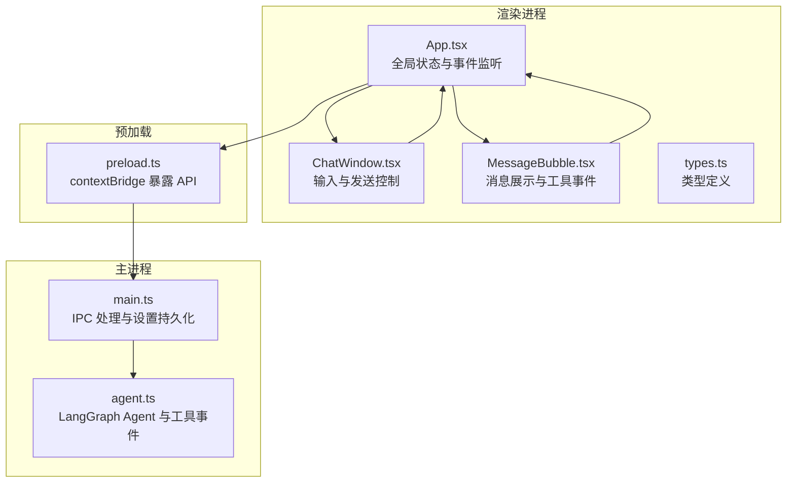
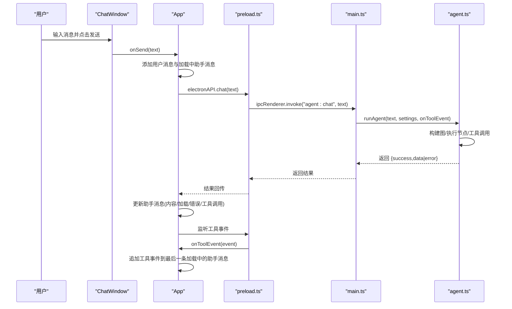
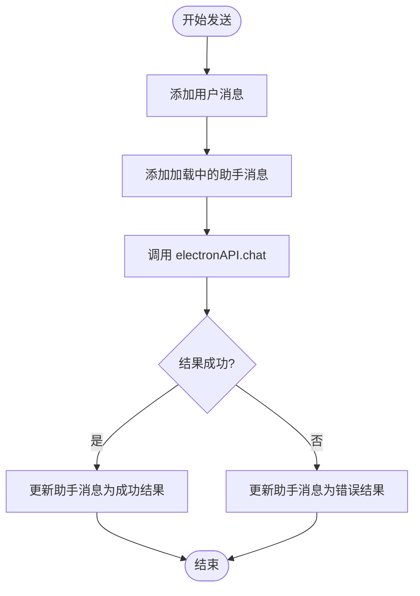
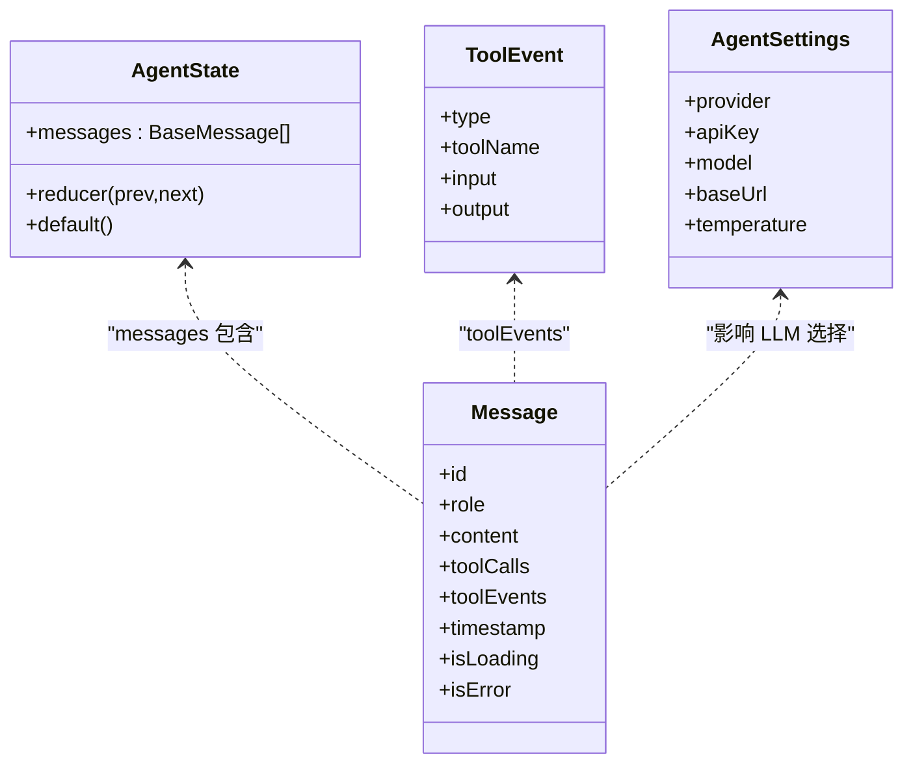
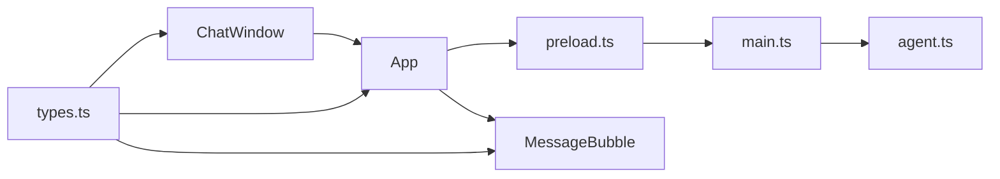

# 状态管理模式

<cite>
**本文引用的文件**
- [src/renderer/App.tsx](file://src/renderer/App.tsx)
- [src/renderer/components/ChatWindow.tsx](file://src/renderer/components/ChatWindow.tsx)
- [src/renderer/components/MessageBubble.tsx](file://src/renderer/components/MessageBubble.tsx)
- [src/renderer/types.ts](file://src/renderer/types.ts)
- [src/agent.ts](file://src/agent.ts)
- [src/main.ts](file://src/main.ts)
- [src/preload.ts](file://src/preload.ts)
- [开发文档.md](file://开发文档.md)
</cite>

## 目录
1. [引言](#引言)
2. [项目结构](#项目结构)
3. [核心组件](#核心组件)
4. [架构总览](#架构总览)
5. [详细组件分析](#详细组件分析)
6. [依赖关系分析](#依赖关系分析)
7. [性能考量](#性能考量)
8. [故障排查指南](#故障排查指南)
9. [结论](#结论)
10. [附录](#附录)

## 引言
本文件围绕 langGraph 的状态管理模式进行系统化文档化，重点解释：
- 应用的状态架构设计与职责划分
- React 状态管理策略与组件间数据传递机制
- 消息状态的生命周期、加载与错误状态处理
- 状态更新触发机制、数据流向与组件重渲染优化
- 状态持久化与缓存策略
- 状态调试技巧与性能监控方法
- 异步操作的状态管理最佳实践与错误恢复机制

## 项目结构
该项目采用 Electron + React + LangGraph 的三层架构：
- 渲染进程（React）：负责 UI 展示与用户交互，管理前端局部状态
- 主进程（Node.js）：负责 IPC 通信、设置持久化、调用 LangGraph Agent
- 预加载脚本（Preload）：在受控环境下暴露安全的 Node.js API 给渲染进程

图表来源
- [src/renderer/App.tsx:1-140](file://src/renderer/App.tsx#L1-L140)
- [src/renderer/components/ChatWindow.tsx:1-114](file://src/renderer/components/ChatWindow.tsx#L1-L114)
- [src/renderer/components/MessageBubble.tsx:1-104](file://src/renderer/components/MessageBubble.tsx#L1-L104)
- [src/renderer/types.ts:1-49](file://src/renderer/types.ts#L1-L49)
- [src/preload.ts:1-18](file://src/preload.ts#L1-L18)
- [src/main.ts:1-100](file://src/main.ts#L1-L100)
- [src/agent.ts:1-316](file://src/agent.ts#L1-L316)

章节来源
- [src/renderer/App.tsx:1-140](file://src/renderer/App.tsx#L1-L140)
- [src/renderer/components/ChatWindow.tsx:1-114](file://src/renderer/components/ChatWindow.tsx#L1-L114)
- [src/renderer/components/MessageBubble.tsx:1-104](file://src/renderer/components/MessageBubble.tsx#L1-L104)
- [src/renderer/types.ts:1-49](file://src/renderer/types.ts#L1-L49)
- [src/preload.ts:1-18](file://src/preload.ts#L1-L18)
- [src/main.ts:1-100](file://src/main.ts#L1-L100)
- [src/agent.ts:1-316](file://src/agent.ts#L1-L316)
- [开发文档.md:152-190](file://开发文档.md#L152-L190)

## 核心组件
- App.tsx：应用根组件，维护全局状态（消息列表、设置面板开关、LLM 设置），处理用户发送消息、保存设置、清空对话；监听工具事件并更新消息状态。
- ChatWindow.tsx：聊天窗口组件，负责输入框状态（文本、发送中）、自动滚动与高度自适应、键盘快捷键、调用父组件回调发送消息。
- MessageBubble.tsx：消息气泡组件，根据消息状态（加载、错误、工具事件）渲染不同 UI；将工具事件配对展示。
- types.ts：定义消息、工具事件、设置等类型，以及渲染进程暴露的 Electron API 类型。
- agent.ts：LangGraph Agent 核心，定义状态图、工具、LLM 模型接入、工具事件广播与最终结果聚合。
- main.ts：主进程，处理 IPC 请求（对话、设置读取/保存），持久化设置到 userData 目录。
- preload.ts：预加载脚本，通过 contextBridge 暴露安全 API（聊天、工具事件监听、设置读取/保存）。

章节来源
- [src/renderer/App.tsx:6-94](file://src/renderer/App.tsx#L6-L94)
- [src/renderer/components/ChatWindow.tsx:10-42](file://src/renderer/components/ChatWindow.tsx#L10-L42)
- [src/renderer/components/MessageBubble.tsx:8-100](file://src/renderer/components/MessageBubble.tsx#L8-L100)
- [src/renderer/types.ts:22-48](file://src/renderer/types.ts#L22-L48)
- [src/agent.ts:143-262](file://src/agent.ts#L143-L262)
- [src/main.ts:64-84](file://src/main.ts#L64-L84)
- [src/preload.ts:3-17](file://src/preload.ts#L3-L17)

## 架构总览
应用采用“渲染进程状态 + 主进程业务”的分工模式：
- 渲染进程负责 UI 状态与用户交互，通过 Electron IPC 调用主进程执行 Agent 对话与工具事件监听。
- 主进程负责设置持久化、IPC 处理、调用 LangGraph 并将工具事件实时推送到渲染进程。
- 预加载脚本作为安全桥接层，仅暴露必要 API，避免渲染进程直接访问 Node.js。

图表来源
- [src/renderer/components/ChatWindow.tsx:29-42](file://src/renderer/components/ChatWindow.tsx#L29-L42)
- [src/renderer/App.tsx:43-84](file://src/renderer/App.tsx#L43-L84)
- [src/preload.ts:5-11](file://src/preload.ts#L5-L11)
- [src/main.ts:65-74](file://src/main.ts#L65-L74)
- [src/agent.ts:279-315](file://src/agent.ts#L279-L315)

## 详细组件分析

### App.tsx：全局状态与事件处理
- 全局状态
  - messages：消息数组，包含用户消息、加载中的助手消息、最终助手消息（含工具调用与工具事件）
  - showSettings：设置面板显示状态
  - settings：LLM 提供商、模型、API Key、Base URL、Temperature 等
- 生命周期与事件
  - 首次挂载时读取持久化设置
  - 监听工具事件，将事件追加到最后一条处于加载中的助手消息
- 发送消息流程
  - 添加用户消息
  - 添加加载中的助手消息
  - 调用 Electron API 执行对话
  - 根据结果更新助手消息（内容、加载状态、错误标记、工具调用）

图表来源
- [src/renderer/App.tsx:43-84](file://src/renderer/App.tsx#L43-L84)

章节来源
- [src/renderer/App.tsx:6-22](file://src/renderer/App.tsx#L6-L22)
- [src/renderer/App.tsx:24-41](file://src/renderer/App.tsx#L24-L41)
- [src/renderer/App.tsx:43-84](file://src/renderer/App.tsx#L43-L84)

### ChatWindow.tsx：输入与发送控制
- 本地状态
  - input：输入框文本
  - isSending：发送中状态，禁用输入与发送按钮
- 行为
  - 自动滚动到底部
  - 自动调整输入框高度
  - Enter 发送、Shift+Enter 换行
  - 调用父组件 onSend 并在 finally 中恢复焦点与发送状态

章节来源
- [src/renderer/components/ChatWindow.tsx:10-42](file://src/renderer/components/ChatWindow.tsx#L10-L42)
- [src/renderer/components/ChatWindow.tsx:16-27](file://src/renderer/components/ChatWindow.tsx#L16-L27)
- [src/renderer/components/ChatWindow.tsx:44-49](file://src/renderer/components/ChatWindow.tsx#L44-L49)

### MessageBubble.tsx：消息展示与工具事件配对
- 根据消息角色渲染不同样式
- 加载状态：显示加载指示器
- 错误状态：标记错误样式
- 工具事件配对：将 tool_start 与 tool_end 按工具名配对，支持展开/折叠查看工具输入/输出

章节来源
- [src/renderer/components/MessageBubble.tsx:8-100](file://src/renderer/components/MessageBubble.tsx#L8-L100)

### types.ts：类型与 Electron API
- Message：包含 id、role、content、toolCalls、toolEvents、timestamp、isLoading、isError
- ToolEvent：工具事件类型（tool_start/tool_end）与工具名、输入/输出
- AgentSettings：LLM 提供商、模型、API Key、Base URL、Temperature
- ElectronAPI：chat、onToolEvent、getSettings、saveSettings

章节来源
- [src/renderer/types.ts:22-48](file://src/renderer/types.ts#L22-L48)

### agent.ts：LangGraph 状态图与工具事件
- 状态定义：messages 列表，reducer 为追加
- 节点与路由：agent 节点（LLM 推理）、tools 节点（工具执行）、条件路由（是否继续）
- 工具事件：在工具开始与结束时广播事件
- 结果聚合：提取最终 AI 回答与所有工具调用

图表来源
- [src/agent.ts:143-149](file://src/agent.ts#L143-L149)
- [src/renderer/types.ts:10-31](file://src/renderer/types.ts#L10-L31)
- [src/renderer/types.ts:22-31](file://src/renderer/types.ts#L22-L31)

章节来源
- [src/agent.ts:143-262](file://src/agent.ts#L143-L262)
- [src/agent.ts:279-315](file://src/agent.ts#L279-L315)

### main.ts：IPC 处理与设置持久化
- IPC 处理
  - agent:chat：执行 runAgent，将工具事件通过 send 推送至渲染进程
  - settings:get/save：读取/保存设置到 userData 目录
- 设置持久化：以 JSON 文件形式存储在 %APPDATA%/langgraph-agent/agent-settings.json

章节来源
- [src/main.ts:64-84](file://src/main.ts#L64-L84)
- [src/main.ts:11-31](file://src/main.ts#L11-L31)

### preload.ts：安全桥接层
- 通过 contextBridge.exposeInMainWorld 暴露 electronAPI
- chat：ipcRenderer.invoke("agent:chat")
- onToolEvent：ipcRenderer.on("agent:tool-event") 订阅工具事件
- getSettings/saveSettings：读取/保存设置

章节来源
- [src/preload.ts:3-17](file://src/preload.ts#L3-L17)

## 依赖关系分析
- 组件耦合
  - App.tsx 依赖 ChatWindow 与 SettingsPanel（未在当前仓库中列出），并通过 Electron API 与主进程交互
  - ChatWindow 仅依赖 App.tsx 的回调，低耦合
  - MessageBubble 仅依赖 Message 类型，无副作用
- 数据流向
  - 用户输入 → ChatWindow → App → Electron API → 主进程 → Agent → 工具事件 → 主进程 → 预加载 → App → UI 更新
- 外部依赖
  - @langchain/langgraph、@langchain/core、@langchain/openai、@langchain/ollama、zod

图表来源
- [src/renderer/App.tsx:1-140](file://src/renderer/App.tsx#L1-L140)
- [src/renderer/components/ChatWindow.tsx:1-114](file://src/renderer/components/ChatWindow.tsx#L1-L114)
- [src/renderer/components/MessageBubble.tsx:1-104](file://src/renderer/components/MessageBubble.tsx#L1-L104)
- [src/renderer/types.ts:1-49](file://src/renderer/types.ts#L1-L49)
- [src/preload.ts:1-18](file://src/preload.ts#L1-L18)
- [src/main.ts:1-100](file://src/main.ts#L1-L100)
- [src/agent.ts:1-316](file://src/agent.ts#L1-L316)

章节来源
- [src/renderer/App.tsx:1-140](file://src/renderer/App.tsx#L1-L140)
- [src/renderer/components/ChatWindow.tsx:1-114](file://src/renderer/components/ChatWindow.tsx#L1-L114)
- [src/renderer/components/MessageBubble.tsx:1-104](file://src/renderer/components/MessageBubble.tsx#L1-L104)
- [src/renderer/types.ts:1-49](file://src/renderer/types.ts#L1-L49)
- [src/preload.ts:1-18](file://src/preload.ts#L1-L18)
- [src/main.ts:1-100](file://src/main.ts#L1-L100)
- [src/agent.ts:1-316](file://src/agent.ts#L1-L316)

## 性能考量
- 渲染性能
  - 使用不可变更新（setState(prev => [...prev])）保证 React 可以正确识别变更
  - ChatWindow 通过自动高度调整与滚动优化用户体验，减少不必要的重排
- 状态更新优化
  - 工具事件按“最后一条加载中的助手消息”追加，避免重复查找与多次 setState
  - 使用 isSending 控制输入状态，防止并发发送
- 数据持久化
  - 设置持久化采用 JSON 文件，路径位于 userData 目录，避免频繁 IO
- 异步处理
  - 使用 try/finally 确保发送状态恢复，避免 UI 卡死
  - 工具事件通过单向推送，降低渲染压力

章节来源
- [src/renderer/App.tsx:24-41](file://src/renderer/App.tsx#L24-L41)
- [src/renderer/App.tsx:67-83](file://src/renderer/App.tsx#L67-L83)
- [src/renderer/components/ChatWindow.tsx:29-42](file://src/renderer/components/ChatWindow.tsx#L29-L42)
- [src/main.ts:11-31](file://src/main.ts#L11-L31)

## 故障排查指南
- 工具事件未显示
  - 检查主进程是否通过 send 推送事件
  - 检查渲染进程是否正确订阅 onToolEvent
  - 确认最后一条助手消息处于 isLoading 状态
- 对话结果错误
  - 检查主进程 IPC 返回结构（success/data|error）
  - 检查 App.tsx 是否正确解析结果并更新消息
- 设置未生效
  - 检查主进程 saveSettings 是否写入 userData 目录
  - 检查渲染进程 getSettings 是否返回最新设置
- 发送按钮禁用
  - 检查 isSending 状态是否在 finally 中恢复
  - 检查输入是否为空或发送中

章节来源
- [src/main.ts:65-74](file://src/main.ts#L65-L74)
- [src/renderer/App.tsx:43-84](file://src/renderer/App.tsx#L43-L84)
- [src/preload.ts:5-11](file://src/preload.ts#L5-L11)
- [src/main.ts:29-31](file://src/main.ts#L29-L31)

## 结论
本项目通过明确的职责划分与安全的 IPC 设计，实现了清晰的状态管理模式：
- 渲染进程专注 UI 状态与交互，主进程专注业务逻辑与持久化
- LangGraph 的状态图以声明式方式定义 Agent 的推理循环，便于扩展与维护
- 工具事件通过单向推送与不可变更新，保证 UI 与业务状态的一致性
- 通过合理的状态更新策略与性能优化，提供了流畅的用户体验

## 附录
- 状态字段说明
  - Message：id、role、content、toolCalls、toolEvents、timestamp、isLoading、isError
  - ToolEvent：type、toolName、input、output
  - AgentSettings：provider、apiKey、model、baseUrl、temperature
- 最佳实践
  - 使用不可变更新与精确的 setState 触发
  - 通过 isSending 等布尔状态控制 UI 交互
  - 工具事件按“最后一条加载中的助手消息”追加，避免复杂查找
  - 设置持久化采用 JSON 文件，路径固定在 userData 目录
  - 异步操作使用 try/finally 确保状态恢复

章节来源
- [src/renderer/types.ts:22-48](file://src/renderer/types.ts#L22-L48)
- [src/renderer/App.tsx:43-84](file://src/renderer/App.tsx#L43-L84)
- [src/main.ts:11-31](file://src/main.ts#L11-L31)