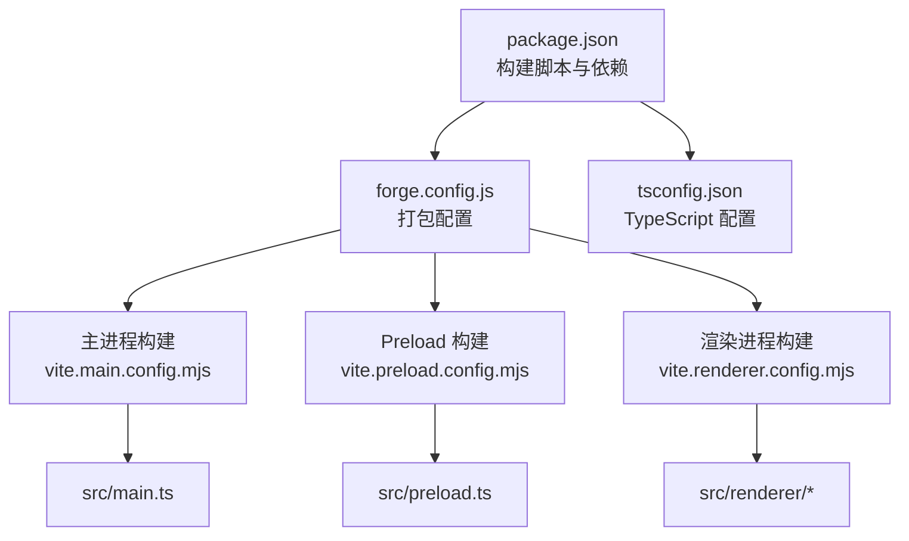
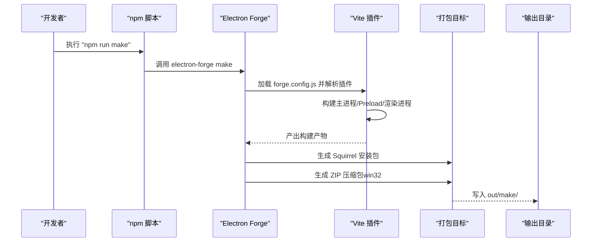
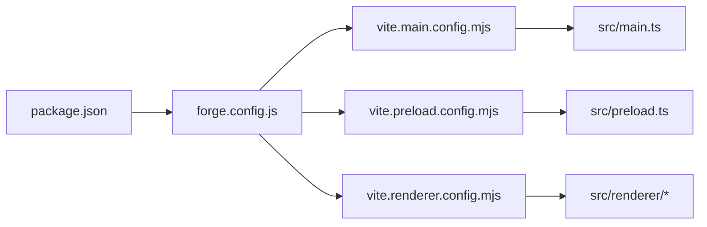

# Electron Forge 打包

<cite>
**本文引用的文件**
- [forge.config.js](file://forge.config.js)
- [package.json](file://package.json)
- [vite.main.config.mjs](file://vite.main.config.mjs)
- [vite.preload.config.mjs](file://vite.preload.config.mjs)
- [vite.renderer.config.mjs](file://vite.renderer.config.mjs)
- [tsconfig.json](file://tsconfig.json)
- [src/main.ts](file://src/main.ts)
- [src/preload.ts](file://src/preload.ts)
- [开发文档.md](file://开发文档.md)
</cite>

## 目录
1. [简介](#简介)
2. [项目结构](#项目结构)
3. [核心组件](#核心组件)
4. [架构总览](#架构总览)
5. [详细组件分析](#详细组件分析)
6. [依赖关系分析](#依赖关系分析)
7. [性能考量](#性能考量)
8. [故障排查指南](#故障排查指南)
9. [结论](#结论)
10. [附录](#附录)

## 简介
本文件面向使用 Electron Forge 的开发者，围绕 langGraph 项目的打包配置进行系统化说明。内容覆盖 forge.config.js 的各项配置项（打包目标、图标设置、asar 压缩、签名与自动更新）、package.json 的构建脚本与依赖管理、不同平台的打包差异、代码签名流程与安全配置、打包优化技巧、调试方法、常见问题与解决方案，以及 CI/CD 集成建议。目标是帮助你在不深入阅读源码的前提下，快速理解并正确配置应用打包。

## 项目结构
该项目采用 Electron + Electron Forge + Vite 的现代桌面应用结构：
- 打包配置集中在 forge.config.js，定义打包目标、图标、asar、签名与自动更新等。
- 构建脚本与依赖集中在 package.json，提供 start/package/make/publish 等常用命令。
- Vite 配置分别针对主进程、preload 与渲染进程，确保各进程构建独立可控。
- TypeScript 配置保证类型安全与路径别名解析。

图表来源
- [forge.config.js:1-42](file://forge.config.js#L1-L42)
- [package.json:1-36](file://package.json#L1-L36)
- [vite.main.config.mjs:1-24](file://vite.main.config.mjs#L1-L24)
- [vite.preload.config.mjs:1-10](file://vite.preload.config.mjs#L1-L10)
- [vite.renderer.config.mjs:1-7](file://vite.renderer.config.mjs#L1-L7)
- [tsconfig.json:1-22](file://tsconfig.json#L1-L22)

章节来源
- [开发文档.md:152-190](file://开发文档.md#L152-L190)

## 核心组件
- 打包配置中心：forge.config.js
  - packagerConfig.asar：启用 asar 压缩，保护源码。
  - makers：定义打包目标与平台过滤。
  - plugins：集成 @electron-forge/plugin-vite，指定主进程、preload 与渲染进程的构建入口与配置文件。
- 构建脚本与依赖：package.json
  - scripts：start/package/make/publish。
  - dependencies/devDependencies：Electron、Forge、Vite、React、LangChain 等。
- Vite 配置：分别针对主进程、preload、渲染进程，确保模块解析、外部依赖与 SSR 内联策略正确。
- TypeScript 配置：路径别名、模块解析策略、输出目录等。

章节来源
- [forge.config.js:3-41](file://forge.config.js#L3-L41)
- [package.json:6-12](file://package.json#L6-L12)
- [vite.main.config.mjs:3-23](file://vite.main.config.mjs#L3-L23)
- [vite.preload.config.mjs:3-9](file://vite.preload.config.mjs#L3-L9)
- [vite.renderer.config.mjs:4-6](file://vite.renderer.config.mjs#L4-L6)
- [tsconfig.json:2-18](file://tsconfig.json#L2-L18)

## 架构总览
Electron Forge 打包流程的关键节点如下：
- 读取 forge.config.js，确定打包目标与插件。
- 通过 @electron-forge/plugin-vite，分别构建主进程、preload 与渲染进程。
- 生成 asar 归档（若启用）。
- 生成安装包（Squirrel）与 ZIP（仅 win32）。
- 产物输出至 out/make/ 下对应子目录。

图表来源
- [forge.config.js:19-40](file://forge.config.js#L19-L40)
- [package.json:8-10](file://package.json#L8-L10)

## 详细组件分析

### forge.config.js 配置详解
- packagerConfig.asar
  - 作用：启用 asar 压缩，将资源打包为不可直接读取的归档，提升源码保护与分发效率。
  - 影响：生产构建时生效；开发模式下仍可直接读取未压缩资源。
- makers
  - @electron-forge/maker-squirrel：生成 Windows 安装程序（.exe），适用于桌面端分发。
  - @electron-forge/maker-zip：生成 ZIP 压缩包，限定平台为 win32，便于快速分发与测试。
  - 注意：当前未配置图标、签名与自动更新，后续可按需补充。
- plugins
  - @electron-forge/plugin-vite：集成 Vite 构建链路。
  - build 数组：定义主进程与 preload 的入口、配置文件与目标标签。
  - renderer 数组：定义渲染进程的开发服务器与构建配置。
- 重要提示
  - 当前未显式配置 icon、publisher、signing、autoUpdater 等字段。如需签名与自动更新，请在后续扩展中补充相应配置项。

章节来源
- [forge.config.js:4-18](file://forge.config.js#L4-L18)
- [forge.config.js:19-40](file://forge.config.js#L19-L40)

### package.json 构建脚本与依赖管理
- scripts
  - start：开发模式启动，同时启动 Vite 开发服务器与 Electron。
  - package：仅打包应用，不生成安装包。
  - make：生成安装包（Squirrel + ZIP，win32）。
  - publish：发布到远程（需配合自动更新配置）。
- dependencies
  - Electron、React、LangChain 生态、Zod 等核心运行时依赖。
- devDependencies
  - Electron Forge CLI、maker、plugin-vite、Vite、React 插件、TypeScript、Node 类型等。

章节来源
- [package.json:6-12](file://package.json#L6-L12)
- [package.json:13-34](file://package.json#L13-L34)

### Vite 配置与模块解析
- vite.main.config.mjs
  - resolve.conditions 与 mainFields：确保 Node 环境下的模块解析行为。
  - build.rollupOptions.external: ['electron']：避免将 Electron 作为打包依赖。
  - ssr.noExternal：将 LangChain/LangGraph 等纯 ESM 包内联，解决 CJS/ESM 兼容问题。
- vite.preload.config.mjs
  - 保持 external: ['electron']，确保 preload 与主进程的边界清晰。
- vite.renderer.config.mjs
  - 引入 @vitejs/plugin-react，支持 React JSX 与 HMR。

章节来源
- [vite.main.config.mjs:3-23](file://vite.main.config.mjs#L3-L23)
- [vite.preload.config.mjs:3-9](file://vite.preload.config.mjs#L3-L9)
- [vite.renderer.config.mjs:4-6](file://vite.renderer.config.mjs#L4-L6)

### TypeScript 配置
- compilerOptions
  - target/module/moduleResolution：ESNext + bundler，适配现代打包工具。
  - jsx：react-jsx，配合 React 18。
  - strict、esModuleInterop、skipLibCheck：提升类型安全与兼容性。
  - resolveJsonModule/isolatedModules：支持 JSON 模块与隔离模块。
  - baseUrl/paths：配置路径别名 @/* -> src/*。
  - outDir：输出目录为 dist。
- include/exclude：仅包含 src，排除 node_modules。

章节来源
- [tsconfig.json:2-18](file://tsconfig.json#L2-L18)

### 打包目标与平台差异
- Windows
  - maker-squirrel：生成 .exe 安装包，适合桌面端分发。
  - maker-zip：生成 ZIP 压缩包，限定平台为 win32，便于快速测试。
- macOS/Linux
  - 当前未配置对应 maker，如需分发请添加相应 maker（例如 @electron-forge/maker-dmg、@electron-forge/maker-deb、@electron-forge/maker-rpm）。
- asar 压缩
  - 仅在生产构建时生效，开发模式下仍可直接读取未压缩资源。

章节来源
- [forge.config.js:7-18](file://forge.config.js#L7-L18)

### 代码签名与安全配置
- 当前配置未包含签名与自动更新字段。如需启用：
  - 签名：在 packagerConfig 中添加签名相关字段（如 certificate、password 等，具体键名参考 Electron Packager 文档）。
  - 自动更新：在 forge.config.js 中添加 autoUpdater 配置（如 updatePub、provider 等），并在 package.json 中配置 publish 脚本。
- 安全建议
  - 保持 asar 启用，减少源码泄露风险。
  - 严格控制 preload 暴露的 API，遵循最小权限原则。
  - 使用 contextIsolation 与 NodeIntegration 禁用策略，确保渲染进程隔离。

章节来源
- [forge.config.js:4-6](file://forge.config.js#L4-L6)
- [src/main.ts:37-48](file://src/main.ts#L37-L48)
- [src/preload.ts:1-18](file://src/preload.ts#L1-L18)

### 打包流程与产物
- 开发模式
  - npm start：启动 Vite 开发服务器，构建主进程与 preload，启动 Electron 并打开 DevTools。
- 生产模式
  - npm run package：仅打包应用，不生成安装包。
  - npm run make：生成安装包（Squirrel + ZIP，win32），产物位于 out/make/。
  - npm run publish：发布到远程（需配置自动更新）。

章节来源
- [package.json:7-11](file://package.json#L7-L11)
- [开发文档.md:532-541](file://开发文档.md#L532-L541)

### 打包优化技巧
- 启用 asar：减少文件数量，提升加载速度与安全性。
- 控制构建范围：仅将必要模块内联（如 LangChain 包），避免过度内联导致体积膨胀。
- 平台特定优化：为不同平台配置专用的 maker 与图标，提升用户体验。
- 依赖精简：移除未使用的依赖，降低安装包体积。

章节来源
- [forge.config.js:5](file://forge.config.js#L5)
- [vite.main.config.mjs:24-26](file://vite.main.config.mjs#L24-L26)

### 调试方法
- 开发模式调试
  - npm start：自动打开 DevTools，便于前端与主进程调试。
- 打包后调试
  - 使用 --inspect-brk 等参数附加调试器，定位打包后的问题。
- 日志与错误
  - 在主进程与 preload 中增加日志输出，定位 IPC 与模块加载问题。

章节来源
- [开发文档.md:509-522](file://开发文档.md#L509-L522)

### 常见问题与解决方案
- ESM/CJS 兼容问题
  - 现象：主进程导入 LangChain 包时报错。
  - 解决：通过 vite.main.config.mjs 的 ssr.noExternal 将 LangChain 包内联，由 Vite 自动转换为 CJS。
- 打包后资源路径异常
  - 现象：静态资源无法加载或路径错误。
  - 解决：确认 Vite 配置中的 publicDir 与输出路径一致，避免相对路径问题。
- 未生成 ZIP 包
  - 现象：仅生成 Squirrel 安装包。
  - 解决：确认 makers 中包含 maker-zip 且 platforms 包含 win32。
- 未启用 asar
  - 现象：源码可被直接读取。
  - 解决：在 packagerConfig 中启用 asar。

章节来源
- [vite.main.config.mjs:24-26](file://vite.main.config.mjs#L24-L26)
- [forge.config.js:14-18](file://forge.config.js#L14-L18)
- [forge.config.js:5](file://forge.config.js#L5)

### CI/CD 集成指南
- 基本步骤
  - 安装依赖：npm ci 或 npm install。
  - 构建：npm run make。
  - 上传：将 out/make/ 下的产物上传至发布平台或分发渠道。
- 平台差异
  - Windows：使用 Squirrel 与 ZIP。
  - macOS/Linux：根据需要添加对应 maker。
- 自动更新
  - 在 forge.config.js 中配置 updatePub/provider，并在 package.json 中配置 publish 脚本。
  - 在 CI 中触发 publish，确保版本号与 tag 一致。

章节来源
- [package.json:8-11](file://package.json#L8-L11)
- [forge.config.js:7-18](file://forge.config.js#L7-L18)

## 依赖关系分析
Electron Forge 打包链路的依赖关系如下：
- forge.config.js 依赖 @electron-forge/plugin-vite。
- plugin-vite 依赖 vite.main.config.mjs、vite.preload.config.mjs、vite.renderer.config.mjs。
- package.json 提供脚本与依赖，驱动 Forge 执行。
- src/main.ts 与 src/preload.ts 作为构建入口，受 Vite 配置影响。

图表来源
- [forge.config.js:19-40](file://forge.config.js#L19-L40)
- [vite.main.config.mjs:1-24](file://vite.main.config.mjs#L1-L24)
- [vite.preload.config.mjs:1-10](file://vite.preload.config.mjs#L1-L10)
- [vite.renderer.config.mjs:1-7](file://vite.renderer.config.mjs#L1-L7)

章节来源
- [forge.config.js:19-40](file://forge.config.js#L19-L40)
- [package.json:13-34](file://package.json#L13-L34)

## 性能考量
- asar 压缩：减少文件数量，提升加载速度与安全性。
- 内联策略：仅对必要模块（如 LangChain）进行内联，避免过度内联导致体积增大。
- 构建缓存：合理利用 Vite 的 HMR 与缓存机制，缩短开发迭代周期。
- 产物体积：移除未使用依赖，拆分大模块，按需加载资源。

## 故障排查指南
- 打包失败
  - 检查 forge.config.js 语法与插件配置。
  - 确认 Vite 配置与入口文件路径一致。
- 运行异常
  - 开启 DevTools，查看控制台与网络面板。
  - 在主进程与 preload 中增加日志，定位 IPC 与模块加载问题。
- 平台差异
  - Windows：确认 maker-squirrel 与 maker-zip 配置。
  - macOS/Linux：添加对应 maker 并配置图标与签名。

章节来源
- [forge.config.js:7-18](file://forge.config.js#L7-L18)
- [开发文档.md:509-522](file://开发文档.md#L509-L522)

## 结论
本项目通过 Electron Forge + Vite 的组合，实现了现代化的桌面应用打包流程。当前配置已覆盖 Windows 平台的安装包与 ZIP 包生成，并通过 asar 与内联策略提升了安全性与兼容性。建议在后续阶段补充图标、签名与自动更新配置，以满足更严格的分发与安全需求。同时，结合 CI/CD 流水线自动化构建与发布，可进一步提升交付效率与稳定性。

## 附录
- 常用命令
  - 开发：npm start
  - 仅打包：npm run package
  - 生成安装包：npm run make
  - 发布：npm run publish
- 产物位置
  - out/make/：包含 Squirrel 与 ZIP 产物（win32）

章节来源
- [package.json:7-11](file://package.json#L7-L11)
- [开发文档.md:532-541](file://开发文档.md#L532-L541)