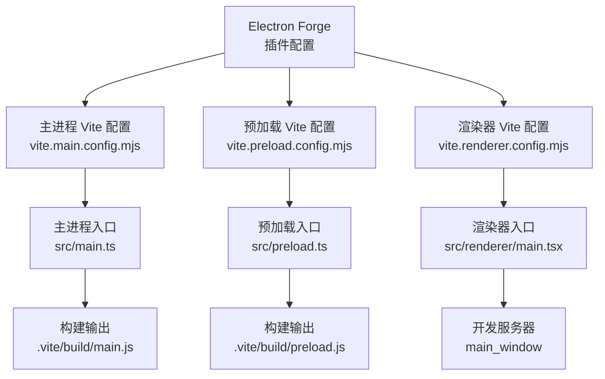
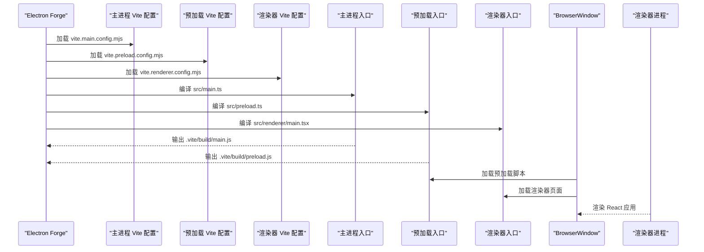
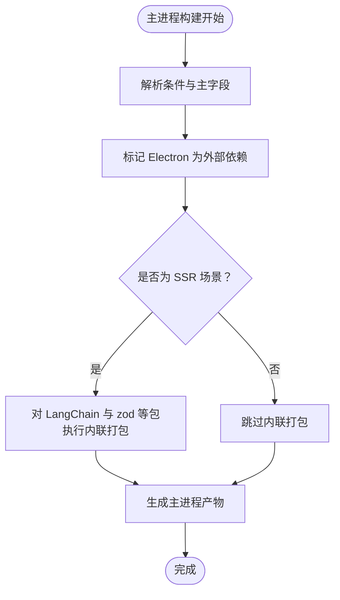
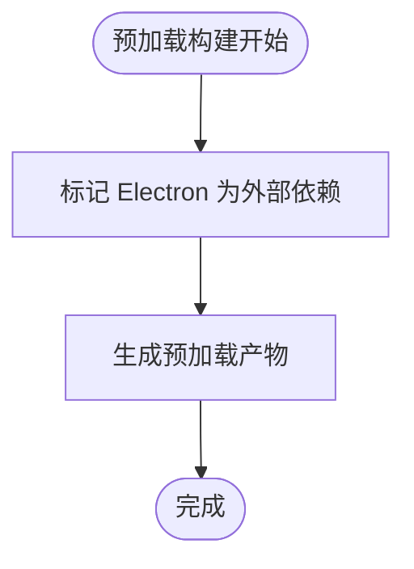
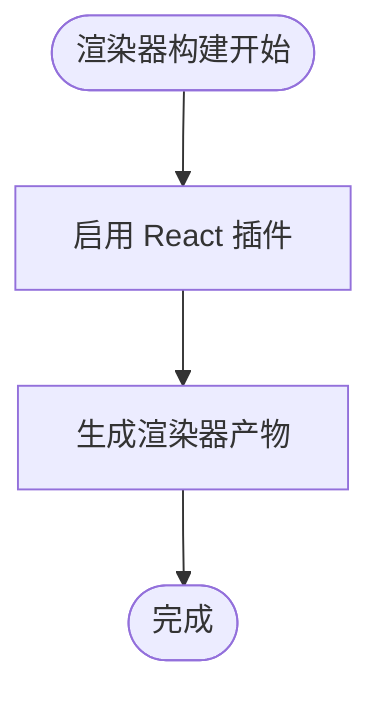
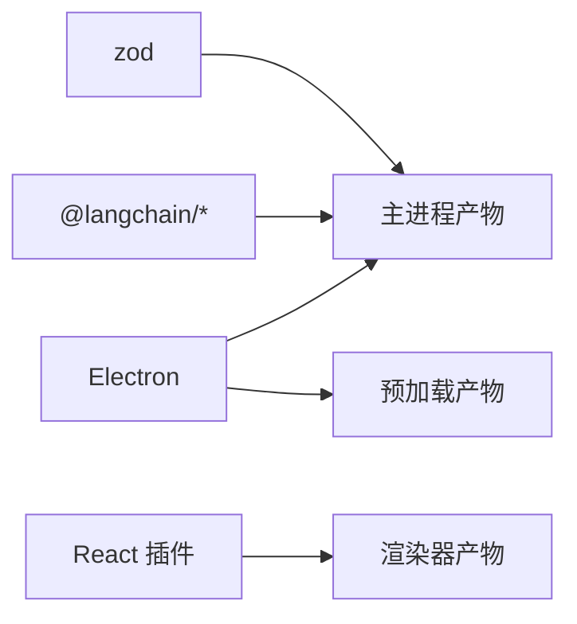

# Vite 构建配置

<cite>
**本文引用的文件**
- [vite.main.config.mjs](file://vite.main.config.mjs)
- [vite.preload.config.mjs](file://vite.preload.config.mjs)
- [vite.renderer.config.mjs](file://vite.renderer.config.mjs)
- [forge.config.js](file://forge.config.js)
- [package.json](file://package.json)
- [tsconfig.json](file://tsconfig.json)
- [src/main.ts](file://src/main.ts)
- [src/preload.ts](file://src/preload.ts)
- [src/renderer/main.tsx](file://src/renderer/main.tsx)
- [开发文档.md](file://开发文档.md)
</cite>

## 目录
1. [简介](#简介)
2. [项目结构](#项目结构)
3. [核心组件](#核心组件)
4. [架构总览](#架构总览)
5. [详细组件分析](#详细组件分析)
6. [依赖关系分析](#依赖关系分析)
7. [性能考虑](#性能考虑)
8. [故障排除指南](#故障排除指南)
9. [结论](#结论)
10. [附录](#附录)

## 简介
本文件系统性地文档化 langGraph 项目中基于 Electron Forge 的 Vite 构建配置，重点解释三个独立的 Vite 配置文件在 Electron 主进程、预加载脚本和渲染器进程中的职责与差异，并结合 TypeScript 配置与 Vite 集成方式，给出优化建议、自定义扩展思路与常见问题排查方法。目标是帮助开发者理解并按需调整构建配置以满足特定业务场景。

## 项目结构
langGraph 使用 Electron Forge 的 Vite 插件统一管理三类产物：
- 主进程（main）：运行 Electron 主线程逻辑，负责窗口创建、IPC、应用生命周期等。
- 预加载脚本（preload）：在隔离上下文中暴露受控 API 给渲染器使用。
- 渲染器（renderer）：React 应用，通过 Vite 进行开发与构建。

Electron Forge 的插件配置将上述三类构建分别映射到对应的入口与 Vite 配置文件，形成清晰的职责边界。

图表来源
- [forge.config.js:20-39](file://forge.config.js#L20-L39)
- [vite.main.config.mjs:1-24](file://vite.main.config.mjs#L1-L24)
- [vite.preload.config.mjs:1-10](file://vite.preload.config.mjs#L1-L10)
- [vite.renderer.config.mjs:1-7](file://vite.renderer.config.mjs#L1-L7)
- [src/main.ts:1-100](file://src/main.ts#L1-L100)
- [src/preload.ts:1-18](file://src/preload.ts#L1-L18)
- [src/renderer/main.tsx:1-8](file://src/renderer/main.tsx#L1-L8)

章节来源
- [forge.config.js:19-39](file://forge.config.js#L19-L39)
- [开发文档.md:195-262](file://开发文档.md#L195-L262)

## 核心组件
本节概述三个 Vite 配置文件的核心作用与关键选项，以及它们如何与 Electron 和 TypeScript 协同工作。

- 主进程配置（vite.main.config.mjs）
  - 解析条件与主字段：通过解析条件与主字段控制模块解析行为，确保 Electron 主进程侧的模块解析符合预期。
  - 外部依赖：将 Electron 设为外部依赖，避免打包进主进程产物。
  - SSR 内联策略：对特定 LangChain 生态与 zod 等包采用“不外部化”策略，确保这些包在 SSR 场景下可被正确打包。
  - 适用场景：主进程代码需要访问 Electron API 且依赖大量 ESM-only 的第三方库。

- 预加载配置（vite.preload.config.mjs）
  - 外部依赖：将 Electron 设为外部依赖，保证预加载脚本在打包后仍能通过 Node 环境访问 Electron。
  - 适用场景：预加载脚本仅负责桥接渲染器与主进程，无需复杂前端框架。

- 渲染器配置（vite.renderer.config.mjs）
  - 插件：启用 React 插件以支持 JSX 与 React 开发体验。
  - 适用场景：React 应用开发与热更新，配合 Electron Forge 的开发服务器。

章节来源
- [vite.main.config.mjs:3-23](file://vite.main.config.mjs#L3-L23)
- [vite.preload.config.mjs:3-9](file://vite.preload.config.mjs#L3-L9)
- [vite.renderer.config.mjs:4-6](file://vite.renderer.config.mjs#L4-L6)

## 架构总览
下图展示了 Electron Forge 如何将三类构建入口与 Vite 配置进行绑定，并描述主进程、预加载脚本与渲染器之间的交互关系。

图表来源
- [forge.config.js:20-39](file://forge.config.js#L20-L39)
- [src/main.ts:36-62](file://src/main.ts#L36-L62)
- [src/preload.ts:1-18](file://src/preload.ts#L1-L18)
- [src/renderer/main.tsx:1-8](file://src/renderer/main.tsx#L1-L8)

## 详细组件分析

### 主进程 Vite 配置（vite.main.config.mjs）
- 解析条件（conditions）
  - 作用：影响模块解析时的条件选择，例如在 Node 环境下优先选择某些入口或导出。
  - 影响：有助于在 Electron 主进程中正确解析 ESM/CJS 混合生态下的包。
- 主字段（mainFields）
  - 作用：指定模块解析时优先查找的字段顺序，提升对现代包的兼容性。
- 外部依赖（rollupOptions.external）
  - 作用：将 Electron 标记为外部依赖，避免将其打包进主进程产物，减少体积并避免重复加载。
- SSR 设置（ssr.noExternal）
  - 作用：将 LangChain 生态与 zod 等包标记为“不外部化”，确保这些包在 SSR 场景下被内联打包，解决 CJS/ESM 兼容问题。
  - 适用范围：主进程侧的 SSR 打包流程。

图表来源
- [vite.main.config.mjs:4-22](file://vite.main.config.mjs#L4-L22)

章节来源
- [vite.main.config.mjs:3-23](file://vite.main.config.mjs#L3-L23)

### 预加载 Vite 配置（vite.preload.config.mjs）
- 外部依赖（rollupOptions.external）
  - 作用：将 Electron 标记为外部依赖，使预加载脚本在打包后仍可通过 Node 环境访问 Electron API。
  - 适用场景：预加载脚本仅负责桥接渲染器与主进程，无需打包 Electron。

图表来源
- [vite.preload.config.mjs:4-8](file://vite.preload.config.mjs#L4-L8)

章节来源
- [vite.preload.config.mjs:3-9](file://vite.preload.config.mjs#L3-L9)

### 渲染器 Vite 配置（vite.renderer.config.mjs）
- 插件（plugins）
  - 作用：启用 React 插件，支持 JSX 语法与 React 开发体验。
- 适用场景：React 应用开发与热更新，配合 Electron Forge 的开发服务器。

图表来源
- [vite.renderer.config.mjs:4-6](file://vite.renderer.config.mjs#L4-L6)

章节来源
- [vite.renderer.config.mjs:4-6](file://vite.renderer.config.mjs#L4-L6)

### TypeScript 配置与 Vite 集成
- 编译器选项（tsconfig.json）
  - 目标与模块：ESNext 目标与 ESNext 模块，适配现代打包链路。
  - 模块解析：bundler，便于与 Vite/Rollup 的解析策略一致。
  - JSX：react-jsx，与 React 插件配合。
  - 路径别名：@/* 映射至 src/*，简化导入路径。
  - 严格模式与检查：strict、skipLibCheck、isolatedModules 等，提升类型安全与构建稳定性。
- 与 Vite 的协同
  - Vite 通过其内置的 TypeScript 支持处理 TS/TSX 文件，结合 tsconfig.json 的编译选项，确保类型检查与构建一致性。

章节来源
- [tsconfig.json:2-18](file://tsconfig.json#L2-L18)
- [vite.renderer.config.mjs:5-5](file://vite.renderer.config.mjs#L5-L5)

### Electron Forge 插件绑定
- 构建绑定（build 数组）
  - 主进程：entry 指向 src/main.ts，config 指向 vite.main.config.mjs，target 为 main。
  - 预加载：entry 指向 src/preload.ts，config 指向 vite.preload.config.mjs，target 为 preload。
- 渲染器绑定（renderer 数组）
  - 名称为 main_window，config 指向 vite.renderer.config.mjs。
- 打包策略
  - asar 启用，将源码打包为 asar 归档，保护源码。

章节来源
- [forge.config.js:20-39](file://forge.config.js#L20-L39)
- [开发文档.md:195-262](file://开发文档.md#L195-L262)

## 依赖关系分析
- 外部依赖与打包策略
  - Electron：在主进程与预加载配置中均标记为外部依赖，避免重复打包。
  - LangChain 生态与 zod：在主进程 SSR 中设置为“不外部化”，确保这些包被内联打包。
- 模块解析与兼容性
  - 解析条件与主字段的组合提升了对现代包的兼容性，减少因入口字段不匹配导致的解析失败。
- 与 Electron 的集成
  - 主进程通过 preload 脚本暴露受限 API 给渲染器，渲染器通过 Vite 开发服务器进行快速迭代。

图表来源
- [vite.main.config.mjs:10-21](file://vite.main.config.mjs#L10-L21)
- [vite.preload.config.mjs:6-6](file://vite.preload.config.mjs#L6-L6)
- [vite.renderer.config.mjs:5-5](file://vite.renderer.config.mjs#L5-L5)

章节来源
- [vite.main.config.mjs:9-22](file://vite.main.config.mjs#L9-L22)
- [vite.preload.config.mjs:4-8](file://vite.preload.config.mjs#L4-L8)
- [vite.renderer.config.mjs:4-6](file://vite.renderer.config.mjs#L4-L6)

## 性能考虑
- 外部依赖与体积控制
  - 将 Electron 标记为外部依赖，避免重复打包，降低主进程与预加载产物体积。
- 内联策略与兼容性权衡
  - 对 LangChain 生态与 zod 采用“不外部化”策略，虽然会增加体积，但能显著减少运行时兼容性问题。
- 模块解析优化
  - 合理设置解析条件与主字段，减少不必要的解析尝试，提升构建速度。
- 开发体验
  - 渲染器启用 React 插件，结合 Electron Forge 的开发服务器，提供快速热更新体验。

## 故障排除指南
- SSR 场景下包未被正确打包
  - 现象：运行时报错提示找不到 LangChain 或 zod。
  - 排查：确认主进程配置中的 SSR noExternal 列表是否包含对应包。
  - 参考位置：[vite.main.config.mjs:13-22](file://vite.main.config.mjs#L13-L22)
- Electron API 在主进程或预加载中不可用
  - 现象：无法访问 window.electron 或 ipcRenderer。
  - 排查：确认外部依赖配置是否正确，Electron 是否被标记为 external；同时检查主进程 preload 配置与窗口创建逻辑。
  - 参考位置：[vite.preload.config.mjs:4-8](file://vite.preload.config.mjs#L4-L8)，[src/main.ts:44-47](file://src/main.ts#L44-L47)
- 渲染器无法识别 JSX
  - 现象：TypeScript 报错 JSX 未定义。
  - 排查：确认已启用 React 插件并设置正确的 JSX 编译选项。
  - 参考位置：[vite.renderer.config.mjs:5-5](file://vite.renderer.config.mjs#L5-L5)，[tsconfig.json:6-6](file://tsconfig.json#L6-L6)
- 构建后资源路径错误
  - 现象：开发环境正常，打包后静态资源 404。
  - 排查：检查 Electron Forge 的开发服务器与打包输出路径配置，确认渲染器入口与 HTML 加载路径一致。
  - 参考位置：[forge.config.js:33-38](file://forge.config.js#L33-L38)，[src/main.ts:50-57](file://src/main.ts#L50-L57)

## 结论
langGraph 的 Vite 构建配置围绕 Electron 的三大角色进行了精细化拆分：主进程侧重 SSR 兼容与外部依赖控制，预加载强调最小化打包与 API 暴露，渲染器聚焦 React 开发体验。通过 Electron Forge 的插件绑定与 TypeScript 的严格配置，整体构建链路具备良好的可维护性与扩展性。根据实际业务需求，可在解析条件、外部依赖与内联策略上进一步优化，以平衡体积、性能与兼容性。

## 附录
- 自定义构建选项建议
  - 主进程：如需引入更多 ESM-only 包，可在 SSR noExternal 中追加；如需减少体积，可评估移除不必要的外部依赖。
  - 预加载：保持 Electron 外部化；如需引入 Node 工具函数，注意仅暴露必要 API 并进行参数校验。
  - 渲染器：根据团队偏好启用或禁用严格模式；如需样式预处理，可添加相应插件。
- 最佳实践
  - 保持三类配置职责单一，避免跨域混用。
  - 在 Electron Forge 插件中明确区分 build 与 renderer 的入口与配置文件。
  - 使用 tsconfig.json 的路径别名与严格选项，提升类型安全与可维护性。
- 实际示例与参考
  - 主进程配置示例：[vite.main.config.mjs:3-23](file://vite.main.config.mjs#L3-L23)
  - 预加载配置示例：[vite.preload.config.mjs:3-9](file://vite.preload.config.mjs#L3-L9)
  - 渲染器配置示例：[vite.renderer.config.mjs:4-6](file://vite.renderer.config.mjs#L4-L6)
  - Forge 插件绑定示例：[forge.config.js:20-39](file://forge.config.js#L20-L39)
  - TypeScript 配置示例：[tsconfig.json:2-18](file://tsconfig.json#L2-L18)