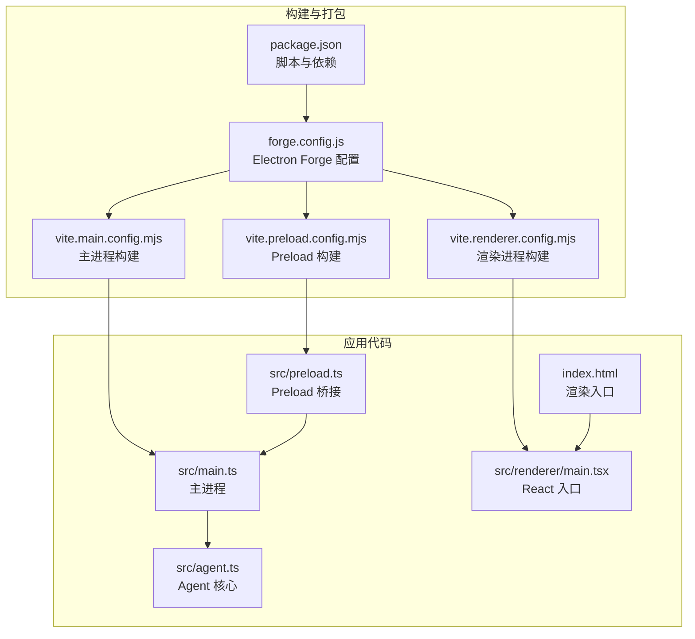
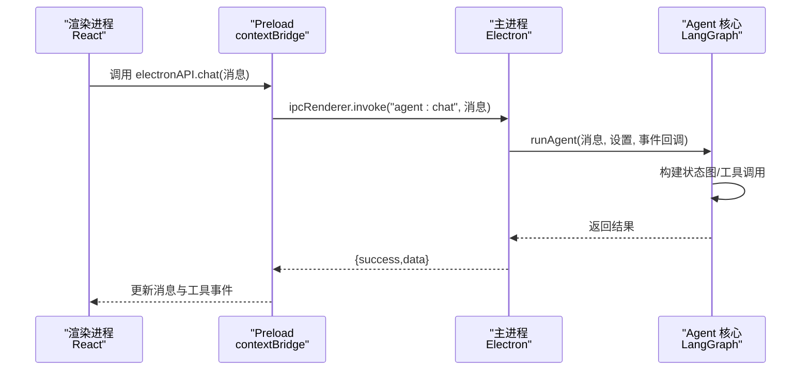
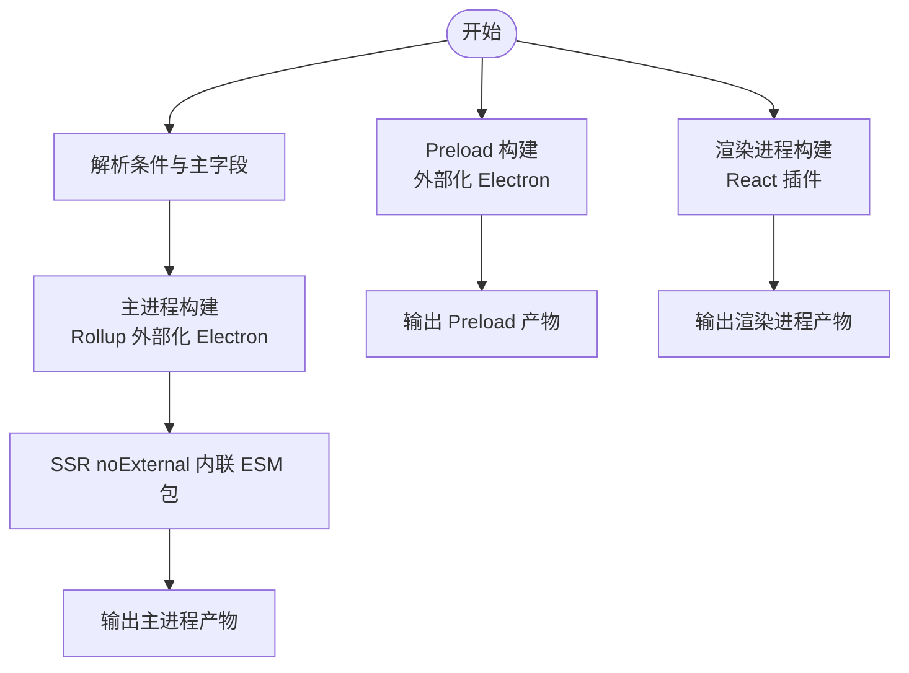
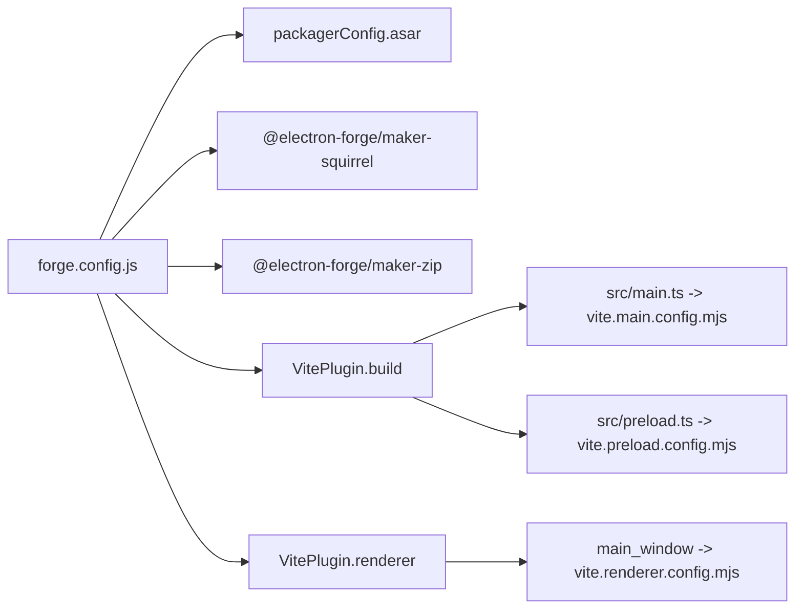
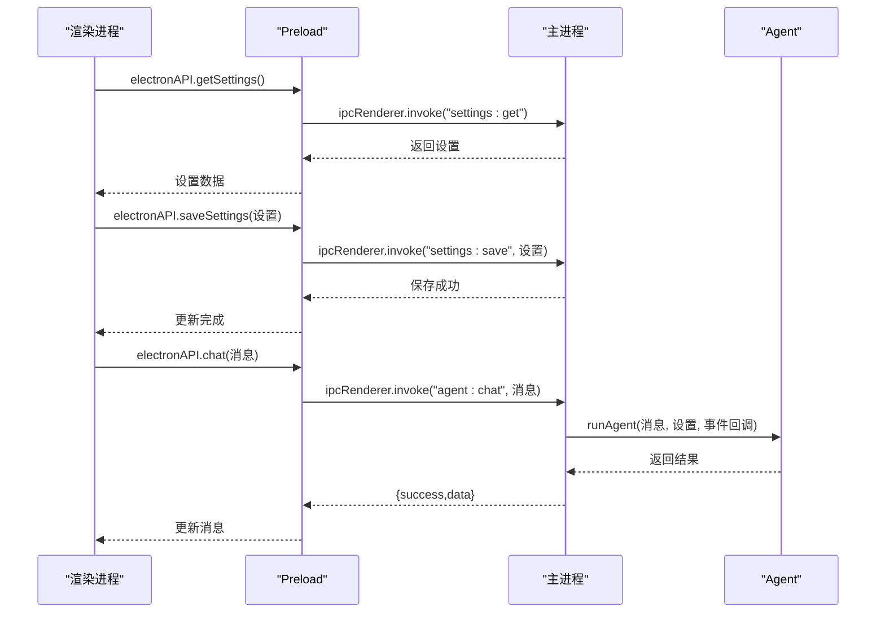
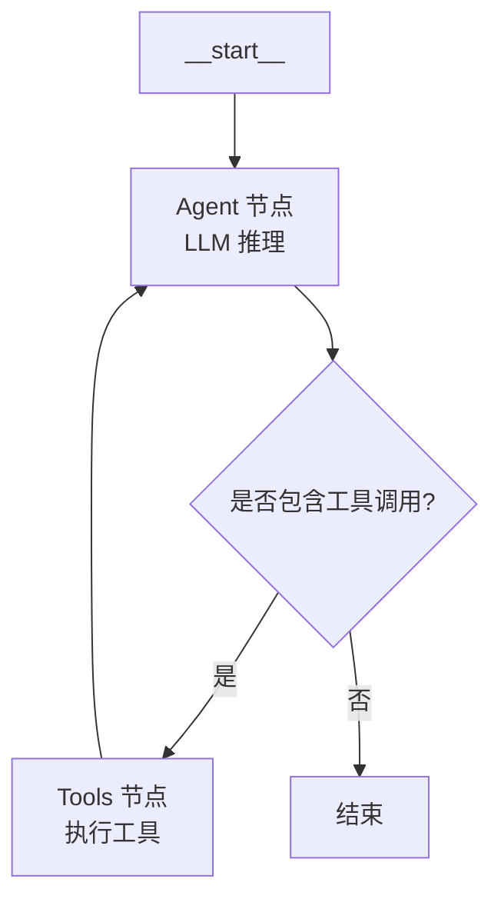
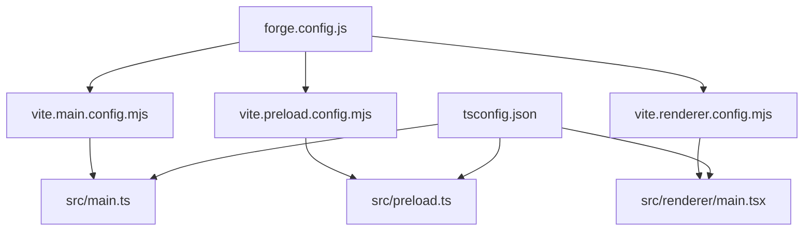

# 构建与部署

<cite>
**本文引用的文件**
- [package.json](file://package.json)
- [forge.config.js](file://forge.config.js)
- [vite.renderer.config.mjs](file://vite.renderer.config.mjs)
- [vite.main.config.mjs](file://vite.main.config.mjs)
- [vite.preload.config.mjs](file://vite.preload.config.mjs)
- [src/main.ts](file://src/main.ts)
- [src/preload.ts](file://src/preload.ts)
- [index.html](file://index.html)
- [src/agent.ts](file://src/agent.ts)
- [src/renderer/main.tsx](file://src/renderer/main.tsx)
- [tsconfig.json](file://tsconfig.json)
- [开发文档.md](file://开发文档.md)
</cite>

## 目录
1. [简介](#简介)
2. [项目结构](#项目结构)
3. [核心组件](#核心-components)
4. [架构总览](#架构总览)
5. [详细组件分析](#详细组件分析)
6. [依赖关系分析](#依赖关系分析)
7. [性能考量](#性能考量)
8. [故障排查指南](#故障排查指南)
9. [结论](#结论)
10. [附录](#附录)

## 简介
本文件面向 DevOps 与工程团队，系统化梳理 langGraph 桌面应用的构建与部署流程，覆盖：
- Vite 多入口构建策略与资源优化
- Electron Forge 打包、签名与分发
- 跨平台构建差异（Windows、macOS、Linux）
- 开发与生产构建策略、代码分割与懒加载
- 构建优化技巧、性能监控与错误排查
- CI/CD 与自动化发布
- 版本管理、热更新与向后兼容
- 面向运维的最佳实践

## 项目结构
该项目采用 Electron + React + Vite + LangGraph 的桌面应用架构，核心目录与职责如下：
- src/main.ts：Electron 主进程入口，负责窗口创建、IPC、设置持久化与 Agent 调用
- src/preload.ts：Preload 脚本，通过 contextBridge 暴露受控 API 至渲染进程
- src/agent.ts：LangGraph Agent 核心逻辑，定义状态图、工具与 LLM 接入
- src/renderer：React 前端应用，包含入口、根组件与 UI 组件
- vite.*.config.mjs：分别针对主进程、preload、渲染进程的 Vite 配置
- forge.config.js：Electron Forge 构建与打包配置
- package.json：脚本、依赖与主入口
- index.html：渲染进程 HTML 入口
- tsconfig.json：TypeScript 编译配置

图表来源
- [forge.config.js:1-42](file://forge.config.js#L1-L42)
- [vite.main.config.mjs:1-24](file://vite.main.config.mjs#L1-L24)
- [vite.preload.config.mjs:1-10](file://vite.preload.config.mjs#L1-L10)
- [vite.renderer.config.mjs:1-7](file://vite.renderer.config.mjs#L1-L7)
- [src/main.ts:1-100](file://src/main.ts#L1-L100)
- [src/preload.ts:1-18](file://src/preload.ts#L1-L18)
- [src/agent.ts:1-316](file://src/agent.ts#L1-L316)
- [src/renderer/main.tsx:1-8](file://src/renderer/main.tsx#L1-L8)
- [index.html:1-13](file://index.html#L1-L13)

章节来源
- [开发文档.md:152-190](file://开发文档.md#L152-L190)

## 核心组件
- Electron Forge + Vite 插件：通过 forge.config.js 配置多入口构建与渲染开发服务器，结合 vite.*.config.mjs 实现主进程、preload、渲染进程的差异化构建
- 主进程（src/main.ts）：窗口生命周期、IPC 处理、设置持久化、调用 Agent 并回传结果
- Preload（src/preload.ts）：通过 contextBridge 暴露受限 API，封装 IPC invoke/on 模式
- Agent（src/agent.ts）：LangGraph 状态图、工具系统、LLM 接入（OpenAI/Ollama）、工具事件回调
- 渲染进程（src/renderer/main.tsx + index.html）：React 应用入口与 HTML 入口

章节来源
- [forge.config.js:19-40](file://forge.config.js#L19-L40)
- [src/main.ts:36-99](file://src/main.ts#L36-L99)
- [src/preload.ts:3-17](file://src/preload.ts#L3-L17)
- [src/agent.ts:171-262](file://src/agent.ts#L171-L262)
- [src/renderer/main.tsx:1-8](file://src/renderer/main.tsx#L1-L8)
- [index.html:8-12](file://index.html#L8-L12)

## 架构总览
Electron 应用的三层架构：渲染进程（React）、Preload（安全桥接）、主进程（Node.js）。Forge + Vite 负责将三类入口分别构建并注入 Electron。

图表来源
- [src/preload.ts:5-16](file://src/preload.ts#L5-L16)
- [src/main.ts:65-84](file://src/main.ts#L65-L84)
- [src/agent.ts:279-315](file://src/agent.ts#L279-L315)

## 详细组件分析

### Vite 多入口构建与资源优化
- 渲染进程构建：vite.renderer.config.mjs 仅启用 React 插件，适合开发与生产构建
- 主进程构建：vite.main.config.mjs
  - 解析条件与主字段：确保模块解析符合 Node 环境
  - Rollup 外部化 Electron：避免将 Electron 打包进主进程产物
  - SSR noExternal：将 LangChain/LangGraph 等纯 ESM 包内联，解决 CJS/ESM 兼容问题
- Preload 构建：vite.preload.config.mjs 外部化 Electron，保证 preload 产物体积小、加载快

图表来源
- [vite.main.config.mjs:4-23](file://vite.main.config.mjs#L4-L23)
- [vite.preload.config.mjs:4-9](file://vite.preload.config.mjs#L4-L9)
- [vite.renderer.config.mjs:4-6](file://vite.renderer.config.mjs#L4-L6)

章节来源
- [vite.main.config.mjs:1-24](file://vite.main.config.mjs#L1-L24)
- [vite.preload.config.mjs:1-10](file://vite.preload.config.mjs#L1-L10)
- [vite.renderer.config.mjs:1-7](file://vite.renderer.config.mjs#L1-L7)

### Electron Forge 打包与分发
- asar 启用：packagerConfig.asar=true，将源码归档以保护源码
- 制作器（Makers）：
  - Squirrel（Windows 安装程序）
  - ZIP（Windows 压缩包）
- 插件（Plugins）：VitePlugin 配置
  - build：主进程与 preload 的入口与配置映射
  - renderer：渲染进程开发服务器与构建配置

图表来源
- [forge.config.js:4-40](file://forge.config.js#L4-L40)

章节来源
- [forge.config.js:1-42](file://forge.config.js#L1-L42)

### 跨平台构建差异与特殊配置
- Windows：Squirrel 安装器与 ZIP 压缩包；可配合 NSIS 或 MSI 制作器（当前未启用）
- macOS/Linux：可通过 makers 数组扩展对应制作器；注意签名与公证（见后续章节）

章节来源
- [forge.config.js:7-18](file://forge.config.js#L7-L18)

### 开发与生产构建策略
- 开发模式：npm start 启动 Vite 开发服务器，Electron 加载开发地址；主进程与 preload 同步构建
- 生产模式：npm run make 触发 Forge 制作器，生成安装包或压缩包；asar 启用

章节来源
- [package.json:6-11](file://package.json#L6-L11)
- [src/main.ts:50-57](file://src/main.ts#L50-L57)

### 代码分割与懒加载
- 当前项目未显式配置代码分割策略；建议在渲染进程按路由或组件维度进行动态导入，以减少首屏体积
- 可结合 Vite 的动态 import 与 React.lazy/Suspense 实现组件级懒加载

章节来源
- [开发文档.md:532-542](file://开发文档.md#L532-L542)

### Electron 主进程与 IPC 设计
- 主进程负责窗口创建、生命周期管理、IPC 处理与设置持久化
- IPC 使用 handle/invoke 模式，确保类型安全与异步通信
- 工具事件通过 send/on 单向推送至渲染进程，实现实时反馈

图表来源
- [src/preload.ts:14-17](file://src/preload.ts#L14-L17)
- [src/main.ts:76-84](file://src/main.ts#L76-L84)
- [src/agent.ts:279-315](file://src/agent.ts#L279-L315)

章节来源
- [src/main.ts:36-99](file://src/main.ts#L36-L99)
- [src/preload.ts:1-18](file://src/preload.ts#L1-L18)

### Agent 与工具系统
- 状态图：Agent 节点 → 条件路由 → Tools 节点 → Agent 循环直至结束
- 工具：计算器、时间获取、文本分析、随机数；通过 bindTools 注入 LLM
- 事件：工具开始/结束事件通过回调传递至主进程，再由主进程推送到渲染进程

图表来源
- [src/agent.ts:240-261](file://src/agent.ts#L240-L261)

章节来源
- [src/agent.ts:171-262](file://src/agent.ts#L171-L262)

## 依赖关系分析
- Forge 依赖 VitePlugin，将 src/main.ts、src/preload.ts、渲染进程分别构建
- 主进程构建依赖 vite.main.config.mjs 的 SSR noExternal 配置以兼容 LangChain ESM 包
- 渲染进程构建依赖 vite.renderer.config.mjs 的 React 插件
- TypeScript 编译配置 tsconfig.json 控制模块解析与路径别名

图表来源
- [forge.config.js:19-40](file://forge.config.js#L19-L40)
- [vite.main.config.mjs:1-24](file://vite.main.config.mjs#L1-L24)
- [vite.preload.config.mjs:1-10](file://vite.preload.config.mjs#L1-L10)
- [vite.renderer.config.mjs:1-7](file://vite.renderer.config.mjs#L1-L7)
- [tsconfig.json:1-22](file://tsconfig.json#L1-L22)

章节来源
- [package.json:13-34](file://package.json#L13-L34)
- [开发文档.md:195-234](file://开发文档.md#L195-L234)

## 性能考量
- 主进程体积优化：preload 外部化 Electron，主进程 noExternal 仅保留必要包
- 渲染进程优化：按需动态导入组件、拆分 vendor chunk、启用压缩
- IPC 优化：使用 invoke/handle 减少同步阻塞；事件推送采用单向监听
- 构建缓存：Vite HMR 与 Forge 缓存策略提升开发效率
- 资源加载：HTML 入口指向 React 入口模块，避免不必要的静态资源

章节来源
- [vite.preload.config.mjs:4-9](file://vite.preload.config.mjs#L4-L9)
- [vite.main.config.mjs:13-23](file://vite.main.config.mjs#L13-L23)
- [src/renderer/main.tsx:1-8](file://src/renderer/main.tsx#L1-L8)
- [index.html:10](file://index.html#L10)

## 故障排查指南
- ESM/CJS 兼容问题：确认 vite.main.config.mjs 的 ssr.noExternal 是否包含 LangChain/LangGraph 相关包
- IPC 通信异常：检查 preload 暴露的 API 名称与主进程 handle 名称是否一致
- 开发模式无法热更新：确认 vite.renderer.config.mjs 的插件配置与开发服务器端口
- 打包失败：检查 asar 配置与 makers 平台限制；Windows 平台需满足 Squirrel 要求
- 设置持久化失败：确认 userData 目录写权限与 JSON 文件格式

章节来源
- [vite.main.config.mjs:13-23](file://vite.main.config.mjs#L13-L23)
- [src/preload.ts:3-17](file://src/preload.ts#L3-L17)
- [src/main.ts:14-31](file://src/main.ts#L14-L31)
- [forge.config.js:4-18](file://forge.config.js#L4-L18)

## 结论
本项目通过 Forge + Vite 的组合，实现了 Electron 桌面应用的高效构建与稳定打包。主进程 ESM/CJS 兼容、Preload 安全桥接、LangGraph Agent 的状态图设计与工具系统，共同构成了可扩展、可维护的桌面 AI Agent 架构。建议在生产环境中进一步完善代码分割、懒加载与资源压缩策略，并补充跨平台签名与自动化发布流程。

## 附录

### CI/CD 与自动化发布
- 建议在 CI 中执行：
  - 依赖安装与类型检查
  - 开发模式构建与测试
  - 生产模式构建与打包
  - 平台特定签名与公证（Windows：代码签名；macOS：Apple 证书；Linux：Debian/Mac 包签名）
  - 自动上传至发布渠道（如 GitHub Releases、企业内网仓库）
- 可使用 GitHub Actions/Azure Pipelines/Jenkins 等工具链实现流水线编排

章节来源
- [开发文档.md:532-542](file://开发文档.md#L532-L542)

### 版本管理、热更新与向后兼容
- 版本管理：语义化版本（SemVer），变更日志记录重大改动
- 热更新：可考虑基于 Squirrel 的更新机制或第三方热更新方案（需评估安全与稳定性）
- 向后兼容：主进程 API 保持稳定；preload 暴露接口遵循契约；LangGraph 状态图演进需谨慎

章节来源
- [开发文档.md:651-672](file://开发文档.md#L651-L672)

### DevOps 最佳实践
- 构建镜像：固定 Node.js 与 Python 版本，预装依赖
- 安全基线：启用 asar、代码签名、最小权限原则
- 监控与日志：收集主进程与渲染进程异常日志，上报至集中式日志系统
- 回滚策略：灰度发布与快速回滚机制

章节来源
- [forge.config.js:4-18](file://forge.config.js#L4-L18)
- [开发文档.md:511-542](file://开发文档.md#L511-L542)