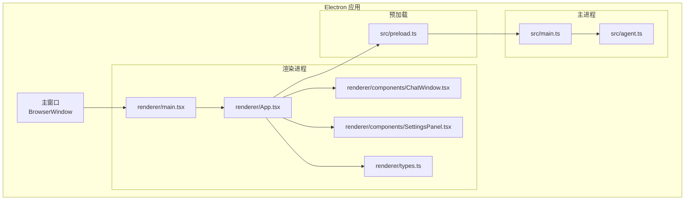
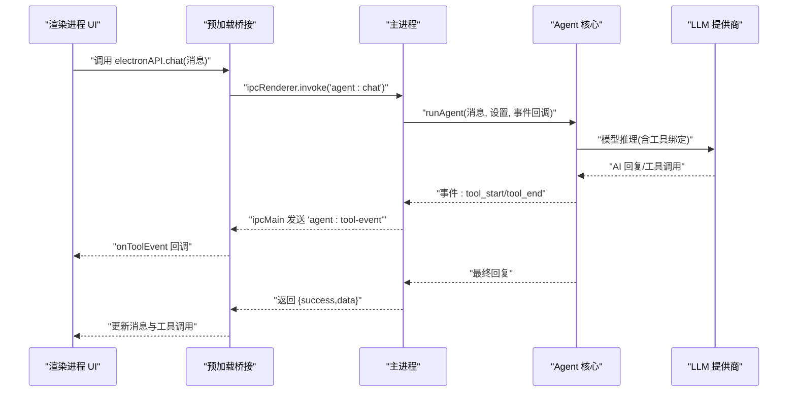
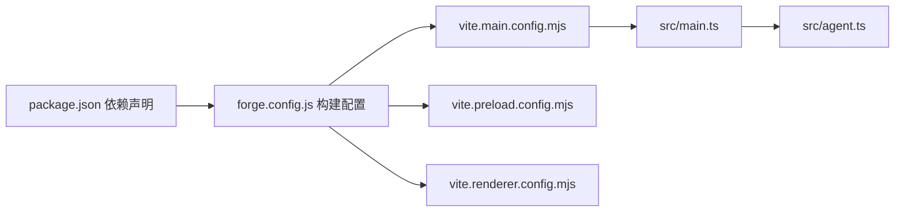

# 生产环境优化

<cite>
**本文引用的文件**
- [package.json](file://package.json)
- [forge.config.js](file://forge.config.js)
- [vite.main.config.mjs](file://vite.main.config.mjs)
- [vite.preload.config.mjs](file://vite.preload.config.mjs)
- [vite.renderer.config.mjs](file://vite.renderer.config.mjs)
- [src/main.ts](file://src/main.ts)
- [src/preload.ts](file://src/preload.ts)
- [src/renderer/main.tsx](file://src/renderer/main.tsx)
- [src/renderer/App.tsx](file://src/renderer/App.tsx)
- [src/renderer/components/ChatWindow.tsx](file://src/renderer/components/ChatWindow.tsx)
- [src/renderer/components/SettingsPanel.tsx](file://src/renderer/components/SettingsPanel.tsx)
- [src/renderer/types.ts](file://src/renderer/types.ts)
- [src/agent.ts](file://src/agent.ts)
- [index.html](file://index.html)
- [开发文档.md](file://开发文档.md)
</cite>

## 目录
1. [简介](#简介)
2. [项目结构](#项目结构)
3. [核心组件](#核心组件)
4. [架构总览](#架构总览)
5. [详细组件分析](#详细组件分析)
6. [依赖分析](#依赖分析)
7. [性能考虑](#性能考虑)
8. [故障排查指南](#故障排查指南)
9. [结论](#结论)
10. [附录](#附录)

## 简介
本文件面向 langGraph 的生产环境优化，聚焦于构建与运行时性能、资源体积与加载速度、内存占用与启动时间、以及可观测性与 A/B 测试方法。结合仓库现有的 Electron + Vite + React + LangGraph 架构，给出可落地的优化策略与实践建议。

## 项目结构
该项目采用 Electron + Vite 的多入口构建：主进程、preload、渲染进程分别独立配置，配合 Electron Forge 插件完成打包与分发。前端使用 React + TypeScript，后端核心逻辑集中在主进程并通过 IPC 与渲染进程交互。

**图表来源**
- [src/renderer/main.tsx:1-8](file://src/renderer/main.tsx#L1-L8)
- [src/renderer/App.tsx:1-140](file://src/renderer/App.tsx#L1-L140)
- [src/renderer/components/ChatWindow.tsx:1-114](file://src/renderer/components/ChatWindow.tsx#L1-L114)
- [src/renderer/components/SettingsPanel.tsx:1-139](file://src/renderer/components/SettingsPanel.tsx#L1-L139)
- [src/renderer/types.ts:1-49](file://src/renderer/types.ts#L1-L49)
- [src/main.ts:1-100](file://src/main.ts#L1-L100)
- [src/preload.ts:1-18](file://src/preload.ts#L1-L18)
- [src/agent.ts:1-316](file://src/agent.ts#L1-L316)

**章节来源**
- [开发文档.md:152-190](file://开发文档.md#L152-L190)
- [forge.config.js:1-42](file://forge.config.js#L1-L42)
- [vite.main.config.mjs:1-24](file://vite.main.config.mjs#L1-L24)
- [vite.preload.config.mjs:1-10](file://vite.preload.config.mjs#L1-L10)
- [vite.renderer.config.mjs:1-7](file://vite.renderer.config.mjs#L1-L7)

## 核心组件
- 主进程：负责窗口创建、IPC 处理、设置持久化、调用 LangGraph Agent 并回传结果。
- 预加载：通过 contextBridge 暴露受控 API，实现渲染进程与主进程的安全通信。
- 渲染进程：React 应用，负责 UI 呈现、用户交互、工具事件展示与设置管理。
- Agent 核心：基于 LangGraph 的状态图，封装工具与 LLM 调用，支持 OpenAI/Ollama。

**章节来源**
- [src/main.ts:1-100](file://src/main.ts#L1-L100)
- [src/preload.ts:1-18](file://src/preload.ts#L1-L18)
- [src/renderer/App.tsx:1-140](file://src/renderer/App.tsx#L1-L140)
- [src/agent.ts:1-316](file://src/agent.ts#L1-L316)

## 架构总览
渲染进程通过 preload 暴露的 API 调用主进程 IPC；主进程根据用户设置选择 LLM 提供商，构建 LangGraph Agent 并执行推理循环，期间通过 IPC 推送工具事件；渲染进程接收事件并更新 UI。

**图表来源**
- [src/renderer/App.tsx:43-84](file://src/renderer/App.tsx#L43-L84)
- [src/preload.ts:3-17](file://src/preload.ts#L3-L17)
- [src/main.ts:65-84](file://src/main.ts#L65-L84)
- [src/agent.ts:279-315](file://src/agent.ts#L279-L315)

## 详细组件分析

### 代码分割策略
- 渲染进程按需加载：当前入口为单页应用，建议对重型组件与页面进行动态导入，减少首屏 JS 体积。
- 工具与模型按需加载：根据用户设置延迟初始化 LLM 与工具集合，避免不必要的初始化成本。
- 第三方库拆分：将 React、LangChain、Zod 等大体量依赖拆分为独立 chunk，便于缓存与增量更新。

实施建议（不展示具体代码，仅提供路径参考）：
- 在渲染入口处对重型组件使用动态导入，参考 [src/renderer/App.tsx:1-140](file://src/renderer/App.tsx#L1-L140) 的组件组织方式。
- 对 LLM 与工具初始化进行惰性封装，参考 [src/agent.ts:171-176](file://src/agent.ts#L171-L176) 的图构建与 [src/agent.ts:43-137](file://src/agent.ts#L43-L137) 的工具定义。

**章节来源**
- [src/renderer/App.tsx:1-140](file://src/renderer/App.tsx#L1-L140)
- [src/agent.ts:171-176](file://src/agent.ts#L171-L176)
- [src/agent.ts:43-137](file://src/agent.ts#L43-L137)

### 懒加载实现
- 渲染侧：将 SettingsPanel、MessageBubble 等组件改为动态导入，降低首屏依赖。
- 主进程侧：仅在首次对话时构建 LangGraph 图，避免常驻内存占用。
- 预加载：保持轻量，仅暴露必要 API。

实施建议（不展示具体代码，仅提供路径参考）：
- 参考 [src/renderer/components/SettingsPanel.tsx:1-139](file://src/renderer/components/SettingsPanel.tsx#L1-L139) 的组件结构，将其改为动态导入。
- 参考 [src/main.ts:65-84](file://src/main.ts#L65-L84) 的 IPC 处理，延迟构建 Agent 图，参考 [src/agent.ts:279-284](file://src/agent.ts#L279-L284) 的 runAgent 入口。

**章节来源**
- [src/renderer/components/SettingsPanel.tsx:1-139](file://src/renderer/components/SettingsPanel.tsx#L1-L139)
- [src/main.ts:65-84](file://src/main.ts#L65-L84)
- [src/agent.ts:279-284](file://src/agent.ts#L279-L284)

### 资源压缩与 Tree Shaking
- 构建阶段启用压缩：Vite 默认开启 Rollup 压缩，可在生产构建中进一步优化压缩参数。
- Tree Shaking：确保依赖均为 ES Module 导出，避免副作用导致的摇树失败；对第三方库尽量使用 ESM 版本。
- 依赖裁剪：移除未使用的 LangChain 工具与适配器，减少打包体积。

实施建议（不展示具体代码，仅提供路径参考）：
- 参考 [vite.renderer.config.mjs:1-7](file://vite.renderer.config.mjs#L1-L7) 的插件配置，结合生产构建参数启用更激进的压缩。
- 参考 [package.json:13-34](file://package.json#L13-L34) 的依赖声明，按需保留与删除。

**章节来源**
- [vite.renderer.config.mjs:1-7](file://vite.renderer.config.mjs#L1-L7)
- [package.json:13-34](file://package.json#L13-L34)

### 生产构建中的性能优化选项
- Electron 打包：启用 asar 归档，减小分发体积并提升加载速度。
- Vite 构建：针对主进程与 preload 使用独立配置，避免不必要的外部依赖打入。
- SSR/noExternal：维持当前配置以解决 ESM/CJS 兼容问题，避免重复内联导致体积膨胀。

实施建议（不展示具体代码，仅提供路径参考）：
- 参考 [forge.config.js:4-6](file://forge.config.js#L4-L6) 的 asar 配置。
- 参考 [vite.main.config.mjs:8-22](file://vite.main.config.mjs#L8-L22) 的 rollupOptions 与 ssr.noExternal。

**章节来源**
- [forge.config.js:4-6](file://forge.config.js#L4-L6)
- [vite.main.config.mjs:8-22](file://vite.main.config.mjs#L8-L22)

### 缓存策略
- 静态资源缓存：利用浏览器缓存与 Electron 打包产物版本号，实现长效缓存。
- 设置持久化：将用户设置写入 userData 目录，避免每次启动重建。
- IPC 事件去抖：对工具事件推送进行节流，减少 UI 更新频率。

实施建议（不展示具体代码，仅提供路径参考）：
- 参考 [src/main.ts:14-31](file://src/main.ts#L14-L31) 的设置读取与写入。
- 参考 [src/renderer/App.tsx:24-41](file://src/renderer/App.tsx#L24-L41) 的工具事件监听与更新逻辑。

**章节来源**
- [src/main.ts:14-31](file://src/main.ts#L14-L31)
- [src/renderer/App.tsx:24-41](file://src/renderer/App.tsx#L24-L41)

### Bundle 分析方法
- 使用 Vite 插件进行体积分析，定位大体积依赖与重复模块。
- 分析主进程、preload、渲染进程三者体积占比，识别优化空间。
- 对比不同 LLM 提供商与工具数量下的体积变化，指导按需加载策略。

实施建议（不展示具体代码，仅提供路径参考）：
- 在 [vite.main.config.mjs:1-24](file://vite.main.config.mjs#L1-L24)、[vite.preload.config.mjs:1-10](file://vite.preload.config.mjs#L1-L10)、[vite.renderer.config.mjs:1-7](file://vite.renderer.config.mjs#L1-L7) 中集成体积分析插件。
- 对比 [src/agent.ts](file://src/agent.ts#L137) 的工具集合规模对体积的影响。

**章节来源**
- [vite.main.config.mjs:1-24](file://vite.main.config.mjs#L1-L24)
- [vite.preload.config.mjs:1-10](file://vite.preload.config.mjs#L1-L10)
- [vite.renderer.config.mjs:1-7](file://vite.renderer.config.mjs#L1-L7)
- [src/agent.ts](file://src/agent.ts#L137)

### 依赖优化与第三方库处理
- LangChain 生态：维持当前 noExternal 配置以兼容 ESM/CJS，避免二次打包。
- React 与工具库：确保使用 ESM 导出，启用 Tree Shaking；对非必要工具库进行按需引入。
- Electron Forge：使用官方 Vite 插件，保证构建一致性。

实施建议（不展示具体代码，仅提供路径参考）：
- 参考 [vite.main.config.mjs:24-26](file://vite.main.config.mjs#L24-L26) 的 noExternal 列表。
- 参考 [package.json:13-34](file://package.json#L13-L34) 的依赖版本与使用范围。

**章节来源**
- [vite.main.config.mjs:24-26](file://vite.main.config.mjs#L24-L26)
- [package.json:13-34](file://package.json#L13-L34)

### 内存使用优化
- Agent 图复用：在应用生命周期内复用已编译的图实例，避免重复编译带来的内存峰值。
- 工具事件聚合：批量更新消息列表，减少频繁 setState 引起的重渲染与内存抖动。
- 设置持久化：将设置写入磁盘而非常驻内存，降低内存占用。

实施建议（不展示具体代码，仅提供路径参考）：
- 参考 [src/agent.ts:279-284](file://src/agent.ts#L279-L284) 的 runAgent 入口，考虑缓存图实例。
- 参考 [src/renderer/App.tsx:67-83](file://src/renderer/App.tsx#L67-L83) 的消息更新逻辑，合并多次更新。

**章节来源**
- [src/agent.ts:279-284](file://src/agent.ts#L279-L284)
- [src/renderer/App.tsx:67-83](file://src/renderer/App.tsx#L67-L83)

### 启动时间改善
- 预加载脚本最小化：仅暴露必要 API，缩短上下文桥接时间。
- 首屏渲染：将非关键 UI 组件延迟加载，优先保证聊天窗口与输入区域可用。
- IPC 预热：在窗口创建后预热 IPC 通道，减少首次调用延迟。

实施建议（不展示具体代码，仅提供路径参考）：
- 参考 [src/preload.ts:3-17](file://src/preload.ts#L3-L17) 的 API 暴露范围。
- 参考 [src/main.ts:36-62](file://src/main.ts#L36-L62) 的窗口创建时机。
- 参考 [src/renderer/App.tsx:18-22](file://src/renderer/App.tsx#L18-L22) 的设置加载时机。

**章节来源**
- [src/preload.ts:3-17](file://src/preload.ts#L3-L17)
- [src/main.ts:36-62](file://src/main.ts#L36-L62)
- [src/renderer/App.tsx:18-22](file://src/renderer/App.tsx#L18-L22)

### 运行时性能监控方案
- 工具事件采样：记录工具调用耗时与成功率，作为运行时健康指标。
- IPC 延迟：测量从 UI 触发到最终回复的端到端延迟。
- 内存曲线：采集主进程与渲染进程内存使用，识别异常增长点。

实施建议（不展示具体代码，仅提供路径参考）：
- 参考 [src/renderer/App.tsx:24-41](file://src/renderer/App.tsx#L24-L41) 的工具事件监听，增加计时与统计。
- 参考 [src/main.ts:65-84](file://src/main.ts#L65-L84) 的 IPC 处理，增加日志与计时。
- 参考 [src/agent.ts:197-237](file://src/agent.ts#L197-L237) 的工具执行，记录耗时与错误。

**章节来源**
- [src/renderer/App.tsx:24-41](file://src/renderer/App.tsx#L24-L41)
- [src/main.ts:65-84](file://src/main.ts#L65-L84)
- [src/agent.ts:197-237](file://src/agent.ts#L197-L237)

## 依赖分析
- Electron 与 Forge：负责打包与分发，生产构建启用 asar。
- Vite：多入口构建，主进程与 preload 独立配置，渲染进程使用 React 插件。
- LangChain/LangGraph：核心推理与工具系统，需注意 ESM/CJS 兼容。
- React/Zod：UI 与参数校验，建议启用 Tree Shaking。

**图表来源**
- [package.json:13-34](file://package.json#L13-L34)
- [forge.config.js:19-40](file://forge.config.js#L19-L40)
- [vite.main.config.mjs:1-24](file://vite.main.config.mjs#L1-L24)
- [vite.preload.config.mjs:1-10](file://vite.preload.config.mjs#L1-L10)
- [vite.renderer.config.mjs:1-7](file://vite.renderer.config.mjs#L1-L7)
- [src/main.ts:1-100](file://src/main.ts#L1-L100)
- [src/agent.ts:1-316](file://src/agent.ts#L1-L316)

**章节来源**
- [package.json:13-34](file://package.json#L13-L34)
- [forge.config.js:19-40](file://forge.config.js#L19-L40)
- [vite.main.config.mjs:1-24](file://vite.main.config.mjs#L1-L24)
- [vite.preload.config.mjs:1-10](file://vite.preload.config.mjs#L1-L10)
- [vite.renderer.config.mjs:1-7](file://vite.renderer.config.mjs#L1-L7)

## 性能考虑
- 体积与加载：通过代码分割、按需加载与 Tree Shaking 控制首屏体积；对大依赖进行拆分与缓存。
- 启动与交互：预加载最小化、首屏关键路径优化、IPC 预热；减少不必要的初始化。
- 运行时：复用 Agent 图、批量更新 UI、采样监控；对工具执行进行超时与重试策略。
- 可观测性：端到端延迟、工具耗时、内存曲线；建立基线与告警阈值。

[本节为通用性能建议，不直接分析具体文件]

## 故障排查指南
- IPC 通信异常：检查预加载桥接暴露的 API 是否正确，确认 IPC 事件命名与回调清理。
- 设置持久化失败：确认 userData 目录可写，JSON 解析与序列化逻辑健壮性。
- LLM 调用失败：检查提供商切换逻辑、API Key 与 Base URL 配置，捕获并上报错误。
- 工具执行异常：对工具输入进行严格校验与清理，记录工具调用的输入/输出与错误信息。

**章节来源**
- [src/preload.ts:3-17](file://src/preload.ts#L3-L17)
- [src/main.ts:14-31](file://src/main.ts#L14-L31)
- [src/agent.ts:43-137](file://src/agent.ts#L43-L137)
- [src/agent.ts:197-237](file://src/agent.ts#L197-L237)

## 结论
本项目在 Electron + Vite + React + LangGraph 的基础上，已具备良好的模块化与安全性。生产优化应围绕“体积控制、启动加速、运行稳定、可观测性”四个维度展开：通过代码分割与按需加载降低体积，通过预加载与首屏关键路径优化启动时间，通过图复用与事件聚合提升运行稳定性，通过采样与监控建立性能基线。结合本仓库现有配置与组件边界，可逐步落地上述优化策略并持续迭代。

[本节为总结性内容，不直接分析具体文件]

## 附录

### A/B 测试方法
- 对比两套构建：一组启用更激进的压缩与拆分，一组维持现状，对比首屏体积与启动时间。
- 对比两种工具策略：一组预加载全部工具，一组按需加载，对比冷启动与工具调用延迟。
- 对比两种 IPC 预热策略：一组在窗口创建后立即预热，一组延迟至首次调用，对比端到端延迟分布。

[本节为概念性方法，不直接分析具体文件]

### 性能基准测试
- 基准场景：首次启动、首次对话、连续对话、工具密集型对话。
- 指标：首屏 JS 体积、首屏可交互时间、IPC 首次调用延迟、Agent 单次推理耗时、内存峰值。
- 工具：Vite 体积分析插件、Chrome DevTools Performance/Heap、Electron 性能监控 API。

[本节为通用方法，不直接分析具体文件]