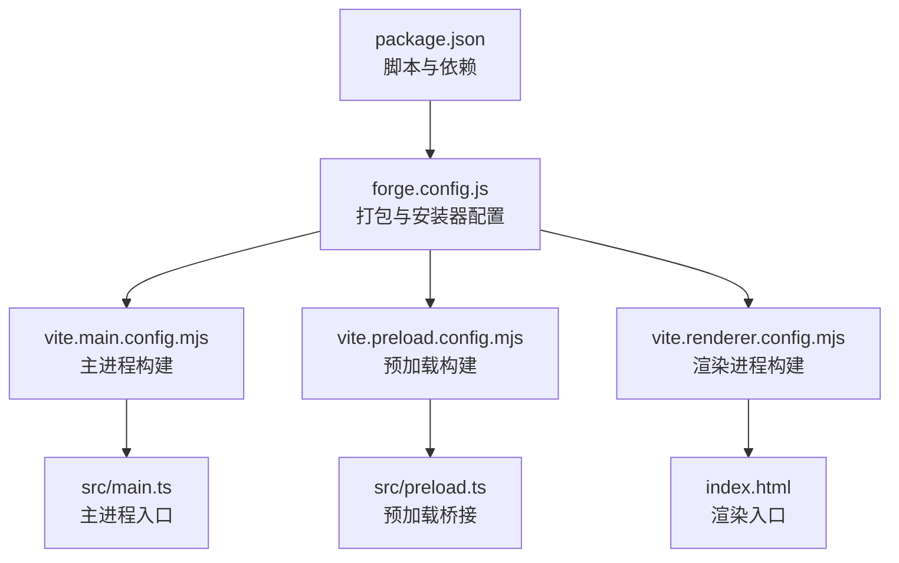
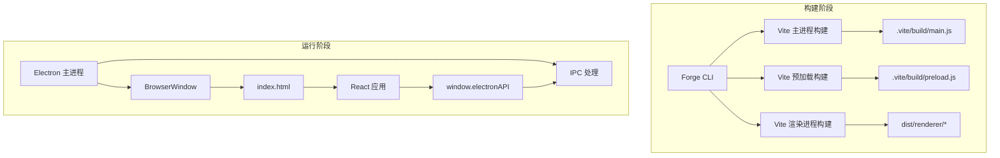
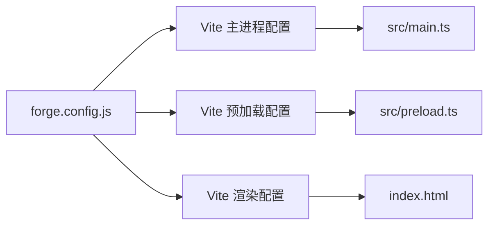

# 跨平台构建

<cite>
**本文引用的文件**
- [package.json](file://package.json)
- [forge.config.js](file://forge.config.js)
- [vite.main.config.mjs](file://vite.main.config.mjs)
- [vite.preload.config.mjs](file://vite.preload.config.mjs)
- [vite.renderer.config.mjs](file://vite.renderer.config.mjs)
- [src/main.ts](file://src/main.ts)
- [src/preload.ts](file://src/preload.ts)
- [index.html](file://index.html)
- [开发文档.md](file://开发文档.md)
</cite>

## 目录
1. [简介](#简介)
2. [项目结构](#项目结构)
3. [核心组件](#核心组件)
4. [架构总览](#架构总览)
5. [详细组件分析](#详细组件分析)
6. [依赖关系分析](#依赖关系分析)
7. [性能考量](#性能考量)
8. [故障排除指南](#故障排除指南)
9. [结论](#结论)
10. [附录](#附录)

## 简介
本文件面向 langGraph 的跨平台构建流程，系统化说明 Windows、macOS 与 Linux 三大平台的构建差异、依赖安装、编译工具链、打包与安装程序生成、图标与资源配置、移植最佳实践、兼容性测试方法以及性能优化建议。文档同时提供完整的构建命令清单与平台特定的故障排除指引，确保应用可在所有目标平台上稳定构建与运行。

## 项目结构
该项目采用 Electron + Electron Forge + Vite 的现代桌面应用架构，源码按职责划分为主进程、预加载脚本、渲染进程与构建配置四大部分。Forge 配置集中定义了打包策略、安装器生成器与 Vite 插件集成；Vite 配置分别针对主进程、预加载脚本与渲染进程进行定制化构建。

图表来源
- [forge.config.js:1-42](file://forge.config.js#L1-L42)
- [vite.main.config.mjs:1-24](file://vite.main.config.mjs#L1-L24)
- [vite.preload.config.mjs:1-10](file://vite.preload.config.mjs#L1-L10)
- [vite.renderer.config.mjs:1-7](file://vite.renderer.config.mjs#L1-L7)
- [src/main.ts:1-100](file://src/main.ts#L1-L100)
- [src/preload.ts:1-18](file://src/preload.ts#L1-L18)
- [index.html:1-13](file://index.html#L1-L13)

章节来源
- [package.json:1-36](file://package.json#L1-L36)
- [forge.config.js:1-42](file://forge.config.js#L1-L42)
- [开发文档.md:152-190](file://开发文档.md#L152-L190)

## 核心组件
- Electron Forge 与 Vite 集成：通过 Forge 插件将 Vite 作为构建后端，分别构建主进程、预加载与渲染进程。
- 主进程构建：针对 Electron 主进程的模块解析与外部化策略，以及 SSR 内联策略以解决 ESM/CJS 兼容问题。
- 预加载构建：保持 Electron API 外部化，避免在渲染进程直接暴露 Node.js。
- 渲染进程构建：基于 React 的开发与构建配置。
- 打包与安装器：默认启用 ASAR 打包；Windows 使用 Squirrel 安装器与 ZIP 包；macOS/Linux 需要在 Forge 配置中补充相应 maker。

章节来源
- [forge.config.js:1-42](file://forge.config.js#L1-L42)
- [vite.main.config.mjs:1-24](file://vite.main.config.mjs#L1-L24)
- [vite.preload.config.mjs:1-10](file://vite.preload.config.mjs#L1-L10)
- [vite.renderer.config.mjs:1-7](file://vite.renderer.config.mjs#L1-L7)

## 架构总览
Electron 应用的构建与运行由 Forge/Vite 驱动，主进程负责窗口管理、IPC 与 Agent 调用，预加载脚本通过 contextBridge 安全暴露有限 API，渲染进程承载 React UI 并通过 IPC 与主进程交互。

图表来源
- [forge.config.js:19-40](file://forge.config.js#L19-L40)
- [vite.main.config.mjs:8-23](file://vite.main.config.mjs#L8-L23)
- [vite.preload.config.mjs:4-9](file://vite.preload.config.mjs#L4-L9)
- [vite.renderer.config.mjs:4-6](file://vite.renderer.config.mjs#L4-L6)
- [src/main.ts:36-62](file://src/main.ts#L36-L62)
- [src/preload.ts:3-17](file://src/preload.ts#L3-L17)
- [index.html:8-12](file://index.html#L8-L12)

## 详细组件分析

### Forge 配置与打包策略
- 打包选项：启用 ASAR，提升源码保护与运行效率。
- 安装器：
  - Windows：Squirrel 安装器与 ZIP 包（通过 platforms 限定）。
  - macOS/Linux：当前未配置，需在 makers 中补充对应 maker。
- 插件：Vite 插件分别定义主进程、预加载与渲染进程的构建入口与目标。

章节来源
- [forge.config.js:4-18](file://forge.config.js#L4-L18)
- [forge.config.js:19-40](file://forge.config.js#L19-L40)

### 主进程构建配置（vite.main.config.mjs）
- 模块解析：针对 Node 条件与 main 字段进行解析，保证 CJS/ESM 兼容。
- 外部化：Electron 保持外部化，避免重复打包。
- SSR 内联：通过 noExternal 将 LangChain/LangGraph 等 ESM-only 包内联，解决主进程 CJS 加载问题。

章节来源
- [vite.main.config.mjs:4-23](file://vite.main.config.mjs#L4-L23)

### 预加载构建配置（vite.preload.config.mjs）
- 外部化策略：Electron API 外部化，确保预加载仅暴露必要 API。
- 与主进程/渲染进程隔离：避免在渲染进程直接访问 Node.js。

章节来源
- [vite.preload.config.mjs:4-9](file://vite.preload.config.mjs#L4-L9)

### 渲染进程构建配置（vite.renderer.config.mjs）
- 插件：集成 React 插件，支持 JSX 与开发服务器。
- 与主进程/预加载分离：独立构建，便于热更新与产物管理。

章节来源
- [vite.renderer.config.mjs:4-6](file://vite.renderer.config.mjs#L4-L6)

### 主进程入口（src/main.ts）
- 窗口创建：根据开发/生产环境加载开发服务器或打包后的页面。
- IPC 处理：提供 Agent 对话与设置读写接口。
- 生命周期：应用就绪、窗口关闭与激活事件处理。

章节来源
- [src/main.ts:36-62](file://src/main.ts#L36-L62)
- [src/main.ts:65-84](file://src/main.ts#L65-L84)
- [src/main.ts:87-99](file://src/main.ts#L87-L99)

### 预加载桥接（src/preload.ts）
- 安全暴露：通过 contextBridge 暴露有限 API，避免渲染进程直接访问 Node.js。
- IPC 模式：使用 invoke/handle 与 on/removeListener 实现请求-响应与事件订阅。

章节来源
- [src/preload.ts:3-17](file://src/preload.ts#L3-L17)

### 渲染入口（index.html）
- 入口脚本：加载 React 应用入口模块。
- 页面结构：根节点与基础 meta 标签。

章节来源
- [index.html:8-12](file://index.html#L8-L12)

### 构建与运行命令
- 开发模式：启动 Vite 开发服务器与 Electron，自动打开 DevTools。
- 打包：生成可执行安装程序与 ZIP 包（当前 Windows）。
- 发布：发布到远端（需配置）。

章节来源
- [package.json:6-11](file://package.json#L6-L11)
- [开发文档.md:511-541](file://开发文档.md#L511-L541)

## 依赖关系分析
- Forge 插件依赖 Vite 与 React 插件，分别处理主进程、预加载与渲染进程。
- 主进程构建依赖 SSR 内联策略以兼容 ESM-only 包。
- 预加载与渲染进程构建相互独立，通过 IPC 通信协作。

图表来源
- [forge.config.js:19-40](file://forge.config.js#L19-L40)
- [vite.main.config.mjs:1-24](file://vite.main.config.mjs#L1-L24)
- [vite.preload.config.mjs:1-10](file://vite.preload.config.mjs#L1-L10)
- [vite.renderer.config.mjs:1-7](file://vite.renderer.config.mjs#L1-L7)
- [src/main.ts:1-100](file://src/main.ts#L1-L100)
- [src/preload.ts:1-18](file://src/preload.ts#L1-L18)
- [index.html:1-13](file://index.html#L1-L13)

## 性能考量
- ASAR 打包：提升运行时加载性能与源码保护。
- Vite 构建：利用 Rollup 外部化与内联策略减少包体与模块解析开销。
- IPC 设计：使用 invoke/handle 与单向事件推送，降低通信阻塞。
- 开发体验：Vite HMR 与 React 插件提升迭代速度。

章节来源
- [forge.config.js:4-6](file://forge.config.js#L4-L6)
- [vite.main.config.mjs:8-23](file://vite.main.config.mjs#L8-L23)
- [src/main.ts:65-84](file://src/main.ts#L65-L84)

## 故障排除指南
- Windows 平台
  - Squirrel 安装失败：确认已安装构建原生依赖所需的 Python 与编译工具链；检查签名与管理员权限。
  - ZIP 包可用但安装器不可用：确认 makers 中 Windows 平台配置与名称一致。
- macOS 平台
  - 安装器缺失：在 makers 中添加对应 macOS 安装器（例如官方 maker）。
  - DMG/ZIP 产物路径：默认输出至 out/make，确认路径与权限。
- Linux 平台
  - 安装器缺失：在 makers 中添加对应 Linux 安装器（例如官方 maker）。
  - 依赖缺失：确保系统满足 Electron Forge 的原生依赖要求。
- 通用问题
  - ESM/CJS 兼容：若新增 ESM-only 包，需在主进程配置的 noExternal 列表中补充。
  - IPC 通讯异常：检查预加载桥接暴露的 API 名称与类型，确保渲染进程调用一致。
  - 开发服务器无法热更新：检查 Vite 配置与端口占用情况。

章节来源
- [开发文档.md:59-81](file://开发文档.md#L59-L81)
- [开发文档.md:545-574](file://开发文档.md#L545-L574)
- [forge.config.js:7-18](file://forge.config.js#L7-L18)
- [vite.main.config.mjs:250-261](file://vite.main.config.mjs#L250-L261)

## 结论
本项目通过 Forge + Vite 的现代化构建体系，结合主进程 ESM/CJS 兼容策略与安全的 IPC 设计，实现了稳定的跨平台桌面应用。当前配置主要覆盖 Windows 平台，macOS 与 Linux 需在 makers 中补充对应安装器即可完成跨平台打包。遵循本文提供的构建命令、配置要点与故障排除建议，可确保应用在各平台正确构建与运行。

## 附录

### 平台特定配置与命令清单
- Windows
  - 安装器：Squirrel（已配置）
  - 压缩包：ZIP（已配置）
  - 命令：构建安装包与 ZIP
    - npm run make
  - 产物位置：out/make/squirrel.windows 与 out/make/zip
- macOS
  - 安装器：需在 makers 中添加对应 maker
  - 命令：构建安装包
    - npm run make
  - 产物位置：out/make（待补充）
- Linux
  - 安装器：需在 makers 中添加对应 maker
  - 命令：构建安装包
    - npm run make
  - 产物位置：out/make（待补充）

章节来源
- [forge.config.js:7-18](file://forge.config.js#L7-L18)
- [开发文档.md:532-541](file://开发文档.md#L532-L541)

### 平台特定图标与资源
- 当前未在 Forge 配置中指定图标与 DMG/安装器资源；建议在 packagerConfig 中补充 icon 与额外资源字段，以适配不同平台的视觉规范。
- macOS/Linux 安装器通常需要专用图标与背景图等资源，需在 makers 配置中显式指定。

章节来源
- [forge.config.js:4-6](file://forge.config.js#L4-L6)

### 移植最佳实践
- 在 makers 中为每个目标平台单独配置安装器，避免平台误用。
- 新增 ESM-only 依赖时同步更新主进程 noExternal 列表。
- 使用统一的版本号与构建脚本，确保跨平台一致性。
- 在 CI 中分别针对 Windows/macOS/Linux 执行 make，提前发现平台差异问题。

章节来源
- [vite.main.config.mjs:250-261](file://vite.main.config.mjs#L250-L261)
- [开发文档.md:651-660](file://开发文档.md#L651-L660)

### 兼容性测试方法
- 本地测试：在各平台分别运行 npm start 与 npm run make，验证窗口、IPC 与安装器行为。
- 虚拟机/容器：使用官方 Electron 镜像或平台镜像进行自动化测试。
- 用户验收：在目标平台真实环境中进行安装与使用验证。

章节来源
- [开发文档.md:511-541](file://开发文档.md#L511-L541)