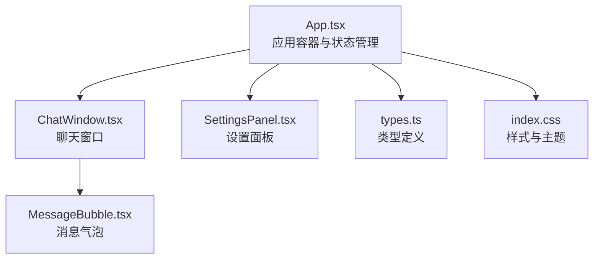
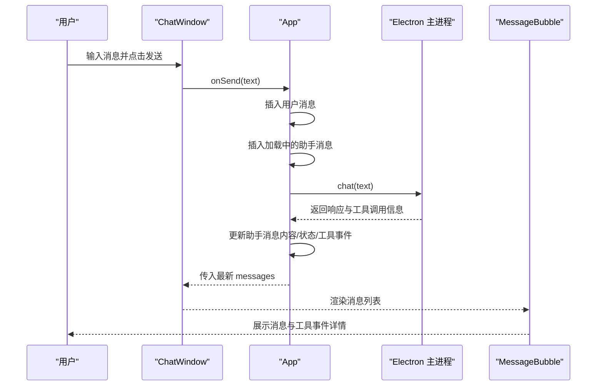
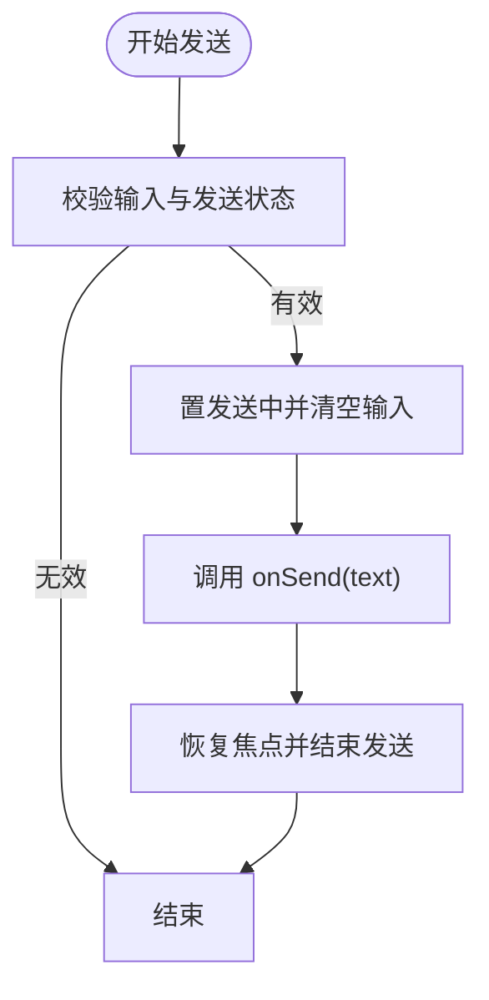
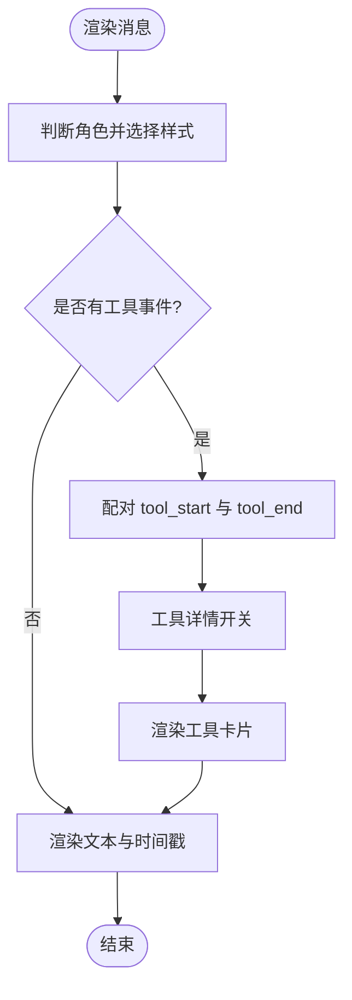
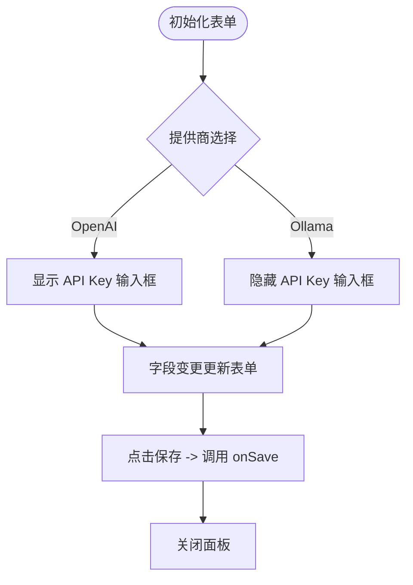
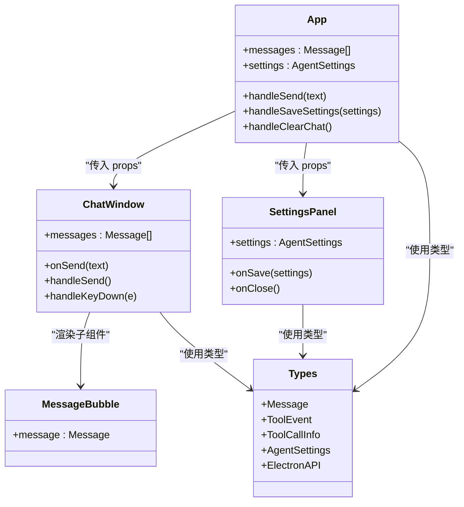

# 核心组件

<cite>
**本文引用的文件**
- [ChatWindow.tsx](file://src/renderer/components/ChatWindow.tsx)
- [MessageBubble.tsx](file://src/renderer/components/MessageBubble.tsx)
- [SettingsPanel.tsx](file://src/renderer/components/SettingsPanel.tsx)
- [App.tsx](file://src/renderer/App.tsx)
- [types.ts](file://src/renderer/types.ts)
- [index.css](file://src/renderer/index.css)
- [package.json](file://package.json)
</cite>

## 目录
1. [简介](#简介)
2. [项目结构](#项目结构)
3. [核心组件](#核心组件)
4. [架构总览](#架构总览)
5. [详细组件分析](#详细组件分析)
6. [依赖分析](#依赖分析)
7. [性能考虑](#性能考虑)
8. [故障排查指南](#故障排查指南)
9. [结论](#结论)
10. [附录](#附录)

## 简介
本文件聚焦 langGraph 的核心 UI 组件：ChatWindow（聊天窗口）、MessageBubble（消息气泡）与 SettingsPanel（设置面板）。文档从系统架构、组件职责、状态管理、事件处理、用户交互、样式与可访问性、响应式与动画、到组件间协作与数据流进行深入解析，并提供面向初学者的使用指南与面向高级用户的扩展建议。

## 项目结构
- 渲染进程采用 React + TypeScript 构建，样式通过全局 CSS 实现主题化与响应式布局。
- 主应用入口负责维护消息列表、设置状态、监听工具事件以及与 Electron 主进程通信。
- 三大核心 UI 组件分别承担消息渲染、输入与发送、设置编辑与保存。

图表来源
- [App.tsx:1-140](file://src/renderer/App.tsx#L1-L140)
- [ChatWindow.tsx:1-114](file://src/renderer/components/ChatWindow.tsx#L1-L114)
- [MessageBubble.tsx:1-104](file://src/renderer/components/MessageBubble.tsx#L1-L104)
- [SettingsPanel.tsx:1-139](file://src/renderer/components/SettingsPanel.tsx#L1-L139)
- [types.ts:1-49](file://src/renderer/types.ts#L1-L49)
- [index.css:1-649](file://src/renderer/index.css#L1-L649)

章节来源
- [App.tsx:1-140](file://src/renderer/App.tsx#L1-L140)
- [package.json:1-36](file://package.json#L1-L36)

## 核心组件
- ChatWindow：负责渲染消息列表、处理输入与发送、自动滚动与输入框自适应高度、空状态与快捷提示。
- MessageBubble：根据角色渲染不同样式，支持加载态、错误态、工具事件配对展示与时间戳显示。
- SettingsPanel：提供 LLM 提供商切换、API Key、模型名、Base URL、Temperature 等设置项的编辑与保存。

章节来源
- [ChatWindow.tsx:5-114](file://src/renderer/components/ChatWindow.tsx#L5-L114)
- [MessageBubble.tsx:4-104](file://src/renderer/components/MessageBubble.tsx#L4-L104)
- [SettingsPanel.tsx:4-139](file://src/renderer/components/SettingsPanel.tsx#L4-L139)

## 架构总览
组件间协作与数据流如下：
- App 维护 messages 与 settings，作为全局状态源。
- ChatWindow 接收 messages 并通过 onSend 回调触发 App 的消息发送流程；内部管理输入值与发送状态。
- App 在收到用户消息后插入一条“加载中”的助手消息，随后调用 Electron API 获取响应并更新消息内容与工具事件。
- SettingsPanel 接收当前 settings，修改表单后通过 onSave 回调保存至 Electron 存储并更新 App 内部状态。

图表来源
- [App.tsx:43-84](file://src/renderer/App.tsx#L43-L84)
- [ChatWindow.tsx:29-42](file://src/renderer/components/ChatWindow.tsx#L29-L42)
- [MessageBubble.tsx:8-101](file://src/renderer/components/MessageBubble.tsx#L8-L101)

## 详细组件分析

### ChatWindow 组件
- 功能职责
  - 渲染消息列表，支持空状态与快捷提示。
  - 提供多行输入框，支持 Enter 发送、Shift+Enter 换行。
  - 自动滚动到底部，自动调整输入框高度，避免滚动条闪烁。
  - 发送过程中禁用输入与按钮，显示加载指示器。
- 状态管理
  - 本地状态：输入值、发送中标志、滚动锚点与输入框引用。
  - 依赖外部状态：messages（由父组件传入）。
- 事件处理
  - 键盘事件：Enter 触发发送，Shift+Enter 允许换行。
  - 点击发送：校验输入非空且未处于发送中。
- 用户交互模式
  - 快捷提示按钮直接注入预设消息。
  - 发送成功后自动聚焦输入框，便于连续对话。
- Props 接口
  - messages: Message[]
  - onSend: (text: string) => void
- 事件回调
  - onSend：当用户点击发送或按回车时触发。
- 样式与可访问性
  - 使用语义化的 div + textarea + button 结构，具备占位符与禁用态。
  - 加载态通过旋转指示器与按钮禁用态反馈。
- 性能与体验
  - 滚动使用平滑行为，输入高度限制在最大 150px。
  - 输入自适应高度，减少重排成本。

图表来源
- [ChatWindow.tsx:29-42](file://src/renderer/components/ChatWindow.tsx#L29-L42)

章节来源
- [ChatWindow.tsx:5-114](file://src/renderer/components/ChatWindow.tsx#L5-L114)

### MessageBubble 组件
- 功能职责
  - 根据角色渲染用户/助手头像与气泡样式。
  - 支持加载态与错误态的视觉反馈。
  - 解析并配对工具事件（tool_start/tool_end），形成工具卡片。
  - 显示时间戳，格式化为本地时间。
- 状态管理
  - 本地状态：是否展开工具详情。
  - 依赖外部状态：message 对象（含 content、toolEvents、isLoading、isError、timestamp 等）。
- 数据结构与算法
  - 工具事件配对：遍历事件数组，遇到 tool_start 即入栈，遇到 tool_end 查找最近未闭合的同名 start 进行配对。
- 事件处理
  - 工具详情折叠/展开切换。
- 用户交互模式
  - 工具事件数量与状态（完成/运行中）可视化呈现。
  - 输入/输出以等宽字体展示，支持横向滚动。
- Props 接口
  - message: Message
- 样式与可访问性
  - 使用语义化结构与颜色区分角色与状态。
  - 加载态与错误态通过颜色与边框提示。
- 性能与体验
  - 工具卡片按需渲染，避免不必要的 DOM。

图表来源
- [MessageBubble.tsx:13-28](file://src/renderer/components/MessageBubble.tsx#L13-L28)
- [MessageBubble.tsx:30-101](file://src/renderer/components/MessageBubble.tsx#L30-L101)

章节来源
- [MessageBubble.tsx:4-104](file://src/renderer/components/MessageBubble.tsx#L4-L104)

### SettingsPanel 组件
- 功能职责
  - 编辑 Agent 设置：提供商（OpenAI/Ollama）、API Key、模型名、Base URL、Temperature。
  - 提供保存与关闭操作。
- 状态管理
  - 本地状态：表单副本（与传入 settings 同步初始化）。
  - 依赖外部状态：settings（由父组件传入）。
- 事件处理
  - 字段变更：通过 handleChange 动态更新表单。
  - 保存：调用 onSave 并关闭面板。
  - 关闭：调用 onClose。
- 用户交互模式
  - 单选提供商，动态显示/隐藏相关字段。
  - Temperature 使用范围滑块，实时显示数值。
- Props 接口
  - settings: AgentSettings
  - onSave: (settings: AgentSettings) => void
  - onClose: () => void
- 样式与可访问性
  - 表单分组清晰，标签与说明文字明确。
  - 滑块与输入框具备焦点态与禁用态。
- 性能与体验
  - 仅在需要时渲染 OpenAI 的 API Key 输入框。
  - 保存后立即关闭面板，避免重复渲染。

图表来源
- [SettingsPanel.tsx:10-19](file://src/renderer/components/SettingsPanel.tsx#L10-L19)
- [SettingsPanel.tsx:57-69](file://src/renderer/components/SettingsPanel.tsx#L57-L69)

章节来源
- [SettingsPanel.tsx:4-139](file://src/renderer/components/SettingsPanel.tsx#L4-L139)

## 依赖分析
- 类型依赖
  - types.ts 定义了 Message、ToolEvent、ToolCallInfo、AgentSettings 以及 ElectronAPI 接口，为组件提供强类型约束。
- 组件耦合
  - App 作为状态中心，向 ChatWindow 注入 messages 与 onSend；向 SettingsPanel 注入 settings、onSave、onClose。
  - ChatWindow 依赖 MessageBubble 渲染消息。
- 外部依赖
  - React 生态（useState、useEffect、useRef）用于状态与副作用。
  - Electron 主进程通过 window.electronAPI 提供 chat、onToolEvent、getSettings、saveSettings 等能力。

图表来源
- [App.tsx:1-140](file://src/renderer/App.tsx#L1-L140)
- [ChatWindow.tsx:1-114](file://src/renderer/components/ChatWindow.tsx#L1-L114)
- [MessageBubble.tsx:1-104](file://src/renderer/components/MessageBubble.tsx#L1-L104)
- [SettingsPanel.tsx:1-139](file://src/renderer/components/SettingsPanel.tsx#L1-L139)
- [types.ts:1-49](file://src/renderer/types.ts#L1-L49)

章节来源
- [types.ts:1-49](file://src/renderer/types.ts#L1-L49)
- [package.json:13-34](file://package.json#L13-L34)

## 性能考虑
- 消息列表渲染
  - 使用 key 基于消息 id，确保列表更新高效。
  - 工具事件卡片按需展开，避免一次性渲染大量节点。
- 输入与滚动
  - 输入框高度自适应，限制最大高度，减少重排。
  - 滚动使用平滑行为，避免突兀跳转。
- 状态更新
  - App 中使用不可变更新策略（复制数组/对象），保证 React 重新渲染可控。
- 动画与视觉反馈
  - 消息入场淡入、加载点弹跳、工具运行脉冲等动画提升交互感知。
- 可访问性
  - 使用语义化元素与键盘事件（Enter 发送），支持屏幕阅读器识别。
  - 禁用态与焦点态明确反馈。

[本节为通用指导，不直接分析具体文件]

## 故障排查指南
- 发送按钮无响应
  - 检查是否处于发送中状态（isSending）或输入为空。
  - 确认 onSend 回调正确传入 App。
- 工具事件未显示
  - 确认主进程已通过 onToolEvent 回调推送事件。
  - 确认消息对象包含 toolEvents。
- 设置无法保存
  - 确认 onSave 回调已正确绑定到 App.handleSaveSettings。
  - 检查 Electron 存储接口返回值。
- 样式异常
  - 检查主题变量是否正确加载，确认 index.css 已引入。
  - 确认容器尺寸与滚动条样式未被覆盖。

章节来源
- [ChatWindow.tsx:29-42](file://src/renderer/components/ChatWindow.tsx#L29-L42)
- [App.tsx:24-41](file://src/renderer/App.tsx#L24-L41)
- [SettingsPanel.tsx:17-19](file://src/renderer/components/SettingsPanel.tsx#L17-L19)

## 结论
ChatWindow、MessageBubble 与 SettingsPanel 三者协同构建了完整的聊天界面与设置体系。App 作为状态与业务逻辑中心，通过清晰的 props 与回调将数据与控制权下放给子组件，实现了高内聚、低耦合的 UI 架构。配合完善的类型系统、主题化样式与动画反馈，为用户提供了流畅、直观且可扩展的桌面端 AI Agent 体验。

[本节为总结性内容，不直接分析具体文件]

## 附录

### 组件使用与配置示例（路径指引）
- 在 App 中集成 ChatWindow
  - 传入 messages 与 onSend 回调，参考：[App.tsx:132-134](file://src/renderer/App.tsx#L132-L134)
- 在 App 中集成 SettingsPanel
  - 传入 settings、onSave、onClose，参考：[App.tsx:124-130](file://src/renderer/App.tsx#L124-L130)
- ChatWindow 的 props 与事件
  - props: messages, onSend，参考：[ChatWindow.tsx:5-8](file://src/renderer/components/ChatWindow.tsx#L5-L8)
- MessageBubble 的 props
  - props: message，参考：[MessageBubble.tsx:4-6](file://src/renderer/components/MessageBubble.tsx#L4-L6)
- SettingsPanel 的 props
  - props: settings, onSave, onClose，参考：[SettingsPanel.tsx:4-8](file://src/renderer/components/SettingsPanel.tsx#L4-L8)

### 样式与主题定制
- 主题变量与颜色
  - 参考：[index.css:5-25](file://src/renderer/index.css#L5-L25)
- 消息气泡与工具事件样式
  - 参考：[index.css:198-398](file://src/renderer/index.css#L198-L398)
- 输入区与按钮样式
  - 参考：[index.css:400-483](file://src/renderer/index.css#L400-L483)
- 设置面板样式
  - 参考：[index.css:484-649](file://src/renderer/index.css#L484-L649)

### 可访问性与键盘交互
- 键盘交互
  - Enter 发送，Shift+Enter 换行，参考：[ChatWindow.tsx:44-49](file://src/renderer/components/ChatWindow.tsx#L44-L49)
- 焦点管理
  - 发送完成后自动聚焦输入框，参考：[ChatWindow.tsx:40](file://src/renderer/components/ChatWindow.tsx#L40)

### 扩展与自定义建议
- 新增消息类型
  - 在 Message 接口中扩展字段（如附件、多媒体），并在 MessageBubble 中新增渲染分支。
- 自定义工具事件展示
  - 在 MessageBubble 中扩展工具卡片 UI 或增加更多元信息（如耗时、错误详情）。
- 设置面板扩展
  - 新增更多提供商参数（如超时、并发限制），在 SettingsPanel 中添加对应表单项。
- 动画与过渡
  - 可为消息入场、工具卡片展开/收起添加更丰富的过渡动画。
- 主题系统
  - 将主题变量抽取为可配置模块，支持动态切换主题。

[本节为通用指导，不直接分析具体文件]