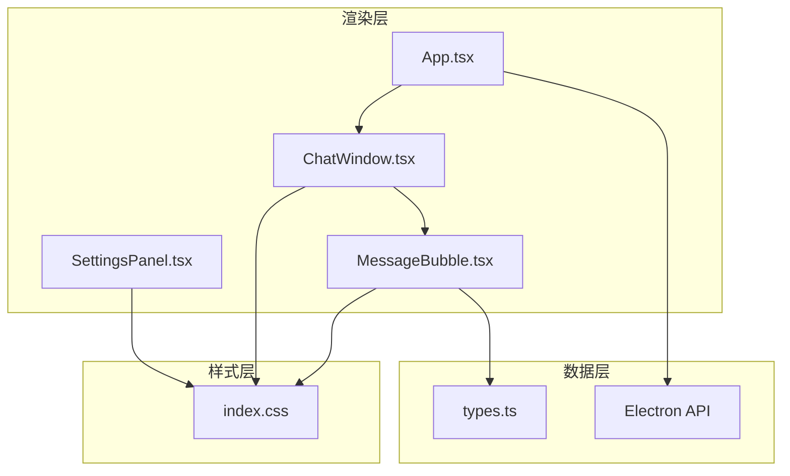
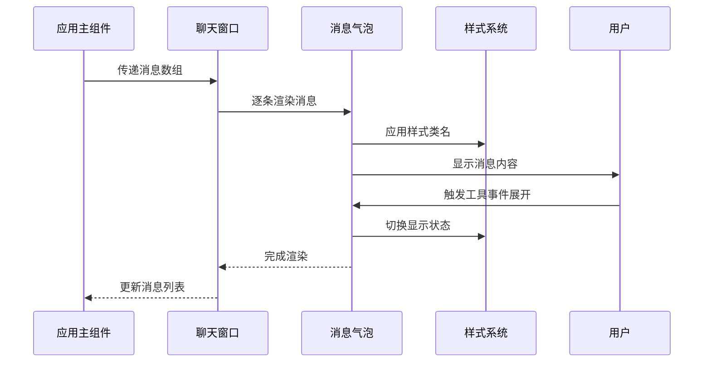
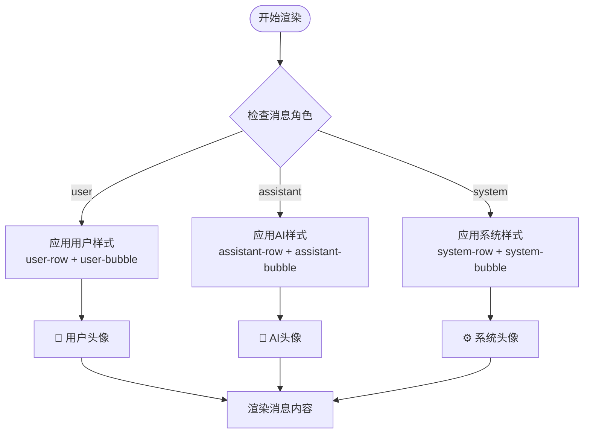
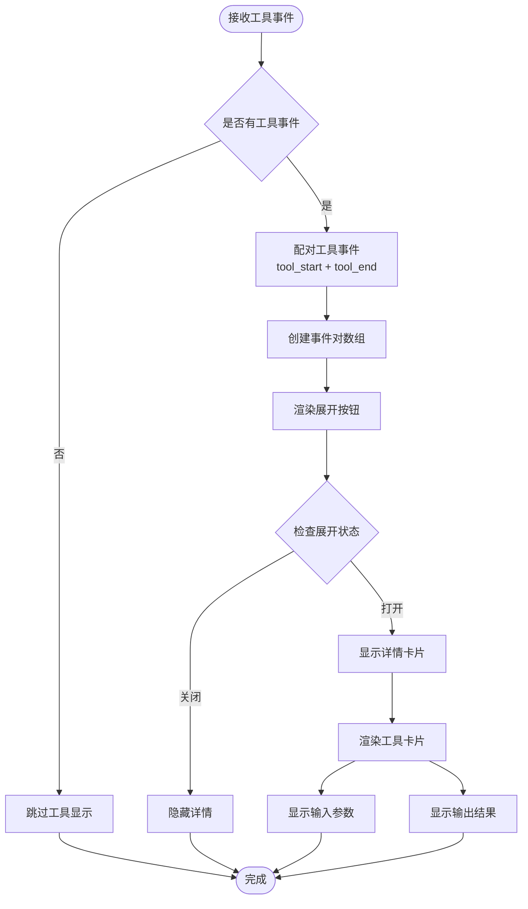
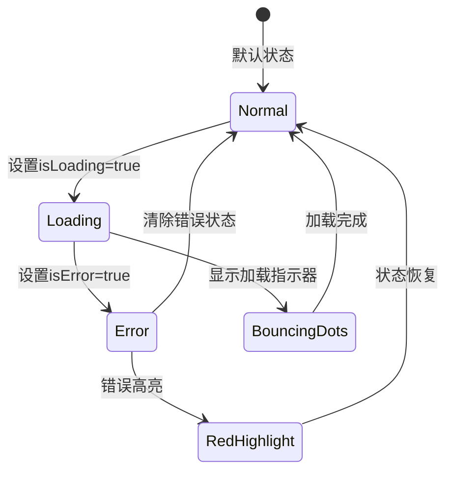
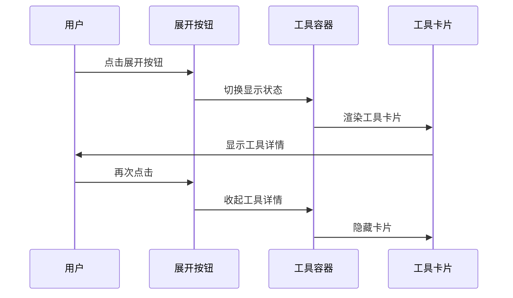
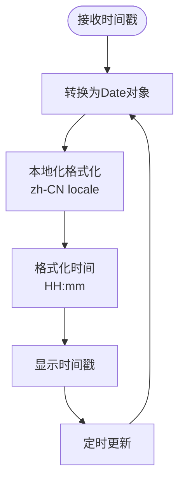
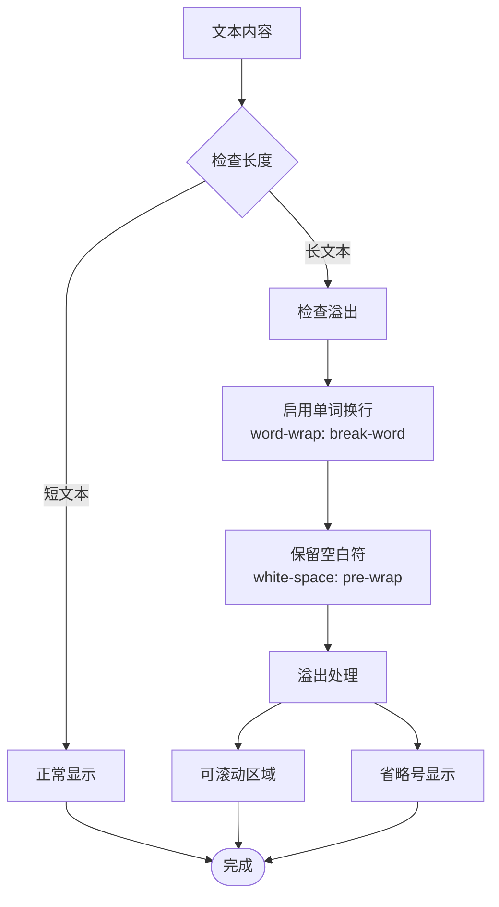
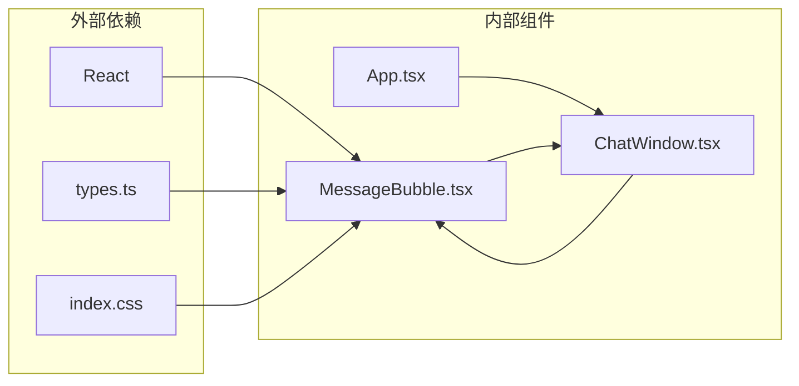

# 消息气泡组件

<cite>
**本文档引用的文件**
- [MessageBubble.tsx](file://src/renderer/components/MessageBubble.tsx)
- [types.ts](file://src/renderer/types.ts)
- [ChatWindow.tsx](file://src/renderer/components/ChatWindow.tsx)
- [App.tsx](file://src/renderer/App.tsx)
- [index.css](file://src/renderer/index.css)
</cite>

## 目录
1. [简介](#简介)
2. [项目结构](#项目结构)
3. [核心组件](#核心组件)
4. [架构概览](#架构概览)
5. [详细组件分析](#详细组件分析)
6. [依赖关系分析](#依赖关系分析)
7. [性能考虑](#性能考虑)
8. [故障排除指南](#故障排除指南)
9. [结论](#结论)

## 简介

MessageBubble 是 LangGraph Agent 桌面应用中的核心组件，负责渲染单个聊天消息的视觉呈现和交互功能。该组件实现了智能对话界面中消息气泡的完整功能，包括用户消息与AI消息的差异化显示、工具调用事件的可视化、实时时间戳更新以及丰富的动画效果。

该组件采用现代化的React函数式组件设计，结合CSS变量系统实现主题化样式，并通过细粒度的状态管理提供流畅的用户体验。组件支持多种消息状态（正常、加载中、错误），并具备响应式布局和多语言时间显示能力。

## 项目结构

LangGraph Agent 采用模块化的组件架构，MessageBubble 作为渲染层的重要组成部分，与其他核心组件协同工作：



**图表来源**
- [App.tsx:1-140](file://src/renderer/App.tsx#L1-L140)
- [ChatWindow.tsx:1-114](file://src/renderer/components/ChatWindow.tsx#L1-L114)
- [MessageBubble.tsx:1-104](file://src/renderer/components/MessageBubble.tsx#L1-L104)

**章节来源**
- [App.tsx:1-140](file://src/renderer/App.tsx#L1-L140)
- [ChatWindow.tsx:1-114](file://src/renderer/components/ChatWindow.tsx#L1-L114)
- [MessageBubble.tsx:1-104](file://src/renderer/components/MessageBubble.tsx#L1-L104)

## 核心组件

### MessageBubble 组件概述

MessageBubble 是一个专门用于渲染单个聊天消息的React函数式组件，它接收 Message 对象作为属性，自动根据消息角色（用户或AI）应用相应的样式和行为。

#### 主要特性
- **消息类型区分**：自动识别用户消息和AI消息，应用不同的视觉样式
- **工具调用可视化**：支持工具事件的配对显示和折叠展开
- **状态指示器**：加载状态、错误状态的视觉反馈
- **时间戳显示**：本地化的时间格式化和实时更新
- **动画效果**：淡入动画和交互反馈
- **响应式设计**：适配不同屏幕尺寸和设备

#### Props 接口定义

```typescript
interface MessageBubbleProps {
  message: Message;
}
```

**章节来源**
- [MessageBubble.tsx:4-6](file://src/renderer/components/MessageBubble.tsx#L4-L6)

## 架构概览

MessageBubble 在整体应用架构中扮演着关键角色，它与上游组件通过props传递数据，与下游组件通过事件回调进行交互。



**图表来源**
- [App.tsx:43-84](file://src/renderer/App.tsx#L43-L84)
- [ChatWindow.tsx:77-79](file://src/renderer/components/ChatWindow.tsx#L77-L79)
- [MessageBubble.tsx:30-100](file://src/renderer/components/MessageBubble.tsx#L30-L100)

## 详细组件分析

### 数据结构与类型定义

MessageBubble 组件依赖于精心设计的消息数据结构，确保所有必要的信息都能被正确渲染和处理。

#### Message 接口定义

```typescript
interface Message {
  id: string;
  role: 'user' | 'assistant' | 'system';
  content: string;
  toolCalls?: ToolCallInfo[];
  toolEvents?: ToolEvent[];
  timestamp: number;
  isLoading?: boolean;
  isError?: boolean;
}
```

#### ToolEvent 接口定义

```typescript
interface ToolEvent {
  type: 'tool_start' | 'tool_end';
  toolName: string;
  input?: string;
  output?: string;
}
```

**章节来源**
- [types.ts:22-31](file://src/renderer/types.ts#L22-L31)
- [types.ts:10-15](file://src/renderer/types.ts#L10-L15)

### 视觉呈现机制

MessageBubble 通过条件渲染和动态类名应用实现不同类型消息的差异化显示。

#### 消息类型判定逻辑



**图表来源**
- [MessageBubble.tsx:10-11](file://src/renderer/components/MessageBubble.tsx#L10-L11)
- [MessageBubble.tsx:31-36](file://src/renderer/components/MessageBubble.tsx#L31-L36)

#### 工具调用事件处理

MessageBubble 实现了复杂的工具事件配对和显示逻辑：



**图表来源**
- [MessageBubble.tsx:13-28](file://src/renderer/components/MessageBubble.tsx#L13-L28)
- [MessageBubble.tsx:52-88](file://src/renderer/components/MessageBubble.tsx#L52-L88)

**章节来源**
- [MessageBubble.tsx:8-28](file://src/renderer/components/MessageBubble.tsx#L8-L28)
- [MessageBubble.tsx:52-88](file://src/renderer/components/MessageBubble.tsx#L52-L88)

### 样式系统与主题化

MessageBubble 采用CSS变量系统实现完整的主题化支持，确保组件在不同主题下都能保持一致的视觉体验。

#### 核心样式类名体系

| 类名 | 用途 | 适用场景 |
|------|------|----------|
| `message-row` | 消息容器 | 所有消息的基础容器 |
| `user-row` | 用户消息容器 | 用户消息行级布局 |
| `assistant-row` | AI消息容器 | AI消息行级布局 |
| `message-bubble` | 气泡主体 | 所有消息气泡 |
| `user-bubble` | 用户气泡 | 用户消息气泡样式 |
| `assistant-bubble` | AI气泡 | AI消息气泡样式 |
| `message-text` | 文本内容 | 消息文本区域 |
| `loading` | 加载状态 | 正在加载的消息 |
| `error` | 错误状态 | 出错的消息 |

#### 动画效果实现

MessageBubble 包含多种动画效果来增强用户体验：



**图表来源**
- [MessageBubble.tsx:40-49](file://src/renderer/components/MessageBubble.tsx#L40-L49)
- [index.css:207-210](file://src/renderer/index.css#L207-L210)
- [index.css:288-308](file://src/renderer/index.css#L288-L308)

**章节来源**
- [MessageBubble.tsx:30-96](file://src/renderer/components/MessageBubble.tsx#L30-L96)
- [index.css:201-286](file://src/renderer/index.css#L201-L286)

### 交互功能实现

MessageBubble 提供了丰富的交互功能，包括工具事件的展开/收起、悬停效果和键盘导航支持。

#### 工具事件交互流程



**图表来源**
- [MessageBubble.tsx:55-60](file://src/renderer/components/MessageBubble.tsx#L55-L60)
- [MessageBubble.tsx:62-86](file://src/renderer/components/MessageBubble.tsx#L62-L86)

#### 时间戳显示机制

MessageBubble 使用本地化的时间格式化来显示消息时间：



**图表来源**
- [MessageBubble.tsx:91-96](file://src/renderer/components/MessageBubble.tsx#L91-L96)

**章节来源**
- [MessageBubble.tsx:55-60](file://src/renderer/components/MessageBubble.tsx#L55-L60)
- [MessageBubble.tsx:91-96](file://src/renderer/components/MessageBubble.tsx#L91-L96)

### 响应式布局与文本处理

MessageBubble 采用了先进的响应式设计和文本处理技术，确保在各种设备和屏幕尺寸下都能提供最佳的用户体验。

#### 响应式布局策略

| 断点 | 最大宽度 | 布局调整 |
|------|----------|----------|
| 移动端 | ≤768px | 气泡最大宽度调整为90% |
| 平板端 | 769px-1024px | 标准气泡宽度75% |
| 桌面端 | >1024px | 固定900px最大宽度 |

#### 文本溢出处理

MessageBubble 实现了多层次的文本溢出处理机制：



**图表来源**
- [index.css:254-255](file://src/renderer/index.css#L254-L255)
- [index.css:393-397](file://src/renderer/index.css#L393-L397)

**章节来源**
- [index.css:223-225](file://src/renderer/index.css#L223-L225)
- [index.css:254-255](file://src/renderer/index.css#L254-L255)
- [index.css:393-397](file://src/renderer/index.css#L393-L397)

## 依赖关系分析

MessageBubble 组件的依赖关系相对简洁，主要依赖于类型定义和样式系统。



**图表来源**
- [MessageBubble.tsx:1-2](file://src/renderer/components/MessageBubble.tsx#L1-L2)
- [ChatWindow.tsx:1-3](file://src/renderer/components/ChatWindow.tsx#L1-L3)
- [App.tsx:1-4](file://src/renderer/App.tsx#L1-L4)

### 组件耦合度评估

MessageBubble 与 ChatWindow 的耦合度为中等，主要通过 props 传递数据，这种设计有利于组件的复用性和测试性。

**章节来源**
- [MessageBubble.tsx:1-104](file://src/renderer/components/MessageBubble.tsx#L1-L104)
- [ChatWindow.tsx:1-114](file://src/renderer/components/ChatWindow.tsx#L1-L114)

## 性能考虑

MessageBubble 在设计时充分考虑了性能优化，采用了多种策略来确保流畅的用户体验。

### 渲染优化策略

1. **条件渲染**：仅在需要时渲染工具事件详情
2. **状态最小化**：使用局部状态管理工具展开状态
3. **CSS动画**：优先使用硬件加速的CSS动画而非JavaScript动画
4. **文本处理**：合理使用CSS属性处理文本溢出

### 内存管理

- 工具事件配对算法的时间复杂度为 O(n)，其中 n 为事件数量
- 组件卸载时自动清理事件监听器
- 合理使用 React.memo 防止不必要的重渲染

## 故障排除指南

### 常见问题及解决方案

#### 工具事件未正确显示

**问题描述**：工具事件无法正确配对或显示

**可能原因**：
1. 工具事件顺序不正确
2. 缺少对应的 tool_start 或 tool_end 事件
3. toolName 不匹配

**解决方法**：
- 检查工具事件的配对逻辑
- 确保每个 tool_start 都有对应的 tool_end
- 验证 toolName 的一致性

#### 时间戳显示异常

**问题描述**：时间戳显示格式不正确或时间不更新

**可能原因**：
1. 时间戳格式不正确
2. 本地化设置问题
3. 时间更新机制失效

**解决方法**：
- 确认时间戳为毫秒值
- 检查本地化配置
- 验证时间格式化函数

#### 样式显示问题

**问题描述**：消息气泡样式不符合预期

**可能原因**：
1. CSS类名冲突
2. 样式优先级问题
3. 主题变量未正确设置

**解决方法**：
- 检查CSS类名拼写
- 验证样式优先级
- 确认主题变量值

**章节来源**
- [MessageBubble.tsx:13-28](file://src/renderer/components/MessageBubble.tsx#L13-L28)
- [MessageBubble.tsx:91-96](file://src/renderer/components/MessageBubble.tsx#L91-L96)

## 结论

MessageBubble 组件成功实现了现代聊天界面的核心功能，通过精心设计的数据结构、灵活的样式系统和丰富的交互功能，为用户提供了优秀的对话体验。

### 主要优势

1. **模块化设计**：组件职责明确，易于维护和扩展
2. **主题化支持**：完整的CSS变量系统支持多种主题
3. **性能优化**：合理的渲染策略和内存管理
4. **用户体验**：流畅的动画效果和直观的交互设计
5. **可访问性**：良好的键盘导航和屏幕阅读器支持

### 改进建议

1. **国际化支持**：可以进一步增强多语言支持
2. **无障碍功能**：增加更多ARIA标签和语义化标记
3. **性能监控**：添加性能指标监控和报告
4. **测试覆盖**：增加单元测试和集成测试覆盖率

该组件为 LangGraph Agent 提供了坚实的基础，其设计理念和实现方式可以作为其他聊天应用开发的参考模板。