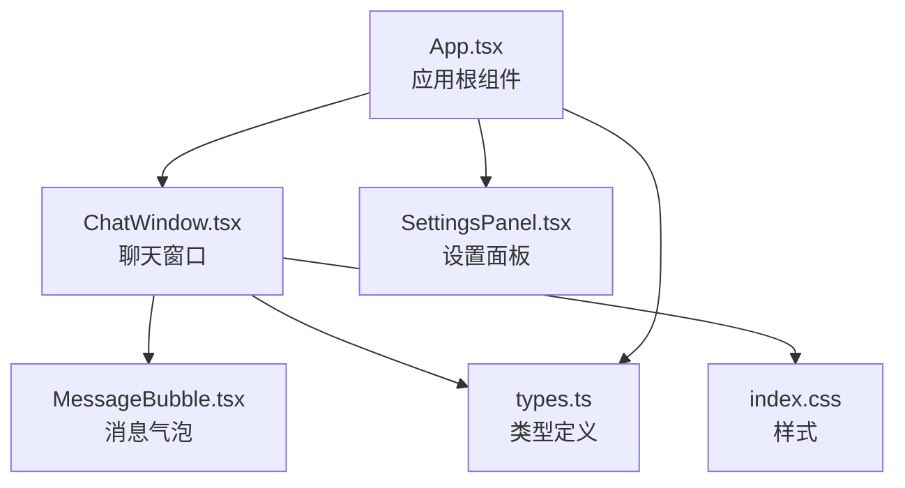
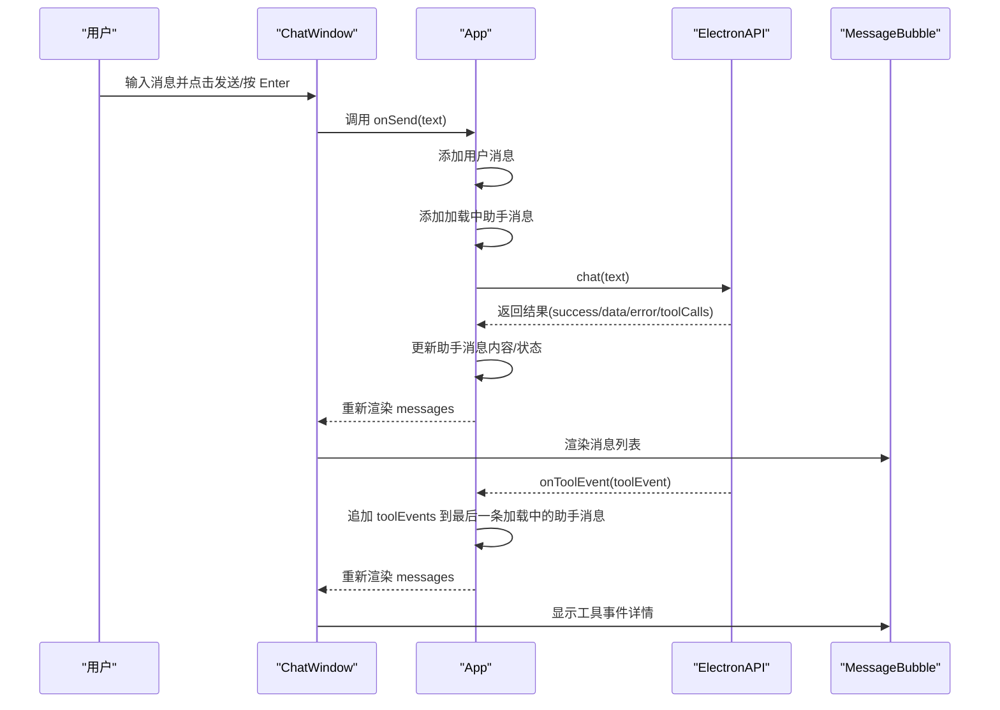
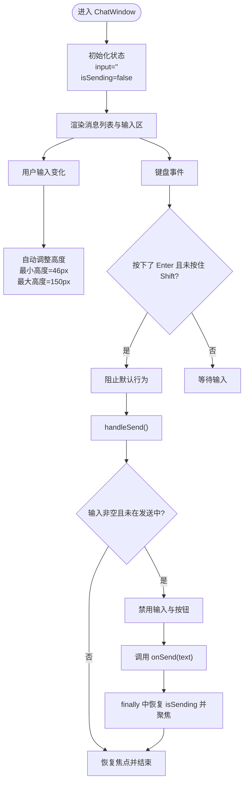
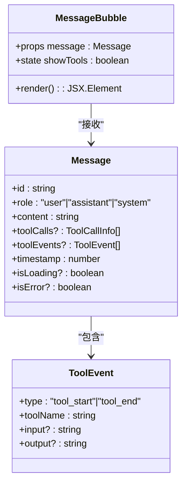
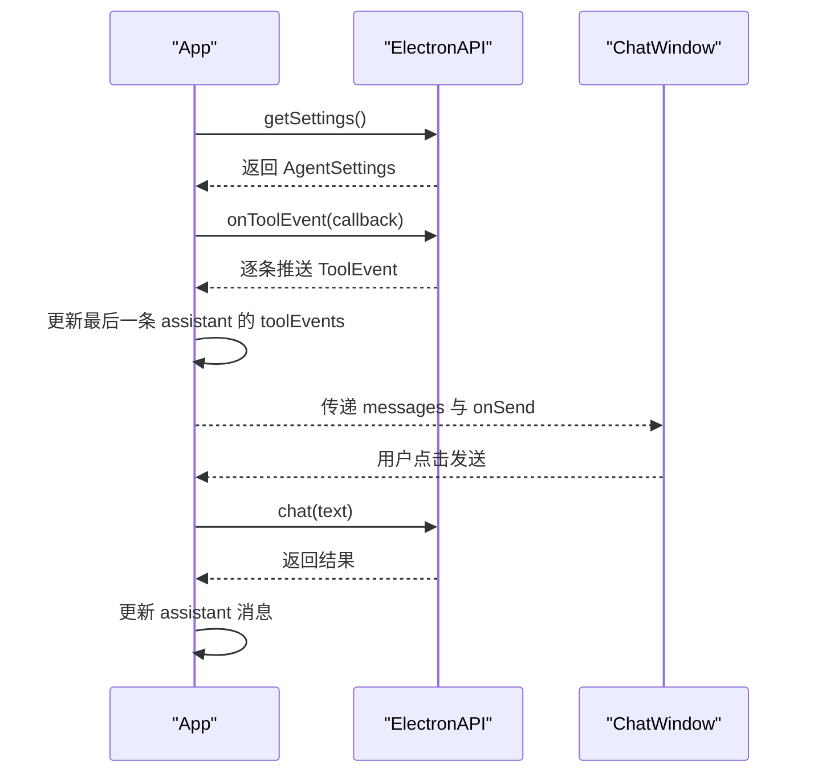
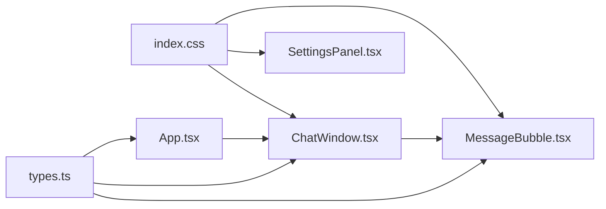

# 聊天窗口组件

<cite>
**本文引用的文件**
- [ChatWindow.tsx](file://src/renderer/components/ChatWindow.tsx)
- [MessageBubble.tsx](file://src/renderer/components/MessageBubble.tsx)
- [App.tsx](file://src/renderer/App.tsx)
- [types.ts](file://src/renderer/types.ts)
- [index.css](file://src/renderer/index.css)
- [SettingsPanel.tsx](file://src/renderer/components/SettingsPanel.tsx)
- [package.json](file://package.json)
</cite>

## 目录
1. [简介](#简介)
2. [项目结构](#项目结构)
3. [核心组件](#核心组件)
4. [架构总览](#架构总览)
5. [详细组件分析](#详细组件分析)
6. [依赖关系分析](#依赖关系分析)
7. [性能考虑](#性能考虑)
8. [故障排查指南](#故障排查指南)
9. [结论](#结论)
10. [附录](#附录)

## 简介
本文件为 ChatWindow 聊天窗口组件的详细技术文档，覆盖以下主题：
- 消息列表渲染与空状态界面
- 输入框自动调整高度与键盘事件处理
- 自动滚动到底部与发送状态管理
- Props 接口定义、onSend 回调使用与错误处理
- 用户交互模式：点击建议按钮、清空对话、设置面板
- 响应式设计与可访问性支持
- 性能优化与最佳实践

## 项目结构
该应用采用 Electron + React 架构，渲染层位于 src/renderer 下，包含聊天窗口、消息气泡、设置面板以及全局样式。App.tsx 作为根组件，负责维护消息列表与设置，并向 ChatWindow 注入数据与回调。

图表来源
- [App.tsx:1-140](file://src/renderer/App.tsx#L1-L140)
- [ChatWindow.tsx:1-114](file://src/renderer/components/ChatWindow.tsx#L1-L114)
- [MessageBubble.tsx:1-104](file://src/renderer/components/MessageBubble.tsx#L1-L104)
- [SettingsPanel.tsx:1-139](file://src/renderer/components/SettingsPanel.tsx#L1-L139)
- [types.ts:1-49](file://src/renderer/types.ts#L1-L49)
- [index.css:1-649](file://src/renderer/index.css#L1-L649)

章节来源
- [App.tsx:1-140](file://src/renderer/App.tsx#L1-L140)
- [ChatWindow.tsx:1-114](file://src/renderer/components/ChatWindow.tsx#L1-L114)
- [MessageBubble.tsx:1-104](file://src/renderer/components/MessageBubble.tsx#L1-L104)
- [SettingsPanel.tsx:1-139](file://src/renderer/components/SettingsPanel.tsx#L1-L139)
- [types.ts:1-49](file://src/renderer/types.ts#L1-L49)
- [index.css:1-649](file://src/renderer/index.css#L1-L649)

## 核心组件
- ChatWindow：负责渲染消息列表、空状态、输入区域与发送逻辑；通过 props 接收 messages 与 onSend 回调。
- MessageBubble：渲染单条消息，支持用户/助手头像、时间戳、加载态、错误态与工具事件展示。
- App：维护全局状态（消息列表、设置），处理发送消息、监听工具事件、清空对话等。
- SettingsPanel：提供 Agent 设置面板，支持 OpenAI/Ollama 选择、模型名、温度等配置。
- types.ts：定义 Message、ToolEvent、ToolCallInfo、AgentSettings 以及 ElectronAPI 接口。

章节来源
- [ChatWindow.tsx:5-114](file://src/renderer/components/ChatWindow.tsx#L5-L114)
- [MessageBubble.tsx:4-104](file://src/renderer/components/MessageBubble.tsx#L4-L104)
- [App.tsx:6-140](file://src/renderer/App.tsx#L6-L140)
- [SettingsPanel.tsx:4-139](file://src/renderer/components/SettingsPanel.tsx#L4-L139)
- [types.ts:10-49](file://src/renderer/types.ts#L10-L49)

## 架构总览
下图展示了从用户输入到消息渲染的整体流程，以及工具事件的实时更新路径。

图表来源
- [ChatWindow.tsx:29-49](file://src/renderer/components/ChatWindow.tsx#L29-L49)
- [App.tsx:43-84](file://src/renderer/App.tsx#L43-L84)
- [types.ts:33-42](file://src/renderer/types.ts#L33-L42)
- [MessageBubble.tsx:13-28](file://src/renderer/components/MessageBubble.tsx#L13-L28)

## 详细组件分析

### ChatWindow 组件
- Props 接口
  - messages: Message[]，用于渲染消息列表
  - onSend: (text: string) => void，发送回调，由父组件实现
- 状态管理
  - 输入状态：useState('') 管理 textarea 内容
  - 发送状态：useState(false) 控制发送按钮禁用与加载动画
- 关键行为
  - 自动滚动到底部：useEffect 监听 messages 变化，滚动至底部
  - 自动调整输入框高度：useEffect 监听 input，计算 scrollHeight 并限制最大高度
  - 键盘事件：handleKeyDown 捕获 Enter（不带 Shift）触发发送
  - 空状态界面：当 messages 为空时显示欢迎语、图标与建议按钮
  - 建议按钮：提供常见提示词，点击直接调用 onSend
- 事件处理
  - handleSend：校验输入、设置发送状态、调用 onSend、最终恢复焦点
  - handleKeyDown：阻止默认 Enter 行为，避免换行
- 性能与体验
  - 使用 ref 引用 DOM，避免不必要的重渲染
  - 发送期间禁用输入与按钮，防止重复提交
  - 最大高度限制，避免输入框无限增长

图表来源
- [ChatWindow.tsx:11-49](file://src/renderer/components/ChatWindow.tsx#L11-L49)

章节来源
- [ChatWindow.tsx:5-114](file://src/renderer/components/ChatWindow.tsx#L5-L114)

### MessageBubble 组件
- 角色区分：根据 message.role 渲染用户或助手样式
- 工具事件配对：遍历 toolEvents，将 tool_start 与 tool_end 配对，形成 pairs
- 展示细节：
  - 加载态：显示三点动画指示器
  - 错误态：高亮错误样式
  - 工具卡片：展开/折叠显示工具名称、输入、输出
  - 时间戳：本地化格式化时间
- 交互：
  - 工具事件开关：点击切换 showTools
  - 工具状态：运行中/已完成视觉提示

图表来源
- [MessageBubble.tsx:4-104](file://src/renderer/components/MessageBubble.tsx#L4-L104)
- [types.ts:22-31](file://src/renderer/types.ts#L22-L31)
- [types.ts:10-15](file://src/renderer/types.ts#L10-L15)

章节来源
- [MessageBubble.tsx:4-104](file://src/renderer/components/MessageBubble.tsx#L4-L104)
- [types.ts:10-31](file://src/renderer/types.ts#L10-L31)

### App 根组件与状态流
- 状态
  - messages: Message[]，全局消息列表
  - showSettings: boolean，控制设置面板显隐
  - settings: AgentSettings，当前 Agent 配置
- 事件与副作用
  - 加载设置：启动时读取保存的设置
  - 监听工具事件：订阅 ElectronAPI.onToolEvent，追加到最后一条加载中的助手消息
  - 发送消息：添加用户消息与加载中的助手消息，调用 ElectronAPI.chat，更新助手消息
  - 清空对话：重置 messages
- 与 ChatWindow 的集成
  - 将 messages 与 handleSend 传给 ChatWindow

图表来源
- [App.tsx:17-41](file://src/renderer/App.tsx#L17-L41)
- [App.tsx:43-84](file://src/renderer/App.tsx#L43-L84)
- [types.ts:33-42](file://src/renderer/types.ts#L33-L42)

章节来源
- [App.tsx:6-140](file://src/renderer/App.tsx#L6-L140)
- [types.ts:33-42](file://src/renderer/types.ts#L33-L42)

### 设置面板 SettingsPanel
- 支持提供商选择：OpenAI 或 Ollama
- 动态表单项：根据提供商显示不同字段
- 温度调节：范围输入，显示精确/创意标签
- 保存与关闭：调用 onSave/onClose 回调

章节来源
- [SettingsPanel.tsx:10-139](file://src/renderer/components/SettingsPanel.tsx#L10-L139)

## 依赖关系分析
- 组件间依赖
  - App -> ChatWindow：注入 messages 与 onSend
  - ChatWindow -> MessageBubble：渲染每条消息
  - App -> MessageBubble：通过 messages 间接使用
- 类型依赖
  - types.ts 定义 Message、ToolEvent、ToolCallInfo、AgentSettings、ElectronAPI
- 样式依赖
  - index.css 提供聊天窗口、消息气泡、输入区、工具事件、设置面板等样式

图表来源
- [types.ts:10-49](file://src/renderer/types.ts#L10-L49)
- [App.tsx:1-140](file://src/renderer/App.tsx#L1-L140)
- [ChatWindow.tsx:1-114](file://src/renderer/components/ChatWindow.tsx#L1-L114)
- [MessageBubble.tsx:1-104](file://src/renderer/components/MessageBubble.tsx#L1-L104)
- [SettingsPanel.tsx:1-139](file://src/renderer/components/SettingsPanel.tsx#L1-L139)
- [index.css:1-649](file://src/renderer/index.css#L1-L649)

章节来源
- [types.ts:10-49](file://src/renderer/types.ts#L10-L49)
- [App.tsx:1-140](file://src/renderer/App.tsx#L1-L140)
- [ChatWindow.tsx:1-114](file://src/renderer/components/ChatWindow.tsx#L1-L114)
- [MessageBubble.tsx:1-104](file://src/renderer/components/MessageBubble.tsx#L1-L104)
- [SettingsPanel.tsx:1-139](file://src/renderer/components/SettingsPanel.tsx#L1-L139)
- [index.css:1-649](file://src/renderer/index.css#L1-L649)

## 性能考虑
- 渲染优化
  - 使用 key 基于消息 id，减少不必要的重排
  - 仅在 messages 或 input 变化时触发副作用，避免频繁滚动与高度计算
- DOM 访问
  - 通过 useRef 获取 DOM 引用，避免在渲染阶段进行昂贵操作
- 状态收敛
  - 发送状态 isSending 在发送过程中统一控制 UI 禁用，避免重复提交
- 样式与动画
  - 使用 CSS 动画与过渡，减少 JavaScript 动画开销
- 可访问性
  - 输入框与按钮具备禁用态样式，键盘快捷键明确（Enter 发送，Shift+Enter 换行）
  - 时间戳与工具事件信息以文本形式呈现，便于屏幕阅读器识别

[本节为通用指导，无需特定文件引用]

## 故障排查指南
- 发送按钮不可用
  - 检查输入是否为空或 isSending 是否为 true
  - 确认 handleSend 中的输入校验与状态切换逻辑
- 消息未自动滚动到底部
  - 确认 messages 数组已更新，useEffect 依赖正确
  - 检查容器滚动属性与样式
- 输入框高度异常
  - 确认 textareaRef.current 存在且在每次输入后执行高度重置
  - 检查最大高度限制是否生效
- 工具事件未显示
  - 确认 ElectronAPI.onToolEvent 已正确订阅并在 App 中追加到最后一条加载中的助手消息
  - 检查 toolEvents 数据结构与配对逻辑
- 空状态建议按钮无效
  - 确认按钮 onClick 调用了 onSend，并传入预设文本

章节来源
- [ChatWindow.tsx:16-49](file://src/renderer/components/ChatWindow.tsx#L16-L49)
- [App.tsx:24-41](file://src/renderer/App.tsx#L24-L41)
- [MessageBubble.tsx:13-28](file://src/renderer/components/MessageBubble.tsx#L13-L28)

## 结论
ChatWindow 组件通过简洁的 Props 设计与清晰的状态管理，实现了流畅的消息交互体验。结合 App 的全局状态与 ElectronAPI 的工具事件监听，形成了完整的聊天闭环。组件具备良好的扩展性，可在保持现有接口不变的前提下增加更多交互能力与可视化效果。

[本节为总结，无需特定文件引用]

## 附录

### Props 接口定义与使用示例
- ChatWindowProps
  - messages: Message[]
  - onSend: (text: string) => void
- 使用方式
  - 在父组件中维护 messages，并实现 onSend 调用 ElectronAPI.chat
  - 将 messages 与 handleSend 传入 ChatWindow

章节来源
- [ChatWindow.tsx:5-8](file://src/renderer/components/ChatWindow.tsx#L5-L8)
- [App.tsx:43-84](file://src/renderer/App.tsx#L43-L84)

### onSend 回调与错误处理
- onSend 调用时机：用户点击发送或按下 Enter（无 Shift）
- 错误处理策略
  - 在 App 中根据返回结果设置 assistant 消息的 content、isLoading、isError 与 toolCalls
  - 对失败场景显示错误提示
- 实时反馈
  - 通过 ElectronAPI.onToolEvent 实时更新助手消息的 toolEvents

章节来源
- [ChatWindow.tsx:29-49](file://src/renderer/components/ChatWindow.tsx#L29-L49)
- [App.tsx:43-84](file://src/renderer/App.tsx#L43-L84)
- [types.ts:33-42](file://src/renderer/types.ts#L33-L42)

### 空状态界面与建议按钮
- 空状态包含：机器人图标、标题、描述与一组建议按钮
- 建议按钮：点击即调用 onSend，快速发起对话
- 适用场景：首次打开、清空对话后

章节来源
- [ChatWindow.tsx:55-75](file://src/renderer/components/ChatWindow.tsx#L55-L75)

### 响应式设计与可访问性
- 响应式布局
  - 输入区最大宽度约束与居中对齐
  - 消息气泡最大宽度与左右对齐
- 可访问性
  - 键盘快捷键明确
  - 禁用态样式清晰
  - 文本内容可被屏幕阅读器识别

章节来源
- [index.css:402-483](file://src/renderer/index.css#L402-L483)
- [index.css:119-131](file://src/renderer/index.css#L119-L131)
- [index.css:201-286](file://src/renderer/index.css#L201-L286)

### 性能优化技巧
- 合理使用 useEffect 依赖数组，避免重复滚动与高度计算
- 使用 CSS 动画替代 JS 动画
- 通过最小高度与最大高度限制输入框尺寸
- 仅在必要时更新消息列表

章节来源
- [ChatWindow.tsx:16-27](file://src/renderer/components/ChatWindow.tsx#L16-L27)
- [index.css:416-430](file://src/renderer/index.css#L416-L430)

### 集成与自定义指南
- 集成步骤
  - 在父组件中维护 messages 与 handleSend
  - 调用 ElectronAPI.chat 获取响应并更新消息
  - 订阅 onToolEvent 实时更新工具事件
- 自定义建议按钮
  - 在 ChatWindow 的空状态区域添加按钮，点击时调用 onSend
- 自定义样式
  - 修改 index.css 中对应类名，如 .message-input、.send-btn、.message-bubble 等

章节来源
- [App.tsx:43-84](file://src/renderer/App.tsx#L43-L84)
- [ChatWindow.tsx:55-75](file://src/renderer/components/ChatWindow.tsx#L55-L75)
- [index.css:119-483](file://src/renderer/index.css#L119-L483)