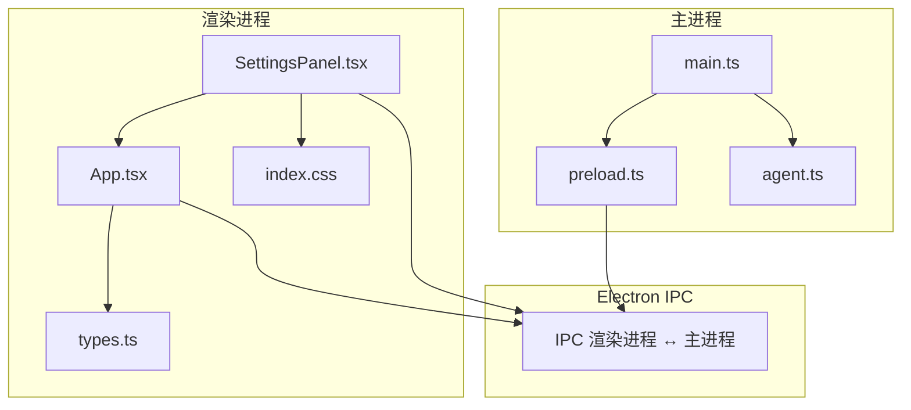
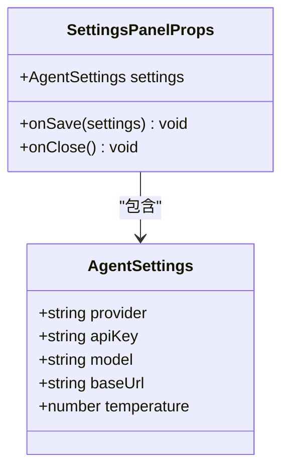
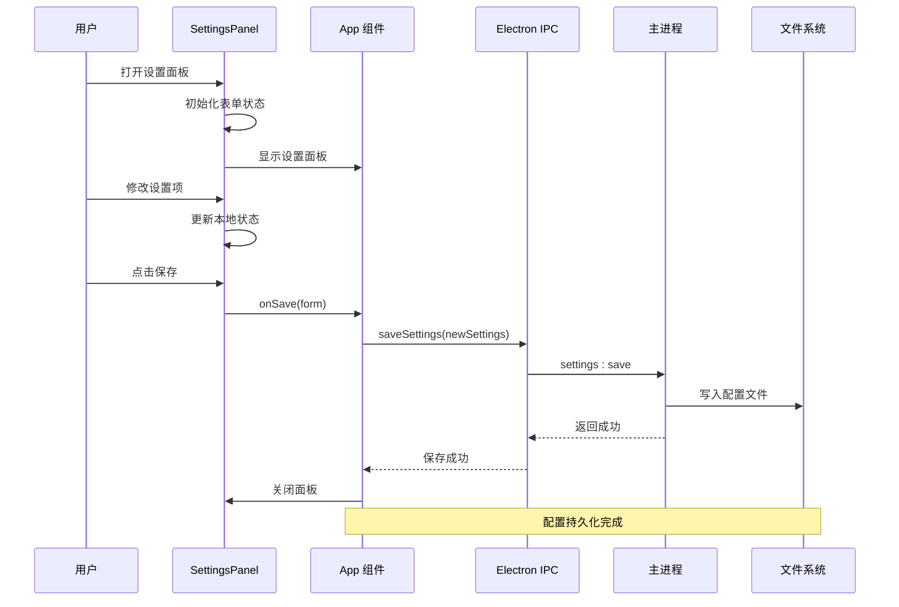
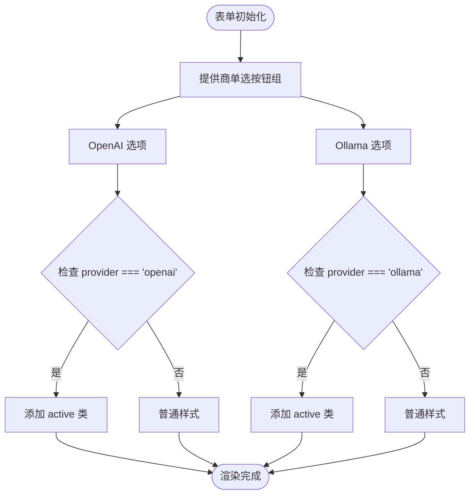
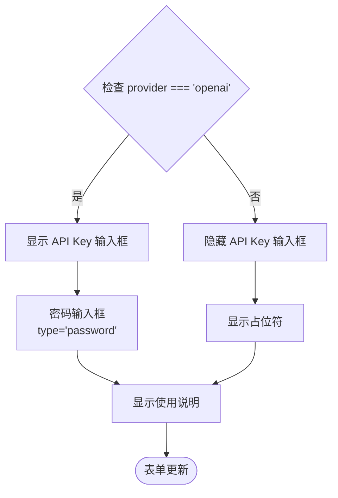
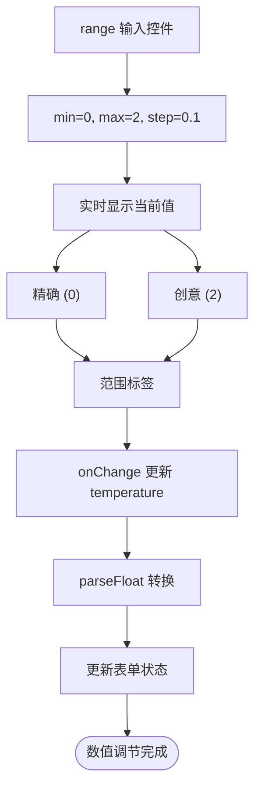
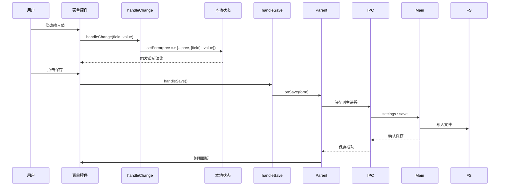
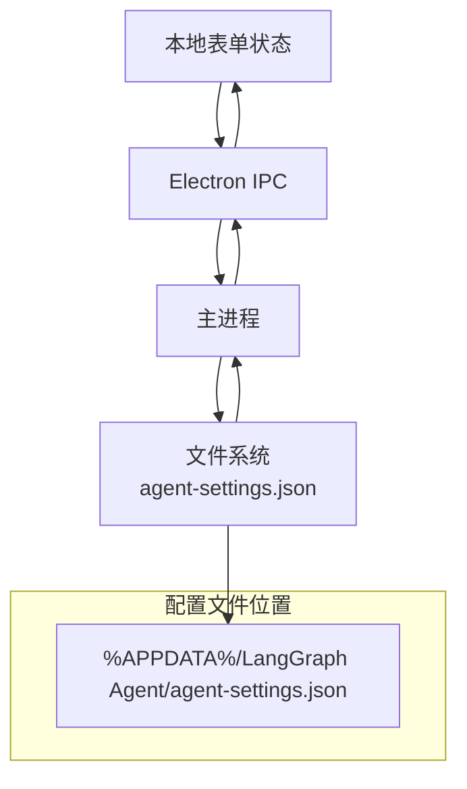
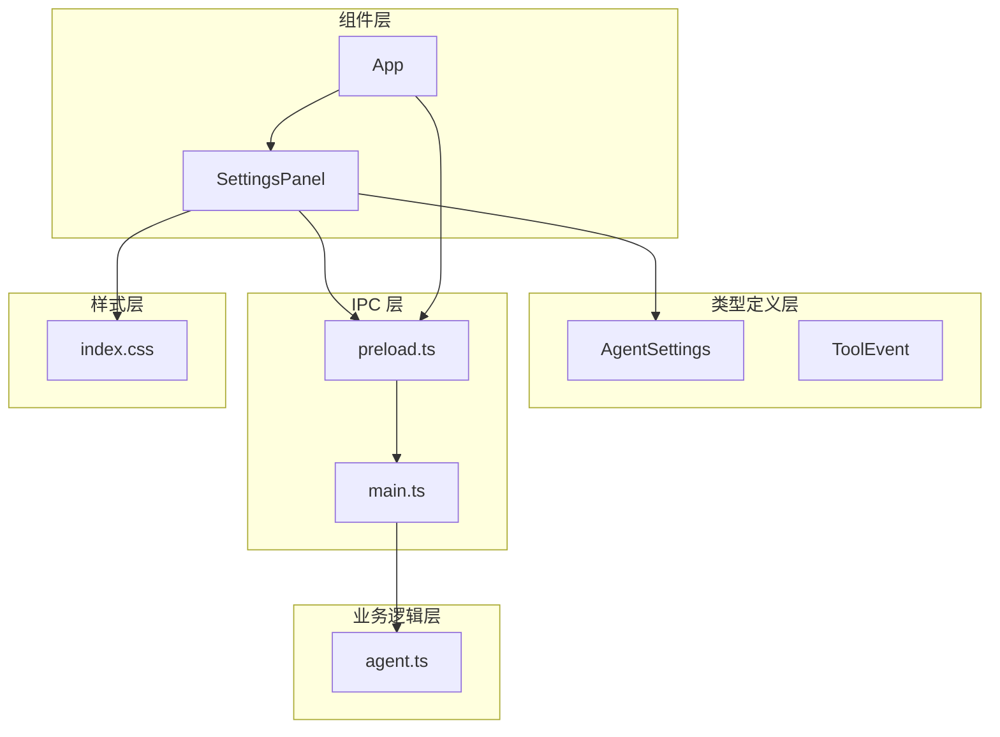

# 设置面板组件

<cite>
**本文档引用的文件**
- [SettingsPanel.tsx](file://src/renderer/components/SettingsPanel.tsx)
- [types.ts](file://src/renderer/types.ts)
- [App.tsx](file://src/renderer/App.tsx)
- [index.css](file://src/renderer/index.css)
- [preload.ts](file://src/preload.ts)
- [main.ts](file://src/main.ts)
- [agent.ts](file://src/agent.ts)
</cite>

## 目录
1. [简介](#简介)
2. [项目结构](#项目结构)
3. [核心组件](#核心组件)
4. [架构概览](#架构概览)
5. [详细组件分析](#详细组件分析)
6. [依赖关系分析](#依赖关系分析)
7. [性能考虑](#性能考虑)
8. [故障排除指南](#故障排除指南)
9. [结论](#结论)

## 简介

设置面板组件（SettingsPanel）是 LangGraph Agent 桌面应用中的核心配置管理界面，负责管理用户偏好设置和系统配置。该组件提供了直观的表单界面，允许用户配置 LLM 提供商、API 密钥、模型参数等关键设置，并通过 Electron IPC 机制与主进程进行通信，实现配置数据的持久化存储。

本组件采用 React 函数式组件设计，结合 TypeScript 类型系统，确保了类型安全性和开发体验。组件支持动态表单渲染、实时配置预览和完整的配置生命周期管理。

## 项目结构

设置面板组件位于渲染进程的组件目录中，与应用的主要逻辑紧密集成：

**图表来源**
- [SettingsPanel.tsx:1-139](file://src/renderer/components/SettingsPanel.tsx#L1-L139)
- [App.tsx:1-140](file://src/renderer/App.tsx#L1-L140)
- [main.ts:1-100](file://src/main.ts#L1-L100)

**章节来源**
- [SettingsPanel.tsx:1-139](file://src/renderer/components/SettingsPanel.tsx#L1-L139)
- [App.tsx:1-140](file://src/renderer/App.tsx#L1-L140)

## 核心组件

### Props 接口定义

设置面板组件通过清晰的 Props 接口定义接收外部传入的配置数据和回调函数：

**图表来源**
- [SettingsPanel.tsx:4-8](file://src/renderer/components/SettingsPanel.tsx#L4-L8)
- [types.ts:2-8](file://src/renderer/types.ts#L2-L8)

### 设置项数据结构

组件内部使用 React 的 useState Hook 管理表单状态，实现了完整的双向数据绑定机制：

| 设置项 | 类型 | 默认值 | 描述 |
|--------|------|--------|------|
| provider | 'openai' \| 'ollama' | 'openai' | LLM 提供商选择 |
| apiKey | string | '' | OpenAI API 密钥 |
| model | string | 'gpt-4o-mini' | 模型名称 |
| baseUrl | string | '' | 自定义 API 地址或 Ollama 地址 |
| temperature | number | 0.7 | 生成温度参数 |

**章节来源**
- [SettingsPanel.tsx:10-19](file://src/renderer/components/SettingsPanel.tsx#L10-L19)
- [types.ts:2-8](file://src/renderer/types.ts#L2-L8)

## 架构概览

设置面板组件采用分层架构设计，实现了清晰的关注点分离：

**图表来源**
- [SettingsPanel.tsx:17-19](file://src/renderer/components/SettingsPanel.tsx#L17-L19)
- [App.tsx:86-90](file://src/renderer/App.tsx#L86-L90)
- [main.ts:80-84](file://src/main.ts#L80-L84)

## 详细组件分析

### 表单控件实现

设置面板组件使用多种表单控件来提供丰富的配置选项：

#### 1. 单选按钮组（LLM 提供商）

**图表来源**
- [SettingsPanel.tsx:30-54](file://src/renderer/components/SettingsPanel.tsx#L30-L54)

#### 2. 条件显示的 API Key 输入框

当选择 OpenAI 作为提供商时，API Key 输入框会动态显示：

**图表来源**
- [SettingsPanel.tsx:57-69](file://src/renderer/components/SettingsPanel.tsx#L57-L69)

#### 3. 数值调节器（Temperature 参数）

温度参数使用 HTML range 输入控件，提供直观的数值调节体验：

**图表来源**
- [SettingsPanel.tsx:111-127](file://src/renderer/components/SettingsPanel.tsx#L111-L127)

### 配置变更事件处理

组件实现了完整的事件处理机制，确保配置变更能够及时响应：

**图表来源**
- [SettingsPanel.tsx:13-19](file://src/renderer/components/SettingsPanel.tsx#L13-L19)
- [App.tsx:86-90](file://src/renderer/App.tsx#L86-L90)

### 配置数据持久化机制

设置面板的配置持久化通过三层架构实现：

1. **渲染进程状态管理**：使用 React useState Hook 管理本地表单状态
2. **Electron IPC 通信**：通过 preload 脚本暴露的安全接口进行跨进程通信
3. **主进程文件存储**：使用 JSON 文件格式存储配置数据

**图表来源**
- [main.ts:11-31](file://src/main.ts#L11-L31)
- [preload.ts:14-16](file://src/preload.ts#L14-L16)

**章节来源**
- [SettingsPanel.tsx:10-19](file://src/renderer/components/SettingsPanel.tsx#L10-L19)
- [App.tsx:86-90](file://src/renderer/App.tsx#L86-L90)
- [main.ts:11-31](file://src/main.ts#L11-L31)

## 依赖关系分析

设置面板组件的依赖关系体现了清晰的模块化设计：

**图表来源**
- [SettingsPanel.tsx:1-2](file://src/renderer/components/SettingsPanel.tsx#L1-L2)
- [App.tsx:1-4](file://src/renderer/App.tsx#L1-L4)
- [types.ts:1-49](file://src/renderer/types.ts#L1-L49)

### 外部依赖

组件依赖于以下关键外部库：

- **React 18.3.1**：用于构建用户界面
- **@langchain/openai**：OpenAI API 客户端
- **@langchain/ollama**：本地 Ollama 服务客户端
- **@langchain/langgraph**：智能体工作流编排
- **zod**：运行时类型验证

**章节来源**
- [package.json:13-21](file://package.json#L13-L21)

## 性能考虑

设置面板组件在设计时充分考虑了性能优化：

### 渲染性能优化

1. **局部状态管理**：仅在设置面板组件内维护表单状态，避免不必要的全局状态更新
2. **条件渲染**：根据提供商类型动态显示相关配置项，减少 DOM 元素数量
3. **受控组件**：使用受控组件模式，确保表单状态与用户输入保持同步

### IPC 通信优化

1. **异步操作**：所有 IPC 调用都是异步的，不会阻塞主线程
2. **错误处理**：完善的错误处理机制，防止配置保存失败影响用户体验
3. **内存管理**：正确清理 IPC 监听器，避免内存泄漏

## 故障排除指南

### 常见问题及解决方案

#### 1. 配置保存失败

**症状**：点击保存后设置未生效或出现错误提示

**可能原因**：
- API 密钥无效或过期
- 网络连接问题
- 文件权限不足

**解决步骤**：
1. 验证 API 密钥格式是否正确
2. 检查网络连接状态
3. 确认应用程序具有文件写入权限

#### 2. Ollama 连接失败

**症状**：选择 Ollama 后无法正常工作

**可能原因**：
- Ollama 服务未启动
- 端口被占用
- 模型未下载

**解决步骤**：
1. 确认 Ollama 服务正在运行
2. 检查端口 11434 是否可用
3. 下载所需的模型文件

#### 3. 表单验证问题

**症状**：某些设置项无法正确保存

**可能原因**：
- 数据类型不匹配
- 缺少必需字段
- 数值超出范围

**解决步骤**：
1. 检查输入数据的类型和格式
2. 确保所有必需字段都已填写
3. 验证数值范围是否在有效区间内

**章节来源**
- [main.ts:76-84](file://src/main.ts#L76-L84)
- [agent.ts:151-169](file://src/agent.ts#L151-L169)

## 结论

设置面板组件作为 LangGraph Agent 应用的核心配置管理界面，展现了优秀的软件工程实践：

### 设计优势

1. **类型安全**：完整的 TypeScript 类型定义确保了开发时的类型安全
2. **模块化设计**：清晰的组件分离和职责划分便于维护和扩展
3. **用户体验**：直观的表单界面和实时反馈提升了用户交互体验
4. **数据持久化**：可靠的配置存储机制确保用户设置的可靠性

### 技术亮点

1. **Electron IPC 通信**：安全高效的跨进程通信机制
2. **条件渲染优化**：根据用户选择动态显示相关配置项
3. **受控组件模式**：确保表单状态与用户输入的完全同步
4. **错误处理机制**：完善的异常处理和用户反馈

### 扩展建议

1. **表单验证增强**：可以添加更严格的表单验证规则
2. **配置导入导出**：支持配置文件的导入导出功能
3. **多语言支持**：添加国际化支持以服务全球用户
4. **配置模板**：提供预设的配置模板供用户快速选择

设置面板组件为整个应用提供了坚实的配置管理基础，其设计原则和实现模式可以作为其他 Electron 应用配置界面开发的参考范例。