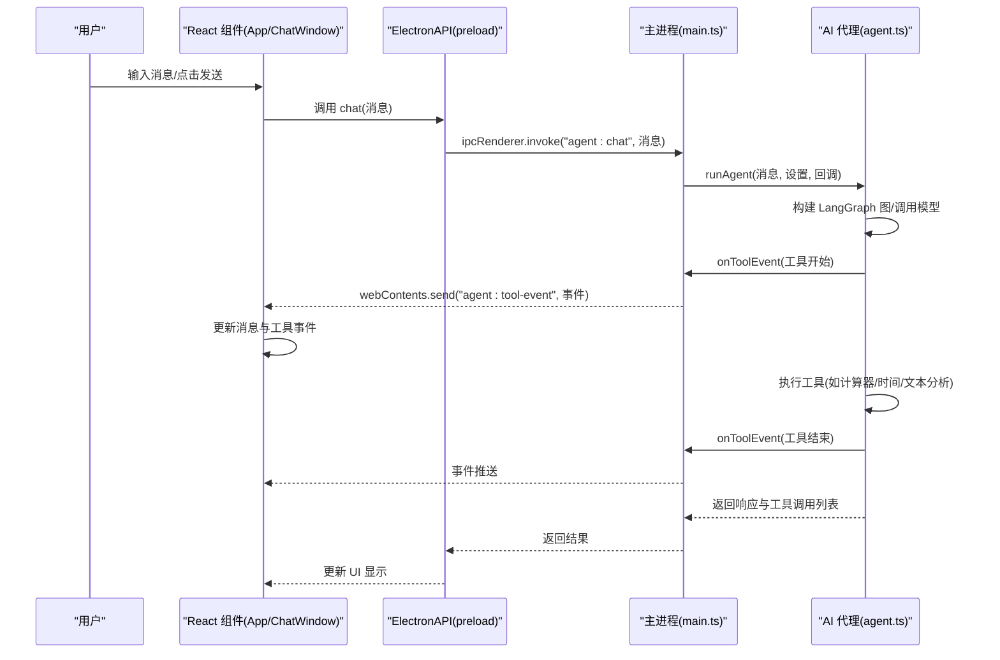
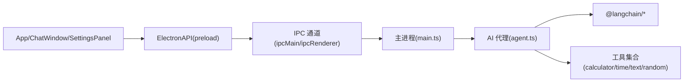

# 测试策略

<cite>
**本文引用的文件**
- [package.json](file://package.json)
- [forge.config.js](file://forge.config.js)
- [src/main.ts](file://src/main.ts)
- [src/preload.ts](file://src/preload.ts)
- [src/agent.ts](file://src/agent.ts)
- [src/renderer/App.tsx](file://src/renderer/App.tsx)
- [src/renderer/components/ChatWindow.tsx](file://src/renderer/components/ChatWindow.tsx)
- [src/renderer/components/SettingsPanel.tsx](file://src/renderer/components/SettingsPanel.tsx)
- [src/renderer/components/MessageBubble.tsx](file://src/renderer/components/MessageBubble.tsx)
- [src/renderer/types.ts](file://src/renderer/types.ts)
</cite>

## 目录
1. [引言](#引言)
2. [项目结构](#项目结构)
3. [核心组件](#核心组件)
4. [架构总览](#架构总览)
5. [详细组件分析](#详细组件分析)
6. [依赖关系分析](#依赖关系分析)
7. [性能考虑](#性能考虑)
8. [故障排查指南](#故障排查指南)
9. [结论](#结论)
10. [附录](#附录)

## 引言
本测试策略文档面向 langGraph（基于 Electron + React + LangGraph 的桌面 AI Agent 应用）的测试工作，覆盖单元测试、集成测试与端到端测试的实施计划与最佳实践。文档针对 React 组件测试、AI 代理服务测试与 Electron 应用测试给出差异化的方法论与工具建议；同时明确测试环境配置、模拟对象与测试数据管理策略，并提出测试覆盖率要求、质量门禁与持续测试流程。此外，文档还涵盖异步测试、状态测试与用户交互测试的实现要点，以及性能、安全与兼容性测试策略，为测试团队与开发者提供完整可执行的测试实施指南。

## 项目结构
langGraph 采用 Electron 主进程 + Vite 渲染进程 + React 前端的典型桌面应用架构。主进程负责窗口创建、IPC 通信与设置持久化；渲染进程通过 preload 暴露受控 API 给前端；AI 代理逻辑封装在独立模块中，使用 LangGraph 构建状态图与工具链路。

```mermaid
graph TB
subgraph "Electron 主进程"
M["src/main.ts<br/>窗口与IPC处理"]
P["src/preload.ts<br/>上下文隔离桥接"]
end
subgraph "渲染进程"
RApp["src/renderer/App.tsx<br/>应用根组件"]
RCW["src/renderer/components/ChatWindow.tsx"]
RSP["src/renderer/components/SettingsPanel.tsx"]
RMB["src/renderer/components/MessageBubble.tsx"]
RT["src/renderer/types.ts<br/>类型声明"]
end
subgraph "AI 代理"
AG["src/agent.ts<br/>LangGraph Agent 与工具"]
end
M <- --> P
P --> RApp
RApp --> RCW
RApp --> RSP
RApp --> RMB
RApp --> RT
M --> AG
RApp --> AG
```

图表来源
- [src/main.ts:1-100](file://src/main.ts#L1-L100)
- [src/preload.ts:1-18](file://src/preload.ts#L1-L18)
- [src/renderer/App.tsx:1-140](file://src/renderer/App.tsx#L1-L140)
- [src/renderer/components/ChatWindow.tsx:1-114](file://src/renderer/components/ChatWindow.tsx#L1-L114)
- [src/renderer/components/SettingsPanel.tsx:1-139](file://src/renderer/components/SettingsPanel.tsx#L1-L139)
- [src/renderer/components/MessageBubble.tsx:1-104](file://src/renderer/components/MessageBubble.tsx#L1-L104)
- [src/renderer/types.ts:1-49](file://src/renderer/types.ts#L1-L49)
- [src/agent.ts:1-316](file://src/agent.ts#L1-L316)

章节来源
- [package.json:1-36](file://package.json#L1-L36)
- [forge.config.js:1-42](file://forge.config.js#L1-L42)

## 核心组件
- 主进程与 IPC：负责窗口生命周期、设置读写与与 AI 代理的交互。
- Preload 桥接：在上下文隔离环境中向渲染进程暴露受控 API。
- React 应用：包含聊天窗口、设置面板与消息气泡等组件。
- AI 代理：基于 LangGraph 的状态图与工具集合，支持 OpenAI/Ollama 模型与多种工具。

章节来源
- [src/main.ts:1-100](file://src/main.ts#L1-L100)
- [src/preload.ts:1-18](file://src/preload.ts#L1-L18)
- [src/renderer/App.tsx:1-140](file://src/renderer/App.tsx#L1-L140)
- [src/agent.ts:1-316](file://src/agent.ts#L1-L316)

## 架构总览
下图展示了从用户交互到 AI 代理执行再到工具调用与事件回传的完整链路。



图表来源
- [src/renderer/App.tsx:43-84](file://src/renderer/App.tsx#L43-L84)
- [src/preload.ts:3-17](file://src/preload.ts#L3-L17)
- [src/main.ts:65-84](file://src/main.ts#L65-L84)
- [src/agent.ts:279-315](file://src/agent.ts#L279-L315)

## 详细组件分析

### React 组件测试策略
- ChatWindow 组件
  - 关注点：消息列表渲染、输入框自动高度、发送按钮状态、快捷键 Enter 发送、空状态提示与示例建议。
  - 测试要点：输入变更、发送流程（含并发保护）、键盘事件处理、滚动行为、禁用态控制。
  - 推荐工具：React Testing Library + 用户事件；使用 MemoryRouter 包裹；通过 MockedProvider 模拟 ElectronAPI。
  - 模拟对象：window.electronAPI.chat/onToolEvent/getSettings/saveSettings。
- SettingsPanel 组件
  - 关注点：表单字段联动（OpenAI/Ollama）、密码输入、模型名占位符、温度滑块、保存与关闭。
  - 测试要点：字段变更、校验提示、保存回调触发、关闭行为。
  - 推荐工具：RTL + 用户事件；通过属性注入模拟保存回调。
- MessageBubble 组件
  - 关注点：用户/助手消息样式、加载态、错误态、工具事件配对显示、展开/收起。
  - 测试要点：toolEvents 配对算法、输入/输出展示、时间戳格式化。
  - 推荐工具：RTL；以 props 注入消息与工具事件数据。
- App 根组件
  - 关注点：设置加载、工具事件监听、消息状态管理、发送流程、清空对话。
  - 测试要点：useEffect 初始化、IPC 回调注册与清理、消息更新逻辑、错误分支。
  - 推荐工具：RTL；通过自定义 render 包装 Provider 与 MockedProvider。

章节来源
- [src/renderer/components/ChatWindow.tsx:1-114](file://src/renderer/components/ChatWindow.tsx#L1-L114)
- [src/renderer/components/SettingsPanel.tsx:1-139](file://src/renderer/components/SettingsPanel.tsx#L1-L139)
- [src/renderer/components/MessageBubble.tsx:1-104](file://src/renderer/components/MessageBubble.tsx#L1-L104)
- [src/renderer/App.tsx:1-140](file://src/renderer/App.tsx#L1-L140)
- [src/renderer/types.ts:1-49](file://src/renderer/types.ts#L1-L49)

### AI 代理服务测试策略
- LangGraph Agent 图构建与执行
  - 关注点：模型工厂（OpenAI/Ollama）、工具绑定、节点函数、条件路由、图编译与执行。
  - 测试要点：不同提供商配置、工具调用与返回、错误处理（工具异常）、消息聚合与最终响应提取。
  - 推荐工具：Jest；通过 jest.mock 替换 LangChain 模型与工具；构造最小化消息序列。
- 工具集合
  - 计算器：表达式清洗与安全求值、异常捕获。
  - 时间：本地化格式化、时区处理。
  - 文本分析：字符/单词/行数/大小写/数字统计。
  - 随机数：范围校验与边界值。
  - 推荐工具：Jest；为每个工具编写独立单元测试，覆盖正常路径与异常路径。
- IPC 与设置持久化
  - 关注点：主进程 IPC 处理、设置读取/保存、用户数据目录下的 JSON 文件。
  - 测试要点：默认设置回退、文件读写失败处理、IPC 错误返回。
  - 推荐工具：Jest；使用 tmpdir 临时目录模拟用户数据路径。

章节来源
- [src/agent.ts:1-316](file://src/agent.ts#L1-L316)
- [src/main.ts:14-31](file://src/main.ts#L14-L31)
- [src/main.ts:65-84](file://src/main.ts#L65-L84)

### Electron 应用测试策略
- 窗口与生命周期
  - 关注点：窗口创建、尺寸限制、开发/生产模式加载、关闭与激活事件。
  - 测试要点：窗口实例状态、事件监听注册与移除。
  - 推荐工具：Electron Forge CLI + Jest；通过最小化启动验证窗口行为。
- IPC 与预加载桥接
  - 关注点：contextBridge 暴露 API、invoke/on 事件、移除监听清理。
  - 测试要点：API 可用性、事件回调注册/注销、参数传递与返回值。
  - 推荐工具：Jest；在 Node 环境下模拟 preload API。
- 打包与分发
  - 关注点：Vite 插件配置、asar 打包、Maker Zip/Squirrel。
  - 测试要点：打包产物完整性、可执行文件可用性。
  - 推荐工具：手动集成测试 + CI 产物校验。

章节来源
- [src/main.ts:36-62](file://src/main.ts#L36-L62)
- [src/preload.ts:1-18](file://src/preload.ts#L1-L18)
- [forge.config.js:1-42](file://forge.config.js#L1-L42)

### 异步测试、状态测试与用户交互测试
- 异步测试
  - 使用 Promise/async/await 编写测试；确保等待异步操作完成（如 IPC 调用、工具执行）。
  - 使用 Jest 的 fake timers 控制定时器场景（如加载指示器）。
- 状态测试
  - 针对 App 的 messages、settings、isLoading/isError 等状态进行断言。
  - 使用 RTL 的 waitFor 与 screen.getByRole 等查询方式。
- 用户交互测试
  - 使用用户事件模拟输入、点击、键盘事件；验证 UI 响应与状态变化。
  - 对于 ChatWindow 的 Enter 发送、Shift+Enter 换行、发送按钮禁用态进行覆盖。

章节来源
- [src/renderer/App.tsx:17-41](file://src/renderer/App.tsx#L17-L41)
- [src/renderer/components/ChatWindow.tsx:29-49](file://src/renderer/components/ChatWindow.tsx#L29-L49)

### 测试环境配置与模拟对象
- 测试框架与工具
  - 单元测试：Jest
  - 组件测试：React Testing Library
  - 异步与定时器：Jest fake timers
  - 类型检查：TypeScript + TS 配置
- 模拟对象与桩
  - LangChain 模型与工具：jest.mock 替换实际实现，返回可控结果。
  - Electron API：在 Node 环境下模拟 window.electronAPI。
  - 文件系统：mock fs.readFileSync/writeFileSync；或使用临时目录。
- 测试数据管理
  - 工具测试数据：构造典型表达式、边界值、异常输入。
  - IPC 测试数据：构造消息序列、工具事件、错误信息。
  - 设置持久化：构造用户数据目录下的 JSON 文件，覆盖读写与异常场景。

章节来源
- [src/agent.ts:151-169](file://src/agent.ts#L151-L169)
- [src/main.ts:14-31](file://src/main.ts#L14-L31)
- [src/preload.ts:3-17](file://src/preload.ts#L3-L17)

### 测试覆盖率与质量门禁
- 覆盖率目标
  - 语句覆盖率：≥80%
  - 函数覆盖率：≥80%
  - 行覆盖率：≥80%
  - 分支覆盖率：≥70%
- 质量门禁
  - CI 中失败即阻断合并；覆盖率低于阈值禁止合并。
  - 通过 ESLint/Prettier 规则统一风格与质量基线。

章节来源
- [package.json:6-11](file://package.json#L6-L11)

### 持续测试流程与报告
- CI 集成
  - 在 CI 中执行：安装依赖 → 运行测试 → 生成覆盖率报告 → 上传报告。
  - 并行执行：按文件或套件拆分，缩短流水线时间。
- 报告生成
  - 使用 Jest 的 HTML/文本报告；结合 Coveralls 或 Codecov 上报覆盖率。
- 自动化
  - PR 触发测试；master 合并后触发打包与发布前的回归测试。

章节来源
- [package.json:6-11](file://package.json#L6-L11)

### 性能测试策略
- 单元性能
  - 工具执行耗时：对复杂表达式与长文本进行基准测试。
  - LangGraph 图构建与执行：记录节点调用次数与耗时。
- 集成性能
  - IPC 往返时间：模拟多轮对话，测量从 UI 到主进程再到代理的总耗时。
  - 渲染性能：大消息列表滚动性能、工具事件展开/收起的渲染开销。
- 工具选择
  - 使用 Jest 的计时能力或自定义计时器；必要时使用 Chrome DevTools Profiler。

章节来源
- [src/agent.ts:171-262](file://src/agent.ts#L171-L262)
- [src/renderer/components/ChatWindow.tsx:16-27](file://src/renderer/components/ChatWindow.tsx#L16-L27)

### 安全测试策略
- 输入验证
  - 计算器：表达式清洗与安全求值，拒绝非法字符。
  - 设置面板：敏感字段（API Key）的可见性与存储加密建议。
- 权限与隔离
  - 验证 contextIsolation 与 preload 暴露 API 的最小化原则。
- 第三方依赖
  - 定期扫描依赖漏洞；对 LangChain 与 Electron 版本进行安全评估。

章节来源
- [src/agent.ts:43-65](file://src/agent.ts#L43-L65)
- [src/main.ts:43-47](file://src/main.ts#L43-L47)

### 兼容性测试策略
- 浏览器与 Node 环境
  - 确保 preload API 在 Node 环境下可用；避免直接访问 DOM。
- 不同操作系统
  - Windows 下打包产物验证；跨平台文件路径处理（如用户数据目录）。
- Electron 与 Vite
  - 验证开发/生产模式加载差异；插件配置正确性。

章节来源
- [forge.config.js:19-40](file://forge.config.js#L19-L40)
- [src/main.ts:50-57](file://src/main.ts#L50-L57)

## 依赖关系分析
- 组件耦合
  - App 依赖 ElectronAPI；ChatWindow 依赖 App 的 onSend；SettingsPanel 依赖 App 的保存回调。
  - Agent 与 LangGraph 工具有强耦合，需通过 mock 解耦测试。
- 外部依赖
  - @langchain/core/langgraph：状态图与消息；@langchain/openai/ollama：模型；zod：工具 Schema。
- IPC 依赖
  - 主进程与渲染进程通过 ipcMain/ipcRenderer 通信；preload 提供桥接。



图表来源
- [src/renderer/App.tsx:1-140](file://src/renderer/App.tsx#L1-L140)
- [src/preload.ts:1-18](file://src/preload.ts#L1-L18)
- [src/main.ts:65-84](file://src/main.ts#L65-L84)
- [src/agent.ts:1-316](file://src/agent.ts#L1-L316)

章节来源
- [src/agent.ts:1-316](file://src/agent.ts#L1-L316)
- [src/main.ts:1-100](file://src/main.ts#L1-L100)
- [src/preload.ts:1-18](file://src/preload.ts#L1-L18)

## 性能考虑
- 渲染层优化
  - ChatWindow 使用自动高度与滚动优化；MessageBubble 对工具事件进行配对与懒展开。
- 代理层优化
  - 工具执行尽量幂等与快速返回；LangGraph 图复用已编译实例（若适用）。
- IPC 优化
  - 合并工具事件推送，减少渲染压力；避免频繁的 JSON 序列化。

章节来源
- [src/renderer/components/ChatWindow.tsx:16-27](file://src/renderer/components/ChatWindow.tsx#L16-L27)
- [src/renderer/components/MessageBubble.tsx:13-28](file://src/renderer/components/MessageBubble.tsx#L13-L28)
- [src/agent.ts:197-237](file://src/agent.ts#L197-L237)

## 故障排查指南
- IPC 无响应
  - 检查 preload 是否正确暴露 API；确认 ipcMain.handle 注册与 ipcRenderer.invoke 调用匹配。
- 设置未生效
  - 检查设置保存流程与文件写入；验证默认设置回退逻辑。
- 工具执行错误
  - 捕获工具异常并上报；在 UI 中展示错误信息与工具事件。
- 性能问题
  - 使用性能分析工具定位慢点；优化消息渲染与工具事件处理。

章节来源
- [src/preload.ts:3-17](file://src/preload.ts#L3-L17)
- [src/main.ts:76-84](file://src/main.ts#L76-L84)
- [src/agent.ts:221-233](file://src/agent.ts#L221-L233)

## 结论
本测试策略围绕 React 组件、AI 代理服务与 Electron 应用三类核心模块制定系统化的测试方案。通过明确的测试层次、工具选择与质量门禁，结合覆盖率与持续测试流程，能够有效保障功能正确性、性能稳定性与安全性。建议在 CI 中强制执行测试与覆盖率检查，并根据业务演进持续迭代测试策略。

## 附录
- 测试清单（建议）
  - React 组件：ChatWindow、SettingsPanel、MessageBubble、App
  - AI 代理：LangGraph 构建、工具执行、错误处理、IPC 回调
  - Electron：窗口生命周期、IPC、打包产物
  - 覆盖率：语句/函数/行/分支 ≥80%/80%/80%/70%
  - CI：PR 触发测试，master 合并前回归