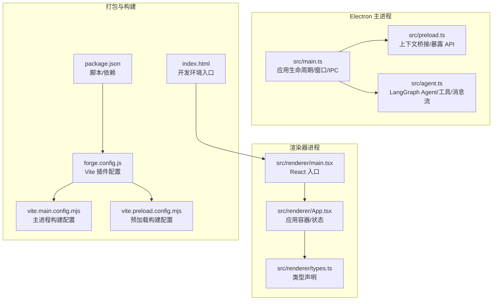
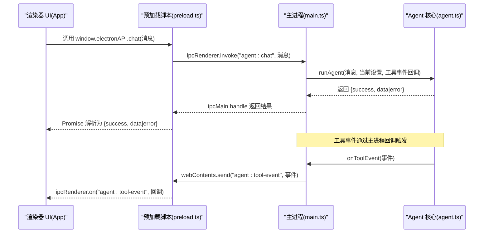
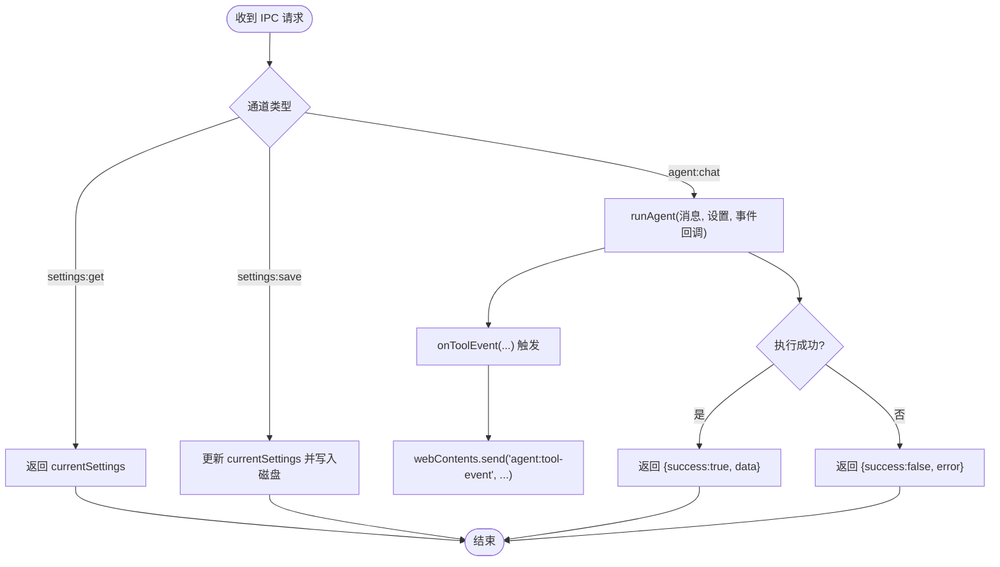
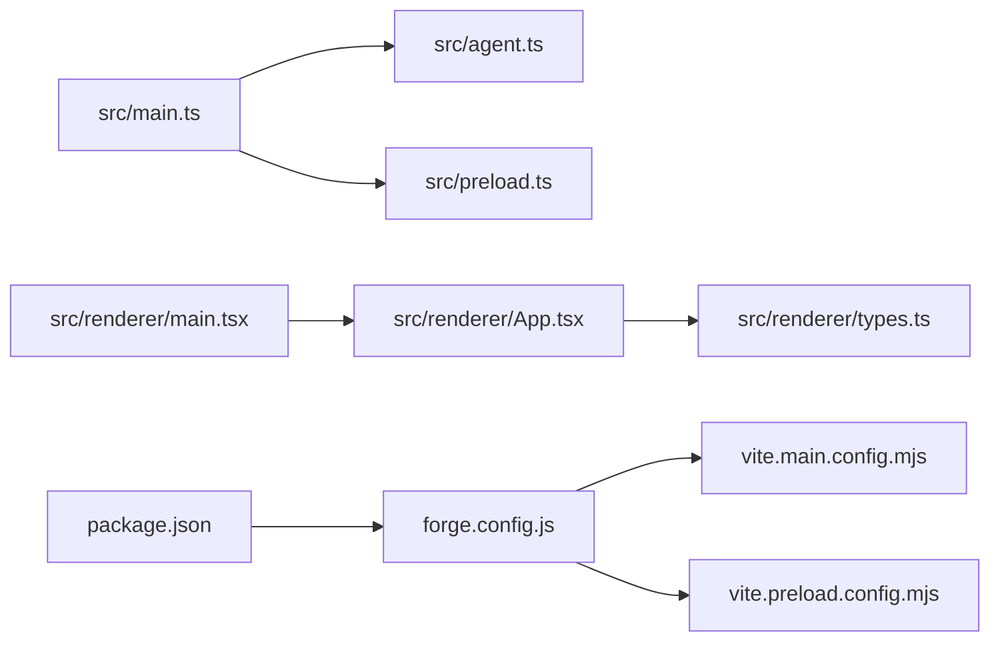

# 主进程架构

<cite>
**本文引用的文件**
- [src/main.ts](file://src/main.ts)
- [src/preload.ts](file://src/preload.ts)
- [src/agent.ts](file://src/agent.ts)
- [src/renderer/App.tsx](file://src/renderer/App.tsx)
- [src/renderer/main.tsx](file://src/renderer/main.tsx)
- [src/renderer/types.ts](file://src/renderer/types.ts)
- [package.json](file://package.json)
- [forge.config.js](file://forge.config.js)
- [vite.main.config.mjs](file://vite.main.config.mjs)
- [vite.preload.config.mjs](file://vite.preload.config.mjs)
- [index.html](file://index.html)
</cite>

## 目录
1. [简介](#简介)
2. [项目结构](#项目结构)
3. [核心组件](#核心组件)
4. [架构总览](#架构总览)
5. [详细组件分析](#详细组件分析)
6. [依赖关系分析](#依赖关系分析)
7. [性能考量](#性能考量)
8. [故障排查指南](#故障排查指南)
9. [结论](#结论)
10. [附录](#附录)

## 简介
本文件系统性地文档化 langGraph 的 Electron 主进程架构，重点覆盖：
- 应用生命周期管理与窗口创建/管理策略
- IPC 通信处理机制（agent:chat 与 settings 相关通道）
- 渲染器进程加载与交互模式
- 用户数据持久化（agent-settings.json）
- 安全策略（contextIsolation、nodeIntegration）与权限控制
- 启动流程、错误处理与扩展/定制的安全建议

## 项目结构
该项目采用 Electron + Vite + React 技术栈，主进程入口位于 src/main.ts，预加载脚本位于 src/preload.ts，AI Agent 核心逻辑位于 src/agent.ts，渲染器侧由 src/renderer 下的 React 组件构成。

图表来源
- [src/main.ts:1-100](file://src/main.ts#L1-L100)
- [src/preload.ts:1-18](file://src/preload.ts#L1-L18)
- [src/agent.ts:1-316](file://src/agent.ts#L1-L316)
- [src/renderer/main.tsx:1-8](file://src/renderer/main.tsx#L1-L8)
- [src/renderer/App.tsx:1-140](file://src/renderer/App.tsx#L1-L140)
- [src/renderer/types.ts:1-49](file://src/renderer/types.ts#L1-L49)
- [forge.config.js:1-42](file://forge.config.js#L1-L42)
- [vite.main.config.mjs:1-24](file://vite.main.config.mjs#L1-L24)
- [vite.preload.config.mjs:1-10](file://vite.preload.config.mjs#L1-L10)
- [package.json:1-36](file://package.json#L1-L36)
- [index.html:1-13](file://index.html#L1-L13)

章节来源
- [src/main.ts:1-100](file://src/main.ts#L1-L100)
- [forge.config.js:1-42](file://forge.config.js#L1-L42)
- [package.json:1-36](file://package.json#L1-L36)
- [index.html:1-13](file://index.html#L1-L13)

## 核心组件
- 主进程入口与生命周期：负责创建 BrowserWindow、加载页面、监听窗口关闭、响应应用激活；通过 ipcMain 暴露 IPC 处理函数。
- 预加载脚本：通过 contextBridge 在渲染器中暴露受控 API（electronAPI），实现安全的 IPC 调用。
- Agent 核心：封装 LangGraph Agent 图、工具集合、消息状态、模型选择与运行。
- 渲染器应用：React 应用，负责 UI、用户交互、调用 electronAPI、展示消息与工具事件。
- 数据持久化：在 userData 目录下读写 agent-settings.json，提供默认设置回退。

章节来源
- [src/main.ts:11-34](file://src/main.ts#L11-L34)
- [src/preload.ts:1-18](file://src/preload.ts#L1-L18)
- [src/agent.ts:19-37](file://src/agent.ts#L19-L37)
- [src/renderer/App.tsx:1-140](file://src/renderer/App.tsx#L1-L140)

## 架构总览
主进程以“单窗口”策略运行，窗口创建时启用 contextIsolation 并禁用 nodeIntegration，确保渲染器侧仅能通过预加载脚本暴露的 API 进行受限通信。IPC 通道包括：
- agent:chat：触发 Agent 执行，返回结果或错误
- settings:get/settings:save：读取/保存用户设置
- agent:tool-event：从主进程向渲染器推送工具调用事件

图表来源
- [src/renderer/App.tsx:43-84](file://src/renderer/App.tsx#L43-L84)
- [src/preload.ts:3-17](file://src/preload.ts#L3-L17)
- [src/main.ts:65-74](file://src/main.ts#L65-L74)
- [src/agent.ts:279-315](file://src/agent.ts#L279-L315)

## 详细组件分析

### 主进程：应用生命周期与窗口管理
- 生命周期
  - 应用就绪后创建窗口
  - 关闭最后一个窗口时退出应用
  - macOS 等平台激活时重建窗口
- 窗口创建
  - 固定尺寸与最小尺寸约束
  - webPreferences 启用预加载脚本、contextIsolation，禁用 nodeIntegration
  - 开发模式下加载 Vite DevServer，生产模式加载打包后的渲染器页面
- 窗口事件
  - closed 时释放引用，避免内存泄漏

章节来源
- [src/main.ts:35-62](file://src/main.ts#L35-L62)
- [src/main.ts:86-99](file://src/main.ts#L86-L99)

### 主进程：用户数据持久化（agent-settings.json）
- 存储位置：使用 app.getPath('userData') 下的 agent-settings.json
- 默认设置：provider、apiKey、model、baseUrl、temperature
- 读取：JSON.parse，异常时返回默认值
- 写入：JSON.stringify，缩进格式化
- 作用域：全局共享，主进程维护 currentSettings，并在保存后同步到磁盘

章节来源
- [src/main.ts:11-34](file://src/main.ts#L11-L34)
- [src/main.ts:29-31](file://src/main.ts#L29-L31)

### 主进程：IPC 处理机制
- agent:chat
  - 接收消息字符串
  - 调用 runAgent，传入 currentSettings 与工具事件回调
  - 将工具事件通过 webContents.send('agent:tool-event', ...) 推送给渲染器
  - 返回统一结果对象 {success, data|error}
- settings:get
  - 返回当前内存中的 currentSettings
- settings:save
  - 更新 currentSettings 并写入磁盘
  - 返回布尔值表示是否成功

图表来源
- [src/main.ts:65-84](file://src/main.ts#L65-L84)

章节来源
- [src/main.ts:65-84](file://src/main.ts#L65-L84)

### 预加载脚本：上下文桥接与 API 暴露
- 通过 contextBridge.exposeInMainWorld 暴露 window.electronAPI
- 暴露方法
  - chat(message) -> ipcRenderer.invoke('agent:chat')
  - onToolEvent(callback) -> 订阅 'agent:tool-event'，返回解绑函数
  - getSettings()/saveSettings(settings) -> 调用对应 IPC 通道
- 作用：在渲染器侧以受控方式访问主进程能力，避免直接注入全局变量

章节来源
- [src/preload.ts:1-18](file://src/preload.ts#L1-L18)

### 渲染器应用：UI 与交互
- App.tsx
  - 管理消息列表、设置面板显示、工具事件监听
  - 初始化时通过 window.electronAPI.getSettings() 加载设置
  - onSend 流程：添加用户消息 -> 添加加载中的助手消息 -> 调用 window.electronAPI.chat -> 更新助手消息
  - 保存设置：调用 window.electronAPI.saveSettings
- ChatWindow.tsx
  - 输入框自动高度、快捷键发送、发送状态控制
- SettingsPanel.tsx
  - 提供 provider、apiKey、model、baseUrl、temperature 等设置项
- 类型声明
  - 定义 AgentSettings、ToolEvent、Message、ToolCallInfo、ElectronAPI 接口
  - 在全局命名空间声明 window.electronAPI

章节来源
- [src/renderer/App.tsx:1-140](file://src/renderer/App.tsx#L1-L140)
- [src/renderer/components/ChatWindow.tsx:1-114](file://src/renderer/components/ChatWindow.tsx#L1-L114)
- [src/renderer/components/SettingsPanel.tsx:1-139](file://src/renderer/components/SettingsPanel.tsx#L1-L139)
- [src/renderer/types.ts:1-49](file://src/renderer/types.ts#L1-L49)

### Agent 核心：LangGraph Agent 图与工具
- 类型定义
  - AgentSettings、ToolEvent、AgentResult
- 工具集合
  - calculator、get_datetime、text_analysis、random_number
  - 使用 Zod schema 校验参数，增强健壮性
- LangGraph 图
  - 状态：messages（BaseMessage[]）
  - 节点：agentNode（LLM 推理）、toolsNode（工具执行）
  - 条件边：根据是否有 tool_calls 决定继续工具执行或结束
- 模型创建
  - OpenAI：支持自定义 baseUrl，读取 apiKey（优先 settings，其次环境变量）
  - Ollama：默认本地地址，可自定义 baseUrl
- 执行流程
  - 构建图 -> 组装 SystemMessage + HumanMessage -> graph.invoke -> 提取最后一条 AI 消息作为回复
  - 收集所有 tool_calls 作为前端展示

章节来源
- [src/agent.ts:19-37](file://src/agent.ts#L19-L37)
- [src/agent.ts:43-137](file://src/agent.ts#L43-L137)
- [src/agent.ts:171-262](file://src/agent.ts#L171-L262)
- [src/agent.ts:279-315](file://src/agent.ts#L279-L315)

### 安全策略与权限控制
- contextIsolation: true
  - 防止渲染器脚本污染主进程上下文，隔离 DOM 与 Node.js API
- nodeIntegration: false
  - 禁用 Node.js 集成，避免渲染器直接访问系统资源
- 预加载脚本
  - 仅暴露必要的 API（electronAPI），降低攻击面
- Vite SSR 配置
  - 主进程构建外部化 electron，避免打包 Node 特性到渲染器
  - 部分 LangChain 包标记为 SSR 不外部化，确保主进程可用

章节来源
- [src/main.ts:43-47](file://src/main.ts#L43-L47)
- [vite.main.config.mjs:8-22](file://vite.main.config.mjs#L8-L22)
- [vite.preload.config.mjs:4-8](file://vite.preload.config.mjs#L4-L8)

### 启动流程与构建配置
- 启动流程
  - package.json scripts 中通过 electron-forge start 启动
  - Forge 配置使用 @electron-forge/plugin-vite，分别构建 main、preload、renderer
  - 开发模式加载 Vite DevServer，生产模式加载打包后的页面
- 页面入口
  - index.html 引入 /src/renderer/main.tsx 作为 React 入口

章节来源
- [package.json:6-11](file://package.json#L6-L11)
- [forge.config.js:19-40](file://forge.config.js#L19-L40)
- [index.html:10](file://index.html#L10)

## 依赖关系分析
- 主进程依赖
  - Electron：app、BrowserWindow、ipcMain
  - Node fs：读写 agent-settings.json
  - Agent 核心：LangGraph、LangChain OpenAI/Ollama、Zod
- 渲染器依赖
  - React、ReactDOM
  - 预加载脚本暴露的 window.electronAPI
- 构建依赖
  - @electron-forge/cli、@electron-forge/plugin-vite
  - Vite、TypeScript

图表来源
- [src/main.ts:1-4](file://src/main.ts#L1-L4)
- [src/agent.ts:1-15](file://src/agent.ts#L1-L15)
- [src/renderer/main.tsx:1-8](file://src/renderer/main.tsx#L1-L8)
- [src/renderer/App.tsx:1-5](file://src/renderer/App.tsx#L1-L5)
- [forge.config.js:19-40](file://forge.config.js#L19-L40)
- [vite.main.config.mjs:1-24](file://vite.main.config.mjs#L1-L24)
- [vite.preload.config.mjs:1-10](file://vite.preload.config.mjs#L1-L10)
- [package.json:22-34](file://package.json#L22-L34)

章节来源
- [src/main.ts:1-4](file://src/main.ts#L1-L4)
- [src/agent.ts:1-15](file://src/agent.ts#L1-L15)
- [forge.config.js:19-40](file://forge.config.js#L19-L40)
- [package.json:22-34](file://package.json#L22-L34)

## 性能考量
- 主进程阻塞风险
  - runAgent 在主进程中执行，可能阻塞 UI。建议将长耗时操作迁移到专用工作线程或子进程，避免影响窗口渲染。
- 工具事件推送
  - 工具事件频繁触发时，注意渲染器侧的重渲染开销，可考虑节流或批量更新。
- 窗口尺寸与布局
  - 固定宽高与最小尺寸有助于稳定渲染，但需平衡不同分辨率体验。
- 依赖体积
  - LangChain 与 LangGraph 体量较大，建议在生产构建中启用 asar 与按需加载策略（如适用）。

[本节为通用建议，不直接分析具体文件]

## 故障排查指南
- 无法加载设置或设置未生效
  - 检查 userData 目录是否存在 agent-settings.json
  - 确认 settings:get/settings:save IPC 是否正常返回
- 聊天无响应或报错
  - 查看主进程返回的错误字段，确认网络/模型配置是否正确
  - 检查工具事件是否被渲染器订阅
- 工具执行异常
  - 检查工具参数校验与工具内部 try/catch
  - 确认 onToolEvent 回调是否正确触发
- 窗口空白或白屏
  - 开发模式下检查 DevTools 是否打开
  - 生产模式下确认渲染器页面路径是否正确

章节来源
- [src/main.ts:65-84](file://src/main.ts#L65-L84)
- [src/agent.ts:203-234](file://src/agent.ts#L203-L234)
- [src/renderer/App.tsx:24-41](file://src/renderer/App.tsx#L24-L41)

## 结论
该主进程架构以“安全隔离 + 明确 IPC 通道”的方式实现了桌面端 AI Agent 的核心功能：窗口管理、用户设置持久化、Agent 执行与工具事件推送。通过预加载脚本与严格的 webPreferences 配置，有效降低了安全风险。后续可在主进程引入工作线程以提升性能，并进一步细化错误处理与日志记录。

[本节为总结性内容，不直接分析具体文件]

## 附录

### IPC 通道一览
- agent:chat
  - 请求：消息字符串
  - 返回：{success, data.response, data.toolCalls} 或 {success:false, error}
  - 触发：工具事件通过 'agent:tool-event' 推送
- settings:get
  - 返回：当前 AgentSettings
- settings:save
  - 请求：AgentSettings
  - 返回：布尔值

章节来源
- [src/main.ts:65-84](file://src/main.ts#L65-L84)
- [src/preload.ts:3-17](file://src/preload.ts#L3-L17)

### 安全加固建议（扩展与定制）
- 限制 IPC 通道数量与命名空间，避免过度暴露
- 对来自渲染器的输入进行严格校验与白名单过滤
- 使用 CSP 与额外的上下文隔离策略
- 对敏感设置（如 API Key）进行加密存储与传输
- 定期审计依赖版本，及时修复已知漏洞

[本节为通用建议，不直接分析具体文件]