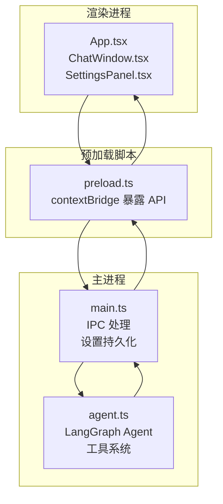
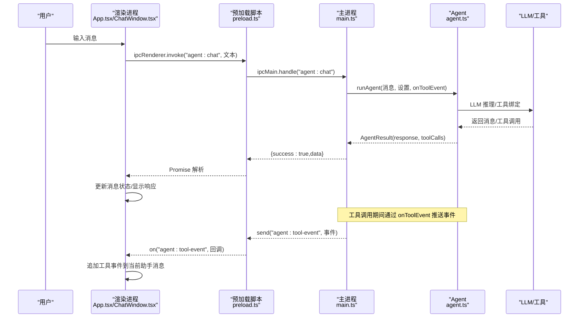
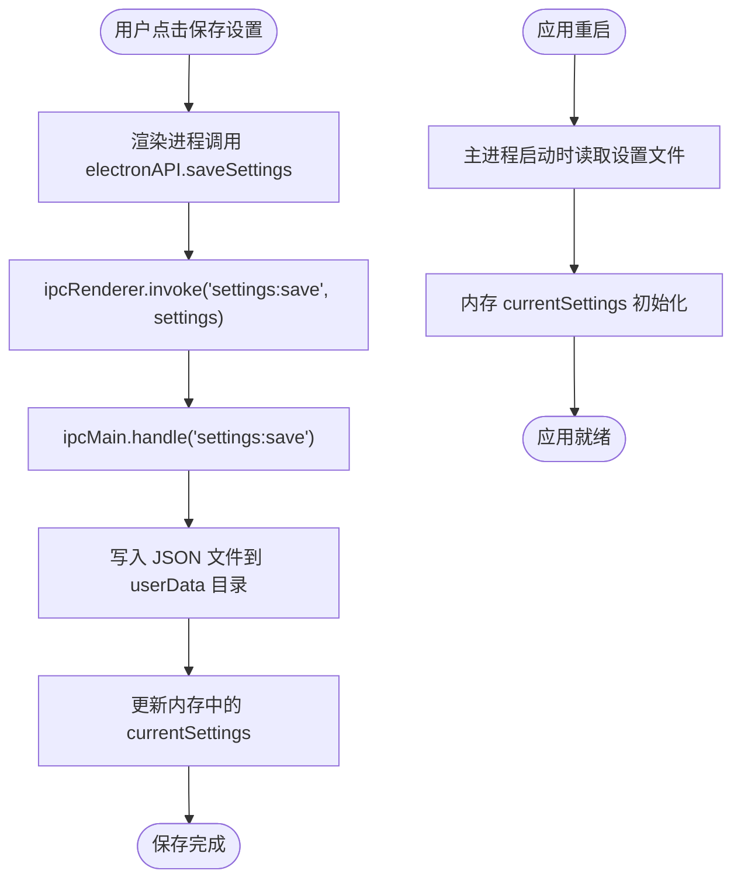
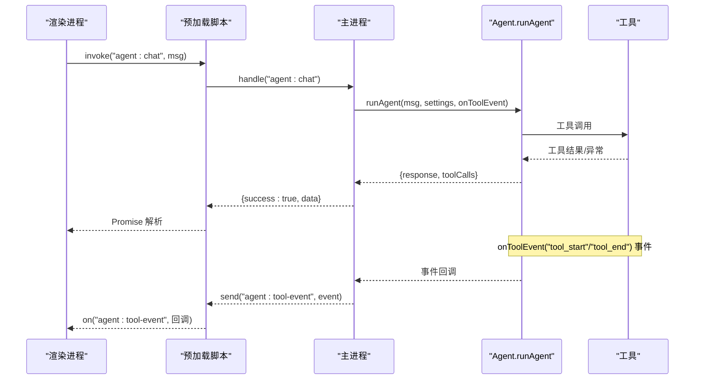
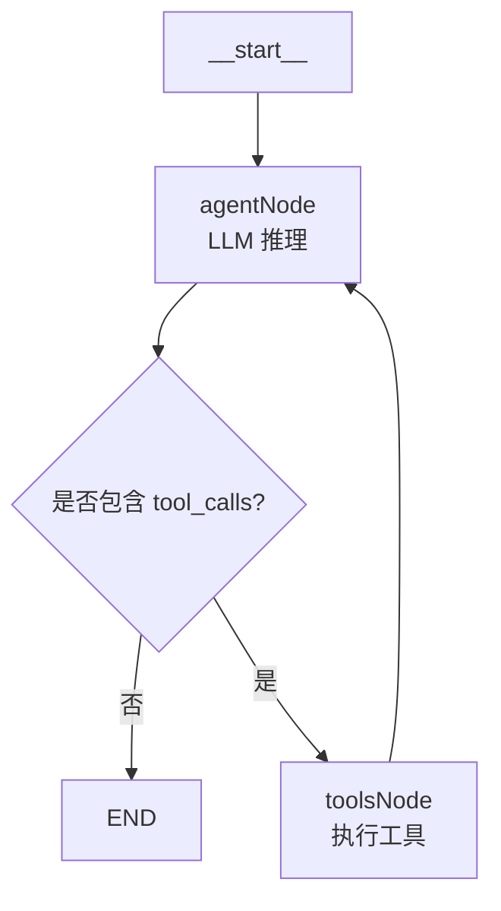
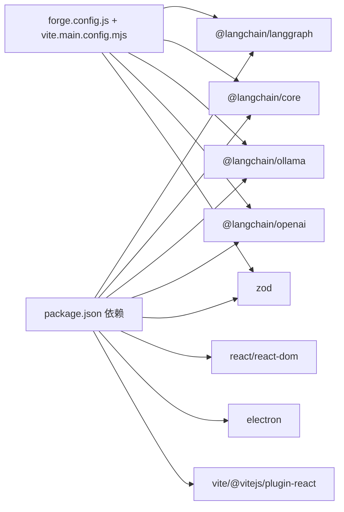

# 数据流模式

<cite>
**本文引用的文件**
- [src/main.ts](file://src/main.ts)
- [src/preload.ts](file://src/preload.ts)
- [src/agent.ts](file://src/agent.ts)
- [src/renderer/App.tsx](file://src/renderer/App.tsx)
- [src/renderer/types.ts](file://src/renderer/types.ts)
- [src/renderer/components/ChatWindow.tsx](file://src/renderer/components/ChatWindow.tsx)
- [src/renderer/components/SettingsPanel.tsx](file://src/renderer/components/SettingsPanel.tsx)
- [package.json](file://package.json)
- [forge.config.js](file://forge.config.js)
- [开发文档.md](file://开发文档.md)
</cite>

## 目录
1. [简介](#简介)
2. [项目结构](#项目结构)
3. [核心组件](#核心组件)
4. [架构总览](#架构总览)
5. [详细组件分析](#详细组件分析)
6. [依赖关系分析](#依赖关系分析)
7. [性能考量](#性能考量)
8. [故障排查指南](#故障排查指南)
9. [结论](#结论)
10. [附录](#附录)

## 简介
本文件围绕 langGraph 数据流模式进行系统化文档化，重点解释：
- 用户输入到 AI 响应的完整数据流路径
- 消息对象的数据结构与状态管理
- 设置配置的持久化与重启后恢复流程
- 异步数据处理模式（Promise 与错误传播）
- 数据验证、类型安全与并发控制策略
- 数据流优化建议与性能监控方法

## 项目结构
该项目采用 Electron + React + Vite 的桌面应用架构，核心分为三个进程：
- 渲染进程（React UI）：负责用户交互与展示
- 预加载脚本（Preload）：安全桥接，暴露受限 API
- 主进程（Node.js）：负责 IPC、持久化、调用 LangGraph Agent

图表来源
- [src/renderer/App.tsx:1-140](file://src/renderer/App.tsx#L1-L140)
- [src/renderer/components/ChatWindow.tsx:1-114](file://src/renderer/components/ChatWindow.tsx#L1-L114)
- [src/renderer/components/SettingsPanel.tsx:1-139](file://src/renderer/components/SettingsPanel.tsx#L1-L139)
- [src/preload.ts:1-18](file://src/preload.ts#L1-L18)
- [src/main.ts:1-100](file://src/main.ts#L1-L100)
- [src/agent.ts:1-316](file://src/agent.ts#L1-L316)

章节来源
- [开发文档.md:152-190](file://开发文档.md#L152-L190)
- [forge.config.js:1-42](file://forge.config.js#L1-L42)

## 核心组件
- 消息对象与设置类型：定义在前端类型文件中，保证前后端一致的契约
- Agent 状态与工具：在主进程中通过 LangGraph 定义状态图与工具节点
- IPC 通道：通过 invoke/handle 与 send/on 实现双向通信
- 设置持久化：主进程读写用户数据目录下的 JSON 文件

章节来源
- [src/renderer/types.ts:1-49](file://src/renderer/types.ts#L1-L49)
- [src/agent.ts:19-37](file://src/agent.ts#L19-L37)
- [src/main.ts:11-31](file://src/main.ts#L11-L31)
- [src/preload.ts:3-17](file://src/preload.ts#L3-L17)

## 架构总览
下面的序列图展示了从用户输入到 AI 响应的完整数据流，以及设置修改的持久化路径。

图表来源
- [src/renderer/App.tsx:43-84](file://src/renderer/App.tsx#L43-L84)
- [src/renderer/components/ChatWindow.tsx:29-42](file://src/renderer/components/ChatWindow.tsx#L29-L42)
- [src/preload.ts:5-12](file://src/preload.ts#L5-L12)
- [src/main.ts:65-74](file://src/main.ts#L65-L74)
- [src/agent.ts:279-315](file://src/agent.ts#L279-L315)

## 详细组件分析

### 消息对象的数据结构与状态管理
- 消息结构
  - 字段：id、role、content、timestamp、isLoading、isError、toolCalls、toolEvents
  - 用途：承载用户消息、助手消息（含加载态）、工具调用记录与事件流
- 状态管理
  - 渲染进程使用 React 状态管理消息列表与设置面板可见性
  - 主进程维护当前设置对象并在重启后加载
- 数据流
  - 用户输入触发渲染进程添加“用户消息”
  - 添加“助手消息（加载态）”，随后等待 Agent 返回
  - Agent 返回后替换助手消息内容，标记加载结束与错误状态

章节来源
- [src/renderer/types.ts:22-31](file://src/renderer/types.ts#L22-L31)
- [src/renderer/App.tsx:6-22](file://src/renderer/App.tsx#L6-L22)
- [src/renderer/App.tsx:43-84](file://src/renderer/App.tsx#L43-L84)

### 设置配置的数据流（从用户修改到持久化再到应用重启）
- 用户修改
  - 渲染进程打开设置面板，用户更改提供商、模型、温度等
  - 点击保存后调用预加载脚本的保存接口
- IPC 与持久化
  - 预加载脚本通过 invoke 调用主进程的 settings:save
  - 主进程更新内存中的设置并写入用户数据目录 JSON 文件
- 应用重启
  - 主进程启动时读取设置文件，回填到内存对象
  - 渲染进程首次挂载时通过 invoke 获取当前设置并填充表单

图表来源
- [src/renderer/components/SettingsPanel.tsx:17-19](file://src/renderer/components/SettingsPanel.tsx#L17-L19)
- [src/preload.ts:15-16](file://src/preload.ts#L15-L16)
- [src/main.ts:80-84](file://src/main.ts#L80-L84)
- [src/main.ts:14-31](file://src/main.ts#L14-L31)

章节来源
- [src/renderer/components/SettingsPanel.tsx:1-139](file://src/renderer/components/SettingsPanel.tsx#L1-L139)
- [src/preload.ts:14-17](file://src/preload.ts#L14-L17)
- [src/main.ts:11-31](file://src/main.ts#L11-L31)

### 异步数据处理模式与错误传播
- 异步调用链
  - 渲染进程通过 invoke 触发主进程处理
  - 主进程内部调用 Agent 的 runAgent，返回 Promise
  - Agent 内部构建 LangGraph 并执行推理循环
- 错误传播
  - 主进程捕获 Agent 异常并返回 {success:false,error}
  - 渲染进程根据 success 字段更新助手消息为错误态
- 工具事件流
  - Agent 在工具调用前后发出事件
  - 主进程通过 send 推送到渲染进程
  - 渲染进程监听并追加到当前助手消息的 toolEvents

图表来源
- [src/renderer/App.tsx:24-41](file://src/renderer/App.tsx#L24-L41)
- [src/preload.ts:7-12](file://src/preload.ts#L7-L12)
- [src/main.ts:65-74](file://src/main.ts#L65-L74)
- [src/agent.ts:197-234](file://src/agent.ts#L197-L234)
- [src/agent.ts:279-315](file://src/agent.ts#L279-L315)

章节来源
- [src/renderer/App.tsx:24-41](file://src/renderer/App.tsx#L24-L41)
- [src/agent.ts:197-234](file://src/agent.ts#L197-L234)

### 数据验证、类型安全与并发控制
- 类型安全
  - 前后端通过 TypeScript 接口定义 IPC 契约
  - 工具参数使用 Zod Schema 校验，确保输入合法
- 数据验证
  - 工具内部对输入进行清洗与校验（如计算器仅允许数字与运算符）
  - Agent 状态使用 LangGraph Annotation 声明式定义，reducer 控制状态合并
- 并发控制
  - 渲染进程通过 isSending 与禁用输入避免重复提交
  - 主进程一次只处理一个 agent:chat 请求（由 IPC handle 的串行特性保障）

章节来源
- [src/renderer/types.ts:33-42](file://src/renderer/types.ts#L33-L42)
- [src/agent.ts:61-64](file://src/agent.ts#L61-L64)
- [src/agent.ts:144-149](file://src/agent.ts#L144-L149)
- [src/renderer/components/ChatWindow.tsx:29-42](file://src/renderer/components/ChatWindow.tsx#L29-L42)

### LangGraph Agent 状态图与消息累加
- 状态定义
  - 使用 Annotation.Root 声明 messages 字段，reducer 为数组拼接
  - 默认值为空数组，确保每次推理从干净状态开始
- 节点与条件
  - agentNode：调用 LLM，返回一条 AIMessage
  - toolsNode：解析 AIMessage 的 tool_calls，逐一执行工具，返回 tool 消息
  - shouldContinue：判断是否有 tool_calls，决定进入工具节点还是结束
- 执行流程
  - 从 agent 节点开始，若无工具调用则结束；若有则进入 tools 节点，再回到 agent 节点，直至结束

图表来源
- [src/agent.ts:171-262](file://src/agent.ts#L171-L262)
- [src/agent.ts:144-149](file://src/agent.ts#L144-L149)

章节来源
- [src/agent.ts:144-149](file://src/agent.ts#L144-L149)
- [src/agent.ts:171-262](file://src/agent.ts#L171-L262)

## 依赖关系分析
- Electron 构建与模块兼容
  - 主进程 Vite 配置通过 ssr.noExternal 将 LangChain/LangGraph 包内联，解决 ESM/CJS 兼容问题
- 依赖清单
  - @langchain/langgraph、@langchain/core、@langchain/openai、@langchain/ollama、zod
  - react、react-dom、electron、vite、@vitejs/plugin-react

图表来源
- [package.json:13-34](file://package.json#L13-L34)
- [forge.config.js:19-41](file://forge.config.js#L19-L41)
- [开发文档.md:235-264](file://开发文档.md#L235-L264)

章节来源
- [package.json:1-36](file://package.json#L1-L36)
- [forge.config.js:1-42](file://forge.config.js#L1-L42)
- [开发文档.md:545-574](file://开发文档.md#L545-L574)

## 性能考量
- 数据流优化建议
  - 减少不必要的状态重渲染：在渲染进程使用稳定的消息 ID 与不可变更新策略
  - 工具调用批量化：若多个工具可并行，可在 toolsNode 中使用并发执行（注意工具幂等性与资源竞争）
  - 流式输出：参考扩展指南，使用 streamEvents 实现逐字输出，改善首屏延迟
  - 缓存与复用：对频繁使用的工具结果进行缓存（需考虑一致性）
- 监控方法
  - 工具事件计数与耗时：在 onToolEvent 中记录开始/结束时间，统计平均耗时
  - LLM 调用指标：记录每次推理的耗时与 token 使用（需在 LLM 层埋点）
  - UI 响应度：测量从用户输入到助手消息更新的时间间隔
  - 错误率：统计 Agent 调用失败次数与错误类型分布

[本节为通用指导，不直接分析具体文件]

## 故障排查指南
- 设置无法保存或重启后丢失
  - 检查 userData 目录权限与磁盘空间
  - 确认主进程 settings:save 是否被调用且未抛出异常
- Agent 调用无响应
  - 检查 LLM 提供商配置（API Key、Base URL、模型名）
  - 查看工具事件流是否正常推送（渲染进程 onToolEvent 是否注册成功）
- 工具执行报错
  - 核对工具参数 Schema 与实际传入值
  - 检查工具内部异常处理与错误消息格式
- UI 卡顿或重复渲染
  - 检查渲染进程状态更新是否使用不可变更新
  - 确认 isSending 与输入框禁用逻辑生效

章节来源
- [src/main.ts:14-31](file://src/main.ts#L14-L31)
- [src/main.ts:80-84](file://src/main.ts#L80-L84)
- [src/renderer/App.tsx:24-41](file://src/renderer/App.tsx#L24-L41)
- [src/agent.ts:61-64](file://src/agent.ts#L61-L64)

## 结论
本项目通过 Electron 的安全架构与 LangGraph 的声明式状态图，构建了清晰、可扩展的数据流体系。消息对象与设置类型定义确保了前后端契约一致；IPC 通道与工具事件流提供了良好的可观测性；持久化策略使得配置在重启后可恢复。结合类型安全、数据验证与并发控制，整体具备较好的健壮性与可维护性。后续可通过流式输出、工具并行化与指标埋点进一步优化用户体验与性能表现。

[本节为总结性内容，不直接分析具体文件]

## 附录
- 相关实现参考路径
  - [消息类型定义:22-31](file://src/renderer/types.ts#L22-L31)
  - [设置类型定义:2-8](file://src/renderer/types.ts#L2-L8)
  - [工具事件类型:10-15](file://src/renderer/types.ts#L10-L15)
  - [IPC 暴露接口:3-17](file://src/preload.ts#L3-L17)
  - [主进程 IPC 处理:65-84](file://src/main.ts#L65-L84)
  - [Agent 状态与工具:144-149](file://src/agent.ts#L144-L149)
  - [Agent 执行流程:279-315](file://src/agent.ts#L279-L315)
  - [渲染进程消息更新:43-84](file://src/renderer/App.tsx#L43-L84)
  - [设置面板保存逻辑:17-19](file://src/renderer/components/SettingsPanel.tsx#L17-L19)

[本节为索引性内容，不直接分析具体文件]