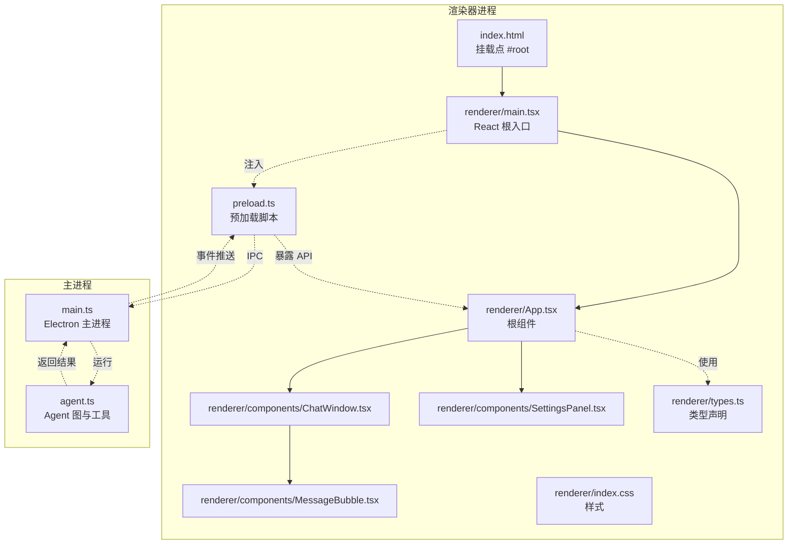
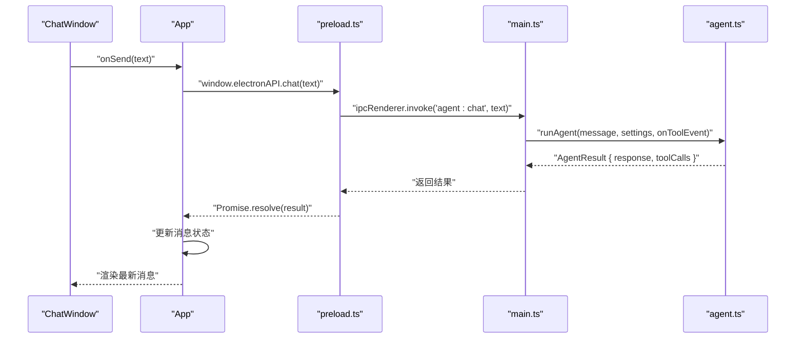
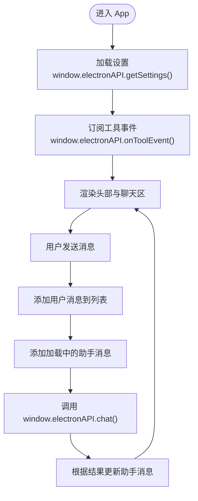
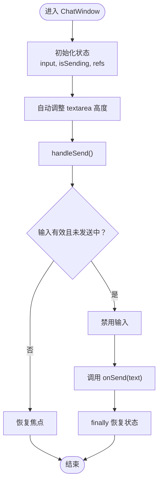
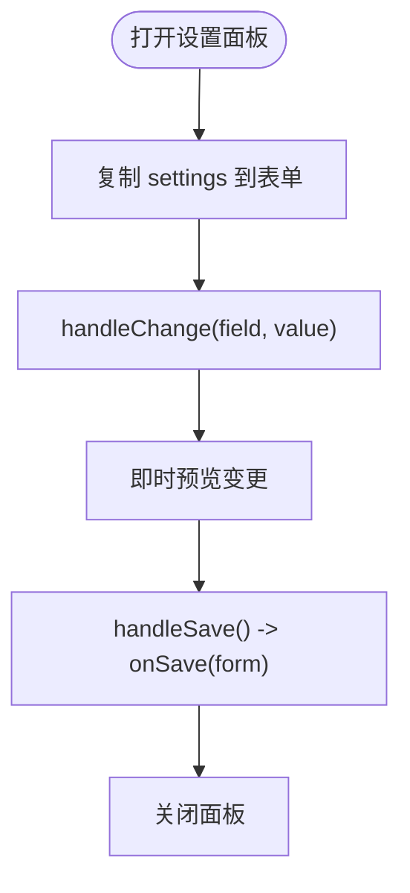
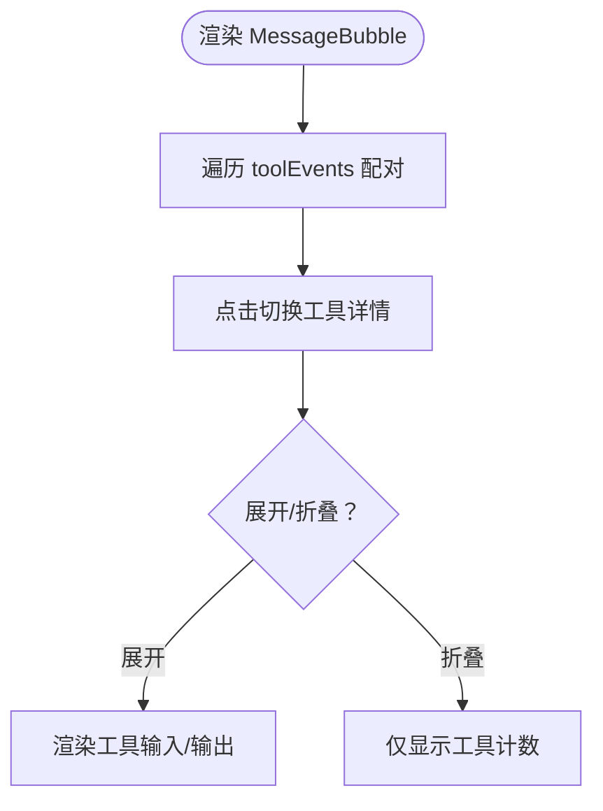
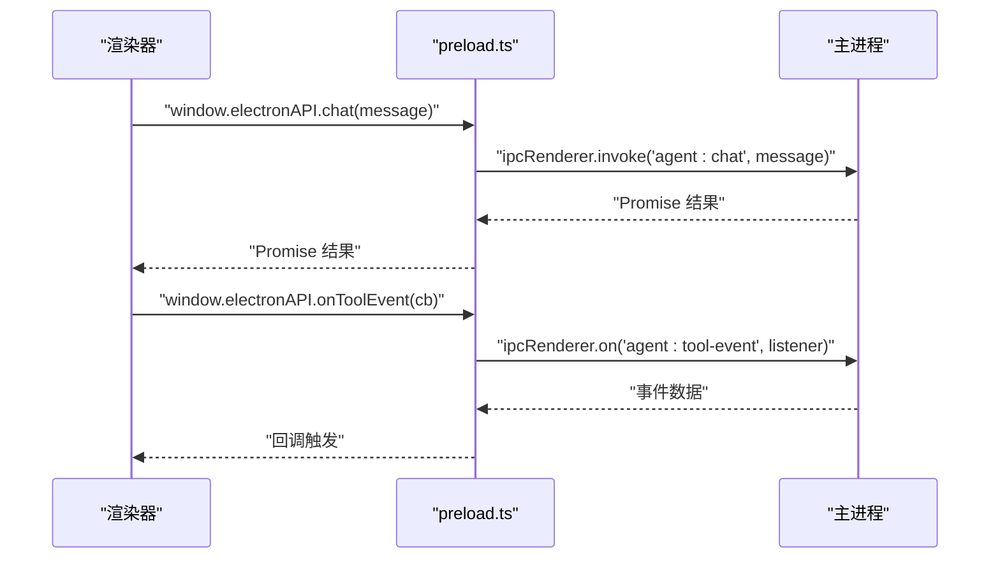
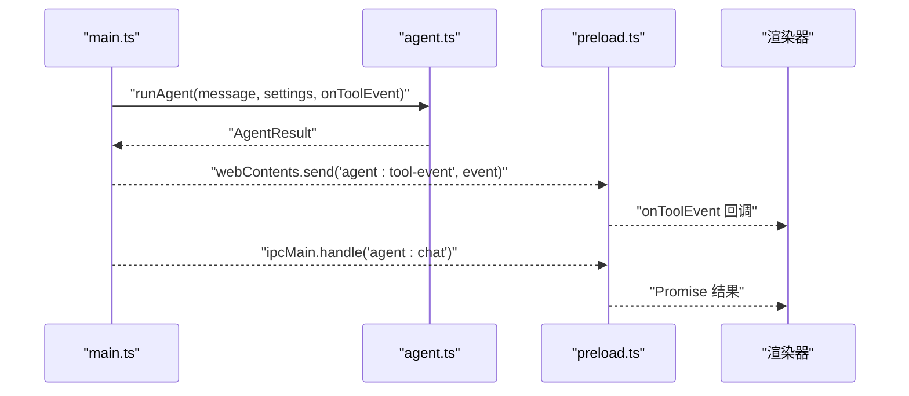
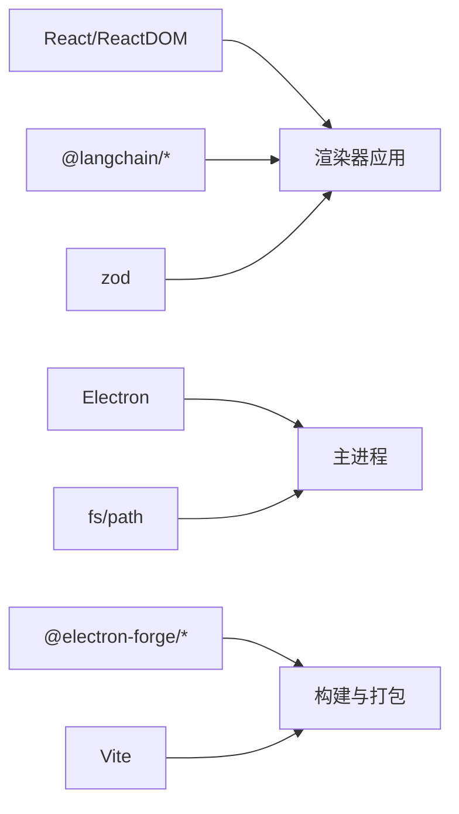

# 渲染器进程架构

<cite>
**本文档引用的文件**
- [src/renderer/App.tsx](file://src/renderer/App.tsx)
- [src/renderer/main.tsx](file://src/renderer/main.tsx)
- [src/renderer/components/ChatWindow.tsx](file://src/renderer/components/ChatWindow.tsx)
- [src/renderer/components/SettingsPanel.tsx](file://src/renderer/components/SettingsPanel.tsx)
- [src/renderer/components/MessageBubble.tsx](file://src/renderer/components/MessageBubble.tsx)
- [src/renderer/types.ts](file://src/renderer/types.ts)
- [src/renderer/index.css](file://src/renderer/index.css)
- [src/preload.ts](file://src/preload.ts)
- [src/main.ts](file://src/main.ts)
- [src/agent.ts](file://src/agent.ts)
- [package.json](file://package.json)
- [index.html](file://index.html)
- [forge.config.js](file://forge.config.js)
</cite>

## 目录
1. [简介](#简介)
2. [项目结构](#项目结构)
3. [核心组件](#核心组件)
4. [架构总览](#架构总览)
5. [详细组件分析](#详细组件分析)
6. [依赖关系分析](#依赖关系分析)
7. [性能考虑](#性能考虑)
8. [故障排除指南](#故障排除指南)
9. [结论](#结论)
10. [附录](#附录)

## 简介
本文件面向开发者，系统性阐述 langGraph 渲染器进程的架构设计与实现细节。重点覆盖：
- 渲染器进程的职责边界与限制（React 应用启动与运行环境）
- App.tsx 根组件的架构设计及其如何协调 ChatWindow 与 SettingsPanel
- 预加载脚本（preload.ts）的安全 IPC 桥接与 Node.js API 的受限暴露
- 渲染器进程的安全上下文、上下文隔离机制与与主进程的通信协议
- 初始化流程、组件树结构与状态管理模式
- 扩展与安全实践指导

## 项目结构
渲染器相关代码集中在 src/renderer 目录，采用按功能模块组织的目录结构：
- 根组件与入口：App.tsx、main.tsx、index.css
- UI 组件：ChatWindow、SettingsPanel、MessageBubble
- 类型声明：types.ts
- 预加载脚本：preload.ts
- 主进程：main.ts
- Agent 逻辑：agent.ts
- 应用配置：package.json、index.html、forge.config.js

图表来源
- [index.html:1-13](file://index.html#L1-L13)
- [src/renderer/main.tsx:1-8](file://src/renderer/main.tsx#L1-L8)
- [src/renderer/App.tsx:1-140](file://src/renderer/App.tsx#L1-L140)
- [src/renderer/components/ChatWindow.tsx:1-114](file://src/renderer/components/ChatWindow.tsx#L1-L114)
- [src/renderer/components/SettingsPanel.tsx:1-139](file://src/renderer/components/SettingsPanel.tsx#L1-L139)
- [src/renderer/components/MessageBubble.tsx:1-104](file://src/renderer/components/MessageBubble.tsx#L1-L104)
- [src/renderer/types.ts:1-49](file://src/renderer/types.ts#L1-L49)
- [src/renderer/index.css:1-649](file://src/renderer/index.css#L1-L649)
- [src/preload.ts:1-18](file://src/preload.ts#L1-L18)
- [src/main.ts:1-100](file://src/main.ts#L1-L100)
- [src/agent.ts:1-316](file://src/agent.ts#L1-L316)

章节来源
- [package.json:1-36](file://package.json#L1-L36)
- [index.html:1-13](file://index.html#L1-L13)
- [forge.config.js:1-42](file://forge.config.js#L1-L42)

## 核心组件
- App.tsx：应用根组件，负责全局状态管理（消息列表、设置面板显示、LLM 设置）、与主进程的 IPC 交互（聊天、工具事件监听、设置读取/保存），以及协调 ChatWindow 与 SettingsPanel 的渲染。
- ChatWindow.tsx：聊天界面容器，处理输入框自动高度、回车发送、消息列表滚动、空状态提示与建议消息。
- SettingsPanel.tsx：设置面板，支持提供商切换（OpenAI/Ollama）、API Key、模型名、基础地址、温度参数等，并提供保存与关闭回调。
- MessageBubble.tsx：单条消息气泡组件，支持工具事件展示与展开/折叠。
- types.ts：定义 ElectronAPI 接口、AgentSettings、ToolEvent、ToolCallInfo、Message 等类型，用于强类型约束与 IDE 提示。
- preload.ts：通过 contextBridge 在渲染器中暴露受控的 IPC API，仅暴露必要的方法，避免直接暴露 Node.js API。
- main.ts：Electron 主进程，负责窗口创建、IPC 处理、设置持久化、Agent 执行与工具事件回推。
- agent.ts：LangGraph Agent 的构建与执行逻辑，包含工具定义、状态图、条件路由与最终响应提取。

章节来源
- [src/renderer/App.tsx:1-140](file://src/renderer/App.tsx#L1-L140)
- [src/renderer/components/ChatWindow.tsx:1-114](file://src/renderer/components/ChatWindow.tsx#L1-L114)
- [src/renderer/components/SettingsPanel.tsx:1-139](file://src/renderer/components/SettingsPanel.tsx#L1-L139)
- [src/renderer/components/MessageBubble.tsx:1-104](file://src/renderer/components/MessageBubble.tsx#L1-L104)
- [src/renderer/types.ts:1-49](file://src/renderer/types.ts#L1-L49)
- [src/preload.ts:1-18](file://src/preload.ts#L1-L18)
- [src/main.ts:1-100](file://src/main.ts#L1-L100)
- [src/agent.ts:1-316](file://src/agent.ts#L1-L316)

## 架构总览
渲染器进程采用“上下文隔离 + 预加载桥接”的安全模式：
- 上下文隔离：webPreferences.contextIsolation=true，确保渲染器 JS 无法直接访问 Node.js API。
- 预加载桥接：preload.ts 使用 contextBridge.exposeInMainWorld 暴露有限的 window.electronAPI，作为渲染器与主进程的唯一通信通道。
- IPC 协议：渲染器通过 window.electronAPI 调用主进程的 ipcMain.handle 方法；主进程通过 ipcRenderer.invoke/ipcRenderer.on 与渲染器通信。
- 状态管理：App.tsx 使用 React hooks 管理消息列表、设置面板显示与 LLM 设置；ChatWindow 负责输入与发送；SettingsPanel 负责设置编辑与保存。

图表来源
- [src/renderer/components/ChatWindow.tsx:29-42](file://src/renderer/components/ChatWindow.tsx#L29-L42)
- [src/renderer/App.tsx:43-84](file://src/renderer/App.tsx#L43-L84)
- [src/preload.ts:5](file://src/preload.ts#L5)
- [src/main.ts:65-74](file://src/main.ts#L65-L74)
- [src/agent.ts:279-315](file://src/agent.ts#L279-L315)

## 详细组件分析

### App.tsx 根组件
职责与设计要点：
- 全局状态：messages（消息列表）、showSettings（设置面板开关）、settings（LLM 设置）。
- 生命周期：首次加载从主进程读取设置；订阅工具事件以实时更新最后一条助手消息的 toolEvents。
- 交互流程：handleSend 触发用户消息添加、加载中助手消息插入、调用 window.electronAPI.chat 并根据结果更新消息状态；handleSaveSettings 调用主进程保存设置并更新本地状态；handleClearChat 清空消息。
- 组件协调：根据 showSettings 决定是否渲染 SettingsPanel；ChatWindow 接收 messages 与 onSend 回调。

图表来源
- [src/renderer/App.tsx:17-41](file://src/renderer/App.tsx#L17-L41)
- [src/renderer/App.tsx:43-84](file://src/renderer/App.tsx#L43-L84)

章节来源
- [src/renderer/App.tsx:1-140](file://src/renderer/App.tsx#L1-L140)

### ChatWindow.tsx 聊天窗口
职责与设计要点：
- 输入管理：自动高度调整、回车发送（Shift+Enter 换行）、禁用发送按钮的条件控制。
- 消息渲染：空状态提示与建议消息；使用 MessageBubble 渲染每条消息。
- 滚动行为：每次消息变化自动滚动到底部，提升用户体验。

图表来源
- [src/renderer/components/ChatWindow.tsx:11-42](file://src/renderer/components/ChatWindow.tsx#L11-L42)

章节来源
- [src/renderer/components/ChatWindow.tsx:1-114](file://src/renderer/components/ChatWindow.tsx#L1-L114)

### SettingsPanel.tsx 设置面板
职责与设计要点：
- 表单状态：基于 props.settings 创建表单副本，onChange 同步更新。
- 提供商切换：OpenAI 与 Ollama 两种模式，动态显示/隐藏对应字段。
- 保存与关闭：调用 onSave 保存设置并关闭面板；onClose 关闭面板。
- 用户体验：提供温度滑块、占位符提示与输入校验辅助文案。

图表来源
- [src/renderer/components/SettingsPanel.tsx:10-19](file://src/renderer/components/SettingsPanel.tsx#L10-L19)

章节来源
- [src/renderer/components/SettingsPanel.tsx:1-139](file://src/renderer/components/SettingsPanel.tsx#L1-L139)

### MessageBubble.tsx 消息气泡
职责与设计要点：
- 工具事件配对：将 tool_start 与 tool_end 事件按工具名配对，支持未完成事件的运行态指示。
- 展示控制：通过按钮切换工具详情的展开/折叠。
- 状态指示：加载态与错误态的视觉反馈；时间戳格式化显示。

图表来源
- [src/renderer/components/MessageBubble.tsx:13-28](file://src/renderer/components/MessageBubble.tsx#L13-L28)

章节来源
- [src/renderer/components/MessageBubble.tsx:1-104](file://src/renderer/components/MessageBubble.tsx#L1-L104)

### 预加载脚本（preload.ts）与 IPC 桥接
职责与设计要点：
- 仅暴露必要 API：chat、onToolEvent、getSettings、saveSettings。
- 使用 contextBridge.exposeInMainWorld 将 electronAPI 暴露至 window，避免直接暴露 Node.js API。
- IPC 协议：invoke 用于请求-响应式调用（如聊天、设置读取/保存）；on 用于订阅事件（工具事件）。

图表来源
- [src/preload.ts:3-17](file://src/preload.ts#L3-L17)
- [src/main.ts:65-84](file://src/main.ts#L65-L84)

章节来源
- [src/preload.ts:1-18](file://src/preload.ts#L1-L18)

### 主进程（main.ts）与 Agent 执行
职责与设计要点：
- 窗口创建：启用上下文隔离、禁用 Node 集成、注入预加载脚本。
- IPC 处理：注册 agent:chat、settings:get、settings:save；将 Agent 执行结果与工具事件通过 IPC 返回给渲染器。
- 设置持久化：使用 app.getPath('userData') 下的 JSON 文件存储设置。
- Agent 协作：runAgent 调用 agent.ts 中的构建与执行逻辑，回传工具事件给渲染器。

图表来源
- [src/main.ts:36-62](file://src/main.ts#L36-L62)
- [src/main.ts:65-84](file://src/main.ts#L65-L84)
- [src/agent.ts:279-315](file://src/agent.ts#L279-L315)

章节来源
- [src/main.ts:1-100](file://src/main.ts#L1-L100)
- [src/agent.ts:1-316](file://src/agent.ts#L1-L316)

## 依赖关系分析
- 渲染器依赖：
  - React 生态：React、ReactDOM
  - LangChain 生态：@langchain/core、@langchain/langgraph、@langchain/openai、@langchain/ollama
  - 类型验证：zod
- 主进程依赖：
  - Electron：app、BrowserWindow、ipcMain、ipcRenderer
  - Node.js：fs、path
- 构建与打包：
  - @electron-forge/cli、@electron-forge/plugin-vite
  - Vite 配置分别构建 main、preload、renderer

图表来源
- [package.json:13-34](file://package.json#L13-L34)
- [forge.config.js:19-41](file://forge.config.js#L19-L41)

章节来源
- [package.json:1-36](file://package.json#L1-L36)
- [forge.config.js:1-42](file://forge.config.js#L1-L42)

## 性能考虑
- 渲染器侧：
  - ChatWindow 使用自动高度与滚动优化，减少重排与重绘。
  - MessageBubble 对工具事件进行配对与懒渲染，避免不必要的 DOM 更新。
  - App 状态更新采用不可变更新策略，减少不必要的子组件重渲染。
- 主进程侧：
  - IPC 使用 invoke/on，避免阻塞 UI 线程。
  - Agent 执行在主进程中进行，渲染器仅负责展示与交互。
- 资源管理：
  - 设置持久化采用同步写入，注意在高频保存场景下的性能影响。
  - 工具事件流式推送，避免一次性大量数据传输。

## 故障排除指南
- 无法加载设置或保存失败
  - 检查主进程设置路径与权限；确认 settingsPath 是否可达。
  - 章节来源
    - [src/main.ts:14-31](file://src/main.ts#L14-L31)
- 工具事件不显示或不更新
  - 确认 App.useEffect 订阅是否生效；检查主进程是否正确发送 agent:tool-event。
  - 章节来源
    - [src/renderer/App.tsx:24-41](file://src/renderer/App.tsx#L24-L41)
    - [src/main.ts:67-68](file://src/main.ts#L67-L68)
- 聊天无响应或报错
  - 检查 window.electronAPI.chat 是否被正确暴露；确认主进程 ipcMain.handle('agent:chat') 是否存在。
  - 章节来源
    - [src/preload.ts:5](file://src/preload.ts#L5)
    - [src/main.ts:65-74](file://src/main.ts#L65-L74)
- 上下文隔离导致 API 不可用
  - 确保 webPreferences.contextIsolation=true，且通过 preload.ts 暴露 API。
  - 章节来源
    - [src/main.ts:43-47](file://src/main.ts#L43-L47)
    - [src/preload.ts:3-17](file://src/preload.ts#L3-L17)

## 结论
该渲染器进程架构遵循 Electron 最佳实践，通过上下文隔离与预加载桥接实现安全可控的 IPC 通信。App.tsx 作为根组件承担状态协调与交互编排，ChatWindow 与 SettingsPanel 提供清晰的 UI 分层，MessageBubble 实现细粒度的消息展示。主进程负责 Agent 执行与设置持久化，形成职责明确、边界清晰的分层架构。开发者可在保持安全性的前提下扩展组件与工具，同时遵循 IPC 协议与类型约束，确保系统的稳定性与可维护性。

## 附录
- 初始化流程概览
  - index.html 加载 renderer/main.tsx
  - main.tsx 创建根节点并渲染 App
  - App 初始化状态并订阅工具事件
  - ChatWindow 渲染消息列表与输入区域
  - SettingsPanel 在需要时渲染设置面板
- 安全实践清单
  - 仅通过 preload.ts 暴露必要 API
  - 严格使用 invoke/on 进行 IPC 通信
  - 避免在渲染器中直接访问 Node.js API
  - 对外部输入进行校验与清理（如工具参数）
  - 使用 HTTPS 与安全的 API 地址（如需）