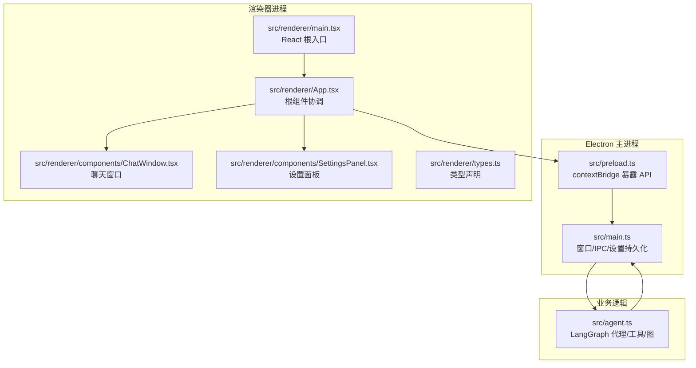
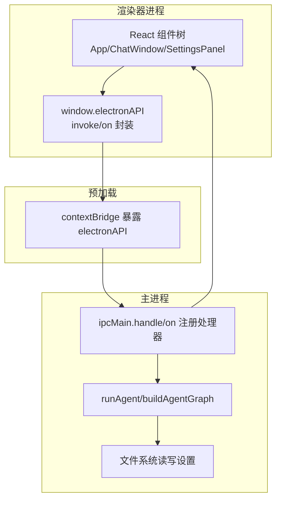
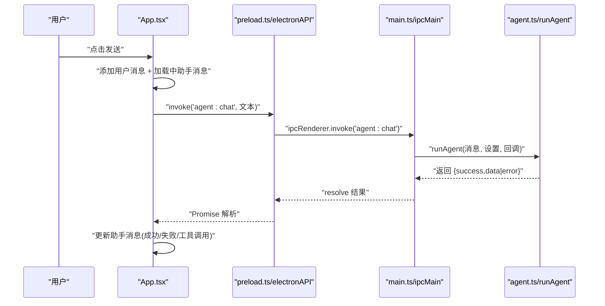
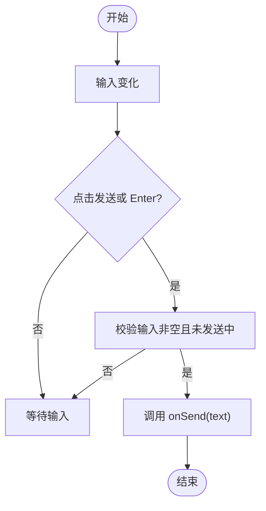
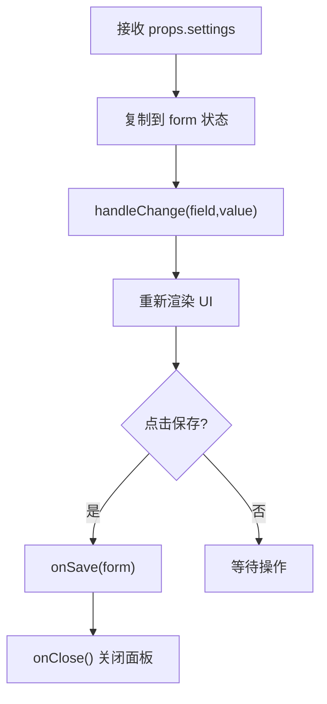
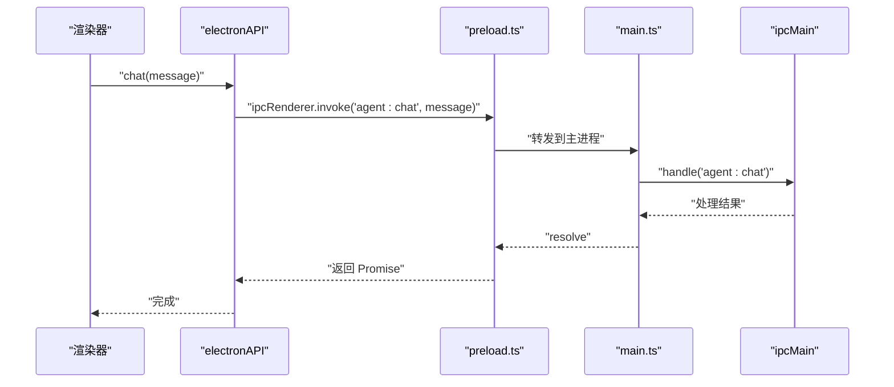
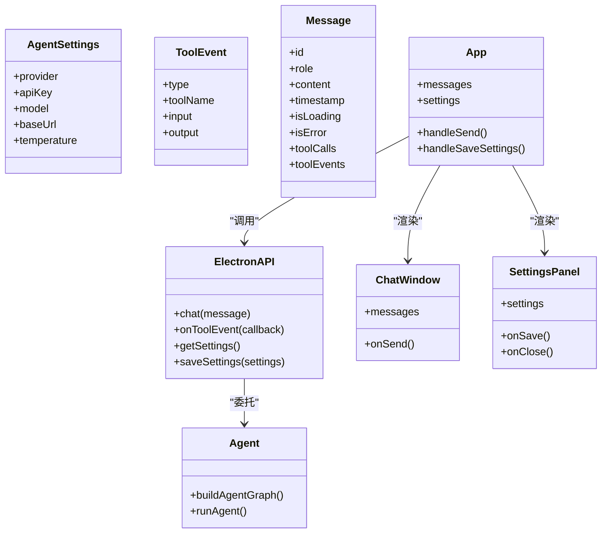
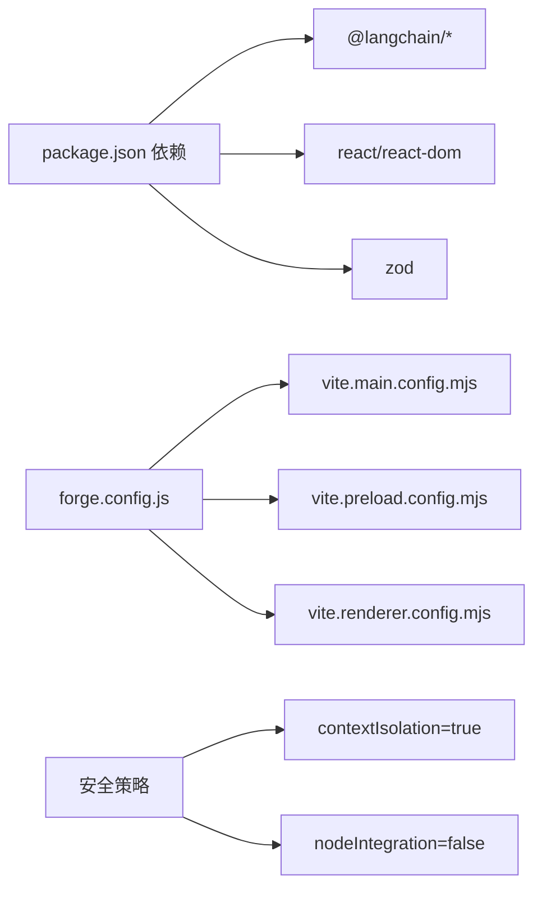

# 系统架构

<cite>
**本文引用的文件**
- [src/renderer/App.tsx](file://src/renderer/App.tsx)
- [src/renderer/components/ChatWindow.tsx](file://src/renderer/components/ChatWindow.tsx)
- [src/renderer/components/SettingsPanel.tsx](file://src/renderer/components/SettingsPanel.tsx)
- [src/renderer/main.tsx](file://src/renderer/main.tsx)
- [src/renderer/types.ts](file://src/renderer/types.ts)
- [src/main.ts](file://src/main.ts)
- [src/preload.ts](file://src/preload.ts)
- [src/agent.ts](file://src/agent.ts)
- [index.html](file://index.html)
- [package.json](file://package.json)
- [forge.config.js](file://forge.config.js)
- [vite.main.config.mjs](file://vite.main.config.mjs)
- [vite.renderer.config.mjs](file://vite.renderer.config.mjs)
</cite>

## 目录
1. [引言](#引言)
2. [项目结构](#项目结构)
3. [核心组件](#核心组件)
4. [架构总览](#架构总览)
5. [详细组件分析](#详细组件分析)
6. [依赖分析](#依赖分析)
7. [性能考量](#性能考量)
8. [故障排查指南](#故障排查指南)
9. [结论](#结论)
10. [附录](#附录)

## 引言
本项目以 Electron 为基础，结合 React 渲染层与 LangGraph 代理执行引擎，构建了一个桌面端 AI 助手应用。系统采用主进程与渲染器进程严格分离的架构：主进程负责系统级能力（IPC、设置持久化、窗口管理）、渲染器负责 UI 与用户交互；通过预加载脚本桥接安全的跨进程通信通道。应用的核心是基于 LangGraph 的状态图代理，具备工具调用能力，能够根据用户输入动态选择工具并返回结果。

## 项目结构
项目采用“按职责分层 + 组件化”的组织方式：
- 主进程与预加载：位于 src/main.ts 与 src/preload.ts，负责窗口创建、IPC 注册、设置持久化与安全桥接。
- 渲染器前端：React 应用入口在 src/renderer/main.tsx，根组件 App.tsx 协调聊天窗口与设置面板。
- 业务逻辑：src/agent.ts 实现 LangGraph 图构建、工具注册与代理执行。
- 配置与打包：Vite 与 Electron Forge 配置分别处理主进程、预加载与渲染器构建；package.json 定义依赖与脚本。

图表来源
- [src/renderer/main.tsx:1-8](file://src/renderer/main.tsx#L1-L8)
- [src/renderer/App.tsx:1-140](file://src/renderer/App.tsx#L1-L140)
- [src/renderer/components/ChatWindow.tsx:1-114](file://src/renderer/components/ChatWindow.tsx#L1-L114)
- [src/renderer/components/SettingsPanel.tsx:1-139](file://src/renderer/components/SettingsPanel.tsx#L1-L139)
- [src/renderer/types.ts:1-49](file://src/renderer/types.ts#L1-L49)
- [src/main.ts:1-100](file://src/main.ts#L1-L100)
- [src/preload.ts:1-18](file://src/preload.ts#L1-L18)
- [src/agent.ts:1-316](file://src/agent.ts#L1-L316)

章节来源
- [package.json:1-36](file://package.json#L1-L36)
- [forge.config.js:1-42](file://forge.config.js#L1-L42)
- [vite.main.config.mjs:1-24](file://vite.main.config.mjs#L1-L24)
- [vite.renderer.config.mjs:1-7](file://vite.renderer.config.mjs#L1-L7)

## 核心组件
- 根组件 App.tsx：集中管理消息状态、设置状态与工具事件监听；协调聊天窗口与设置面板的显示与交互。
- 聊天窗口 ChatWindow.tsx：负责输入框高度自适应、回车发送、消息列表滚动与空态提示；向父组件回调发送消息。
- 设置面板 SettingsPanel.tsx：提供 LLM 提供商、API Key、模型名、Base URL、Temperature 等配置项，并支持保存。
- 预加载脚本 preload.ts：通过 contextBridge 在渲染器中暴露受控的 electronAPI，封装 IPC 调用与事件订阅。
- 主进程 main.ts：创建 BrowserWindow、注册 IPC 处理器、读写设置文件、转发工具事件到渲染器。
- 代理执行 agent.ts：定义工具、构建 LangGraph 状态图、执行代理并收集工具调用信息。

章节来源
- [src/renderer/App.tsx:1-140](file://src/renderer/App.tsx#L1-L140)
- [src/renderer/components/ChatWindow.tsx:1-114](file://src/renderer/components/ChatWindow.tsx#L1-L114)
- [src/renderer/components/SettingsPanel.tsx:1-139](file://src/renderer/components/SettingsPanel.tsx#L1-L139)
- [src/renderer/types.ts:1-49](file://src/renderer/types.ts#L1-L49)
- [src/preload.ts:1-18](file://src/preload.ts#L1-L18)
- [src/main.ts:1-100](file://src/main.ts#L1-L100)
- [src/agent.ts:1-316](file://src/agent.ts#L1-L316)

## 架构总览
系统采用“主进程-预加载-渲染器”的三层隔离架构：
- 主进程：负责窗口生命周期、IPC 服务器、设置持久化与安全策略（contextIsolation、禁用 nodeIntegration）。
- 预加载：仅暴露必要的 API（electronAPI），通过 ipcRenderer.invoke/on 进行请求-响应与事件订阅。
- 渲染器：React 应用，UI 与业务交互完全在渲染进程中完成，通过 electronAPI 访问主进程能力。

图表来源
- [src/renderer/App.tsx:1-140](file://src/renderer/App.tsx#L1-L140)
- [src/preload.ts:1-18](file://src/preload.ts#L1-L18)
- [src/main.ts:1-100](file://src/main.ts#L1-L100)
- [src/agent.ts:1-316](file://src/agent.ts#L1-L316)

## 详细组件分析

### 根组件 App.tsx 的协调机制
- 状态管理：维护 messages、showSettings、settings 三类状态；通过 useEffect 初始化设置与工具事件监听。
- 事件流：handleSend 触发用户消息入队、插入加载中的助手消息、调用 window.electronAPI.chat 并更新最终结果；handleSaveSettings 调用保存设置并关闭面板。
- 子组件：条件渲染 SettingsPanel 与 ChatWindow，实现“设置面板覆盖聊天窗口”的布局。

图表来源
- [src/renderer/App.tsx:43-84](file://src/renderer/App.tsx#L43-L84)
- [src/preload.ts:3-17](file://src/preload.ts#L3-L17)
- [src/main.ts:65-84](file://src/main.ts#L65-L84)
- [src/agent.ts:279-315](file://src/agent.ts#L279-L315)

章节来源
- [src/renderer/App.tsx:1-140](file://src/renderer/App.tsx#L1-L140)

### 聊天窗口 ChatWindow.tsx 的交互流程
- 输入控制：自动高度调整、Enter 发送、Shift+Enter 换行、发送中禁用输入。
- 滚动行为：消息变更后平滑滚动到底部。
- 空态提示：无消息时展示引导按钮，一键触发示例问题。

图表来源
- [src/renderer/components/ChatWindow.tsx:29-49](file://src/renderer/components/ChatWindow.tsx#L29-L49)

章节来源
- [src/renderer/components/ChatWindow.tsx:1-114](file://src/renderer/components/ChatWindow.tsx#L1-L114)

### 设置面板 SettingsPanel.tsx 的配置流程
- 表单绑定：基于传入 settings 初始化表单，逐项变更同步到 form。
- 条件渲染：根据 provider 决定是否显示 API Key 字段与占位提示。
- 保存逻辑：调用 onSave(form) 后关闭面板。

图表来源
- [src/renderer/components/SettingsPanel.tsx:10-19](file://src/renderer/components/SettingsPanel.tsx#L10-L19)

章节来源
- [src/renderer/components/SettingsPanel.tsx:1-139](file://src/renderer/components/SettingsPanel.tsx#L1-L139)

### 预加载与 IPC 桥接
- 暴露 API：electronAPI.chat、onToolEvent、getSettings、saveSettings。
- 事件订阅：onToolEvent 返回清理函数，避免内存泄漏。
- 调用约定：invoke 用于请求-响应，on 用于事件订阅。

图表来源
- [src/preload.ts:3-17](file://src/preload.ts#L3-L17)
- [src/main.ts:65-84](file://src/main.ts#L65-L84)

章节来源
- [src/preload.ts:1-18](file://src/preload.ts#L1-L18)
- [src/main.ts:1-100](file://src/main.ts#L1-L100)

### 代理执行与工具链
- 工具定义：计算器、时间获取、文本分析、随机数生成，均使用 LangChain 的 tool() 包装。
- 图构建：StateGraph 定义 agent/tools 节点与条件边，支持工具调用后的循环推理。
- 执行流程：runAgent 接收用户消息与设置，构建图并执行，收集最后一条 AI 消息与工具调用列表。

图表来源
- [src/renderer/types.ts:2-48](file://src/renderer/types.ts#L2-L48)
- [src/renderer/App.tsx:6-90](file://src/renderer/App.tsx#L6-L90)
- [src/agent.ts:19-315](file://src/agent.ts#L19-L315)

章节来源
- [src/agent.ts:1-316](file://src/agent.ts#L1-L316)
- [src/renderer/types.ts:1-49](file://src/renderer/types.ts#L1-L49)

## 依赖分析
- 运行时依赖：@langchain/* 提供 LLM 与 LangGraph；React 生态负责 UI；zod 用于工具参数校验。
- 构建与打包：Electron Forge + Vite 插件；主进程 SSR 外部化特定包；渲染器使用 React 插件。
- 安全与隔离：主进程 webPreferences 启用 contextIsolation、禁用 nodeIntegration；预加载通过 contextBridge 暴露最小 API。

图表来源
- [package.json:13-34](file://package.json#L13-L34)
- [forge.config.js:19-40](file://forge.config.js#L19-L40)
- [vite.main.config.mjs:8-22](file://vite.main.config.mjs#L8-L22)

章节来源
- [package.json:1-36](file://package.json#L1-L36)
- [forge.config.js:1-42](file://forge.config.js#L1-L42)
- [vite.main.config.mjs:1-24](file://vite.main.config.mjs#L1-L24)
- [vite.renderer.config.mjs:1-7](file://vite.renderer.config.mjs#L1-L7)

## 性能考量
- 渲染器性能
  - 聊天窗口使用自动高度与滚动优化，减少重排开销。
  - 空态引导按钮直接触发示例问题，降低用户思考成本。
- 主进程性能
  - IPC 采用 invoke/on，避免阻塞主线程；工具事件通过异步回调推送，不阻塞代理执行。
  - 设置读写使用同步文件接口，建议在空闲时触发，避免频繁 IO。
- 构建与打包
  - Vite SSR noExternal 配置确保 LangChain 包正确打包；asar 打包提升分发效率。
- 安全与稳定性
  - contextIsolation 与禁用 nodeIntegration 有效降低注入风险。
  - 预加载仅暴露必要 API，降低攻击面。

## 故障排查指南
- 无法连接 LLM
  - 检查 SettingsPanel 中 provider、model、baseUrl、apiKey 是否正确配置。
  - 若使用 OpenAI，确认自定义 baseURL 与官方地址差异；若使用 Ollama，确认本地服务可达。
- 工具调用异常
  - 查看工具事件流：App.tsx 中 onToolEvent 会将事件追加到最近的助手消息的 toolEvents 中。
  - 确认代理执行日志：主进程 ipcMain.handle('agent:chat') 返回的 error 字段。
- 设置无法保存
  - 确认主进程 settings:save 处理器已写入 userData 下的 agent-settings.json。
  - 检查文件权限与磁盘空间。
- 渲染器无响应
  - 检查 preload.ts 中 electronAPI 的 invoke/on 是否被正确调用。
  - 确认 index.html 中入口脚本路径与 Vite 输出一致。

章节来源
- [src/renderer/App.tsx:24-41](file://src/renderer/App.tsx#L24-L41)
- [src/main.ts:65-84](file://src/main.ts#L65-L84)
- [src/main.ts:14-31](file://src/main.ts#L14-L31)
- [index.html:9-10](file://index.html#L9-L10)

## 结论
该系统以 Electron 为宿主，通过严格的主/预加载/渲染器分层与最小化的 IPC 暴露，实现了安全、可扩展的桌面 AI 助手。React 组件化与类型驱动开发提升了可维护性；LangGraph 的状态图使代理具备工具调用与多轮推理能力。整体架构兼顾易用性与安全性，适合进一步扩展更多工具与模型提供商。

## 附录
- 技术选型与权衡
  - Electron：统一桌面平台体验，便于打包与分发。
  - React + Vite：快速迭代与热更新，开发体验佳。
  - LangGraph：状态图抽象清晰，易于扩展工具与节点。
  - Zod：运行时参数校验，增强健壮性。
- 系统边界
  - 渲染器边界：仅通过 electronAPI 访问主进程能力，不直接访问 Node API。
  - 主进程边界：仅处理 IPC、文件系统与窗口生命周期，不参与 UI 渲染。
  - 业务边界：agent.ts 专注代理与工具，不关心 UI 细节。