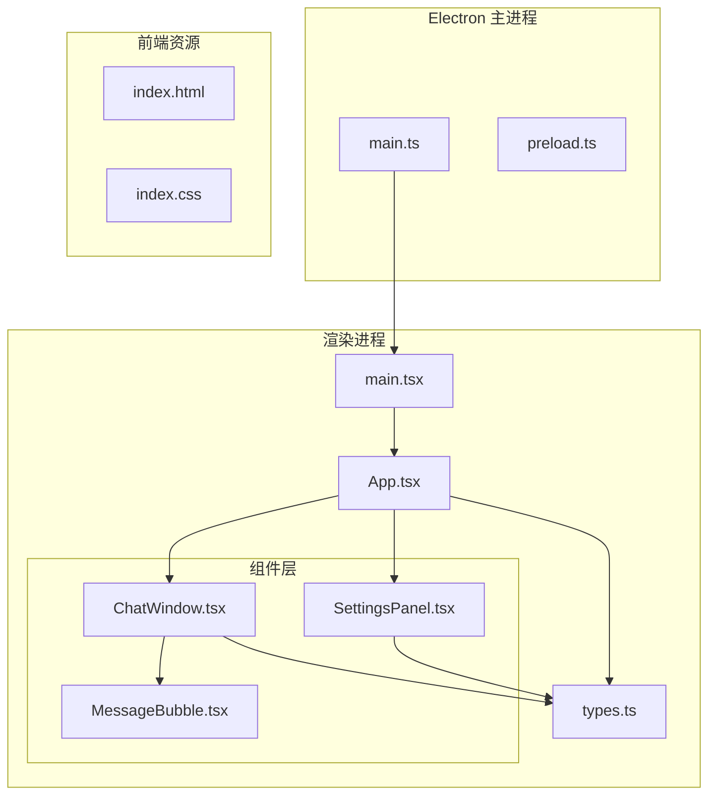
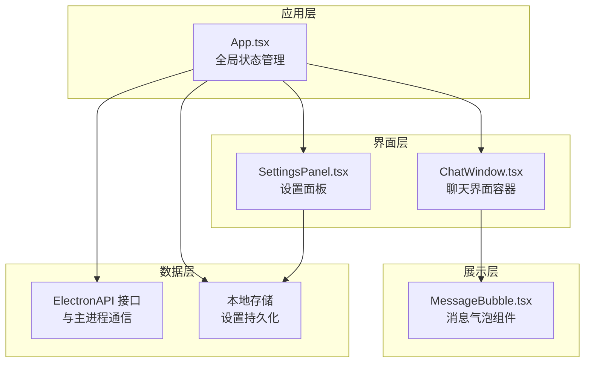
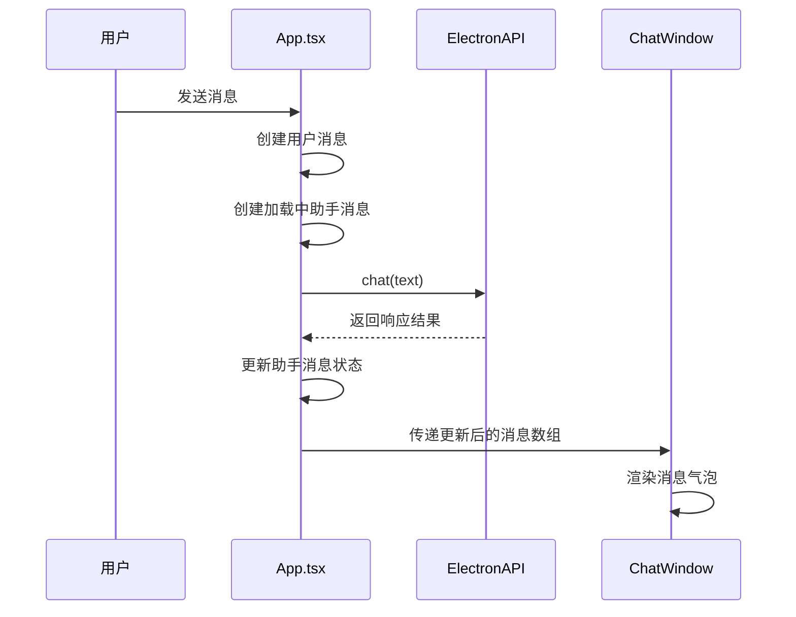
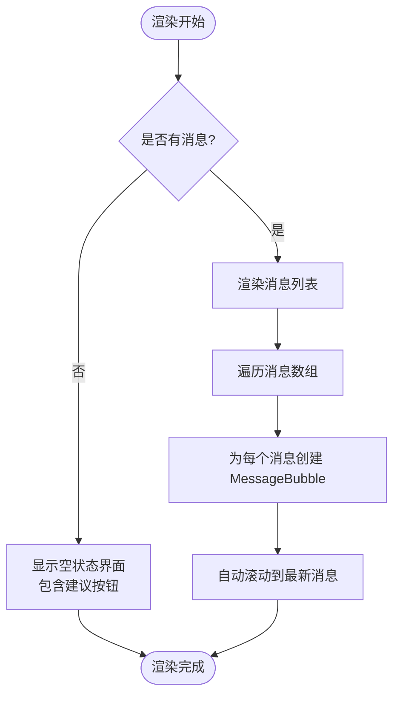
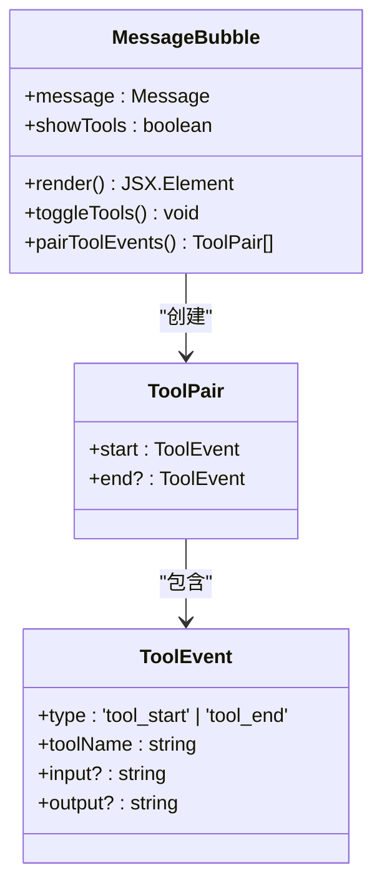
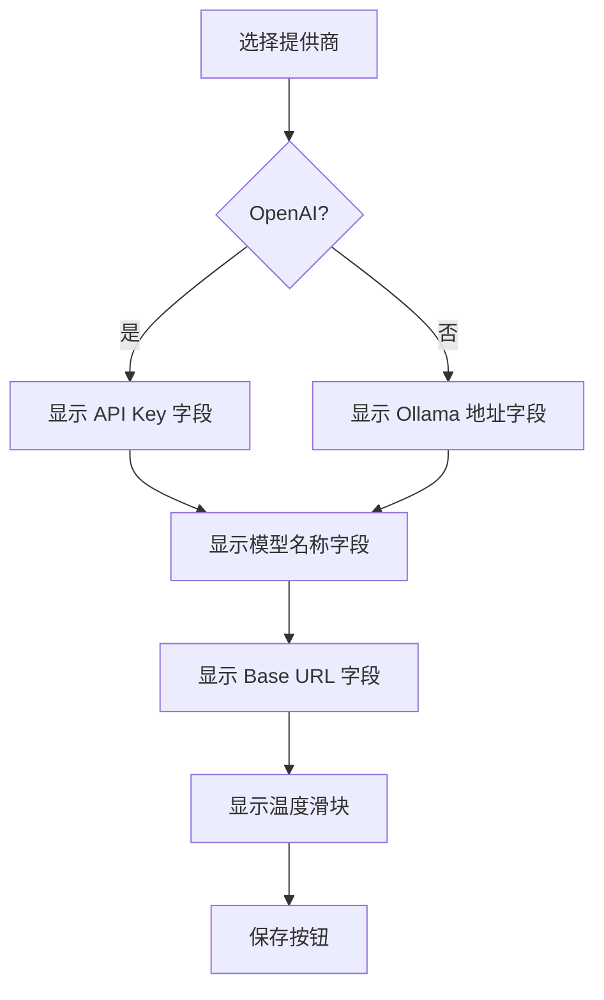
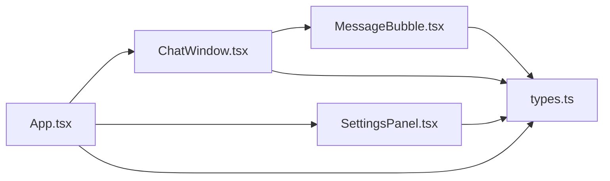

# 组件层次结构

<cite>
**本文档引用的文件**
- [App.tsx](file://src/renderer/App.tsx)
- [ChatWindow.tsx](file://src/renderer/components/ChatWindow.tsx)
- [MessageBubble.tsx](file://src/renderer/components/MessageBubble.tsx)
- [SettingsPanel.tsx](file://src/renderer/components/SettingsPanel.tsx)
- [types.ts](file://src/renderer/types.ts)
- [main.tsx](file://src/renderer/main.tsx)
- [index.html](file://index.html)
- [package.json](file://package.json)
</cite>

## 目录
1. [引言](#引言)
2. [项目结构](#项目结构)
3. [核心组件](#核心组件)
4. [架构概览](#架构概览)
5. [详细组件分析](#详细组件分析)
6. [依赖分析](#依赖分析)
7. [性能考虑](#性能考虑)
8. [故障排除指南](#故障排除指南)
9. [结论](#结论)

## 引言

LangGraph 是一个基于 React 和 Electron 构建的桌面 AI 助手应用，采用组件化架构设计。该应用通过清晰的组件层次结构实现了聊天界面、设置管理和消息展示的分离，提供了良好的可维护性和扩展性。

## 项目结构

该项目采用典型的 React + Electron 结构，主要分为以下层次：

**图表来源**
- [main.tsx:1-8](file://src/renderer/main.tsx#L1-L8)
- [App.tsx:1-140](file://src/renderer/App.tsx#L1-L140)
- [ChatWindow.tsx:1-114](file://src/renderer/components/ChatWindow.tsx#L1-L114)
- [SettingsPanel.tsx:1-139](file://src/renderer/components/SettingsPanel.tsx#L1-L139)
- [MessageBubble.tsx:1-104](file://src/renderer/components/MessageBubble.tsx#L1-L104)

**章节来源**
- [main.tsx:1-8](file://src/renderer/main.tsx#L1-L8)
- [index.html:1-13](file://index.html#L1-L13)

## 核心组件

### 应用入口点

应用的启动流程从 Electron 主进程开始，通过 Vite 构建系统加载渲染进程：

1. **主进程初始化**：Electron 主进程启动并配置预加载脚本
2. **渲染进程挂载**：React 应用通过 main.tsx 挂载到 DOM 元素
3. **根组件渲染**：App.tsx 作为根组件负责全局状态管理和路由

### 类型系统设计

应用使用 TypeScript 定义了完整的类型系统，确保组件间的数据传递安全：

- **AgentSettings**：代理设置接口，包含提供商、API 密钥、模型等配置
- **Message**：消息数据结构，支持用户、助手、系统三种角色
- **ToolEvent**：工具事件接口，用于跟踪工具调用过程
- **ToolCallInfo**：工具调用信息接口
- **ElectronAPI**：Electron 渲染进程与主进程通信接口

**章节来源**
- [types.ts:1-49](file://src/renderer/types.ts#L1-L49)

## 架构概览

应用采用分层架构设计，实现了关注点分离和组件复用：

**图表来源**
- [App.tsx:1-140](file://src/renderer/App.tsx#L1-L140)
- [ChatWindow.tsx:1-114](file://src/renderer/components/ChatWindow.tsx#L1-L114)
- [SettingsPanel.tsx:1-139](file://src/renderer/components/SettingsPanel.tsx#L1-L139)
- [MessageBubble.tsx:1-104](file://src/renderer/components/MessageBubble.tsx#L1-L104)

## 详细组件分析

### App.tsx - 根组件

App.tsx 作为应用的根组件，承担着全局状态管理和业务逻辑协调的核心职责：

#### 状态管理

- **messages**: 存储完整的聊天历史记录
- **showSettings**: 控制设置面板的显示/隐藏状态
- **settings**: 管理代理配置信息

#### 生命周期管理

应用使用两个关键的 useEffect 钩子：

1. **设置加载**：启动时从 Electron API 获取保存的设置
2. **工具事件监听**：持续监听工具执行事件并更新消息状态

#### 事件处理机制

- **handleSend**: 处理用户发送消息的完整流程
- **handleSaveSettings**: 保存设置并关闭面板
- **handleClearChat**: 清空聊天记录

#### 数据流控制

**图表来源**
- [App.tsx:43-84](file://src/renderer/App.tsx#L43-L84)

**章节来源**
- [App.tsx:1-140](file://src/renderer/App.tsx#L1-L140)

### ChatWindow.tsx - 聊天窗口组件

ChatWindow.tsx 实现了聊天界面的主要功能，是用户交互的核心容器：

#### 组件职责

- **消息列表渲染**：遍历并渲染所有消息
- **输入处理**：管理用户输入和发送逻辑
- **自动滚动**：新消息到达时自动滚动到底部
- **输入框自适应**：根据内容动态调整高度

#### 状态管理

- **input**: 当前输入框内容
- **isSending**: 发送状态指示器
- **messagesEndRef**: 滚动定位引用
- **textareaRef**: 文本域引用

#### 交互特性

- **快捷键支持**：Enter 发送，Shift+Enter 换行
- **智能禁用**：发送过程中禁用输入控件
- **空状态处理**：无消息时显示欢迎界面和建议消息

#### 条件渲染策略

**图表来源**
- [ChatWindow.tsx:54-81](file://src/renderer/components/ChatWindow.tsx#L54-L81)

**章节来源**
- [ChatWindow.tsx:1-114](file://src/renderer/components/ChatWindow.tsx#L1-L114)

### MessageBubble.tsx - 消息气泡组件

MessageBubble.tsx 是最底层的展示组件，专门负责单个消息的视觉呈现：

#### 设计模式

采用纯函数组件设计，专注于单一职责的消息展示：

- **props 输入**：接收完整的 Message 对象
- **状态管理**：内部管理工具事件的展开/收起状态
- **条件渲染**：根据消息类型和状态动态渲染

#### 工具事件处理

组件能够智能配对工具事件（tool_start/tool_end），形成完整的工具调用链路：

**图表来源**
- [MessageBubble.tsx:8-28](file://src/renderer/components/MessageBubble.tsx#L8-L28)
- [types.ts:10-15](file://src/renderer/types.ts#L10-L15)

#### 视觉层次

组件采用卡片式设计，支持多种状态指示：

- **用户消息**：左侧对齐，带用户头像
- **助手消息**：右侧对齐，带 AI 头像
- **加载状态**：显示三点动画指示器
- **错误状态**：高亮显示错误信息
- **工具调用**：可展开的工具详情面板

**章节来源**
- [MessageBubble.tsx:1-104](file://src/renderer/components/MessageBubble.tsx#L1-L104)

### SettingsPanel.tsx - 设置面板组件

SettingsPanel.tsx 提供了完整的代理配置界面：

#### 表单管理

- **受控组件**：使用独立的状态管理表单字段
- **实时验证**：根据提供商类型动态显示相关字段
- **即时反馈**：提供输入提示和占位符信息

#### 配置选项

1. **提供商选择**：支持 OpenAI 和 Ollama 两种模式
2. **API 配置**：针对不同提供商的特定设置
3. **模型参数**：温度系数等高级配置
4. **连接设置**：自定义 API 地址和端点

#### 条件渲染逻辑

**图表来源**
- [SettingsPanel.tsx:57-109](file://src/renderer/components/SettingsPanel.tsx#L57-L109)

**章节来源**
- [SettingsPanel.tsx:1-139](file://src/renderer/components/SettingsPanel.tsx#L1-L139)

## 依赖分析

### 组件间依赖关系

**图表来源**
- [App.tsx:1-5](file://src/renderer/App.tsx#L1-L5)
- [ChatWindow.tsx:1-3](file://src/renderer/components/ChatWindow.tsx#L1-L3)
- [SettingsPanel.tsx:1-2](file://src/renderer/components/SettingsPanel.tsx#L1-L2)
- [MessageBubble.tsx:1-2](file://src/renderer/components/MessageBubble.tsx#L1-L2)

### 外部依赖

应用依赖以下关键库：

- **React 18.3.1**: 核心 UI 框架
- **@langchain/core**: LangChain 核心功能
- **@langchain/langgraph**: LangGraph 图结构
- **@langchain/openai**: OpenAI 集成
- **@langchain/ollama**: Ollama 本地推理

**章节来源**
- [package.json:13-34](file://package.json#L13-L34)

## 性能考虑

### 渲染优化

1. **虚拟滚动**：对于大量消息的历史记录，可以考虑实现虚拟滚动以提升性能
2. **记忆化**：使用 React.memo 包装 MessageBubble 组件避免不必要的重渲染
3. **懒加载**：工具事件详情面板采用按需加载策略

### 内存管理

- **事件清理**：正确清理 Electron 事件监听器防止内存泄漏
- **状态优化**：合理拆分状态避免不必要的组件重渲染
- **引用管理**：使用 useRef 管理 DOM 引用，避免闭包陷阱

### 网络性能

- **请求去重**：防止重复发送相同的聊天请求
- **缓存策略**：对频繁使用的工具调用结果进行缓存
- **超时处理**：实现合理的请求超时和重试机制

## 故障排除指南

### 常见问题诊断

#### 设置无法保存

1. **检查 Electron API**：确认 `saveSettings` 方法正常工作
2. **验证数据格式**：确保 AgentSettings 结构符合预期
3. **查看控制台错误**：检查是否有网络或权限相关错误

#### 消息不显示

1. **检查消息数组**：确认 messages 状态正确更新
2. **验证 props 传递**：确保 ChatWindow 正确接收 messages
3. **调试渲染**：检查 MessageBubble 的条件渲染逻辑

#### 工具事件不匹配

1. **事件配对算法**：验证 tool_start/tool_end 事件的正确配对
2. **时间戳检查**：确保事件按正确顺序到达
3. **状态同步**：确认工具事件在消息更新后及时显示

**章节来源**
- [App.tsx:25-41](file://src/renderer/App.tsx#L25-L41)
- [MessageBubble.tsx:13-28](file://src/renderer/components/MessageBubble.tsx#L13-L28)

## 结论

LangGraph 组件体系展现了优秀的架构设计原则：

### 设计优势

1. **清晰的层次结构**：从根组件到展示组件的逐层抽象
2. **单一职责原则**：每个组件专注于特定功能领域
3. **类型安全**：完整的 TypeScript 类型系统确保代码质量
4. **可扩展性**：模块化的组件设计便于功能扩展

### 最佳实践总结

1. **状态管理**：将全局状态集中在 App.tsx，局部状态保留在组件内部
2. **事件处理**：通过回调函数实现父子组件通信，避免直接状态修改
3. **条件渲染**：合理使用条件渲染提升用户体验和性能
4. **类型约束**：利用 TypeScript 严格类型检查预防运行时错误

### 扩展建议

1. **主题系统**：添加深色/浅色主题切换功能
2. **国际化**：支持多语言界面
3. **快捷键**：添加更多键盘快捷键支持
4. **导出功能**：允许导出聊天记录为多种格式
5. **插件系统**：支持第三方工具集成

这个组件体系为构建复杂的 AI 助手应用提供了坚实的基础，其模块化设计使得功能扩展和维护都变得相对简单。