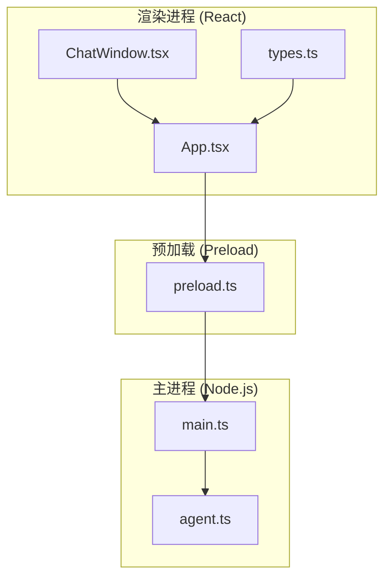
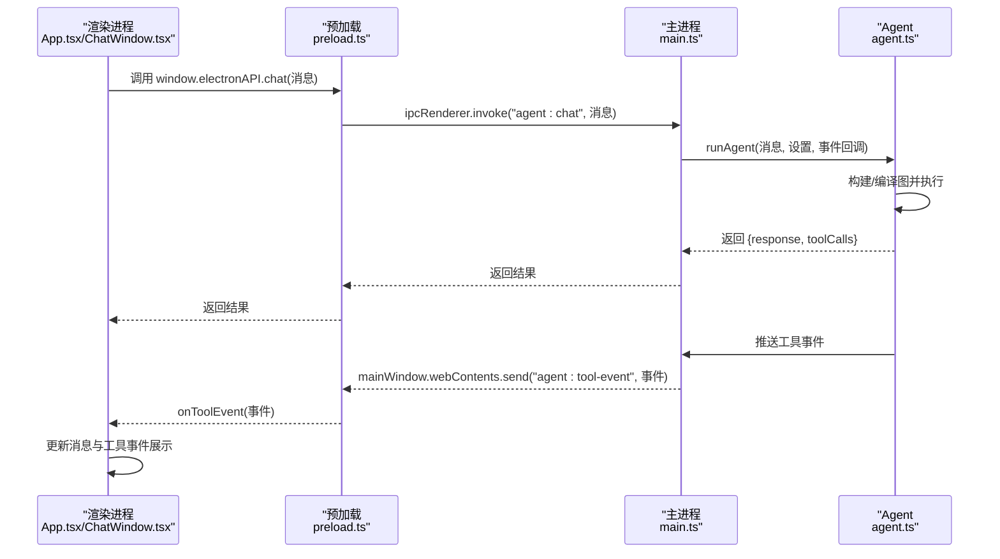
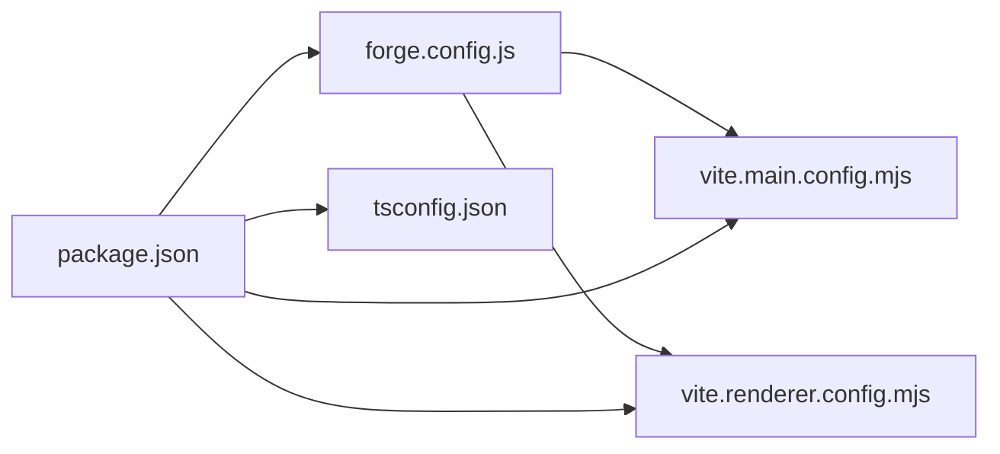

# 贡献指南

<cite>
**本文引用的文件**
- [package.json](file://package.json)
- [forge.config.js](file://forge.config.js)
- [开发文档.md](file://开发文档.md)
- [src/main.ts](file://src/main.ts)
- [src/preload.ts](file://src/preload.ts)
- [src/agent.ts](file://src/agent.ts)
- [src/renderer/App.tsx](file://src/renderer/App.tsx)
- [src/renderer/components/ChatWindow.tsx](file://src/renderer/components/ChatWindow.tsx)
- [src/renderer/types.ts](file://src/renderer/types.ts)
- [vite.main.config.mjs](file://vite.main.config.mjs)
- [vite.renderer.config.mjs](file://vite.renderer.config.mjs)
- [tsconfig.json](file://tsconfig.json)
- [index.html](file://index.html)
- [.gitignore](file://.gitignore)
</cite>

## 目录
1. [简介](#简介)
2. [项目结构](#项目结构)
3. [核心组件](#核心组件)
4. [架构总览](#架构总览)
5. [详细组件分析](#详细组件分析)
6. [依赖关系分析](#依赖关系分析)
7. [性能考量](#性能考量)
8. [故障排查指南](#故障排查指南)
9. [结论](#结论)
10. [附录](#附录)

## 简介
本项目是一个基于 Electron + LangGraph 的桌面端 AI Agent 应用，支持通过 OpenAI API 或本地 Ollama 模型驱动，具备工具调用能力与可视化聊天界面。本文面向开源贡献者，提供完整的贡献流程、代码规范、提交与评审标准、测试与文档更新规范、开发环境与调试方法、Issue 报告与功能请求流程、社区参与方式以及发布与版本管理建议。目标是让新贡献者能快速理解并高效参与项目开发。

## 项目结构
项目采用 Electron + Vite + React + TypeScript 的现代桌面应用架构：
- 主进程：负责窗口管理、IPC 通信、设置持久化与调用 Agent
- Preload：安全桥接层，暴露受限 API 给渲染进程
- 渲染进程：React 应用，负责 UI 与用户交互
- Agent：LangGraph 状态图与工具系统，封装 LLM 与工具调用逻辑
- 构建：Electron Forge + Vite 插件，支持开发与打包

图表来源
- [src/renderer/App.tsx:1-140](file://src/renderer/App.tsx#L1-L140)
- [src/renderer/components/ChatWindow.tsx:1-114](file://src/renderer/components/ChatWindow.tsx#L1-L114)
- [src/renderer/types.ts:1-49](file://src/renderer/types.ts#L1-L49)
- [src/preload.ts:1-18](file://src/preload.ts#L1-L18)
- [src/main.ts:1-100](file://src/main.ts#L1-L100)
- [src/agent.ts:1-316](file://src/agent.ts#L1-L316)

章节来源
- [开发文档.md:152-190](file://开发文档.md#L152-L190)
- [package.json:1-36](file://package.json#L1-L36)
- [forge.config.js:1-42](file://forge.config.js#L1-L42)

## 核心组件
- 主进程入口与窗口管理：负责创建窗口、处理 IPC、读写设置文件
- Preload 桥接：通过 contextBridge 暴露受控 API，实现渲染进程与主进程的安全通信
- Agent 逻辑：LangGraph 状态图、工具定义、LLM 模型接入与工具调用事件推送
- 渲染进程：React 组件树、状态管理、工具事件展示与 UI 交互
- 构建配置：Electron Forge + Vite 插件，主进程与渲染进程分别构建，主进程使用 SSR noExternal 解决 ESM/CJS 兼容

章节来源
- [src/main.ts:1-100](file://src/main.ts#L1-L100)
- [src/preload.ts:1-18](file://src/preload.ts#L1-L18)
- [src/agent.ts:1-316](file://src/agent.ts#L1-L316)
- [src/renderer/App.tsx:1-140](file://src/renderer/App.tsx#L1-L140)
- [vite.main.config.mjs:1-24](file://vite.main.config.mjs#L1-L24)
- [vite.renderer.config.mjs:1-7](file://vite.renderer.config.mjs#L1-L7)

## 架构总览
应用采用“渲染进程 + 预加载桥接 + 主进程”的三层架构，IPC 采用 invoke/handle 模式，工具事件通过单向 send/on 推送，确保安全性与实时性。

图表来源
- [src/renderer/App.tsx:43-84](file://src/renderer/App.tsx#L43-L84)
- [src/preload.ts:3-17](file://src/preload.ts#L3-L17)
- [src/main.ts:65-84](file://src/main.ts#L65-L84)
- [src/agent.ts:279-315](file://src/agent.ts#L279-L315)

## 详细组件分析

### 主进程 (main.ts)
职责
- 创建主窗口，加载开发或打包后的页面
- 注册 IPC 处理器：代理对话、设置读取与保存
- 读写设置文件，使用 Electron userData 目录持久化

关键点
- 开发模式下自动打开 DevTools
- 使用 try/catch 包裹 IPC 处理，保证错误信息回传
- 设置文件路径位于 %APPDATA%/langgraph-agent/agent-settings.json

章节来源
- [src/main.ts:1-100](file://src/main.ts#L1-L100)

### 预加载桥接 (preload.ts)
职责
- 通过 contextBridge.exposeInMainWorld 暴露受控 API
- 使用 ipcRenderer.invoke/handle 与主进程通信
- 提供 onToolEvent 订阅工具事件，返回取消订阅函数

安全设计
- contextIsolation: true
- 仅暴露必要 API
- 事件监听通过 on/removeListener 管理

章节来源
- [src/preload.ts:1-18](file://src/preload.ts#L1-L18)

### Agent 核心 (agent.ts)
职责
- 定义 Agent 状态、工具与条件路由
- 构建 LangGraph 状态图并编译执行
- 根据提供商选择 OpenAI 或 Ollama 模型
- 推送工具调用事件，收集工具调用信息

关键实现
- Annotation.Root 定义状态结构
- tool() + Zod Schema 定义工具与参数校验
- shouldContinue 检查 AIMessage.tool_calls 决定是否继续
- bindTools 将工具注入 LLM，使其感知可用工具

章节来源
- [src/agent.ts:1-316](file://src/agent.ts#L1-L316)

### 渲染进程 (App.tsx 与 ChatWindow.tsx)
职责
- App.tsx：顶层容器，管理消息、设置与工具事件监听
- ChatWindow.tsx：聊天界面，支持自动高度、发送与建议消息
- types.ts：定义 ElectronAPI、消息、工具事件与设置接口

交互流程
- 用户输入 -> 添加用户消息 -> 添加加载中的助手消息 -> 调用 window.electronAPI.chat -> 更新助手消息

章节来源
- [src/renderer/App.tsx:1-140](file://src/renderer/App.tsx#L1-L140)
- [src/renderer/components/ChatWindow.tsx:1-114](file://src/renderer/components/ChatWindow.tsx#L1-L114)
- [src/renderer/types.ts:1-49](file://src/renderer/types.ts#L1-L49)

### 构建配置 (Vite 与 Electron Forge)
职责
- vite.main.config.mjs：主进程构建，SSR noExternal 解决 ESM/CJS 兼容
- vite.renderer.config.mjs：渲染进程构建，使用 React 插件
- forge.config.js：Electron Forge 配置，定义打包器与 Vite 插件

章节来源
- [vite.main.config.mjs:1-24](file://vite.main.config.mjs#L1-L24)
- [vite.renderer.config.mjs:1-7](file://vite.renderer.config.mjs#L1-L7)
- [forge.config.js:1-42](file://forge.config.js#L1-L42)

## 依赖关系分析
- 主进程依赖 Electron、LangGraph、LangChain、Zod 等
- 渲染进程依赖 React、TypeScript 类型
- 构建依赖 Electron Forge 与 Vite 插件
- 项目脚本由 package.json 管理

图表来源
- [package.json:1-36](file://package.json#L1-L36)
- [forge.config.js:1-42](file://forge.config.js#L1-L42)
- [vite.main.config.mjs:1-24](file://vite.main.config.mjs#L1-L24)
- [vite.renderer.config.mjs:1-7](file://vite.renderer.config.mjs#L1-L7)
- [tsconfig.json:1-22](file://tsconfig.json#L1-L22)

章节来源
- [package.json:1-36](file://package.json#L1-L36)
- [开发文档.md:195-234](file://开发文档.md#L195-L234)

## 性能考量
- 主进程构建使用 SSR noExternal 内联 LangChain 包，避免 ESM/CJS 兼容问题带来的运行时开销
- 渲染进程使用 Vite HMR，开发体验与热更新性能优异
- 工具事件通过单向推送减少不必要的状态同步
- 建议在工具实现中进行输入校验与超时控制，避免阻塞 Agent 循环

章节来源
- [vite.main.config.mjs:13-22](file://vite.main.config.mjs#L13-L22)
- [开发文档.md:545-574](file://开发文档.md#L545-L574)

## 故障排查指南
常见问题与定位思路
- 无法启动开发模式：检查 Node.js 与 npm 版本，确认依赖安装成功
- IPC 调用失败：检查 preload 是否正确暴露 API，主进程是否注册对应 handle
- 工具未执行：确认 LLM 是否绑定了工具，工具名称与参数是否匹配
- 设置未生效：确认设置文件路径与读写权限，检查主进程保存逻辑
- 打包失败：检查 Electron Forge maker 配置与平台支持

章节来源
- [开发文档.md:509-542](file://开发文档.md#L509-L542)
- [src/main.ts:14-31](file://src/main.ts#L14-L31)
- [src/preload.ts:3-17](file://src/preload.ts#L3-L17)
- [src/agent.ts:171-262](file://src/agent.ts#L171-L262)

## 结论
本项目通过 Electron + LangGraph 的组合，提供了清晰的三层架构与安全的 IPC 设计，结合 Vite 构建工具链，实现了良好的开发体验与可扩展性。贡献者应重点关注 IPC 安全、工具定义规范、状态图设计与前端交互体验，遵循本文的流程与规范，即可高效参与项目贡献。

## 附录

### 代码规范与风格
- 语言与类型
  - 使用 TypeScript，启用严格模式与模块解析
  - React 使用 JSX，组件导出使用函数式组件
- 命名约定
  - 文件与组件使用帕斯卡命名；变量与函数使用驼峰命名
  - 工具名称使用小写下划线或短横线风格，便于 LLM 调用
- 导入与模块
  - 优先使用相对路径导入，避免循环依赖
  - 工具与类型定义集中管理，避免分散重复
- 安全与健壮性
  - 预加载仅暴露必要 API，避免直接暴露 Node.js 全能对象
  - IPC 错误捕获与回传，确保 UI 友好提示

章节来源
- [tsconfig.json:1-22](file://tsconfig.json#L1-L22)
- [src/renderer/types.ts:1-49](file://src/renderer/types.ts#L1-L49)
- [src/preload.ts:1-18](file://src/preload.ts#L1-L18)

### 提交流程与分支策略
- 分支策略
  - 主分支：稳定版本，仅合并经评审的 PR
  - develop 分支：日常开发与集成，建议使用
  - 功能分支：按功能或修复创建，完成后合并至 develop
- 提交信息
  - 格式：类型(scope): 说明
  - 示例：feat(agent): 新增计算器工具
- 合并与发布
  - 通过 Pull Request 合并，至少一名维护者批准
  - 合并后打标签并更新变更日志

章节来源
- [开发文档.md:509-542](file://开发文档.md#L509-L542)

### 代码审查标准
- 正确性
  - 通过单元与集成测试，确保功能与边界条件覆盖
  - IPC 通信契约清晰，错误处理完备
- 可维护性
  - 函数与组件职责单一，命名语义明确
  - 工具定义使用 Zod Schema，参数校验完整
- 安全性
  - 预加载 API 最小化暴露，避免任意 Node.js API
  - 工具实现进行输入清洗与异常捕获
- 文档与注释
  - 关键流程与算法提供注释说明
  - 新增功能补充开发文档与注释

章节来源
- [src/agent.ts:43-137](file://src/agent.ts#L43-L137)
- [src/preload.ts:1-18](file://src/preload.ts#L1-L18)
- [开发文档.md:545-574](file://开发文档.md#L545-L574)

### 测试要求
- 单元测试
  - 工具函数与纯函数：覆盖正常与异常路径
  - 状态图节点：模拟 AIMessage 与工具调用，验证条件路由
- 集成测试
  - IPC 端到端：从渲染进程调用到主进程处理再到 Agent 执行
  - 设置持久化：读写设置文件，验证路径与格式
- UI 测试
  - 聊天窗口交互：输入、发送、自动滚动、工具事件展示
- 性能测试
  - 工具执行耗时与并发场景下的稳定性

章节来源
- [开发文档.md:509-542](file://开发文档.md#L509-L542)

### 文档更新规范
- 新功能或重大改动：同步更新开发文档与注释
- API 变更：更新 types.ts 与相关注释
- 构建与配置：更新 forge.config.js 与 vite 配置说明

章节来源
- [开发文档.md:1-672](file://开发文档.md#L1-L672)
- [src/renderer/types.ts:1-49](file://src/renderer/types.ts#L1-L49)

### 开发环境设置与本地调试
- 环境要求
  - Windows 10/11，Node.js >= 18（推荐 v20+），npm >= 9，Python >= 3.10
- 初始化步骤
  - 安装依赖：npm install
  - 启动开发：npm start
- 调试技巧
  - 开发模式自动打开 DevTools
  - 工具事件通过 onToolEvent 实时展示
  - 设置持久化在 %APPDATA%/langgraph-agent/agent-settings.json

章节来源
- [开发文档.md:59-81](file://开发文档.md#L59-L81)
- [开发文档.md:509-542](file://开发文档.md#L509-L542)

### Issue 报告模板与功能请求流程
- Issue 模板
  - 标题：简明描述问题
  - 环境：操作系统、Node 版本、依赖版本
  - 复现步骤：最小可复现步骤
  - 期望行为与实际行为
  - 日志与截图（如有）
- 功能请求
  - 描述需求背景与使用场景
  - 提供伪代码或流程图
  - 评估对现有架构的影响

章节来源
- [开发文档.md:509-542](file://开发文档.md#L509-L542)

### 社区参与指南
- 沟通渠道
  - GitHub Issues：Bug 报告与功能请求
  - Discussions：想法交流与设计讨论
- 行为准则
  - 尊重与包容，避免人身攻击
  - 基于事实与证据进行讨论

章节来源
- [开发文档.md:509-542](file://开发文档.md#L509-L542)

### 发布流程、版本管理与变更日志
- 版本号
  - 遵循语义化版本：主版本.次版本.修订
- 发布流程
  - 合并 PR 至主分支，打标签并生成发布说明
  - 使用 npm run make 生成安装包与 ZIP
- 变更日志
  - 记录新增、修改、修复与破坏性变更
  - 与版本标签一一对应

章节来源
- [package.json:1-36](file://package.json#L1-L36)
- [开发文档.md:532-542](file://开发文档.md#L532-L542)

### 许可证与版权
- 许可证：请在仓库中补充 LICENSE 文件
- 版权声明：在 README 或 LICENSE 中声明版权归属与作者信息

章节来源
- [开发文档.md:662-672](file://开发文档.md#L662-L672)