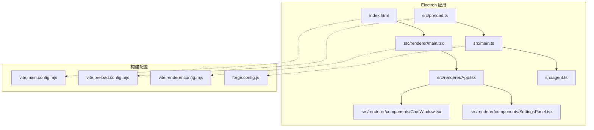
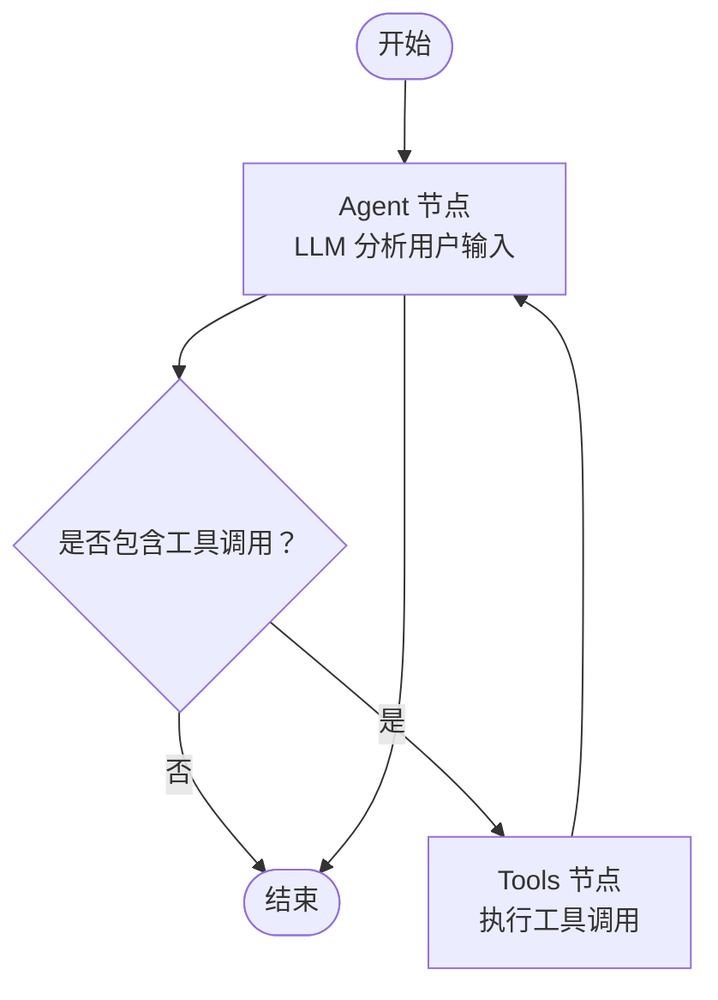
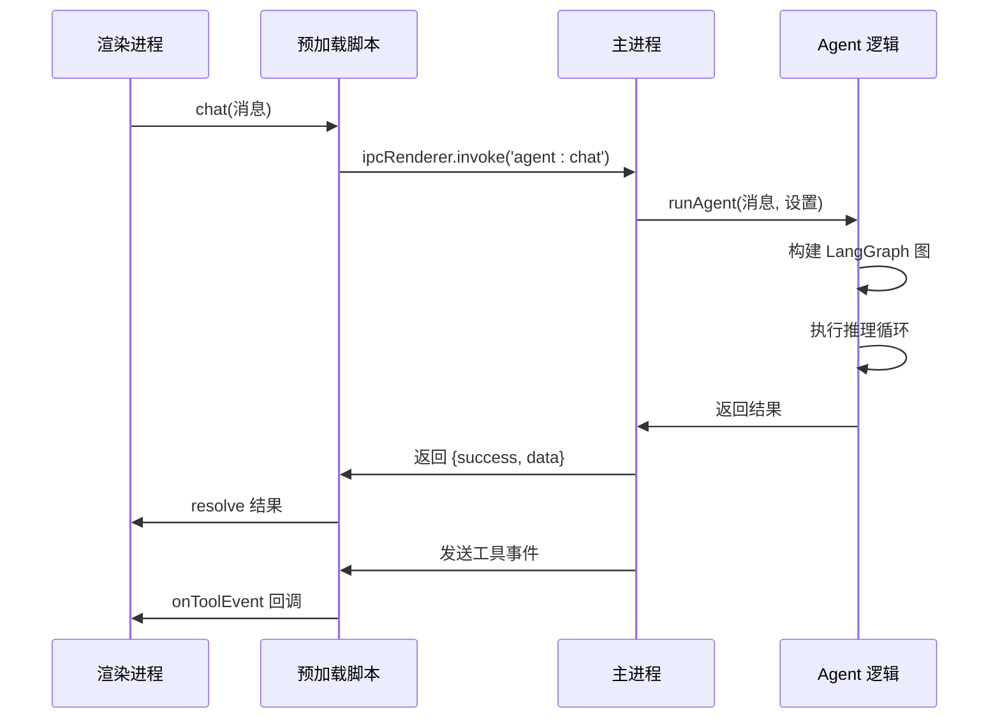
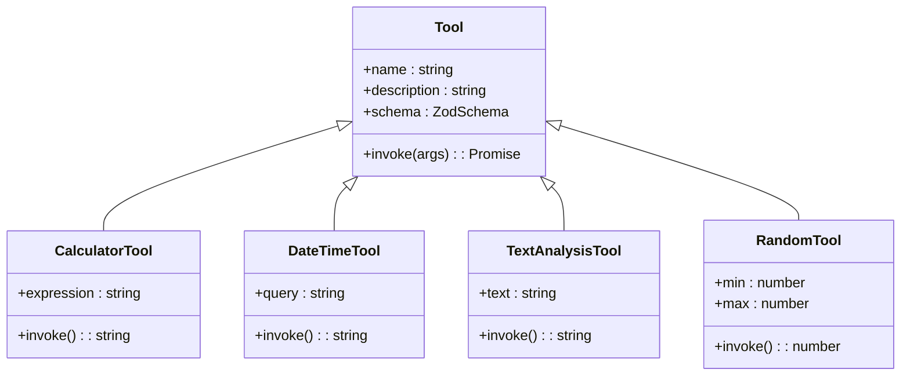
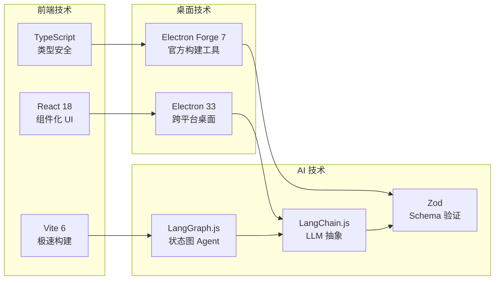

# 项目概述

<cite>
**本文档引用的文件**
- [package.json](file://package.json)
- [forge.config.js](file://forge.config.js)
- [index.html](file://index.html)
- [src/main.ts](file://src/main.ts)
- [src/preload.ts](file://src/preload.ts)
- [src/agent.ts](file://src/agent.ts)
- [src/renderer/App.tsx](file://src/renderer/App.tsx)
- [src/renderer/types.ts](file://src/renderer/types.ts)
- [src/renderer/components/ChatWindow.tsx](file://src/renderer/components/ChatWindow.tsx)
- [src/renderer/components/SettingsPanel.tsx](file://src/renderer/components/SettingsPanel.tsx)
- [开发文档.md](file://开发文档.md)
</cite>

## 目录
1. [简介](#简介)
2. [项目结构](#项目结构)
3. [核心组件](#核心组件)
4. [架构总览](#架构总览)
5. [详细组件分析](#详细组件分析)
6. [依赖关系分析](#依赖关系分析)
7. [性能考虑](#性能考虑)
8. [故障排除指南](#故障排除指南)
9. [结论](#结论)
10. [附录](#附录)

## 简介
langGraph 桌面聊天应用是一个基于 Electron 和 React 的跨平台桌面 AI Agent 应用，支持智能对话与语言处理。它以 Electron 作为桌面壳，集成 LangGraph.js 实现智能体推理循环，支持通过 OpenAI API 或本地 Ollama 模型驱动，具备工具调用（Tool Calling）能力，并以直观的聊天界面与用户交互。项目采用现代技术栈（Electron、React、TypeScript、Vite），提供原生桌面体验、灵活的 LLM 接入、可视化交互与可扩展架构。

核心价值主张：
- 原生桌面体验：Windows 平台原生应用，支持打包分发与系统集成
- 智能 Agent：基于 LangGraph 的 ReAct 模式，具备推理+工具调用能力
- 灵活 LLM 接入：支持 OpenAI API 和本地 Ollama 模型
- 可视化交互：现代化聊天界面，实时展示工具调用过程
- 可扩展架构：模块化设计，便于添加新工具和自定义 Agent 逻辑

## 项目结构
项目采用典型的 Electron + React 架构，分为主进程、预加载脚本和渲染进程三个部分，配合 Vite 构建工具链实现快速开发与构建。



**图表来源**
- [index.html:1-13](file://index.html#L1-L13)
- [src/renderer/main.tsx](file://src/renderer/main.tsx)
- [src/renderer/App.tsx:1-140](file://src/renderer/App.tsx#L1-L140)
- [src/renderer/components/ChatWindow.tsx:1-114](file://src/renderer/components/ChatWindow.tsx#L1-L114)
- [src/renderer/components/SettingsPanel.tsx:1-139](file://src/renderer/components/SettingsPanel.tsx#L1-L139)
- [src/preload.ts:1-18](file://src/preload.ts#L1-L18)
- [src/main.ts:1-100](file://src/main.ts#L1-L100)
- [src/agent.ts:1-316](file://src/agent.ts#L1-L316)
- [forge.config.js:1-42](file://forge.config.js#L1-L42)

**章节来源**
- [开发文档.md:152-190](file://开发文档.md#L152-L190)

## 核心组件
项目由四个核心组件构成：主进程、预加载脚本、渲染进程 React 应用和 LangGraph Agent 核心逻辑。

### 主进程 (src/main.ts)
负责应用生命周期管理、窗口创建、IPC 通信处理和设置持久化。主要职责包括：
- 创建和管理 BrowserWindow 实例
- 处理 IPC 事件：代理对话、设置读取/保存
- 通过 fs 模块持久化用户设置到 userData 目录
- 调用 Agent 逻辑并实时推送工具事件

### 预加载脚本 (src/preload.ts)
通过 contextBridge 安全地暴露 Node.js API 给渲染进程，实现：
- chat: 调用主进程的代理对话功能
- onToolEvent: 订阅工具事件回调
- getSettings/saveSettings: 设置管理接口

### 渲染进程 React 应用 (src/renderer/App.tsx)
基于 React 18 的前端应用，包含：
- 根组件 App：状态管理、布局组织
- ChatWindow：聊天窗口组件，支持消息显示、输入处理
- SettingsPanel：设置面板，支持 LLM 提供商选择、API Key 配置
- 类型定义：统一的 TypeScript 接口定义

### LangGraph Agent 核心 (src/agent.ts)
实现基于 LangGraph 的 ReAct Agent，包含：
- 工具系统：计算器、日期时间、文本分析、随机数生成
- 状态图定义：Agent 节点与 Tools 节点的条件路由
- LLM 模型接入：OpenAI 和 Ollama 适配器
- 设置持久化：用户配置的序列化存储

**章节来源**
- [src/main.ts:1-100](file://src/main.ts#L1-L100)
- [src/preload.ts:1-18](file://src/preload.ts#L1-L18)
- [src/renderer/App.tsx:1-140](file://src/renderer/App.tsx#L1-L140)
- [src/agent.ts:1-316](file://src/agent.ts#L1-L316)

## 架构总览
项目采用 Electron 的多进程架构，严格分离安全边界，通过 IPC 实现进程间通信。

```mermaid
graph TB
subgraph "渲染进程 (React)"
A[App.tsx<br/>ChatWindow.tsx<br/>SettingsPanel.tsx]
end
subgraph "预加载脚本 (Bridge)"
B[contextBridge<br/>IPC 桥接]
end
subgraph "主进程 (Node.js)"
C[BrowserWindow<br/>IPC 处理]
D[Agent 逻辑<br/>LangGraph 图]
E[设置持久化<br/>文件系统]
end
subgraph "外部服务"
F[OpenAI API]
G[Ollama 本地模型]
H[用户数据存储]
end
A <- --> B
B <- --> C
C --> D
D --> F
D --> G
C --> E
E --> H
```

**图表来源**
- [src/main.ts:1-100](file://src/main.ts#L1-L100)
- [src/preload.ts:1-18](file://src/preload.ts#L1-L18)
- [src/agent.ts:1-316](file://src/agent.ts#L1-L316)

架构特点：
- **安全隔离**：渲染进程与 Node.js 完全隔离，通过 contextBridge 暴露受控 API
- **模块化设计**：各组件职责明确，便于维护和扩展
- **实时通信**：IPC 事件实现工具调用过程的实时反馈
- **可配置性**：支持多种 LLM 提供商和模型配置

## 详细组件分析

### Agent 状态图设计
项目采用 LangGraph 的状态图模式，实现 ReAct（推理+行动）循环。



**图表来源**
- [src/agent.ts:240-262](file://src/agent.ts#L240-L262)

状态图特点：
- **条件路由**：根据 LLM 输出决定继续推理还是结束
- **循环机制**：工具执行后回到 Agent 节点，形成完整的 ReAct 循环
- **状态累积**：消息列表作为 Agent 的工作内存

### IPC 通信流程
渲染进程与主进程通过 IPC 实现安全通信。



**图表来源**
- [src/renderer/App.tsx:43-84](file://src/renderer/App.tsx#L43-L84)
- [src/preload.ts:3-17](file://src/preload.ts#L3-L17)
- [src/main.ts:65-84](file://src/main.ts#L65-L84)
- [src/agent.ts:279-315](file://src/agent.ts#L279-L315)

### 工具系统架构
项目内置四种工具，通过 LangChain 的 tool() 函数定义。



**图表来源**
- [src/agent.ts:43-137](file://src/agent.ts#L43-L137)

工具特点：
- **类型安全**：使用 Zod Schema 定义参数类型
- **可扩展**：新增工具只需实现 invoke 方法并加入工具列表
- **安全执行**：计算器工具包含输入过滤和异常处理

**章节来源**
- [src/agent.ts:1-316](file://src/agent.ts#L1-L316)
- [src/renderer/App.tsx:1-140](file://src/renderer/App.tsx#L1-L140)

## 依赖关系分析

### 技术栈选择与优势
项目采用现代化技术栈，每个技术都有其特定优势：



**图表来源**
- [package.json:13-34](file://package.json#L13-L34)
- [开发文档.md:19-56](file://开发文档.md#L19-L56)

### 关键依赖说明
- **@langchain/langgraph**: LangGraph.js 核心，用于构建 Agent 状态图
- **@langchain/core**: LangChain 核心类型：消息、工具、Runnable 等
- **@langchain/openai**: OpenAI 模型适配器 (ChatGPT 系列)
- **@langchain/ollama**: Ollama 本地模型适配器
- **@electron-forge/plugin-vite**: Electron Forge 的 Vite 构建插件

**章节来源**
- [package.json:13-34](file://package.json#L13-L34)
- [开发文档.md:133-143](file://开发文档.md#L133-L143)

## 性能考虑
项目在多个层面进行了性能优化：

### 构建优化
- **Vite 极速开发**：开发模式下提供热更新和快速构建
- **SSR 内联打包**：解决 ESM/CJS 模块兼容问题，避免运行时转换开销
- **ASAR 打包**：生产环境将源码打包为 asar 归档，提高加载效率

### 运行时优化
- **状态图缓存**：LangGraph 图编译后复用，避免重复编译开销
- **IPC 事件去抖**：工具事件按顺序推送，减少 UI 更新频率
- **懒加载策略**：仅在需要时加载额外的 LLM 适配器

### 内存管理
- **消息列表截断**：长时间对话时自动清理旧消息
- **工具调用结果缓存**：对重复计算结果进行缓存
- **事件监听清理**：组件卸载时自动移除 IPC 监听器

## 故障排除指南

### 常见问题与解决方案

#### 1. 模块兼容性问题
**问题**：LangChain.js 生态为纯 ESM 包，Electron 主进程使用 CJS
**解决方案**：通过 Vite 的 `ssr.noExternal` 配置将 LangChain 包内联打包

#### 2. IPC 通信失败
**问题**：渲染进程无法调用主进程 API
**排查步骤**：
- 检查 `contextBridge` 是否正确暴露 API
- 验证 `ipcRenderer.invoke` 的回调是否正确处理
- 确认 `contextIsolation: true` 配置生效

#### 3. LLM 模型连接失败
**问题**：OpenAI API 或 Ollama 连接超时
**排查步骤**：
- 验证 API Key 和 Base URL 配置
- 检查网络连接和防火墙设置
- 确认 Ollama 服务是否正常运行

#### 4. 工具执行异常
**问题**：计算器等工具报错
**排查步骤**：
- 检查输入表达式的合法性
- 验证工具参数类型匹配
- 查看工具执行日志

**章节来源**
- [开发文档.md:545-574](file://开发文档.md#L545-L574)
- [src/main.ts:65-84](file://src/main.ts#L65-L84)
- [src/preload.ts:3-17](file://src/preload.ts#L3-L17)

## 结论
langGraph 桌面聊天应用成功展示了现代桌面 AI 应用的完整实现方案。通过 Electron + React + LangGraph.js 的技术组合，项目实现了：

1. **技术架构完整性**：从底层 Electron 架构到上层 React UI，每个组件都发挥着明确作用
2. **AI 能力集成**：LangGraph.js 提供了强大的状态图 Agent 能力，结合多种 LLM 提供商
3. **用户体验优化**：现代化的聊天界面、实时工具事件展示和流畅的交互体验
4. **可扩展性设计**：模块化的架构使得添加新工具、新 LLM 提供商变得简单

该项目不仅是一个功能完整的桌面应用，更是学习 Electron 桌面开发、LangGraph Agent 实现和现代前端技术栈的最佳实践案例。

## 附录

### 快速开始指南

#### 环境要求
- **操作系统**: Windows 10/11
- **Node.js**: >= 18 (推荐 v20+)
- **npm**: >= 9
- **Python**: >= 3.10 (Electron Forge 构建原生依赖需要)

#### 安装步骤
1. 克隆项目并安装依赖
2. 配置 LLM 提供商（OpenAI 或 Ollama）
3. 启动应用进行测试

#### 基本使用示例
- **OpenAI 方案**：配置 API Key，选择模型，开始对话
- **本地方案**：启动 Ollama 服务，配置本地地址，使用本地模型
- **工具调用**：直接询问计算器、时间查询、文本分析等功能

### 扩展建议
- **添加新工具**：参考现有工具实现，扩展更多实用功能
- **集成更多 LLM**：支持 Claude、Gemini 等其他模型提供商
- **增强 UI 体验**：添加主题切换、消息导出、对话历史管理等功能
- **性能优化**：实现对话记忆、流式输出、并发工具执行等高级特性